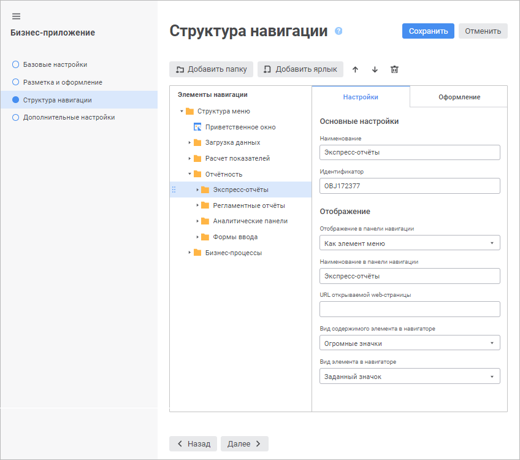
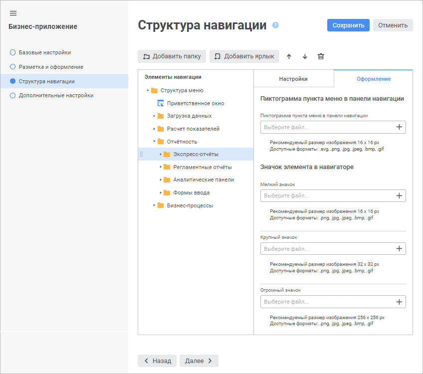
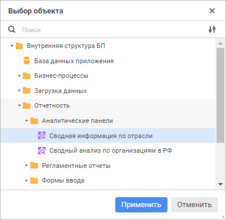

# Настройка структуры навигации: Бизнес-приложение, веб-приложение

Настройка структуры навигации: Бизнес-приложение, веб-приложение
-

# Настройка структуры навигации

Настройка структуры элементов меню на [панели
 навигации](../Intro/Component_interface.htm) выполняется на странице «Структура
 навигации» в [мастере создания
 бизнес-приложения](General_Principles_Web.htm).

[Для открытия
 мастера](javascript:TextPopup(this))

	Для открытия мастера создания бизнес-приложения выделите готовое
	 бизнес-приложение в [навигаторе
	 объектов](GetStarted.chm::/Interface/Interface_Navigator.htm) и откройте его на редактирование:

	- выполните команду «Редактировать»
	 в контекстном меню бизнес-приложения;

	- выполните команду «Редактировать
	 в новой вкладке» в контекстном меню бизнес-приложения;

	- выполните команду «Редактировать
	 в новом окне» в контекстном меню бизнес-приложения;

	- нажмите клавишу F4.

	Настройки Оформление

		

		

В области «Элементы навигации»
 содержится иерархия элементов меню, которая будет отображаться на панели
 навигации. К элементам меню относятся папки и ярлыки на объекты, содержащиеся
 во [внутренней
 структуре бизнес-приложения](Create_Internal_Structure_Business_Application.htm). На вкладке «Настройки»
 содержатся [базовые свойства](#properties) и [настройки
 отображения элемента](#view). На вкладке «Оформление»
 доступна [настройка оформления элемента](#design): загрузка
 пиктограммы пункта меню, отображаемого на панели навигации, и пользовательских
 изображений элемента, отображаемых в навигаторе объектов бизнес-приложения.

Сформируйте структуру навигации:

[Добавление
 папки](javascript:TextPopup(this))

	Для добавления папки в структуру навигации:

		- Выделите корневую папку «Структура
		 меню» или дочерний элемент, в который будет добавлена папка.

		- Нажмите кнопку «Добавить
		 папку».

	После выполнения действий будет добавлена папка в структуру навигации.

	Примечание.
	 Иерархия дочерних элементов может быть любого уровня вложенности,
	 но на панели навигации отображается только двухуровневая структура.

[Добавление
 ярлыка](javascript:TextPopup(this))

	Для добавления ярлыка на объект в структуру навигации:

		- Выделите корневую папку «Структура
		 меню» или дочерний элемент, в который будет добавлен ярлык.

		- Нажмите кнопку «Добавить
		 ярлык». После чего будет открыто окно «Выбор
		 объекта»:

	

	Для поиска объекта:

			- Измените способ отображения объектов в раскрывающемся
			 меню кнопки  «Отображение
			 объекта» при необходимости:

				- Наименование.
				 По умолчанию. Отображаются только наименования объектов;

				- Идентификатор.
				 Отображаются только идентификаторы объектов;

				- Наименование и
				 идентификатор. Отображаются наименования и идентификаторы
				 объектов.

			- Начните вводить в строке поиска наименование или идентификатор
			 объекта в зависимости от выбранного способа отображения объектов.

		- Выберите объект из [внутренней
		 структуры бизнес-приложения](Create_Internal_Structure_Business_Application.htm).

		- Нажмите кнопку «Применить».

	После выполнения действий будет добавлен ярлык на объект в структуру
	 навигации.

[Изменение порядка
 элементов](javascript:TextPopup(this))

	Для изменения порядка элементов в структуре навигации выберите элемент
	 и выполните одно из действий:

		- нажмите кнопку  «Вверх»
		 для перемещения элемента на одну позицию вверх;

		- нажмите кнопку  «Вниз»
		 для перемещения элемента на одну позицию вниз.

	Также изменение порядка элементов доступно с помощью механизма Drag&Drop.

[Настройка
 базовых свойств элемента](javascript:TextPopup(this))

	Для настройки базовых свойств выбранного элемента измените параметры
	 на вкладке «Настройки» при
	 необходимости:

		- Наименование. При
		 [добавлении папки](#folder) задаётся наименование по
		 умолчанию. При [добавлении ярлыка](#shortcut) на объект
		 наименование элемента совпадает с наименованием объекта;

		- Идентификатор. Генерируется
		 автоматически при [добавлении папки](#folder) или [ярлыка](#shortcut) на объект. Идентификатор может состоять
		 только из букв латинского алфавита, цифр, символа подчеркивания
		 и не должен начинаться с цифр.

	Примечание.
	 Настройки элементов в структуре меню привязаны к идентификаторам объектов.
	 Изменение идентификатора объекта в структуре меню рекомендуется
	 выполнять в мастере редактирования бизнес-приложения для сохранения
	 заданных настроек. При смене идентификатора объекта структуры
	 меню вне мастера редактирования бизнес-приложения установленные настройки
	 будут сброшены до настроек элемента по умолчанию.

[Настройка
 отображения элемента](javascript:TextPopup(this))

	Для настройки отображения выбранного элемента задайте параметры:

		- Отображение в панели навигации.
		 Выберите в раскрывающемся списке способ отображения элемента первого
		 или второго уровня структуры навигации:

			- Не отображать.
			 По умолчанию. Отображается только в навигаторе объектов бизнес-приложения.
			 При выборе данного способа доступен параметр «Вид
			 элемента в навигаторе»;

	Примечание.
	 Если в папке содержится [объект](DataEntryForms.chm::/desktop/Custom_module/Advanced.htm#setting_for_object_opening),
	 который задан для [пользовательской
	 кнопки](DataEntryForms.chm::/desktop/Custom_module/Advanced.htm) в [форме ввода](DataEntryForms.chm::/DataEntryForms_Purpose.htm),
	 то при его открытии с помощью пользовательской кнопки не будет отображаться
	 панель навигации и навигационное меню. Для получения подробной информации
	 обратитесь к подразделу «[Особенности
	 отображения элементов](../Intro/Component_interface.htm#view)».

			- Как группа меню.
			 Отображается на панели навигации как группа меню, которая
			 содержит дочерние элементы. Группа меню может быть свёрнута
			 или развёрнута на панели навигации. При выборе данного способа
			 доступны параметры «Наименование
			 в панели навигации», «URL
			 открываемой web-страницы»;

	Примечание.
	 Параметр доступен только для элемента первого уровня.

			- Как элемент меню.
			 Отображается на панели навигации как элемент меню, который
			 содержится в группе или корне структуры навигации. Если элементом
			 меню является папка, то она может содержать дочерние элементы.
			 При выборе данного способа доступны параметры «Наименование
			 в панели навигации», «URL
			 открываемой web-страницы», «Вид
			 содержимого элемента в навигаторе»;

		- Наименование в панели навигации.
		 Задайте альтернативное наименование элемента первого или второго
		 уровня структуры навигации, отображаемое только в бизнес-приложении.
		 Альтернативное наименование может использоваться в случае длинного
		 наименования элемента, которое не входит полностью на панели навигации,
		 и для [перевода](uinav.chm::/Multilanguage/Multilanguage_setting.htm#constructor)
		 наименования элемента на другие языки;

	Примечание.
	 Параметр доступен, если выбран способ отображения элемента «Как группа меню» или «Как
	 элемент меню».

		- URL открываемой web-страницы.
		 Укажите адрес веб-страницы, которая будет открываться на отдельной
		 вкладке браузера при нажатии на элемент первого или второго уровня
		 структуры навигации.

	Пример адреса веб-страницы:

	https://help.fsight.ru/ru/help.htm

	Примечание.
	 Параметр доступен, если выбран способ отображения элемента «Как группа меню» или «Как
	 элемент меню».

		- Вид содержимого элемента
		 в навигаторе. Выберите в раскрывающемся списке вид содержимого
		 элемента в навигаторе объектов бизнес-приложения:

			- Крупные значки;

			- Мелкие значки;

			- Список;

			- Таблица;

			- Огромные значки. По умолчанию;

	Примечание.
	 Параметр доступен, если выбран способ отображения элемента «Как элемент меню».

		- Вид элемента в навигаторе.
		 Выберите в раскрывающемся списке вид элемента в навигаторе объектов
		 бизнес-приложения:

			- Стандартный значок.
			 По умолчанию. Устанавливается в зависимости от типа объекта;

			- Предпросмотр.
			 Отображается предварительный просмотр содержимого объекта,
			 созданного с помощью инструментов «[Аналитические
			 панели](UIAdhoc.chm::/UiAdhoc_Purpose.htm)», «[Аналитические
			 запросы (OLAP)](UIExpress.chm::/purpose/UiExpress_Purpose.htm)», «[Отчеты](UIReport.chm::/UiReport_purpose.htm)»
			 и «[Информационные панели](dataanalysis.chm::/Dashboard.htm)»,
			 если в навигаторе объектов установлен вид отображения объектов
			 «Огромные значки»;

	Примечание.
	 Для отображения предварительного просмотра элементов в навигаторе
	 объектов бизнес-приложения убедитесь, что установлен флажок «[Разрешить
	 отображение объектов в виде значков без учета прав доступа на объекты](Admin.chm::/03_Admin/Access_control_settings.htm#extralargeicons)» в менеджере
	 безопасности.

			- Заданный значок.
			 Отображаются изображения элемента, загруженные на вкладке
			 «[Оформление](#design)»
			 на странице «Структура меню».

	Примечание.
	 Параметр доступен только для элемента второго уровня.

[Настройка
 оформления элемента](javascript:TextPopup(this))

	Для настройки оформления выбранного элемента задайте параметры на
	 вкладке «Оформление»:

		- Пиктограмма пункта меню
		 в панели навигации. Загрузите пиктограмму элемента первого
		 или второго уровня структуры навигации, которая будет отображаться
		 на панели навигации, с помощью кнопки  «Выбрать файл». Рекомендуемый
		 размер пиктограммы: 16*16 пикселей. Допустимый формат: SVG, PNG,
		 JPG, JPEG, BMP, GIF.

	Если для элемента не загружена пользовательская
	 пиктограмма, то будет отображаться пиктограмма по умолчанию - .

	Примечание.
	 Для отображения пиктограмм элементов, расположенных только на первом
	 уровне структуры навигации, установите флажок «[Отключить отображение пиктограмм
	 второго уровня иерархии](Layout_and_design_web.htm#off_view)».

	Для сброса загруженной пиктограммы нажмите
	 кнопку 
	 «Удалить».

	Примечание.
	 Параметр доступен, если установлен флажок «[Отображать пиктограммы
	 в панели навигации](Layout_and_design_web.htm#view_icons)» на странице «Разметка
	 и оформление».

		- Значок элемента в навигаторе.
		 Загрузите изображения, которые будут отображаться для элемента
		 в зависимости от [вида
		 отображения объектов](../Work/Work_business_application.htm#view) в навигаторе бизнес-приложения, с помощью
		 кнопки  «Выбрать
		 файл». Допустимый формат: PNG, JPG, JPEG, BMP, GIF.

			- Мелкий значок.
			 Рекомендуемый размер изображения: 16*16 пикселей;

			- Крупный значок.
			 Рекомендуемый размер изображения: 32*32 пикселей;

			- Огромный значок.
			 Рекомендуемый размер изображения: 256*256 пикселей.

	По умолчанию используются предустановленные
	 изображения.

	Для сброса загруженного изображения нажмите
	 кнопку 
	 «Удалить».

	Примечание.
	 Параметр доступен, если выбран [вид элемента в навигаторе](#view)
	 «Заданный значок» на вкладке
	 «Настройки». При изменении
	 вида элемента на «Стандартный значок»
	 или «Предпросмотр» загруженные
	 изображения сбрасываются.

	Если изображение, используемое в качестве значка элемента в навигаторе,
	 загружено в [конструкторе
	 бизнес-приложения](../Desktop/Setting_web_application_structure.htm) в настольном приложении, то оно будет отображаться
	 в мастере создания бизнес-приложения в веб-приложении. В обратном
	 случае изображение, загруженное в веб-приложении, не будет отображаться
	 в конструкторе бизнес-приложения в настольном приложении.

[Удаление элемента](javascript:TextPopup(this))

	Для удаления выбранного элемента нажмите кнопку 
	 «Удалить». После подтверждения
	 действия элемент будет удалён.

Для сохранения заданных настроек нажмите кнопку «Сохранить».

После настройки структуры навигации перейдите к [выбору
 стартового объекта и обработчика событий](Select_Starting_Object_and_Event_Handler.htm).

См. также:

[Построение
 бизнес-приложения в веб-приложении](General_Principles_Web.htm) | [Выбор
 стартового объекта и обработчика событий](Select_Starting_Object_and_Event_Handler.htm)

		Справочная
		 система на версию 10.9
		 от 18/08/2025,
		 © ООО «ФОРСАЙТ»,
