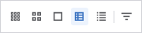
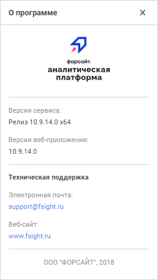

# Работа с готовым бизнес-приложением

Работа с готовым бизнес-приложением
-

# Работа с готовым бизнес-приложением

	При работе с готовым бизнес-приложением в веб-интерфейсе доступно:

		- [обновление списка объектов](#update). Доступно
		 только в бизнес-приложении 10.x;

		- [открытие объекта на просмотр](#open_object);

		- [управление отображением объектов](#view);

		- [увеличение рабочей области](#work_area);

		- [навигация по объектам](#navigation);

		- [открытие справочной системы на продукт
		 «Форсайт. Аналитическая платформа»](#open_help);

		- [получение информации о программе](#about_program).
		 Доступно только в бизнес-приложении 10.x;

		- [смена пароля пользователя](#change_password);

		- [выход из бизнес-приложения](#exit).

	При необходимости для расширения функциональности объектов в конструкторе
	 бизнес-приложений подключите [плагины](DataAnalysis.chm::/Plugins/Plugins.htm).

## Обновление списка объектов

	Для обновления списка объектов в навигаторе бизнес-приложения нажмите
	 кнопку  «Обновить»
	 в [главном меню](../Intro/Component_interface.htm).

	Примечание.
	 Обновление списка объектов доступно только в бизнес-приложении 10.x.

## Открытие объекта на просмотр

	Для открытия объекта на просмотр в навигаторе бизнес-приложения:

		- выполните команду «Открыть»
		 в контекстном меню объекта;

		- выполните команду «Открыть
		 в новой вкладке» в контекстном меню объекта;

		- выполните команду «Открыть
		 в новом окне» в контекстном меню объекта;

		- дважды щёлкните по объекту;

		- выделите объект и нажмите клавишу ENTER.

	После выполнения одного из действий объект будет открыт на просмотр.

## Управление отображением объектов

	Для управления отображением объектов в навигаторе бизнес-приложения:

		- в бизнес-приложении 10.x
		 используйте панель управления:

	

		- в бизнес-приложении 9.x
		 используйте раскрывающееся меню кнопки «Вид».

### Изменение отображения объектов

	Для изменения отображения объектов в навигаторе бизнес-приложения
	 выберите вид:

		- 
		 «Мелкие значки»;

		- 
		 «Крупные значки»;

		- 
		 «Огромные значки»;

		- 
		 «Таблица»;

		- 
		 «Список».

	Вид объекта в навигаторе зависит от выбранного способа отображения
	 в параметре «[Вид
	 элемента в навигаторе](../Web/Setting_Navigation_Structure.htm#view)» на странице «[Структура навигации](../Web/Setting_Navigation_Structure.htm)»
	 в мастере создания бизнес-приложения или на странице «[Структура
	 меню](../Desktop/Setting_web_application_structure.htm)» в конструкторе бизнес-приложения.

	Вид содержимого элемента меню зависит от выбранного способа отображения
	 в параметре «[Вид
	 содержимого элемента в навигаторе](../Web/Setting_Navigation_Structure.htm#view)» на странице «[Структура навигации](../Web/Setting_Navigation_Structure.htm)»
	 в мастере создания бизнес-приложения или на странице «[Структура
	 меню](../Desktop/Setting_web_application_structure.htm)» в конструкторе бизнес-приложения.

### Сортировка объектов

	Для сортировки объектов в навигаторе бизнес-приложения:

		- выполните действия:

			- Нажмите кнопку 
			 «Сортировка» на панели
			 управления.

			- Выберите вариант сортировки
			 в раскрывающемся меню:

				- По наименованию;

				- По идентификатору;

				- По дате изменения;

				- По типу объектов.

			- Выберите способ сортировки:

				- По возрастанию;

				- По убыванию.

	Примечание.
	 Сортировка объектов с помощью кнопки  «Сортировка»
	 доступна только в бизнес-приложении 10.x.

		- нажмите на заголовок столбца,
		 если используется табличный вид отображения объектов. После выполнения
		 действия объекты будут отсортированы по выбранному столбцу. В
		 заголовке столбца отображается пиктограмма сортировки, например:

	

## Увеличение рабочей области

	Для увеличения рабочей области и размера отображаемых объектов:

		- сверните панель навигации с помощью кнопки  «Свернуть
		 панель», расположенной в навигационном меню. Для отображения
		 панели навигации нажмите кнопку  «Развернуть
		 панель»;

		- сверните ленту инструментов при отображении аналитической
		 панели или экспресс-отчёта на рабочей области с помощью кнопки  «Свернуть». Для отображения ленты
		 инструментов нажмите кнопку  «Развернуть».

## Навигация по объектам

	Для удобства навигации и перехода по элементам меню, содержащихся
	 на панели навигации, в том числе если оно не отображается, используйте
	 [навигационное меню](../Intro/Component_interface.htm):

		- выберите нужный пункт для возврата к предыдущему элементу;

		- для перехода к элементам меню/объектам одного уровня используйте
		 раскрывающийся список с помощью кнопки 
		 «Развернуть». Доступно
		 только в бизнес-приложении 9.x.

	Навигационное меню содержит путь от стартовой страницы до папки
	 или объекта, открытого в данный момент.

## Открытие справочной системы

	Для открытия справочной системы [на
	 продукт «Форсайт. Аналитическая платформа»](uinav.chm::/02_navigator/uinav_repoconfig_help.htm):

		- в бизнес-приложении 10.x
		 выполните команду  «Справка»
		 в [главном меню](../Intro/Component_interface.htm);

		- в бизнес-приложении 9.x
		 выполните команду «Справка»
		 в раскрывающемся меню кнопки , расположенной
		 в правом верхнем углу [главного
		 меню](../Intro/Component_interface.htm).

	После выполнения одного из действий будет открыта справочная система
	 [на продукт
	 «Форсайт. Аналитическая платформа»](uinav.chm::/02_navigator/uinav_repoconfig_help.htm)
	 на отдельной вкладке браузера.

## Получение информации о программе

	Для получения информации о программе выполните команду  «О
	 программе» в [главном
	 меню](../Intro/Component_interface.htm). После выполнения действия будет открыто окно «О
	 программе»:

	

	Примечание.
	 Получение информации о программе доступно только в бизнес-приложении
	 10.x.

## Смена пароля пользователя

	Для смены пароля текущего пользователя:

		- Откройте окно «Смена пароля»:

			- в бизнес-приложении 10.x
			 выполните команду 
			 «Сменить пароль» в
			 [главном меню](../Intro/Component_interface.htm);

			- в бизнес-приложении 9.x
			 выполните команду «Сменить
			 пароль» в раскрывающемся меню кнопки , расположенной
			 в правом верхнем углу [главного
			 меню](../Intro/Component_interface.htm).

	После выполнения одного из действий будет
	 открыто окно «Смена пароля»:

	

		- Задайте параметры:

			- Старый пароль.
			 Введите текущий пароль пользователя;

			- Новый пароль.
			 Введите новый пароль пользователя. Пароль может начинаться
			 с цифры, буквы или символа "_" и может содержать
			 латинские буквы (a-z, A-Z), цифры 0-9, символы "_@#$&*%^"
			 и должен соответствовать установленной [парольной
			 политике](Admin.chm::/04_SecurityPolicy/Editor_of_Politicy/Security_EditorPoliticy_General_Parole.htm);

			- Подтверждение пароля.
			 Повторите ввод нового пароля пользователя.

		- Нажмите кнопку «Применить».

	После выполнения действий пароль пользователя будет изменён.

	Примечание.
	 Смена пароля пользователя доступна только при использовании [парольной
	 аутентификации](Setup.chm::/UiWebSetup/Authentication/Authentication.htm) и при снятом флажке «[Запретить
	 смену пароля пользователем](admin.chm::/03_Admin/Users/Admin_UserProp_Common.htm)».

## Выход из бизнес-приложения

	Для выхода из бизнес-приложения:

		- в бизнес-приложении 10.x
		 выполните команду  «Выход»
		 в [главном меню](../Intro/Component_interface.htm);

		- в бизнес-приложении 9.x
		 выполните команду «Выход»
		 в раскрывающемся меню кнопки , расположенной
		 в правом верхнем углу [главного
		 меню](../Intro/Component_interface.htm).

	После выполнения одного из действий будет выполнен выход из конструктора
	 бизнес-приложения и открыто [окно регистрации](getstarted.chm::/GetStarted/Get_Started.htm).

См. также:

[Построение
 бизнес-приложения в веб-приложении](../Web/General_Principles_Web.htm) | [Построение
 бизнес-приложения в настольном приложении](../Desktop/General_Principles.htm)

		Справочная
		 система на версию 10.9
		 от 18/08/2025,
		 © ООО «ФОРСАЙТ»,
