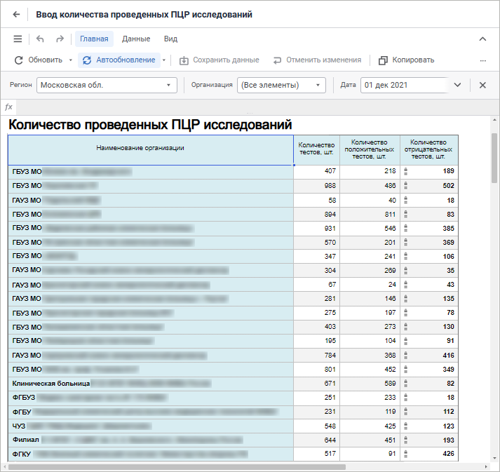
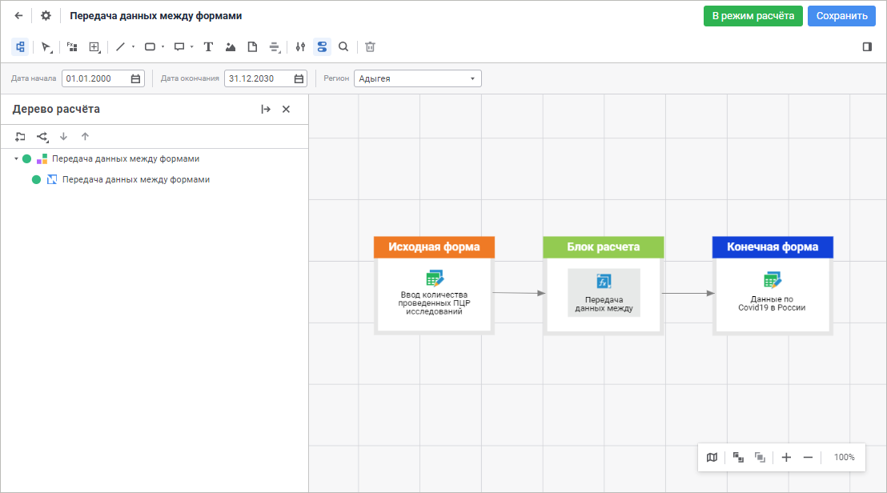
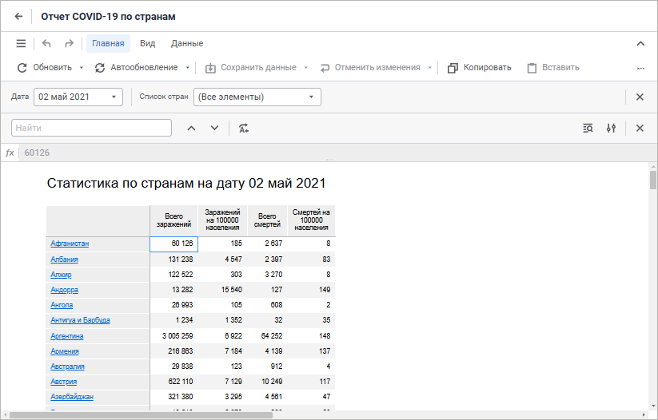
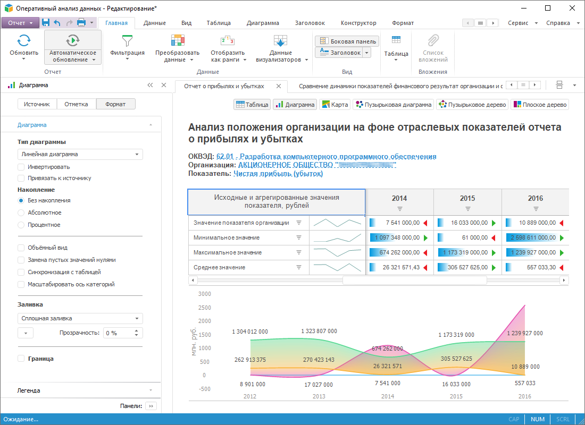
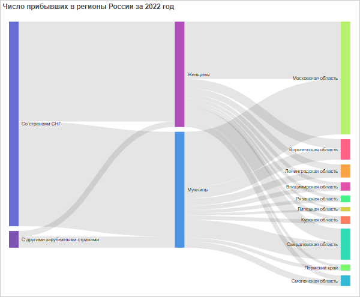

# Анализ данных и построение отчётов

Анализ данных и построение отчётов
-

# Анализ данных и построение отчётов

В продукте «Форсайт. Аналитическая платформа»
 анализ данных и построение отчётов выполняется с помощью различных инструментов
 и расширений. В результате анализа формируется набор различных отчётов,
 в том числе и интерактивных, которые предназначены для передачи конечным
 пользователям: руководителям, менеджерам, аналитикам и т.п.

## Построение форм ввода, контроля и согласования данных

Расширение «[Интерактивные
 формы ввода данных](DataEntryForms.chm::/DataEntryForms_Purpose.htm)» предназначено для создания
 форм для ручного ввода данных, контроля вводимых данных и расчёта показателей.

## Алгоритмы расчёта

Расширение «[Алгоритмы расчёта](CalculationAlgorithm.chm::/purpose.htm)»
 предназначено для автоматизации методик и алгоритмов.

## Построение отчёта для печати

Инструмент «[Отчёты](UiReport.chm::/UiReport_purpose.htm)»
 предназначен для формирования отчётов с произвольной структурой отображения
 информации, позволяющих комбинировать табличные данные, текст, деловую
 графику и различные визуализаторы.

## 

## Построение информационных панелей

Инструмент [«Информационная панель»](Dashboard.htm)
предназначен для решения задач по исследованию, поиску и визуализации данных с использованием средств интерактивной деловой графики.

## Оперативный просмотр и анализ данных (OLAP)

Инструмент «[Аналитические
 запросы (OLAP)](UiExpress.chm::/purpose/UiExpress_Purpose.htm)» предназначен для формирования нерегламентированных
 запросов к данным и проведения анализа с помощью средств деловой графики
 и с применением различных аналитических функций.

## Построение аналитических панелей

Инструмент «[Аналитические панели](UiAdhoc.chm::/UiAdhoc_Purpose.htm)»
 предназначен для представления аналитических документов на основе информации
 из различных источников с помощью набора взаимосвязанных визуализаторов.

## Анализ временных рядов

Инструмент «[Анализ временных рядов](UiDw.chm::/uidw_title.htm)»
 предназначен для исследования данных, изменяющихся во времени.

## Визуализация данных

В инструментах продукта «Форсайт. Аналитическая платформа» доступны
 [различные визуализаторы](Visualizators.htm), которые позволяют
 отображать данные. При изменении данных в источнике изменения будут автоматически
 отображены во всех визуализаторах.

## Плагины

В инструментах продукта «Форсайт. Аналитическая платформа» доступно
 подключение [плагинов](Plugins/Plugins.htm) для расширения
 возможностей и решения пользовательских задач.

		Справочная
		 система на версию 10.9
		 от 18/08/2025,
		 © ООО «ФОРСАЙТ»,
