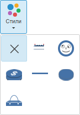
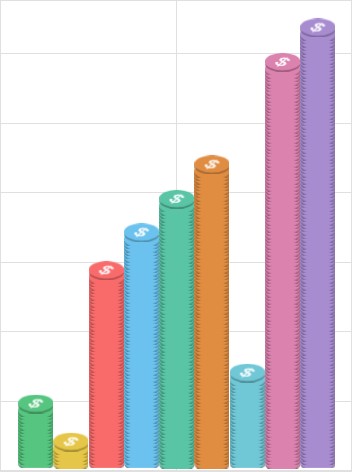

# Подключение пользовательских шаблонов диаграмм: Плагин

Подключение пользовательских шаблонов диаграмм: Плагин
-

# Подключение пользовательских шаблонов
 диаграмм

Прикладным разработчикам доступно подключение пользовательских шаблонов
 диаграмм. Пользовательский шаблон меняет форму всех [рядов данных](UiDiagrams.chm::/Series.htm)
 диаграммы, используя шаблон, написанный в формате [*.svg](http://www.w3.org/2000/svg).
 Файл шаблона должен соответствовать [определенной
 структуре](Svg_specification.htm), состоящей из стандартной SVG-разметки и дополнительных
 атрибутов «Форсайт. Аналитическая платформа».

Примечание.
 Подключение пользовательских шаблонов доступно для [гистограммы](UiDiagrams.chm::/Type_diagrams/UiDiagrams_Bar.htm)
 и [круговой
 диаграммы](UiDiagrams.chm::/Type_diagrams/UiDiagrams_round.htm) в инструментах «[Аналитические
 панели](UIAdhoc.chm::/UiAdhoc_Purpose.htm)», «[Аналитические
 запросы (OLAP)](UIExpress.chm::/purpose/UiExpress_Purpose.htm)», «[Анализ
 временных рядов](UiDw.chm::/UiDw_Title.htm)» только в веб-приложении и
 [конструкторе
 бизнес-приложений](Constructor.chm::/Intro/Designer_business_applications.htm).

Для подключения пользовательских шаблонов диаграмм:

	- Добавьте файлы шаблонов *.svg в папку установки веб-приложения
	 или конструктора бизнес-приложений.

	Веб-приложение

	 Конструктор
	 бизнес-приложений

		Путь до папки установки веб-приложения:

			- если
			 описание плагина добавляется в конфигурационном файле [config.json](Setup.chm::/UiWebSetup/03_Setup_Web/PP_config_Java.htm#config_json):

				- в ОС Linux: /opt/foresight/fp10.x-webserver/r;

				- в ОС Windows: C:\Program Files (x86)\Foresight\Analytics
				 Platform 10.x Web Application\r;

			- если описание плагина добавляется
			 в конфигурационном файле [PP.xml](Setup.chm::/UiWebSetup/03_Setup_Web/PP_config_Java.htm):

				- в ОС Linux: /opt/foresight/fp10.x-webserver;

				- в ОС Windows: C:\Program Files (x86)\Foresight\Analytics
				 Platform 10.x Web Application.

		Путь до папки установки конструктора
		 бизнес-приложений:

			- если серверная часть конструктора бизнес-приложений
			 установлена автоматически на веб-сервер Apache2 или вручную
			 на IIS:

				- в ОС Linux: /opt/foresight/fp10.x-dba;

				- в ОС Windows: C:\Program Files (x86)\Foresight\DBA_10.x. Папка
				 DBA_10.x
				 создаётся [вручную](Setup.chm::/Extensions/ASP_NET/Manual_Install_Designer_of_Business_Applications_ASP_NET.htm)
				 и может отличаться;

			- если серверная часть конструктора бизнес-приложений
			 установлена вручную на веб-сервер Apache2, Java или автоматически
			 на IIS:

				- в ОС Linux: /opt/foresight/dba/10.x;

				- в ОС Windows: C:\Program Files (x86)\Foresight\Designer
				 of Business Application 10.x Web Server.

Совет.
 Для удобного использования шаблонов создайте отдельную папку custom_plugins,
 в которой будет размещаться плагин для подключения шаблонов. В папке custom_plugins
 создайте папку templates, в которой будут размещаться файлы шаблонов *.svg.

	- Создайте плагин ChartTemplates.js с параметрами используемых
	 шаблонов и разместите его в папке plugins:

PP.ChartTemplates = function (settings) {
    PP.ChartTemplates.base.constructor.apply(this, arguments);
    this._Interfaces = [];
};
PP.initClass(PP.ChartTemplates, PP.Object, 'PP.ChartTemplates', [PP.IPlugin]);
PP.Object.defineProps(PP.ChartTemplates, ['Interfaces', 'ImagePath'], false);
PP.ChartTemplates.prototype._ImagePath = PP.ImagePath;
PP.ChartTemplates.prototype.getInstance = function () {
    return null;
};
PP.ChartTemplates.init = function (settings) {
    var t = new PP.ChartTemplates(settings);
    var templates = PP.Ui.getConfig().getChart().getTemplates();
    var newTemplates = {
        '<наименование шаблона>': {

            'Id': '<уникальный идентификатор шаблона>',

            'PPType': '<тип диаграммы>',

            // Метод getImagePath возвращает относительный путь до файлов шаблонов,
            // заданный в атрибуте value раздела <param> в шаге 3. Если файл шаблона
            // содержится в отдельной вложенной папке, то укажите её перед
            // подстановкой <наименование файла шаблона>

            'Source': t.getImagePath() + '<наименование файла шаблона>.svg'

        },
        // Добавьте несколько шаблонов
        ...
    };
    for (var i = 0, nt; i < templates.length; i++) {
        if (nt = newTemplates[PP.getProperty(templates[i], 'Id')]) {
            templates[i] = nt;
            delete newTemplates[nt.Id];
        }
    }
    for (var c in newTemplates)
        templates.push(newTemplates[c]);
    PP.Ui.getConfig().getChart().setTemplates(templates);
    return t;
};

Примечание.
 Значения, заданные в подстановках <наименование
 шаблона> и <уникальный
 идентификатор шаблона>, могут
 совпадать и соответствовать наименованию файла шаблона.

В подстановке <тип
 диаграммы> задайте одно из значений:

		- PP.Ui.ChartColumnTemplate.
		 При использовании [гистограммы](UiDiagrams.chm::/Type_diagrams/UiDiagrams_Bar.htm);

		- PP.Ui.ChartPieTemplate.
		 При использовании [круговой
		 диаграммы](UiDiagrams.chm::/Type_diagrams/UiDiagrams_round.htm).

	- Добавьте описание плагина в конфигурационном файле [config.json](Setup.chm::/UiWebSetup/03_Setup_Web/PP_config_Java.htm#config_json)/[PP.xml](Setup.chm::/UiWebSetup/03_Setup_Web/PP_config_Java.htm)
	 для веб-приложения или [config.json](Setup.chm::/Extensions/Configuration_Designer_of_Business_Applications.htm#config_json)/[DBA.config.json](Setup.chm::/Extensions/Configuration_Designer_of_Business_Applications.htm#dba_config_json)
	 для конструктора бизнес-приложений.

	config.json PP.xml DBA.config.json

		В файле config.json [веб-приложения](Setup.chm::/UiWebSetup/03_Setup_Web/PP_config_Java.htm#modules_config)/[конструктора
		 бизнес-приложений](Setup.chm::/Extensions/Configuration_Designer_of_Business_Applications.htm#modules_config_json) для описания плагина используйте
		 поле plugins:

"modules": {
  "8448": { //числовое значение класса объекта «Аналитическая панель». Для объекта «Экспресс-отчёт» укажите значение класса «2561»
    "customization": { //пользовательские настройки оформления
      "plugins": [
          {
              "name": "ChartTemplates", //наименование плагина
              "path": "./custom_plugins/ChartTemplates.js", //относительный путь до плагина ChartTemplates.js
              "params": [ //параметры открытия плагина
                {
                  "name": "ImagePath",
                  "value": "./custom_plugins/templates/" //относительный путь до файлов шаблонов *.svg
                }
              ]
           },
          {
              ...
          }
        ]
     }
  }
}

		В файле PP.xml для описания плагина используйте раздел [<plugins>](Setup.chm::/UiWebSetup/03_Setup_Web/PP_config_Java.htm#plugins):

<plugins>
    <!-- Задайте относительный путь до плагина ChartTemplates.js в атрибуте path -->
    <plugin name="ChartTemplates" path="../custom_plugins/ChartTemplates.js" loaded="true">
        <params>
            <!-- Задайте относительный путь до файлов шаблонов *.svg в атрибуте value -->
            <param name="ImagePath" value="../custom_plugins/templates/"/>
        </params>
    </plugin>
</plugins>

		В файле DBA.config.json для описания плагина используйте поле [plugins](Setup.chm::/Extensions/Configuration_Designer_of_Business_Applications.htm#plugins):

"plugins": [
    {
        "Path": "../custom_plugins/ChartTemplates.js", //относительный путь до плагина ChartTemplates.js
        "Name": "ChartTemplates", //наименование плагина
        "Loaded": true, //способ загрузки плагина
        "Params":{
            "Param":[{
                "Name": "ImagePath",
                "Value": "../custom_plugins/templates/" //относительный путь до файлов шаблонов *.svg
            }]
        }
    }
]

	- Перезапустите серверную часть [веб-приложения](setup.chm::/UiWebSetup/03_Setup_Web/Web_Server_Restart.htm)/[конструктора
	 бизнес-приложений](setup.chm::/Extensions/Restart_Backend_Designer_of_Business_Applications.htm).

После выполнения действий пользовательские шаблоны диаграмм будут подключены
 в веб-приложение или конструктор бизнес-приложений в раскрывающемся меню
 кнопки  «Стили»
 на вкладке «Диаграмма» [ленты
 инструментов](GetStarted.chm::/Interface/Interface_Description.htm#customize_ribbon).

## Пример подключения пользовательских шаблонов

Для выполнения примера скачайте архив [plugins.zip](plugins.zip)
 с набором готовых шаблонов и разархивируйте его в папке установки веб-приложения
 C:\Program Files (x86)\Foresight\Analytics Platform 10.x Web Application.

Добавьте описание плагина в конфигурационном файле [PP.xml](Setup.chm::/UiWebSetup/03_Setup_Web/PP_config_Java.htm)
 в разделе [<plugins>](Setup.chm::/UiWebSetup/03_Setup_Web/PP_config_Java.htm#plugins):

<plugins>
    <plugin name="ChartTemplates" path="../custom_plugins/ChartTemplates.js" loaded="true">
        <params>
            <param name="ImagePath" value="../custom_plugins/templates/"/>
        </params>
    </plugin>
</plugins>

После выполнения действий пользовательские шаблоны из архива будут подключены
 в веб-приложение в раскрывающемся меню кнопки  «Стили» на вкладке «Диаграмма»
 [ленты
 инструментов](GetStarted.chm::/Interface/Interface_Description.htm#customize_ribbon):

При выборе пользовательского шаблона отображение рядов диаграммы будет
 изменено, например:

См. также:

[Плагины](../Plugins.htm)
 | [Типы
 диаграмм](UiDiagrams.chm::/Type_diagrams/UiDiagrams_Type_diagrams.htm) | [Структура
 пользовательского шаблона диаграммы](Svg_specification.htm)

		Справочная
		 система на версию 10.9
		 от 18/08/2025,
		 © ООО «ФОРСАЙТ»,
