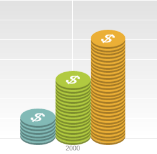
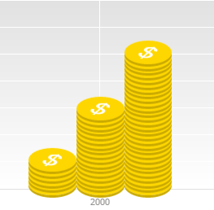
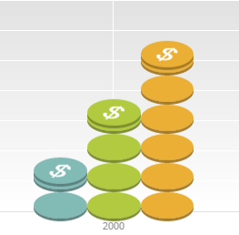
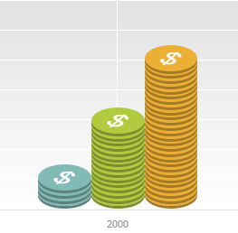
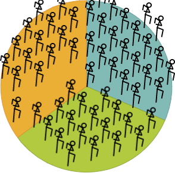
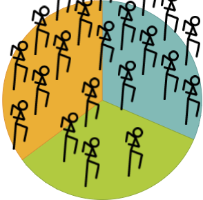
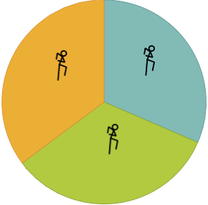
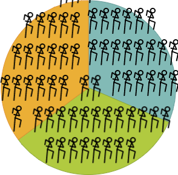
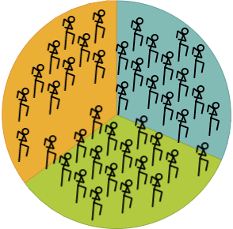

# Структура пользовательского шаблона диаграммы: Плагин

Структура пользовательского шаблона диаграммы: Плагин
-

# Структура пользовательского шаблона диаграммы

Шаблоны диаграммы создаются в формате [svg](http://www.w3.org/2000/svg)
 (Scalable Vector Graphics) и имеют следующую структуру:

Элементы <svg> внутри корневого элемента <svg> воспринимаются
 как части шаблона в следующем порядке:

	- Footer. Нижняя часть.

	- Content. Часть заполнения.

	- Header. Верхняя часть.

Прочая разметка внутри корневого элемента <svg> игнорируется.

Если внутри корневого элемента <svg> отсутствуют вложенные <svg>,
 он будет интерпретироваться как часть заполнения (Content).

Принадлежность к конкретной части вложенного <svg> можно также
 задать через атрибут «id» ("footer"
 / "content" / "header" соответственно).

## Дополнительные атрибуты svg разметки

В «Форсайт. Аналитическая платформа» помимо стандартной разметки svg
 в шаблонах диаграммы используются специальные атрибуты.

### ppchart-color-value

Добавляется в тег <svg>.

Определяет, что фигуру данного тега необходимо покрасить в цвет ряда,
 домноженный на это число.

Пример:

ppchart-color-value="1"
        не заданный ppchart-color-value

  

### ppchart-overlap

Добавляется в тег <svg>.

Для гистограмм определяет наложение элемента на элемент, находящийся
 ниже. Задается в процентах от своей высоты или в пикселях.

Для круговых диаграмм определяет наложение по обеим сторонам. Задается
 в процентах, считается от размера соответствующей стороны.

Пример:

Атрибут изменен для части заполнения (Content).

ppchart-overlap="82%"
              ppchart-overlap="0%"

  

### ppchart-target-x, ppchart-target-y

Добавляется в тег <svg>.

Для гистограмм определяет смещение по оси Y самого нижнего элемента
 ряда. Задается в процентах от высоты элемента.

По умолчанию для нижнего элемента установлено значение 100%.

Для круговых диаграмм задает точку, привязывающую сетку заполнения к
 центру сектора. Также данная точка определяет, входит ли очередная картинка
 сетки в сектор. По умолчанию установлен центр картинки.

Пример:

ppchart-target-y="63%"
            ppchart-target-y="100%"

  

### ppchart-size

Атрибут доступен только для круговых диаграмм, добавляется в корневой
 тег <svg>.

Определяет размер большей стороны шаблона относительно радиуса круга.
 По умолчанию установлено значение "0.3".

При значении "0.5" длина картинки будет равна половине радиуса
 круга.

Пример:

     ppchart-size="0.3"
                     ppchart-size="0.5"

    

### ppchart-repeat

Атрибут доступен только для круговых диаграмм, добавляется в корневой
 тег <svg>.

Определяет повторное использование шаблона. По умолчанию содержит значение
 "repeat".

Допустимые значения:

	- none. Без повторения
	 шаблона;

	- repeat-x. Повторение
	 шаблона по оси X;

	- repeat-y. Повторение
	 шаблона по оси Y;

	- repeat. Повторение шаблона
	 по оси X и Y;

Пример:

    ppchart-repeat="repeat"
              ppchart-repeat="none"

   

### ppchart-offset-y

Атрибут доступен только для круговых диаграмм, добавляется в корневой
 тег <svg>.

Определяет смещение соседних столбцов при повторении шаблона. По умолчанию
 установлено значение "0".

Пример:

    ppchart-offset-y="0"
                  ppchart-offset-y="50%"

    

### ppchart-min-size

Добавляется в корневой тег <svg>.

Определяет минимальный размер в пикселях (для гистограмм - ширину, для
 круговых - большую сторону шаблона), при котором будет отображен
 шаблон. Если размер меньше, будет отображен стандартный ряд/сектор круга.
 По умолчанию установлено значение "5".

Пример:

ppchart-min-size="20"

### ppchart-allowed-intersections

Атрибут доступен только для круговых диаграмм, добавляется в корневой
 тег <svg>.

Определяет, какие пересечения можно отображать. По умолчанию разрешены
 все пересечения.

Допустимые значения:

	- border. Выход за границы
	 диаграммы;

	- sector. Пересечение
	 со смежным сектором;

	- template. Пересечение
	 с шаблоном из смежного сектора.

Пример:

ppchart-allowed-intersections="border;sector"
   ppchart-allowed-intersections="sector"

                             

См. также:

[Подключение
 пользовательских шаблонов диаграмм](CustomDiagram.htm)

		Справочная
		 система на версию 10.9
		 от 18/08/2025,
		 © ООО «ФОРСАЙТ»,
