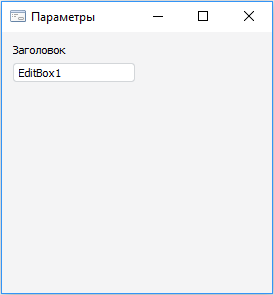

# Создание формы-мастера: Плагин

Создание формы-мастера: Плагин
-

# Создание формы-мастера

Для создания формы-мастера выполните следующие действия:

	- Создайте форму с идентификатором «PluginMasterForm». Данная
	 форма должна быть наследником класса [AdhocUserMasterForm](KeAdHoc.chm::/Class/AdhocUserMasterForm/AdhocUserMasterForm.htm).
	 Выделите форму и в [инспекторе
	 объектов](UiDevEnv.chm::/01_Development_Environment/03_Windows_of_Development_Environment/Object_Inspector.htm) на вкладке «Свойства»
	 задайте для свойства «Text»
	 значение «Параметры:».

	- В верхней части формы разместите компонент Label с идентификатором
	 «Label_Caption». Выделите данный компонент и в [инспекторе
	 объектов](UiDevEnv.chm::/01_Development_Environment/03_Windows_of_Development_Environment/Object_Inspector.htm) на вкладке «Свойства»
	 задайте для свойства «Text»
	 значение «Заголовок».

	- Добавьте на форму компонент EditBox с идентификатором «EditBox_Caption».
	 Выделите данный компонент и в [инспекторе
	 объектов](UiDevEnv.chm::/01_Development_Environment/03_Windows_of_Development_Environment/Object_Inspector.htm) на вкладке «События»
	 задайте событие «OnChange».
	 Код обработчика события приведен ниже. Форма должна принять следующий
	 вид:

	- Добавьте ссылку на системную сборку Adhoc и на сборку PluginViewForm
	 в текущем репозитории.

	- Задайте код формы:

	Class PluginMasterFormForm: AdhocUserMasterForm

	    Label_Caption: Label;

	    EditBox_Caption: EditBox;

	    ViewForm: PluginViewFormForm;

	    // Обработка события: изменение текста в EditBox_Caption

	    Sub EditBox_CaptionOnChange(Sender: Object; Args: IEventArgs);

	    Begin

	        ViewForm.SetLabelText(EditBox_Caption.Text);

	    End Sub EditBox_CaptionOnChange;

	    // Функция получения формы-визуализатора

	    Function GetViewForm: PluginViewFormForm;

	    Begin

	        Return ViewForm;

	    End Function GetViewForm;

	    { Процедура задания формы визуализатора и

	      начального значения EditBox_Caption.

	      Реализация AdhocUserMasterForm.View}

	    Protected Sub set_View(Val: Object);

	    Begin

	        ViewForm := Val As PluginViewFormForm;

	        EditBox_Caption.text := GetViewForm.GetLabelText;

	    End Sub set_View;

	End Class PluginMasterFormForm;

См. также:

[Создание
 плагина](Create_Plugin.htm) | [AdhocUserMasterForm](KeAdHoc.chm::/Class/AdhocUserMasterForm/AdhocUserMasterForm.htm)

		Справочная
		 система на версию 10.9
		 от 18/08/2025,
		 © ООО «ФОРСАЙТ»,
