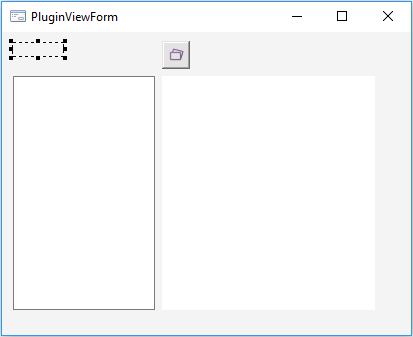

# Создание формы-визуализатора: Плагин

Создание формы-визуализатора: Плагин
-

# Создание формы-визуализатора

Для создания формы-визуализатора выполните следующие действия:

	- Создайте форму с идентификатором «PluginViewForm». Данная форма
	 должна быть наследником класса [AdhocUserViewForm](KeAdhoc.chm::/Class/AdhocUserViewForm/AdhocUserViewForm.htm).

	- В верхней части формы разместите компонент Label с идентификатором
	 «Label_Plugin_Caption». Выделите данный компонент и в [инспекторе
	 объектов](UiDevEnv.chm::/01_Development_Environment/03_Windows_of_Development_Environment/Object_Inspector.htm) на вкладке «Свойства»
	 удалите значения свойства «Text»,
	 для свойства «AutoSize» установите
	 значение «True».

	- Добавьте на форму компонент UiErAnalyzer с идентификатором «UiErAnalyzer1».

	- В левую часть формы добавьте компонент ErAnalyzerDimPanel с
	 идентификатором «ErAnalyzerDimPanel1». Выделите данный компонент и
	 в [инспекторе
	 объектов](UiDevEnv.chm::/01_Development_Environment/03_Windows_of_Development_Environment/Object_Inspector.htm) на вкладке «Свойства»
	 выберите для свойства «Object»
	 значение «UiErAnalyzer1».

	- В правую часть формы компонент ChartBox с идентификатором «ChartBox1».
	 Выделите данный компонент и в [инспекторе
	 объектов](UiDevEnv.chm::/01_Development_Environment/03_Windows_of_Development_Environment/Object_Inspector.htm) на вкладке «Свойства»
	 выберите для свойства «Source»
	 значение «UiErAnalyzer1». Форма должна принять следующий вид:

	- Добавьте ссылки на системные сборки: Adhoc, Chart, Metabase,
	 Xml.

	- Задайте код формы:

	Public Class PluginViewFormForm: AdhocUserViewForm

	    UiErAnalyzer1: UiErAnalyzer;

	    ChartBox1: ChartBox;

	    ErAnalyzerDimPanel1: ErAnalyzerDimPanel;

	    Label_Plugin_Caption: Label;

	    { Функция для получения типов поддерживаемых источников данных.

	      Реализация AdhocUserViewForm.SupportedSource}

	    Function get_SupportedSource: Array Of Integer;

	    Var

	        SourcesKeys: Array Of Integer;

	    Begin

	        SourcesKeys := New Integer[1];

	        SourcesKeys[0] := MetabaseObjectClass.KE_CLASS_EXPRESSREPORT;

	        return sourcesKeys;

	    end Function get_SupportedSource;

	    { Процедура задания источника данных плагина.

	      Реализация AdhocUserViewForm.Source}

	    Sub set_Source(s: IAdhocDataSourceObject);

	    Var

	        Analyzer: IEaxAnalyzer;

	    Begin

	        SourceValue := s;

	        Analyzer := SourceValue.GetSourceObject As IEaxAnalyzer;

	        UiErAnalyzer1.ErAnalyzer := SourceValue.GetSourceObject As IEaxAnalyzer;

	        UiErAnalyzer1.ErAnalyzer.Chart.Active := True;

	        UiErAnalyzer1.Active := True;

	    End Sub set_Source;

	    { Процедура для сохранения настроек плагина.

	      Реализация AdhocUserViewForm.SaveSettings}

	    Sub SaveSettings(xml: Variant);

	    Var

	        el: IXmlDomElement;

	    Begin

	        el := xml As IXmlDomElement;

	        el.setAttribute("txt", Label_Plugin_Caption.Text);

	    End Sub SaveSettings;

	    { Процедура для загрузки настроек плагина.

	      Реализация AdhocUserViewForm.LoadSettings}

	    Sub LoadSettings(xml: Variant);

	    Var

	        el: IXmlDomElement;

	    Begin

	        el := xml As IXmlDomElement;

	        Label_Plugin_Caption.Text := el.getAttribute("txt") As string;

	    End Sub LoadSettings;

	    { Пользовательская процедура для установки заголовка плагина.

	      Предназначена для взаимодействия со вкладкой боковой панели}

	    Public Sub SetLabelText(val: string);

	    Begin

	        Label_Plugin_Caption.Text := val;

	    End Sub SetLabelText;

	    { Пользовательская функция для получения заголовка плагина.

	      Предназначена для взаимодействия со вкладкой боковой панели}

	    Public Function GetLabelText: string;

	    Begin

	        Return Label_Plugin_Caption.Text;

	    End Function GetLabelText;

	End Class PluginViewFormForm;

См. также:

[Создание
 плагина](Create_Plugin.htm) | [AdhocUserViewForm](KeAdhoc.chm::/Class/AdhocUserViewForm/AdhocUserViewForm.htm)

		Справочная
		 система на версию 10.9
		 от 18/08/2025,
		 © ООО «ФОРСАЙТ»,
