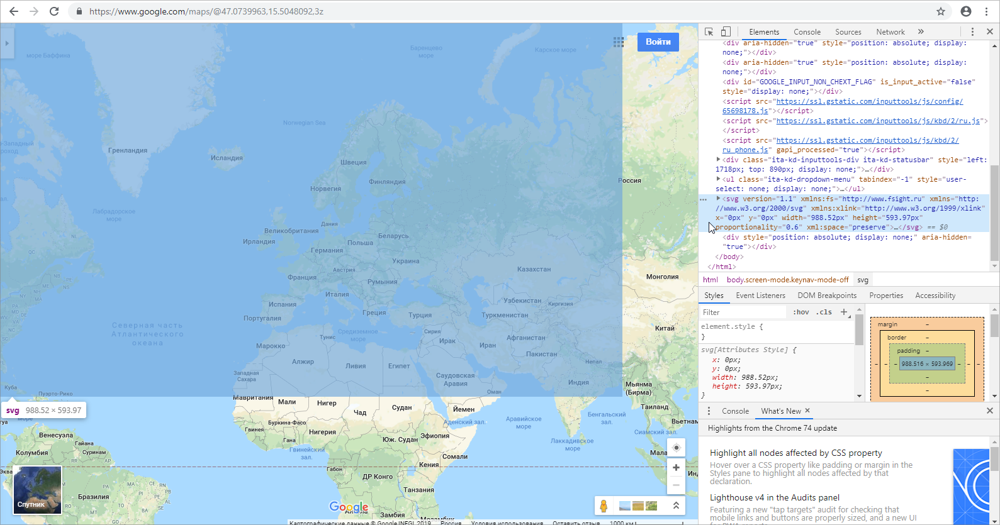
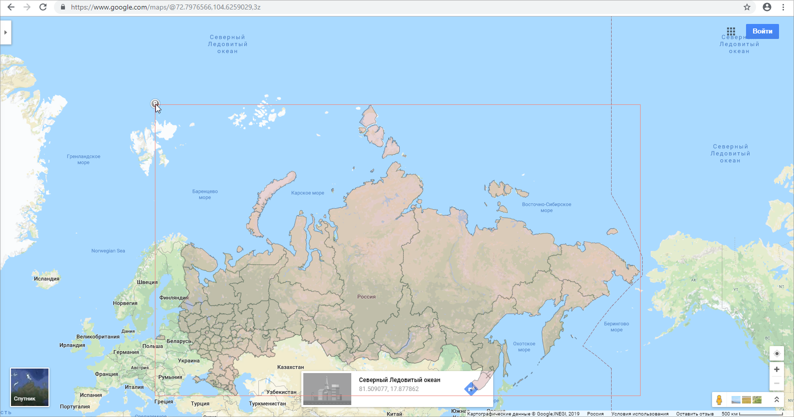

# Решение проблем с геопривязкой при подключении внешних сервисов

Решение проблем с геопривязкой при подключении внешних сервисов
-

# Решение проблем с геопривязкой при подключении внешних сервисов

При [подключении внешних картографических
 сервисов](Connecting_External_Services.htm) может возникнуть несовпадение границ накладываемых друг на
 друга карт. Причиной расхождения координат может быть:

	- Неверное значение атрибута proportionality="0.67",
	 который находится в заголовочной части топоосновы.

	- Отсутствуют или неверно выставлена геопривязка топоосновы:

<fs:Geo>
    <fs:GeoItem Latitude="83.608096" Longitude="-168.230659" X="0" Y="0"></fs:GeoItem>
    <fs:GeoItem Latitude="-56.586816" Longitude="-169.636909" X="1" Y="1"></fs:GeoItem>
</fs:Geo>

Для настройки геопривязки выполните следующие шаги:

	- Выгрузите содержимое используемой
	 топоосновы в файл:

		- Выделите объект, в котором используется карта, в навигаторе
		 объектов в настольном приложении.

		- Откройте диалог «[Свойства
		 объекта](uinav.chm::/03_objects/uinav_obj_basicprop.htm)» с помощью команды «Свойства»
		 контекстного меню.

		- Перейдите на вкладку «Состоит
		 из», выделите карту и нажмите кнопку «Перейти
		 к объекту». Будет осуществлен переход в папку, в которой
		 размещается используемая карта.

		- выгрузите содержимое карты в файл формата SVG на локальный
		 ресурс с помощью команды «Сохранить
		 в файл» контекстного меню.

	- Откройте выгруженный файл текстовым редактором и измените значение
	 атрибута proportionality на
	 "0.6", например:

<svg version="1.1" xmlns:fs="http://www.fsight.ru" xmlns="http://www.w3.org/2000/svg"
xmlns:xlink="http://www.w3.org/1999/xlink" x="0px" y="0px" width="988.52px" height="593.97px"
proportionality="0.6" xml:space="preserve">

Примечание.
 В некоторых случаях для совмещения границ достаточно выполнения двух первых
 шагов. Сохраните файл с топосновой, перейдите к шагу 9 и проверьте отображение
 границ.

	- Скопируйте содержимое файла.

	- Откройте сервис [https://www.google.com/maps](https://www.google.com/maps)
	 или [https://yandex.ru/maps/](https://yandex.ru/maps/):

		- перейдите в режим разработчика, например, в браузере GoogleChrome
		 с помощью сочетания клавиш CTRL+SHIFT+I или клавиши F12;

		- в разделе Elements
		 перейдите в режим редактирования с помощью команды контекстного
		 меню «Edit as HTML»;

		- вставьте скопированное содержимое файла с картой в конец
		 тега <body>;

		- выйдите из режима редактирования.

При наведении курсора на вставленный текст
 с тегом <svg> на Google-карте или Яндекс-карте будет отображаться
 добавленная карта в виде синего прямоугольника:

	- Выделите тег <svg>, перейдите в раздел Styles
	 и задайте стили добавленной карты в секции element.style,
	 чтобы она была видна на фоне Google-карты или Яндекс-карты:

element.style {
    position: absolute;
    border: 1px solid red;
    left: 300px;
    top: 170px;
    opacity: .4;
}

	- Совместите границы территорий вставленной карты и Google-карты
	 или Яндекс-карты, вручную перемещая Google-карту или Яндекс-карту.

Примечание.
 Предварительно размер Google-карты или Яндекс-карты уменьшите до минимального.
 Отключите в меню параметр Globus для Google-карты.

	- Определите координаты точек (0, 0) и (1, 1). Для этого щёлкните
	 рядом с левым верхним и правым нижним углами за пределами вставленной
	 карты. На Google-карте сразу будут отображены координаты точек. Для
	 просмотра координат на Яндекс-карте выполните щелчок правой кнопкой
	 мыши и выберите пункт «Что здесь?»
	 в контекстном меню. Запишите координаты для дальнейшей вставки в топооснову.

	- Внесите полученные координаты для точек (0, 0) и (1, 1) в файл
	 с топоосновой в текстовом редакторе в раздел <fs:MetaInfo>,
	 например:

<fs:MetaInfo>
    <fs:Geo>
        <fs:GeoItem Latitude="81.509077" Longitude="17.877862" X="0" Y="0"></fs:GeoItem>
        <fs:GeoItem Latitude="40.265518" Longitude="-168.445904" X="1" Y="1"></fs:GeoItem>
    </fs:Geo>
    ...
</fs:MetaInfo>

	- Загрузите обновленную топооснову для замены её данных. Для этого
	 выполните команду «Загрузить из файла»
	 в контекстном меню топоосновы в навигаторе объектов в настольном приложении.

	- Отройте отчёт с картой в веб-приложении или конструкторе бизнес-приложений
	 и проверьте совпадение границ топоосновы и Google-карты или Яндекс-карты.

См. также:

[Подключение
 внешних картографических сервисов к карте](Connecting_External_Services.htm)

		Справочная
		 система на версию 10.9
		 от 18/08/2025,
		 © ООО «ФОРСАЙТ»,
