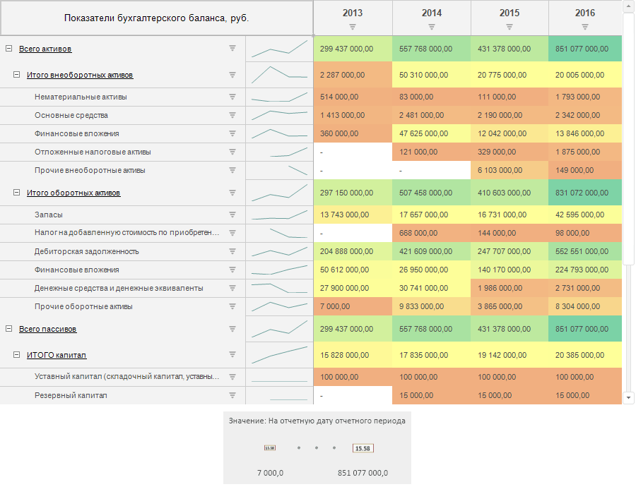
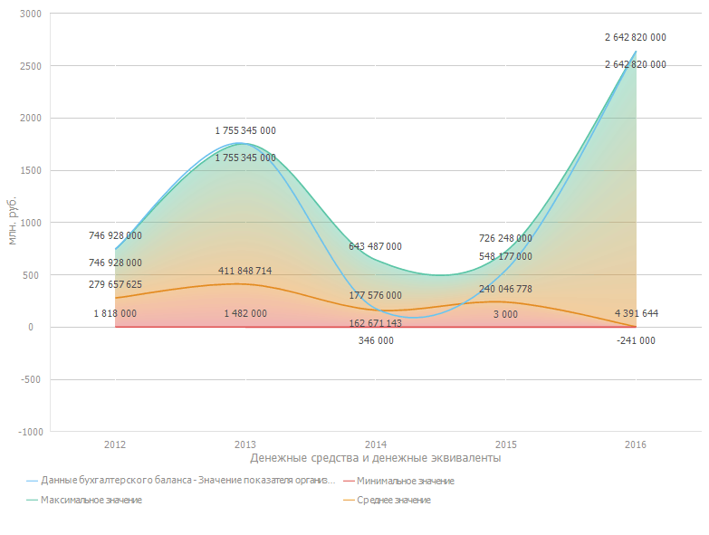
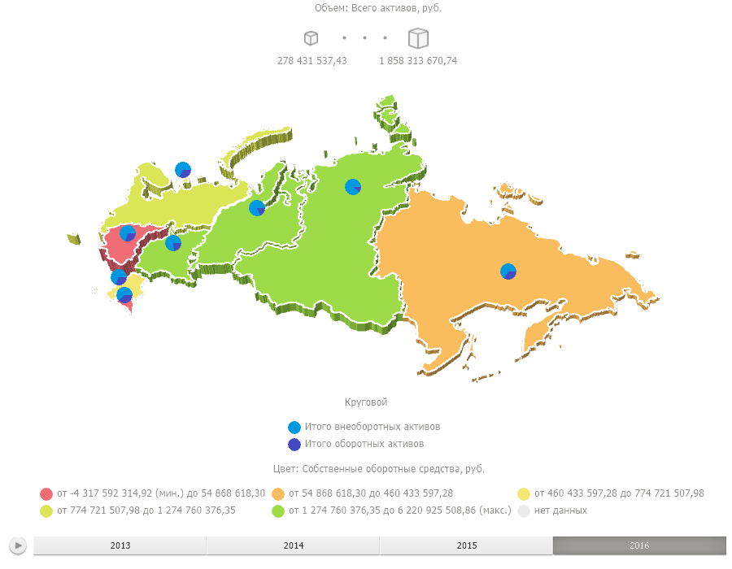
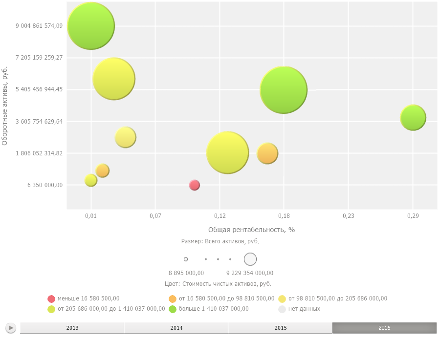
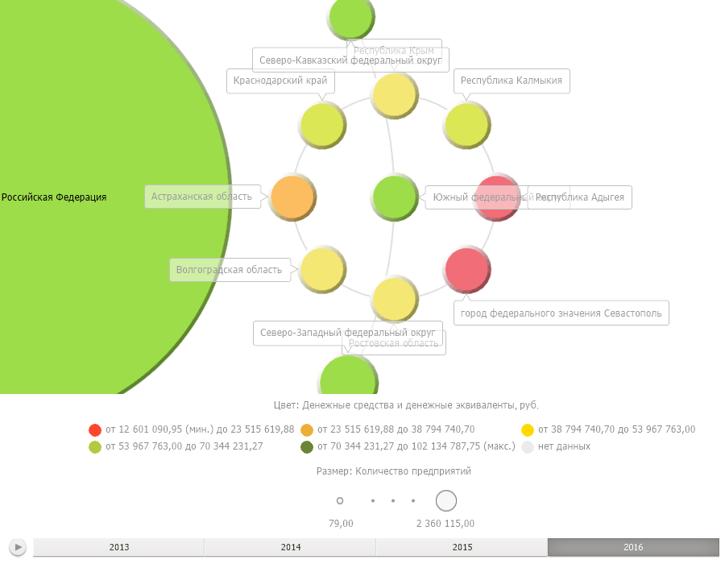

# Визуализаторы данных

Визуализаторы данных
-

# Визуализаторы данных

Визуализаторы позволяют отображать данные из одного [источника](uiexpress.chm::/purpose/UiExpress_Tree_Multivariate_Object.htm)
 в различных формах. Изменение данных в источнике автоматически отображается
 во всех визуализаторах.

Использование визуализаторов доступно в следующих инструментах продукта
 «Форсайт. Аналитическая платформа»:

	- «[Аналитические запросы (OLAP)](UIExpress.chm::/purpose/UiExpress_Purpose.htm)». Для получения подробной
	 информации об особенностях отображения визуализаторов обратитесь к
	 разделу «[Выбор
	 визуализатора для отображения данных](UIExpress.chm::/Setup_express_report/UiExpress_control.htm)»;

	- «[Аналитические панели](UIAdhoc.chm::/UiAdhoc_Purpose.htm)». Для получения подробной информации
	 об особенностях отображения визуализаторов обратитесь к разделу «[Вставка и настройка
	 визуализаторов](UIAdhoc.chm::/Blocks/Gadgets/Gadgets.htm)»;

	- «[Отчёты](UIReport.chm::/UiReport_purpose.htm)».
	 Для получения подробной информации об особенностях отображения визуализаторов
	 обратитесь к разделу «[Визуализация
	 данных на листе отчёта](UIReport.chm::/desktop/Reports/Visualization.htm)»;

	- «[Анализ временных рядов](UiDw.chm::/UiDw_Title.htm)». В инструменте доступно
	 использование некоторых визуализаторов: таблица, диаграмма, карта.
	 Для получения подробной информации об особенностях отображения визуализаторов
	 обратитесь к разделам «[Настройка таблицы данных](UiDw.chm::/Workbook/UiDw_Series.htm)»,
	 «[Настройка
	 диаграммы](UiDw.chm::/Workbook/Chart_work.htm)»,
	 «[Настройка
	 карты](UiDw.chm::/Workbook/Map_Work.htm)».

## Таблица

		

		Визуализатор «[Таблица](UiAnalyticalArea.chm::/Table.htm)»
		 предназначен для структурирования данных в виде электронной таблицы.

		Ключевые возможности:

			- анализ данных в таблице: преобразование, ранжирование,
			 условное форматирование, статистические характеристики и др.;

			- детализация и обобщение данных для перехода по уровням:
			 от многомерных данных до реляционного уровня и наоборот;

			- валидация данных;

			- расчёт итоговых значений и настройка расчёта формул;

			- отображение прав доступа к данным в виде пиктограмм;

			- настройка внешнего вида таблицы и её элементов.

## Диаграмма

		

		Визуализатор «[Диаграмма](UiDiagrams.chm::/Diagrams.htm)»
		 предназначен для графического отображения табличных данных с помощью
		 различных [типов
		 диаграмм](UiDiagrams.chm::/Type_diagrams/UiDiagrams_Type_diagrams.htm).

		Ключевые возможности:

			- выбор типа диаграммы, настройка объемного вида и зазоров
			 между рядами данных диаграммы;

			- детализация и нормализация отображаемых данных;

			- отображение вычисляемых значений;

			- настройка всплывающих подсказок, подписей к данным,
			 легенды, заголовков, осей диаграммы;

			- использование коридоров диаграммы, линии уровня и тренда;

			- настройка рядов данных диаграммы.

## Карта

		

		Визуализатор «[Карта](UiMaps.chm::/Map.htm)»
		 предназначен для графического отображения картографических данных
		 таблицы с динамикой значений по времени.

		Ключевые возможности:

			- подключение внешних картографических сервисов;

			- детализация и обобщение данных;

			- использование маркеров геолокации, стрелок, круговых
			 и столбиковых диаграмм;

			- настройка всплывающих подсказок, легенды;

			- 3D режим карты;

			- настройка стиля карты и отображения контуров территорий.

## Пузырьковая диаграмма

		

		Визуализатор «[Пузырьковая диаграмма](UiVisualizators.chm::/BubbleChart/BubbleChart.htm)» предназначен для графического отображения
		 табличных данных в виде пузырьков, построенных по принципу точечной
		 диаграммы с динамикой значений по времени.

		Ключевые возможности:

			- детализация и обобщение данных;

			- отображение следов пузырьков для анализа изменения данных
			 во времени;

			- настройка всплывающих подсказок, легенды, осей диаграммы;

			- использование линии тренда;

			- настройка стиля пузырьковой диаграммы, цветовой шкалы
			 и шкалы размера.

## Пузырьковое дерево

		

		Визуализатор «[Пузырьковое дерево](UiVisualizators.chm::/BubbleTree/BubbleTree.htm)» предназначен для графического отображения
		 табличных данных в виде набора взаимосвязанных пузырьков с динамикой
		 значений по времени.

		Ключевые возможности:

			- детализация и обобщение данных;

			- настройка всплывающих подсказок и легенды;

			- настройка цветовой шкалы и шкалы размера.

## Плоское дерево

		

		Визуализатор «[Плоское дерево](UiVisualizators.chm::/TreeMap/TreeMap.htm)» предназначен для графического отображения
		 табличных данных в виде набора вложенных прямоугольников с динамикой
		 значений по времени.

		Ключевые возможности:

			- детализация и обобщение данных;

			- настройка всплывающих подсказок и легенды;

			- настройка цветовой шкалы и шкалы размера.

См. также:

[Таблица](UiAnalyticalArea.chm::/Table.htm) |
 [Диаграмма](UiDiagrams.chm::/Diagrams.htm) | [Карта](UiMaps.chm::/Map.htm) | [Пузырьковая
 диаграмма](UiVisualizators.chm::/BubbleChart/BubbleChart.htm) | [Пузырьковое
 дерево](UiVisualizators.chm::/BubbleTree/BubbleTree.htm) | [Плоское дерево](UiVisualizators.chm::/TreeMap/TreeMap.htm)

		Справочная
		 система на версию 10.9
		 от 18/08/2025,
		 © ООО «ФОРСАЙТ»,
