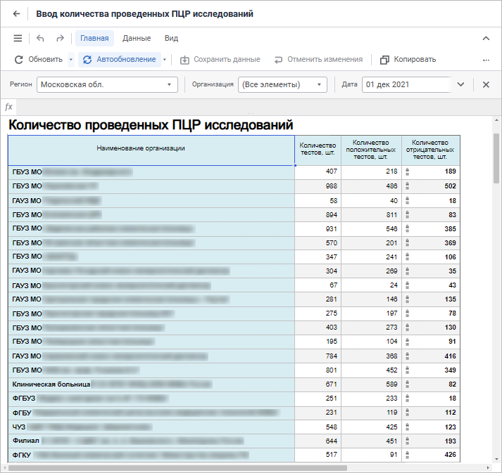

# Построение форм ввода, контроля и согласования данных

Построение форм ввода, контроля и согласования данных
-

# Построение форм ввода, контроля и согласования данных

Для построения форм ввода, контроля и согласования данных используйте
 расширение «Интерактивные формы ввода
 данных»:

[Расширение](setup.chm::/Extensions/install_or_update_extensions.htm)
 «Интерактивные формы ввода данных»
 предназначено для создания форм для ручного ввода данных, контроля вводимых
 данных и расчёта показателей.

Ключевые возможности:

	- создание интерактивных многолистовых форм ввода данных: табличных,
	 реестровых, в виде карточки, комбинированных;

	- гибкая структура и оформление форм: шапка и боковик, авторедакторы,
	 маски ввода, фильтрация, оформление, печатный вид формы, переходы
	 между формами;

	- использование формул расчета и контроля данных;

	- параметризация: динамическое управление содержимым, настройка
	 связей и синхронизации измерений, фильтрация параметров по атрибутам;

	- ввод и согласование данных;

	- расширение функциональности: создание пользовательских кнопок,
	 подключение Fore-функций;

	- экспорт в различные форматы с сохранением форматирования и настроек
	 печати.

Для начала работы c расширением
 в веб-приложении смотрите статью «[Начало работы с расширением «Интерактивные
 формы ввода данных» в веб-приложениия](Web/Starting/Starting.htm).

Для начала работы c расширением
 в настольном приложении смотрите статью «[Начало
 работы с расширением «Интерактивные формы ввода данных» в настольном приложении»](Desktop/Starting/Starting.htm).

Если остались вопросы, смотрите
 статью «[Вопросы
 и ответы](FAQ/FAQ.htm)».

См. также:

[Начало
 работы с расширением «Интерактивные формы ввода данных» в веб-приложении](Web/Starting/Starting.htm) |
 [Начало работы с расширением «Интерактивные
 формы ввода данных» в настольном приложении](Desktop/Starting/Starting.htm) | [Вопросы
 и ответы](FAQ/FAQ.htm)

		Справочная
		 система на версию 10.9
		 от 18/08/2025,
		 © ООО «ФОРСАЙТ»,
