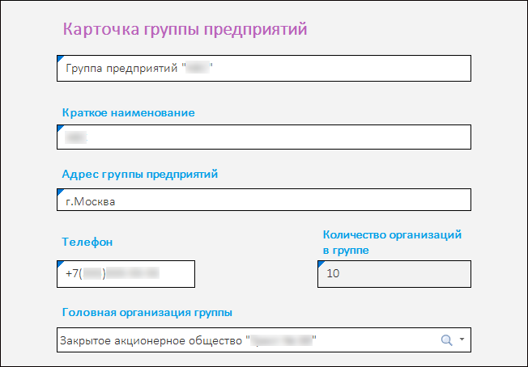
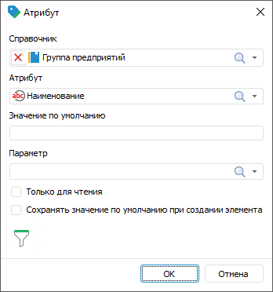
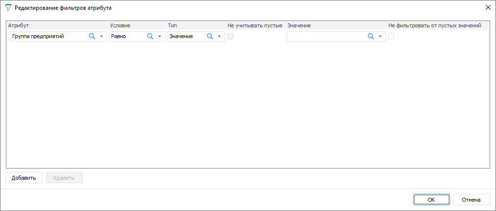

# Настройка редактора атрибутов справочника

Настройка редактора атрибутов справочника
-

# Настройка редактора атрибута справочника

Редактор атрибутов используется для отображения значений атрибутов справочника
 в ячейках формы ввода.

Примечание.
 Для создания редактора атрибута справочника в форме необходимо наличие
 [параметра](../Parameters/Parameters.htm).

Редактор атрибутов справочника применяется для создания комбинированных
 форм и карточек. Карточки применяются для редактирования и добавления
 записей в реестре.

[Пример карточки](javascript:TextPopup(this))

	Форма ввода представлена в виде карточки, каждое поле которой представляет
	 собой редактор атрибута справочника «Группа предприятий»:

	

Для настройки редактора атрибута справочника выполните шаги:

	- [Создайте](Attribute.htm#add) редактор атрибута справочника.

	- [Определите](Attribute.htm#properties) свойства редактора
	 атрибута справочника.

	- [Редактируйте](Attribute.htm#edit) атрибут, если
	 требуется.

После создания карточки используйте её для редактирования и добавления
 записей в реестре. Для этого настройте реестр для перехода к карточке:
 укажите её в качестве объекта репозитория при [расшифровке](../Table/Detail_dimensions.htm)
 измерения.

После завершения настройки редактора перейдите к шагу, если нужно:

	- [Настройка табличной области](../Table/AreaTable.htm);

	- [Настройка оформления формы](../Common/Design.htm).

Для настройки редактора атрибута справочника используйте диалог «Атрибут», нажав кнопку  «Добавить
 атрибут» вкладки «Конструктор»
 ленты инструментов:

[Создание
 редактора](javascript:TextPopup(this))

	Создайте редактор атрибута справочника, нажав кнопку  «Добавить
	 атрибут» вкладки «Конструктор»
	 ленты инструментов.

[Определение
 свойств редактора](javascript:TextPopup(this))

	Задайте свойства редактора:

		- Справочник. Укажите
		 справочник, к которому будет привязан атрибут. Для этого выберите
		 справочник из раскрывающегося списка или нажмите кнопку  «Поиск»
		 начните печатать название справочника;

		- Атрибут. Укажите
		 атрибут, значение которого будет отображаться в ячейке. Для этого
		 выберите атрибут справочника из раскрывающегося списка или нажмите
		 кнопку  «Поиск»
		 и начните печатать;

	Примечание.
	 Если для редактора атрибута используется связанный атрибут [параметризованного](UiNavObj.chm::/reference_book/Master_RDS_reference_book/Parameters.htm)
	 справочника, то в форме ввода учитываются настройки параметров в [связи](UiNavObj.chm::/reference_book/Master_RDS_reference_book/Link.htm).

		- Значение по умолчанию.
		 Задайте значение, которое будет по умолчанию присваиваться каждому
		 новому элементу при создании;

	Примечание.
	 Если для редактора атрибута используется атрибут «Дата
	 начала/Дата окончания»
	 [версионного](UiNavObj.chm::/reference_book/Master_RDS_reference_book/base_settings.htm#change_in_time)
	 справочника, то при настройке значения по умолчанию можно указать
	 дату и время.

		- Параметр. Для динамического
		 изменения значения атрибута, выберите из раскрывающегося списка
		 атрибут справочника, привязанного к параметру формы;

		- Только чтение. Для
		 запрета изменения значения атрибута установите флажок. При добавлении
		 нового элемента значение по умолчанию не будет сохранено в справочник;

		- Сохранять значение по умолчанию
		 при создании элемента. Для сохранения в справочник значения
		 по умолчанию при добавлении нового элемента установите флажок.
		 Доступен после установки флажка «Только
		 чтение».

	Завершите выбор, нажав кнопку «ОК».

[Настройка значений
 атрибута](javascript:TextPopup(this))

	Для настройки значений, передаваемых в атрибут из связанного справочника,
	 используйте расширенный фильтр.

	Если у выбранного атрибута есть [связь](UiNavObj.chm::/reference_book/Master_RDS_reference_book/Link.htm)
	 с другими справочниками, то кнопка  «Фильтрация» становится активной.

	Для вызова диалога фильтра нажмите кнопку  «Фильтрация». Будет открыт диалог
	 «Редактирование фильтров атрибута»:

	

	Для создания фильтра нажмите кнопку «Добавить»
	 и задайте параметры:

	- Атрибут.
	 Выберите атрибут указанного справочника из раскрывающегося списка.
	 Для фильтрации элементов справочника по атрибутам [связанного
	 справочника](UiNavObj.chm::/reference_book/Master_RDS_reference_book/Link_Property.htm) выберите в списке доступных связанных
	 атрибутов атрибут справочника, выбранного при [создании
	 связи](UiNavObj.chm::/reference_book/Master_RDS_reference_book/Link.htm) с атрибутом указанного справочника. Связанные
	 атрибуты отображаются с первым уровнем вложенности и представляют
	 собой дерево из доступных связанных атрибутов;

Примечание.
 Если атрибут справочника содержит [множественные значения](UiNavObj.chm::/reference_book/Master_RDS_reference_book/Attributes/Attribute.htm),
 то при проверке условия фильтрации будут сравниваться все значения атрибута.
 Если хотя бы одно значение атрибута удовлетворяет условию, то элемент
 справочника будет автоматически удовлетворять условию.

	- Условие.
	 Задайте условие фильтрации в зависимости от [типа данных](UiNavObj.chm::/reference_book/Master_RDS_reference_book/Attributes/Attribute.htm)
	 атрибута. Возможные варианты: равно, не равно, больше, меньше, больше
	 или равно, меньше или равно, входит, не входит. Для атрибута строкового
	 типа данных доступны дополнительные варианты условия: начинается с,
	 заканчивается на, содержит, не содержит;

		- Тип.
		 Выберите тип фильтра. Возможные варианты: значение, атрибут;

		- Не
		 учитывать пустые. Пустые значения атрибута не будут учитываться,
		 если установить флажок. Доступно только для типа «Атрибут»;

		- Значение.
		 Зависит от выбранного атрибута и типа:

			- если выбран тип «Значение»,
			 то в поле указывается конкретное значение, соответствующее
			 [типу
			 данных](UiNavObj.chm::/reference_book/Master_RDS_reference_book/Attributes/Attribute.htm)
			 атрибута;

			- если выбран тип «Атрибут»,
			 то в поле выбирается атрибут из раскрывающегося списка, представляющего
			 собой дерево из доступных атрибутов;

			- если атрибут связанный и выбран тип «Значение»,
			 то в поле появляется всплывающее меню с доступными значениями
			 связанного справочника;

			- если атрибут связанный и выбран тип «Атрибут»,
			 то в поле появляется всплывающее меню, представляющее собой
			 дерево из доступных атрибутов [связанного
			 справочника](UiNavObj.chm::/reference_book/Master_RDS_reference_book/Link_Property.htm);

		- Не
		 фильтровать от пустых значений. Значения атрибута не будут
		 фильтроваться при пустом значении, если установить флажок.

	Для удаления созданного фильтра нажмите
	 кнопку «Удалить» при необходимости.

	Для сохранения фильтра нажмите кнопку «ОК».

[Изменение
 редактора](javascript:TextPopup(this))

	Для изменения редактора атрибута справочника нажмите кнопку  «Редактировать» вкладки «Конструктор»
	 ленты инструментов или выполните команду «Редактировать»
	 контекстного меню ячейки, для которой добавлен редактор.

[Копирование/вставка
 редактора](javascript:TextPopup(this))

	Для добавления в форму ввода нескольких атрибутов, привязанных к
	 одному справочнику, используйте копирование и вставку.

	Для копирования редактора атрибута выделите ячейку с атрибутом и
	 выполните команду «Копировать атрибут»
	 контекстного меню. Копируются все заданные настройки атрибута и настройки
	 оформления.

	Для вставки редактора атрибута выделите ячейку, куда требуется вставить
	 атрибут, и выполните команду «Вставить
	 атрибут» контекстного меню. Команда становится доступной, если
	 был скопирован редактор атрибута.

	Добавленный атрибут доступен для редактирования.

[Удаление
 редактора](javascript:TextPopup(this))

	Для удаления редактора атрибута:

		- нажмите кнопку  «Удалить» вкладки «Конструктор»
		 ленты инструментов;

		- выполните команду «Удалить»
		 в контекстном меню.

	Будет запрошено подтверждение выполняемого действия.

См. также:

[Начало
 работы с расширением «Интерактивные формы ввода данных» в веб-приложении](../../Web/Starting/Starting.htm) |
 [Построение формы ввода](../Starting/ConstructForm.htm) |
 [Работа с готовой формой ввода](../Work/FinishForm.htm)

		Справочная
		 система на версию 10.9
		 от 18/08/2025,
		 © ООО «ФОРСАЙТ»,
