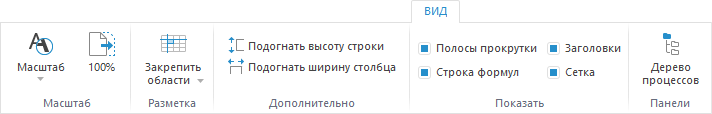
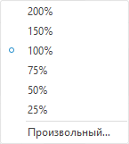
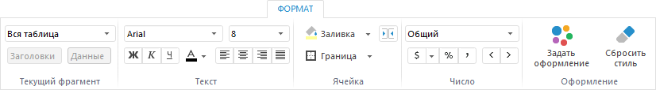

# Настройка оформления и вида отображения формы

Настройка оформления и вида отображения формы
-

# Настройка оформления и вида отображения формы ввода

Для настройки внешнего вида формы ввода:

	- Настройте [вид отображения](Design.htm#view).

	- Настройте [оформление](Design.htm#format).

Примечание.
 Настройка оформления формы ввода относится к [пользовательским
 настройкам табличной области](../Work/Custom_settings.htm). При просмотре [готовой
 формы ввода](../Work/FinishForm.htm) доступно сохранение настроенного оформления формы.

Для дополнительной визуализации данных и расширения функциональности
 формы ввода в [конструкторе
 бизнес-приложений](Constructor.chm::/Intro/Designer_business_applications.htm) подключите [плагины](DataAnalysis.chm::/Plugins/Plugins.htm).
 Плагины подключаются на отдельных [листах](../Starting/Sheets.htm)
 формы ввода.

Завершив настройку, перейдите к следующему шагу, если требуется:

	- [Экспорт формы](Export.htm);

	- [Работа с готовыми формами ввода](../Work/FinishForm.htm);

	- [Ввод и согласование данных в
	 бизнес-процессах](../Work/Agreement.htm);

	- [Расширение функциональности](../Custom_module/Advanced.htm).

## Настройка вида отображения форм

Для настройки вида отображения форм выполните шаги:

	- Настройте [масштаб](Design.htm#zoom).

	- Настройте [разметку](Design.htm#freeze).

	- Настройте [размеры строк/столбцов](Design.htm#size).

	- Настройте [отображение](Design.htm#display) элементов
	 рабочей области.

Для настройки используйте вкладу «Вид»
 ленты инструментов:

[Изменение
 масштаба](javascript:TextPopup(this))

	Для изменения масштаба:

		- нажмите кнопку  «Масштаб». После чего будет открыто
		 раскрывающееся меню:

	

	Выполните одно из действий:

			- установите переключатель напротив одного из фиксированных
			 значений масштаба;

			- выполните команду «Произвольный».
			 После чего будет открыто окно «Масштаб»
			 для указания произвольного значения масштаба:

	

		- установите фокус на листе и, удерживая клавишу CTRL, прокрутите
		 колесико мыши. При прокручивании колесика вверх масштаб будет
		 увеличиваться, при прокручивании вниз - уменьшаться.

	Для отображения полноразмерной формы нажмите кнопку  «100%».

[Закрепление
 областей](javascript:TextPopup(this))

	Для постоянного отображения на экране областей формы при прокрутке,
	 закрепите нужные области:

		- для закрепления первой строки выполните команду «Закрепить
		 верхнюю строку» в раскрывающемся меню кнопки  «Закрепить
		 области»;

		- для закрепления крайнего левого столбца выполните команду
		 «Закрепить первую колонку»
		 в раскрывающемся меню кнопки  «Закрепить области»;

		- для закрепления области, включающей несколько строк и столбцов:

			- выделите ячейку, левый верхний угол которой будет определять
			 закрепленные строки и столбцы;

			- выполните команду «Закрепить
			 области» в раскрывающемся меню кнопки  «Закрепить
			 области».

	Для снятия закрепления с областей выполните команду «Закрепить
	 области > Снять закрепление областей» группы «Разметка».

[Отображение/скрытие
 элементов графического интерфейса](javascript:TextPopup(this))

	Для того чтобы отобразить/скрыть полосы прокрутки, строку формул,
	 заголовки и сетку установите/снимите флажок.

[Подгонка
 размеров строк/столбцов](javascript:TextPopup(this))

	Для автоматического подбора размера по содержимому строки/столбца
	 нажмите кнопки  «Подогнать
	 высоту строки»/ «Подогнать
	 ширину столбца».

[Отображение/скрытие
 панелей](javascript:TextPopup(this))

	При работе с биснес-процессами для [выполнения
	 шагов процесса](../Work/Agreement.htm) используйте панель и вкладку «Процессы».
	 Для отображения/скрытия панели и вкладки нажмите/отожмите кнопку  «Дерево процессов» группы «Панели».

	Примечание.
	 Кнопка  «Дерево
	 процессов» доступна только при установленном расширении «[Управление бизнес-процессами](BPM.chm::/Modeling_of_business_processes.htm)».

## Настройка оформления форм

Для настройки оформления форм выполните шаги:

	- Настройте [формат текста](Design.htm#text).

	- Настройте [заливку и границы](Design.htm#fill).

	- Настройте [формат числа](Design.htm#number).

	- Настройте [оформление ячеек](Design.htm#index).

Примечание.
 Настройка оформления доступна только в настольном приложении. При просмотре
 формы ввода отображение вкладки зависит от параметра [IsUserDataEnabled](../Work/Custom_settings.htm#isuserdataenabled),
 содержащегося в ветке реестра [HKEY_CURRENT_USER\Software\Foresight\Foresight Analytics Platform\10.0\Reporter\Options].

Для настройки используйте вкладку «Формат» ленты
 инструментов:

Для настройки формата определенной области формы:

	- выберите тип в раскрывающемся списке в группе «Текущий
	 фрагмент»;

	- выделите ячейку или диапазон ячеек. В зависимости от того, какому
	 типу области принадлежат ячейки или диапазон ячеек, заполняется поле
	 раскрывающегося списка в группе «Текущий
	 фрагмент»;

	- выберите тип в раскрывающемся списке кнопки  «Выделить»,
	 выделив ячейку или диапазон ячеек.

Доступные типы областей: уголок, боковик, шапка, данные, выделенная
 область, вся таблица, измерение, уровень, элемент, показатель, выделенные
 столбцы, нумерация по столбцам, нумерация по строкам.

Порядок применения оформления:

	- Вся таблица. Наименьший приоритет.

	- Данные.

	- Измерение.

	- Уровень.

	- Элемент.

	- Показатель.

	- Выделенные столбцы. Наибольший приоритет.

Для областей: измерение, уровень, элемент - можно настроить отдельно
 оформление для заголовков и для данных. Для этого используйте кнопки «Заголовки»/«Данные»
 в группе «Текущий фрагмент». Нажатой
 может быть только одна из кнопок, при нажатии на одну кнопку, другая автоматически
 отключается. По умолчанию нажата кнопка «Данные».

Примечание.
 Настройка оформления недоступна для частных измерений.

При оформлении данных приоритет областей шапки выше, чем областей боковика.

Если в боковике или шапке отображается несколько измерений, то настройки
 оформления для данных будут применяться только если они настроены для:

	- крайнего правого измерения в боковике;

	- нижнего измерения в шапке.

Примечание.
 При [поджатии](../Table/Merging_Dim.htm#press) тип области
 и оформление поджимаемого элемента измерения изменится на тип области
 и оформление элемента измерения, к которому поджимают.

Порядок применения оформления для заголовков:

	- Боковик/шапка. Наименьший приоритет.

	- Заголовок измерения.

	- Заголовок уровня.

	- Заголовок элемента. Наибольший приоритет.

Настройки оформления заголовков сохраняются как и все остальные настройки
 оформления.

Настройки оформления табличной области применяются после обновления
 формы.

[Настройка
 формата текста](javascript:TextPopup(this))

	Настройка осуществляется в группе «Текст»
	 и совпадает с настройкой формата [шрифта](UiAnalyticalArea.chm::/TableView/Formatting/Font_settings.htm)
	 в инструменте «Отчёты».

[Настройка
 заливки и границ](javascript:TextPopup(this))

	Для настройки заливки нажмите кнопку  «Заливка» на вкладке «Формат»
	 ленты инструментов. В раскрывающемся меню кнопки выберите цвет заливки.

	Для настройки границ нажмите кнопку  «Граница» на вкладке «Формат»
	 ленты инструментов. В раскрывающемся меню кнопки выберите тип границы
	 и её цвет.

	Примечание.
	 В веб-приложении не поддерживается отображение диагоналей для ячейки
	 таблицы. Оформление элементов таблицы применяется в соответствии с [порядком оформления](uinav.chm::/GUI/applystyle.htm)
	  и
	 может быть перекрыто другим оформлением.

[Настройка
 формата числа](javascript:TextPopup(this))

	Настройка осуществляется в группе «Число».
	 В раскрывающемся списке выберите один из поддерживаемых форматов данных:
	 общий, числовой, денежный, дата, время, процентный, экспоненциальный,
	 текстовый.

	Для настройки формата данных используйте кнопки:

		-  - преобразование в денежный формат.
		 Для выбора валюты используйте раскрывающееся меню кнопки;

		-  - преобразование в процентный формат;

		-  -
		 преобразование в числовой формат и отображение разделителя групп
		 разрядов с двумя десятичными знаками после запятой;

		-  -
		 уменьшение/увеличение разрядности числа. Применяется для отображения
		 менее/более точных значений.

[Настройка
 оформления ячеек](javascript:TextPopup(this))

	Для настройки оформления ячеек используйте стандартный диалог «[Форматирование](UiNav.chm::/GUI/Format.htm)».
	 Для вызова диалога нажмите кнопку  «Задать оформление» группы «Оформление». Вкладки диалога содержат
	 расширенные настройки, представленные на вкладке «Формат»
	 ленты инструментов.

	Примечание.
	 Диалог форматирования ячеек в формах ввода содержит вкладки: [формат
	 числа](UiNav.chm::/GUI/Format/UiReport_Table_Attribute_Format.htm), [шрифт](UiNav.chm::/GUI/Format/UiReport_Table_Attribute_Type.htm),
	 [заливка](UiNav.chm::/GUI/Format/UiReport_Table_Attribute_View.htm),
	 [выравнивание](UiNav.chm::/GUI/Format/UiReport_Table_Attribute_Arrange.htm),
	 [границы](UiNav.chm::/GUI/Format/UiReport_Table_Attribute_Border.htm),
	 [прочее](UiNav.chm::/GUI/Format/UiReport_Table_Attribute_Others.htm).

	Для ограничения типов значений при вводе данных и добавления маски
	 ввода в ячейки формы используйте [редактор значений](uinav.chm::/GUI/ValueEditorParameters.htm).

Для отмены использования заданного для определённой области оформления
 нажмите кнопку  «Сбросить стиль» группы «Оформление», кнопка становится активна
 после настройки оформления.

## Особенности оформления области «Наименование показателя»

Область <Наименование показателя>
 доступна для ячеек шапки табличной области.

Оформление применяется для элементов выбранного показателя. При
 добавлении элементов в отметку, оформление будет расширяться на добавленные
 элементы.

Оформление доступно при отображении наименования показателя. Если наименование
 скрыто, то настройка оформления будет недоступна. Если стиль задан
 ранее, то он будет применяться, при этом сбросить стиль нельзя.

## Особенности оформления области «Выделенные столбцы»

Область «Выделенные столбцы»
 доступна для ячеек шапки табличной области.

Оформление применяется для столбцов, к которым относятся выделенные
 ячейки.

Приоритет оформления области «Выделенные
 столбцы» выше, чем у всех остальных областей.

Если в шапке несколько строк, то приоритет оформления выше у нижней
 строки.

## Особенности оформления области «Выделенная область»

Область «Выделенная область»
 доступна для ячеек:

	- листа;

	- табличной области.

Оформление применяется для выделенных ячеек.

При оформлении табличной области используйте тип «Выделенная
 область» только, если при построении табличной области был установлен
 флажок «[Использовать
 оформление листа](../Table/Basic_Properties.htm#design)».

См. также:

[Начало
 работы с расширением «Интерактивные формы ввода данных» в веб-приложении](../../Web/Starting/Starting.htm) |
 [Построение формы ввода](../Starting/ConstructForm.htm) |
 [Работа с готовой формой ввода](../Work/FinishForm.htm)

		Справочная
		 система на версию 10.9
		 от 18/08/2025,
		 © ООО «ФОРСАЙТ»,
