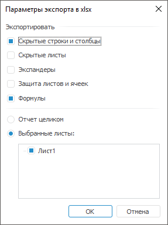

# Экспорт формы ввода

Экспорт формы ввода
-

# Экспорт формы ввода

При необходимости сохранить форму в другом формате воспользуйтесь экспортом
 форм. При экспорте сохраняются [пользовательские
 настройки](../Work/Custom_settings.htm) табличной области формы ввода.

Для экспорта формы ввода:

	- Выполните команду «Форма ввода/вывода
	 > Экспорт» главного меню, выбрав один из доступных форматов:
	 XLSX, XLS, PDF, RTF, ODS. Изменить доступные при открытии формы ввода
	 на просмотр форматы экспорта можно при [редактировании
	 формы ввода](../Starting/Starting.htm#main_menu).

Примечание.
 Экспорт в формат ODS доступен только для форм, открытых с помощью [бизнес-приложения](../../../Constructor/Intro/Designer_business_applications.htm).

После выполнения действия будет открыто окно
 «Параметры экспорта в <формат>»:

Примечание.
 Набор параметров экспорта зависит от выбранного формата.

	- Задайте параметры экспорта, если выбран формат XLSX или XLS:

		- Скрытые
		 строки и столбцы. По умолчанию флажок установлен. При установленном
		 флажке экспортируются скрытые строки и столбцы табличной области
		 формы ввода. Скрытые строки и столбцы доступны для работы средствами
		 Microsoft Excel;

		- Скрытые
		 листы. По умолчанию флажок снят. При установленном флажке
		 экспортируются все скрытые листы формы ввода, если установлен
		 переключатель «Отчет целиком».
		 Если установлен переключатель «Выбранные
		 листы», то скрытые листы доступны для отметки в списке
		 листов формы ввода;

Важно.
 Скрытие листов в форме ввода доступно только в среде разработки с помощью
 свойства [IPrxSheet.Visible](kereport.chm::/interface/iprxsheet/iprxsheet.visible.htm).

		- Цветовая
		 палитра. По умолчанию флажок снят. При установленном флажке
		 экспортируется оформление табличной области формы ввода с оригинальной
		 цветовой палитрой. Если флажок снят, то цветовая палитра экспортируется
		 с заменой на палитру, которая используется в Microsoft Excel,
		 с наиболее подходящими цветами;

Примечание.
 Параметр доступен только для экспорта в файл формата XLS. При экспорте
 в файл формата XLSX оригинальная цветовая палитра табличной области экспортируется
 автоматически.

		- Экспандеры.
		 По умолчанию флажок снят. При установленном флажке экспортируются
		 отображаемые [экспандеры](UiAnalyticalArea.chm::/TableView/Layout/Layout_Dim.htm#expanders)
		 вместе с табличной областью формы ввода в текущем виде. Если экспандеры
		 свернуты, то экспортируются все вложенные элементы табличной области
		 и содержащиеся в нем свернутые\развернутые экспандеры. Экспандеры
		 доступны для работы средствами Microsoft Excel;

Примечание.
 Параметр доступен только для экспорта в файл формата XLSX.

		- Защита
		 листов и ячеек. По умолчанию флажок снят. При установленном
		 флажке экспортируется защита листов и [ячеек](uinav.chm::/GUI/format/uireport_table_attribute_others.htm)
		 вместе с табличной областью формы ввода. При открытии экспортированного
		 файла запрашивается заданный пароль для открытия защищенного листа.
		 Если на листе содержатся защищенные ячейки, то они будут недоступны
		 для редактирования в Microsoft Excel;

Важно.
 Защита листов в форме ввода доступна только в среде разработки с помощью
 свойства [ITabView.Protection](tabsheet.chm::/interface/itabview/itabview.protection.htm).

		- Формулы.
		 По умолчанию флажок установлен. При установленном флажке экспортируются
		 формулы, заданные для расчёта значений в ячейках табличной области
		 формы ввода. Если флажок снят, то экспортируются только значения,
		 которые получены в результате расчёта.

Примечание.
 Формулы с использованием оператора OR не экспортируются в файлы формата
 XLS/XLSX.

Если в Excel [функция](uireport.chm::/Desktop/organizational_management/Function/uireport_function.htm)
 не поддерживается, то в ячейке с формулой будет отображаться текстовое
 или числовое значение.

Если экспортируемая форма ввода содержит
 [формулы](uireport.chm::/Desktop/organizational_management/Function/uireport_function.htm)
 имеющие ссылки на другие листы формы, которые не были включены в экспорт,
 то при экспорте в формат XLS/XLSX в качестве результата вычисления таких
 формул будет указана ошибка вычисления.

Примечание.
 Флажок доступен также при экспорте формы ввода в формат ODS.

	- Выберите экспортируемую область формы ввода с помощью переключателей:

		- Отчет целиком. При
		 установке переключателя форма ввода экспортируется целиком;

		- Выбранные листы.
		 При установке переключателя отметьте флажками листы формы ввода,
		 которые должны экспортироваться.

	- Нажмите кнопку «ОК».
	 После выполнения действия будет открыт стандартный диалог сохранения
	 файла.

	- Укажите наименование и расположение файла.

После экспорта появится диалог, предлагающий открыть полученный файл.

Закончив выполнять экспорт формы, перейдите, если требуется, к [предварительному
 просмотру и печати формы](ParamPage.htm).

## Особенности экспорта

Особенности экспорта формул:

	- в формат XLS или XLSX:

		- если для ячейки с формулой заданы [настройки
		 редактора ячейки](UiNav.chm::/GUI/Format/UiReport_Table_Attribute_Format.htm#cell_editor), то будет экспортироваться
		 только формула без учёта заданных настроек;

		- при расчёте формул с функциями Irr,
		 TBillEq, TBillPrice,
		 TBillYield в экспортированных
		 файлах возникает ошибка в связи с особенностями их реализации
		 в документах Microsoft Excel;

		- результаты расчёта формул с функцией Rand
		 отличаются в экспортированных файлах от соответствующих значений
		 в форме ввода в связи с особенностями их реализации в документах
		 Microsoft Excel;

		- результаты расчёта формул с функциями GetSelectionEl,
		 GetSelection, JarqueBeraStat,
		 NormsDist, OddlPrice,
		 OddlYield, RedemptionYield,
		 RndPermutation, RndSample, Slope,
		 Sum, TimeValue
		 экспортируются в виде текста;

	- в формат ODS:

		- функция PercentRank
		 экспортируется без учёта параметра Significance;

		- функции OddfPrice,
		 OddfYield возвращают ошибочные
		 результаты в связи с их некорректной реализацией в документах
		 OpenOffice;

		- при расчёте формул с функциями NormsInv,
		 Irr, Prob,
		 TBillEq, TBillYield
		 в экспортированных файлах возникает ошибка в связи с особенностями
		 их реализации в документах OpenOffice;

		- результаты расчёта формул с функциями MDuration,
		 PercentRank, Price,
		 Rand, RndPermutation,
		 RndSample, TBillPrice,
		 YieldF отличаются в экспортированных
		 файлах от соответствующих значений в форме ввода в связи с особенностями
		 их реализации в документах OpenOffice;

		- результаты расчёта формул с функциями Aggregate,
		 GetSelectionEl, GetSelection, JarqueBeraStat,
		 NormInv, NormsDist,
		 OddfPrice, OddlPrice,
		 OddfYield, OddlYield,
		 RedemptionYield, RndPermutation, RndSample,
		 Slope, Sum,
		 TimeValue экспортируются
		 в виде текста.

Если к форме ввода были подключены [плагины](DataAnalysis.chm::/Plugins/Plugins.htm),
 то листы с плагинами не будут экспортироваться.

Особенности экспорта формы ввода c экспандерами в табличной области:

	- если в шапке или боковике табличной области содержится более
	 одного иерархического измерения, то экспандеры будут экспорироваться
	 только для первого измерения, расположенного в первом столбце или
	 строке табличной области. Если для первого измерения экспандеры [скрыты](UiAnalyticalArea.chm::/TableView/Layout/Layout_Dim.htm#expander),
	 то экспортируются отображаемые экспандеры у следующего измерения;

	- если в шапке или боковике табличной области содержится несколько
	 [объединенных
	 измерений](UiAnalyticalArea.chm::/TableView/Layout/Merging_Dimensions.htm), то экспортируются экспандеры только
	 для первого столбца или строки с учётом объединения. Если первое измерение
	 содержит несколько [уровней](UiNavObj.chm::/reference_book/Master_Table_reference_book/UiMd_reference_book_Master_Table_page4.htm),
	 которые размещены по нескольким столбцам или строкам, то экспортируются
	 экспандеры только нулевого уровня;

	- если форма ввода экспортируется без учёта скрытых [строк](../Starting/Sheets.htm#rows)
	 и [столбцов](../Starting/Sheets.htm#columns), то свернутые
	 экспандеры и их дочерние элементы не экспортируются;

	- если форма ввода состоит из нескольких табличных областей с
	 экспандерами, то экспортируются экспандеры на всех табличных областях
	 в боковике и шапке. Если табличные области расположены по вертикали,
	 то экспандеры в шапке экспортируются только для верхних табличных
	 областей. Если табличные области расположены по горизонтали, то экспандеры
	 в боковике экспортируются только для крайних табличных областей слева.

При экспорте существуют ограничения на количество строк и столбцов:

	- XLS. Максимальное число
	 столбцов - 256, максимальное число строк - 65536;

	- XLSX. Максимальное число
	 столбцов - 16385, максимальное число строк - 1048576;

	- ODS. Максимальное число
	 столбцов - 1024, максимальное число строк - 1048576.

См. также:

[Начало
 работы с расширением «Интерактивные формы ввода данных» в веб-приложении](../../Web/Starting/Starting.htm) |
 [Работа с готовой формой ввода](../Work/FinishForm.htm)

		Справочная
		 система на версию 10.9
		 от 18/08/2025,
		 © ООО «ФОРСАЙТ»,
