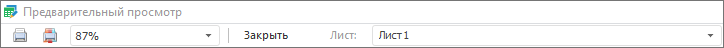

# Предварительный просмотр и печать формы ввода

Предварительный просмотр и печать формы ввода
-

# Предварительный просмотр и печать формы ввода

Перед печатью формы:

	- Проверьте [настройки оформления формы](Design.htm).

	- Настройте параметры страницы.

Примечание.
 Настройка параметров страницы в форме ввода аналогична [настройке
 отчёта под печать](UIReport.chm::/desktop/Tuning/ParamPage/UiReport_Tuning_ParamPage.htm) в регламентном отчёте.

	- Выполните [предварительный просмотр](ParamPage.htm#preview)
	 формы.

Затем выполните [печать](ParamPage.htm#print) формы. При
 предварительном просмотре и печати формы ввода сохраняются [пользовательские
 настройки](../Work/Custom_settings.htm) табличной области.

Перейдите к [экспорту формы](Export.htm), если требуется.

## Предварительный просмотр

Для того чтобы убедиться, что форма имеет требуемый вид, выполните команду
 «Форма ввода/вывода > Печать > Предварительный
 просмотр» главного меню. В открывшемся окне «Предварительный
 просмотр» форма отображается так же как будет выглядеть на бумаге.

Окно предварительного просмотра позволяет:

	- выбирать лист для просмотра. Используйте раскрывающийся список
	 «Лист»;

	- выбирать масштаб отображения. Используйте раскрывающийся список;

	- переходить к печати формы. Нажмите кнопку  «Печать»;

	- переходить к настройкам параметров страниц. Нажмите кнопку  «Параметры страницы»:

Завершите работу в режиме предварительного просмотра нажав кнопку «Закрыть».

## Печать формы

Для печати формы:

	- выполните команду «Форма ввода/вывода >
	 Печать > Печать» главного меню;

	- нажмите кнопку  «Печать»
	 в режиме предварительного просмотра;

	- нажмите сочетание клавиш CTRL+P. Возможность доступна только
	 в настольном приложении.

В настольном приложении будет открыт диалог «[Печать](uinav.chm::/GUI/Print_setup.htm)»
 для настройки параметров печати и выбора используемого принтера. В веб-приложении
 будет открыта страница для предварительного просмотра и печати отчета.
 Внешний вид страницы и порядок работы зависит от используемого браузера.

Примечание.
 Лист с [подключенным
 плагином](DataAnalysis.chm::/Plugins/Connecting_Plugins_Report.htm) недоступен для печати.

См. также:

[Начало
 работы с расширением «Интерактивные формы ввода данных» в веб-приложении](../../Web/Starting/Starting.htm) |
 [Работа с готовой формой ввода](../Work/FinishForm.htm)

		Справочная
		 система на версию 10.9
		 от 18/08/2025,
		 © ООО «ФОРСАЙТ»,
