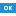
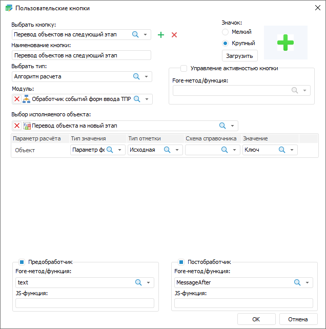
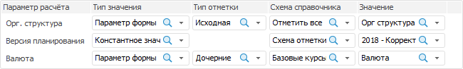
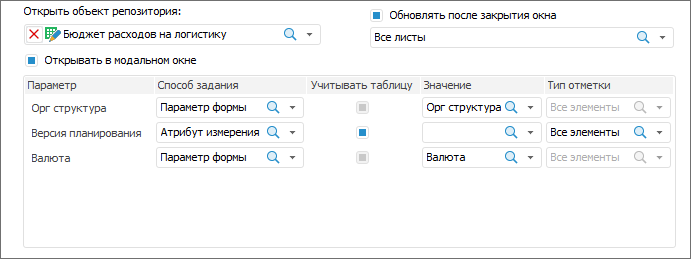

# Расширение функциональности

Расширение функциональности
-

		В этой статье:

		[Создание пользовательских кнопок](#MiniTOCBookMark2)

  [Применение пользовательских кнопок](#MiniTOCBookMark3)

  [Отображение итоговых значений](#MiniTOCBookMark4)

# Расширение функциональности

	Функциональность создаваемых форм ввода может быть расширена за
	 счёт использования дополнительных возможностей, которые предоставляет
	 «Форсайт. Аналитическая платформа». К таким возможностям относятся:

		- создание и использование пользовательских кнопок для выполнения
		 алгоритма расчёта;

		- отображение итоговых значений.

	Для запуска алгоритмов расчёта, выполнения модулей, написанных на
	 Fore, открытия объекта репозитория создайте пользовательскую кнопку
	 или используйте гиперссылку. Сигнатура
	 и примеры функций для гиперссылки указаны в разделе «[Гиперссылка](../../../UiNav/GUI/Format/UiReport_Table_Attribute_Hyperlink.htm)».

	Важно.
	 Настройка гиперссылки для формы ввода доступна только в среде разработки
	 с помощью интерфейса [ITabHyperlink](TabSheet.chm::/Interface/ITabHyperlink/ITabHyperlink.htm).

	Для использования пользовательских кнопок:

		- Создайте [алгоритм
		 расчета](CalculationAlgorithm.chm::/Purpose.htm),
		 [модуль
		 Fore](UiDevEnv.chm::/01_Development_Environment/02_Work_in_Development_Environment/DevEnv_Object/DevEnv_Module.htm)/JS-функцию или объект репозитория. В качестве
		 открываемого объекта репозитория может быть выбран: [справочник](UiNavObj.chm::/reference_book/Create.htm),
		 [регламентный
		 отчёт](UIReport.chm::/desktop/CreateReport.htm), [форма
		 ввода](../Starting/ConstructForm.htm).

	Примечание.
	 Работа с алгоритмом расчёта доступна только при наличии установленного
	 расширения «[Алгоритмы расчёта](CalculationAlgorithm.chm::/Purpose.htm)».

		- [Создайте](#create) пользовательскую кнопку.

		- [Примените](Advanced.htm#use) пользовательскую
		 кнопку.

		- [Настройте](../Starting/Ribbon.htm) ленту инструментов
		 для структурирования добавленных кнопок.

## Создание пользовательских кнопок

	Для создания пользовательской кнопки используйте диалог «Пользовательские
	 кнопки».

	[Для открытия
	 диалога](javascript:TextPopup(this))

		Нажмите кнопку  «Редактор
		 пользовательских кнопок» группы «Пользовательские
		 операции» вкладки «Конструктор»
		 ленты инструментов.

	Для создания пользовательских кнопок:

		- [Добавьте](#create_button) пользовательскую кнопку,
		 введите ее наименование и определите тип.

		- Задайте настройки для выбранного типа: [алгоритм
		 расчёта](#setting_for_calculation_algorithm), [модуля
		 Fore/JS-функции](#setting_for_fore_unit_js-function) или [открытия
		 объекта репозитория](#setting_for_object_opening).

		- [Загрузите](#load_icon) пиктограмму для кнопки
		 и настройте ее размер.

		- Выберите [модуль](#setting_for_fore_unit_js-function),
		 который может быть использован для [предобработчика](#preprocessor),
		 [постобработчика](#postprocessor), [управления
		 активностью кнопки](#manage_button_activity), а также для [исполняемого
		 метода/функции](#setting_for_fore_unit_js-function) при создании кнопки типа «Модуль
		 Fore/JS-функция».

	

	[Добавление
	 пользовательской кнопки](javascript:TextPopup(this))

		Для добавления кнопки:

			- Нажмите на кнопку  «Добавить кнопку».

			- Введите наименование кнопки в поле «Наименование
			 кнопки», отражающее её функциональность. По умолчанию
			 наименование кнопки «Пользовательская
			 кнопка N», где N -
			 порядковый номер кнопки.

		Наименование пользовательской кнопки
		 может быть сохранено на разных языках в зависимости от текущего
		 языка, выбранного в [окне регистрации](getstarted.chm::/GetStarted/Get_Started.htm),
		 или с помощью ресурса, входящего в [состав
		 объекта](UiNav.chm::/03_Objects/UiNav_Obj_BasicPropConsist.htm). Для получения подробной информации
		 обратитесь к разделу «[Настройка
		 мультиязычности](UiNav.chm::/Multilanguage/Multilanguage_setting.htm)».

			- Выберите из раскрывающегося списка тип объекта:
			 «Алгоритм расчета»,
			 «Модуль Fore/JS-функция»
			 или «Открытие объекта репозитория».
			 Для каждого типа объекта задаются отдельные настройки, которые
			 появляются при изменении типа объекта.

	[Редактирование
	 кнопки](javascript:TextPopup(this))

		Для редактирования кнопки выберите кнопку из раскрывающегося
		 списка или нажмите кнопку  «Поиск» и начните печатать название
		 кнопки.

	[Настройка
	 алгоритма расчёта](javascript:TextPopup(this))

		При выборе типа «Алгоритм
		 расчёта» появится раскрывающийся список «Выбор
		 исполняемого объекта», где необходимо выбрать алгоритм
		 расчёта. Если у выбранного алгоритма есть параметры, то ниже списка
		 будет отображена область настройки параметров:

		

		Настройка аналогична [настройке
		 параметров](../Table/Calculation_Practices.htm#modelproperties) для алгоритмов расчёта в табличной области.

		Примечание.
		 Если при выполнении алгоритма расчёта возникнут какие-либо ошибки,
		 то расчёт алгоритма будет остановлен. Изменённые данные не будут
		 сохранены в приёмники данных.

	[Настройка
	 модуля Fore/JS-функции](javascript:TextPopup(this))

		При выборе типа «Модуль
		 Fore/JS-функция» задайте дополнительные настройки:

			- В раскрывающемся списке «Модуль»
			 выберите модуль, написанный на языке Fore. Для кнопки можно
			 задать только один модуль.

		Примечание.
		 После выбора модуля также становятся активными области «[Предобработчик](#preprocessor)»,
		 «[Постобработчик](#postprocessor)» и «[Управление
		 активностью кнопки](#manage_button_activity)». Все методы/функции для настройки обработчиков
		 и управления активностью кнопки должны содержаться в этом модуле.

			- Выберите метод или функцию из раскрывающегося списка в
			 поле «Исполняемый метод/функция».
			 Функция должна иметь требуемую сигнатуру:

		Public Sub <Наименование функции>(<Report>: IPrxReport);

		Begin

		…

		End Sub <Наименование
		 функции>;

		Параметр:

				- Report.
				 В параметр передается регламентный отчёт в формате IPrxReport. При работе
				 с этим объектом будут доступны все свойства и методы интерфейса
				 [IPrxReport](KeReport.chm::/Interface/IPrxReport/IPrxReport.htm).

		Пример функции:

			Public Sub SubButton(Report: IPrxReport);

			Var

			    NameSheet: String;

			Begin

			    If WinApplication.InputBox("Переименовать лист", "Введите наименование листа", NameSheet) Then

			        Report.ActiveSheet.Name := NameSheet;

			    End If;

			End Sub SubButton;

			- Выберите метод или функцию из раскрывающегося списка
			 в поле «Название класса».

		Примечание.
		 Если в указанном модуле нет класса, то список «Название
		 класса» будет скрыт.

			-
Укажите наименование функции на языке JavaScript в поле «JS-функция»,
 которую необходимо запустить в веб-приложении после выполнения действия
 кнопки. Наименование функции:

javascript:<Наименование функции(пользовательские
 параметры, callback, args)>

Параметры:

	- Пользовательские параметры.
	 Требуемые пользовательские параметры. Необязательный параметр;

	- Callback. Функция обратного
	 вызова. Обязательный параметр;

	- Args. Аргументы функции.
	 Необязательный параметр.

Наличие угловых скобок при указании наименования функции с параметрами
 обязательно.

Пример наименования функции:

javascript:<AfterOperTest(callback)>

Если указаны JS-функция и Fore-функция, то
 в веб-приложении сначала выполняется Fore-функция, затем JS-функция, в
 настольном приложении выполняется только Fore-функция.

Добавление JS-функции осуществляется в разделе
 «[Разметка
 и оформление](Constructor.chm::/Desktop/Layout_and_design.htm)» конструктора бизнес-приложений.
 Нажмите кнопку  «Добавить»
 в области «Загрузка файлов» и
 загрузите файл в кодировке UTF-8. Функция должна иметь требуемую сигнатуру:

function <Наименование функции>(пользовательские
 параметры, callback, args)

{

…callback();

}

В качестве аргументов могут приходить параметры:

	- Report. Параметр для
	 управления [отчётом](dhtmlReport.chm::/Classes/RegularReport/Report/Report.htm);

	- DataEntryForm. Параметр
	 для управления формой ввода;

	- DataArea. Параметр
	 для управления [табличной
	 областью](dhtmlReport.chm::/Classes/RegularReport/DataArea/DataArea.htm).

Пример функции:

function addAttachments(callback,
 args)

{

                var
 rep = args.Report;

                var
 da = args.DataArea

                var
 grid = da.getGridView();

                var
 tabSheet = grid.getTabSheet();

                var
 tableSource = grid.getTableSource();

                var
 onMeasuresLoaded = (function(){

                               var
 tabSheetRange = tabSheet.getSelection().getRange();

                               attachFile(da,
 tabSheetRange);

                               tableSource.MeasuresLoaded.remove(onMeasuresLoaded,
 this, );

                });

                tableSource.MeasuresLoaded.addOne(onMeasuresLoaded,
 this, args);

                callback();

}

function attachFile(da,
 tabSheetRange) {

                var
 rep = da.getSource();

                var
 grid = da.getGridView();

                var
 tabSheet = grid.getTabSheet();

                if
 (tabSheetRange && tabSheetRange.isValid()) {

                               var
 cells = tabSheetRange.getCells();

                               if
 (cells.length == 1) {

                                               var
 cell = cells[0];

                                               var
 coord = cell.getCoord();

                                               var
 range = { top: coord.rowIndex, left: coord.colIndex, width: 1, height:
 1 };

                                               var
 views = rep.getGridViews(range);

                                               var
 gridKey = views.length ? views[0].key : undefined;

                                               var
 attachDlg = da.getGridView().showAttachmentDialog(gridKey, coord.rowIndex,
 coord.colIndex);

                               }

                }

}

	[Настройка
	 открытия объекта репозитория](javascript:TextPopup(this))

		При выборе типа «Открытие
		 объекта репозитория» задайте дополнительные настройки:

			- Выберите в раскрывающемся списке «Открыть
			 объект репозитория» нужный объект:

		

		Примечание.
		 При выборе в качестве объекта для открытия многолистовой формы
		 ввода убедитесь, что у неё установлен флажок «[Загрузка
		 только активного листа](../Starting/Starting.htm#multiexecutor)» для ускорения открытия формы.

			- Установите
			 флажки при необходимости:

				- Открывать
				 в модальном окне. По умолчанию флажок снят. При
				 установке флажка блокируется работа с родительской формой
				 во время открытия объекта. Флажок доступен при настройке
				 открытия форм ввода и справочников. Открытие справочника
				 в модальном окне доступно только в веб-приложении.

		Примечание.
		 Данный флажок ограничивает доступность панели навигации и навигационного
		 меню в [конструкторе
		 бизнес-приложений](Constructor.chm::/Intro/Component_interface.htm). Для получения подробной
		 информации обратитесь к разделу «[Особенности
		 отображения элементов](Constructor.chm::/Intro/Component_interface.htm#view)».

				- Обновлять
				 после закрытия окна. Флажок становится доступным
				 после установки флажка «Открывать
				 в модальном окне». В раскрывающемся списке выберите
				 листы, которые необходимо обновить после закрытия объекта.

			- Задайте параметры для объектов,
			 у которых есть параметры:

				- Способ
				 передачи значения. В раскрывающемся списке выберите:

					- Не передавать.
					 Значение по умолчанию. При открытии объекта в параметр
					 ничего не будет передаваться;

					- Параметр формы.
					 При открытии объекта в параметр передается значение
					 параметра формы;

					- Атрибут измерения.
					 При открытии объекта в параметр передается значение
					 атрибута первого элемента или всех элементов выбранного
					 измерения из выделенной в таблице области;

					- Вручную.
					 При открытии объекта в параметр передается указанное
					 значение;

				- Учитывать
				 таблицу. Флажок доступен, если выбран способ передачи
				 «Атрибут измерения».
				 Для отображения только всех атрибутов всех измерений,
				 без указания табличных областей, снимите флажок «Учитывать табличную область».
				 По умолчанию флажок установлен;

				- Значение.
				 Наполнение поля зависит от выбранного способа передачи
				 значения:

					- если был выбран способ передачи значения «Не передавать»,
					 то поле недоступно;

					- если был выбран способ передачи значения «Параметр формы»,
					 то в раскрывающемся списке выберите параметр. В списке
					 отображаются доступные параметры формы. Список параметров
					 формы отфильтрован по типу параметра объекта. Выбрать
					 можно только один параметр;

					- если был выбран способ передачи значения «Атрибут измерения»,
					 то в раскрывающемся списке выберите атрибут. В списке
					 отображаются все доступные атрибуты всех измерений
					 всех табличных областей в форме. Выбрать можно только
					 один атрибут;

					- если был выбран способ передачи значения «Вручную», то в поле
					 «Значение»
					 отображается редактор, соответствующий типу параметра.
					 Выбрать можно только один элемент;

				- Тип
				 отметки. Раскрывающийся список доступен если был
				 выбран способ передачи значения «Атрибут
				 измерения». В раскрывающемся списке выберите:

					- Первый элемент.
					 В параметр передается выбранный атрибут первого элемента
					 измерения из выделения;

					- Все элементы.
					 В параметр передаются значения выбранного атрибута
					 всех элементов измерения из выделения.

	[Загрузка
	 и настройка размера пиктограммы](javascript:TextPopup(this))

		Для загрузки пиктограммы нажмите кнопку «Загрузить»
		 в области «Значок». В
		 открывшемся окне выберите путь до файла пиктограммы с расширением
		 *.png, *.jpg, *.jpeg, *.bmp. Если пиктограмма не загружена, то
		 на вкладке «Пользовательские
		 функции» ленты инструментов будет отображено только название
		 кнопки.

		Примечание.
		 Для корректного отображения пиктограмм пользовательских кнопок
		 используйте 32-битные изображения с прозрачностью.

		Для выбора размера пиктограммы, отображаемой на вкладке «Пользовательские функции», установите
		 переключатель в области «Размер
		 значка»: мелкий или крупный. При выборе крупной пиктограммы
		 наименование кнопки будет отображаться под кнопкой, при выборе
		 мелкой - рядом с ней. При добавлении нескольких кнопок с
		 мелкими пиктограммами они располагаются в несколько строк на ленте
		 инструментов, тогда как кнопки с крупными пиктограммами располагаются
		 последовательно, занимая всю высоту ленты инструментов.

	[Настройка
	 предобработчика](javascript:TextPopup(this))

		Для вывода текстового сообщения с
		 произвольным текстом при нажатии на пользовательскую кнопку настройте
		 предобработчик. Например: для кнопки настроено выполнение расчёта
		 и предобработчик с сообщением о начале выполнения расчёта, которое
		 может занять длительное время. В этом случае при нажатии кнопки
		 перед выполнением расчёта будет выведено настроенное сообщение.

		Для настройки предобработчика:

			- Установите флажок «Предобработчик».

		Примечание.
		 Область становится активна после [выбора
		 модуля](#setting_for_fore_unit_js-function).

			-
Выберите функцию в списке «Fore метод/функция».
 Список содержит все функции выбранного модуля, соответствующие сигнатуре:

Function <Наименование функции>(<Report>: IPrxReport; [Var messageType: Integer]): String;

Параметр:

	- Report. В параметр
	 передаётся регламентный отчёт в формате IPrxReport.
	 При работе с этим объектом будут доступны все свойства и методы интерфейса
	 [IPrxReport](KeReport.chm::/Interface/IPrxReport/IPrxReport.htm);

	- messageType. Необязательная
	 переменная, используйте для определения формата выводимого сообщения.
	 Если переменная не задана, то будет применяться диалог подтверждения.
	 Для выведения текста сообщения в консоль среды разработки в настольном
	 приложении и отсутствия сообщения в веб-приложении уберите возвращаемое
	 значение в return. Пример такой функции представлен ниже. Допустимые
	 значения:

		- 0. Диалог подтверждения.
		 При нажатии кнопки «Да»
		 диалога выполняется заданное для кнопки действие. При нажатии
		 кнопки «Нет» диалога заданное
		 для кнопки действие выполняться не будет;

		- 1. Ошибка. При нажатии
		 кнопки «ОК» диалога заданное
		 для кнопки действие не выполняется;

		- 2. Предупреждение.
		 При нажатии кнопки «ОК»
		 диалога заданное для кнопки действие не выполняется;

		- 3. Информационное
		 сообщение. При нажатии кнопки «ОК»
		 диалога заданное для кнопки действие не выполняется.

Пример функции:

	Function MessageInformationBox(Report: IPrxReport; Var messageType: integer): String;

	    Begin

	        messageType := 3;

	    Return "Операция будет доступна, когда будут введены все данные";

	End Function MessageInformationBox;

Пример функции, при выполнении которой в веб-приложении сообщения не
 будет, а в настольном приложении текст сообщения будет выведен в консоль
 среды разработки:

	Function BeforeOper2(Report: IPrxReport): String;

	Begin

	    debug.WriteLine("BeforeOper2");

	    Return "";

	End Function BeforeOper2;

			-
Укажите наименование функции на языке JavaScript в поле «JS-функция»,
 которую необходимо запустить в веб-приложении после выполнения действия
 кнопки. Наименование функции:

javascript:<Наименование функции(пользовательские
 параметры, callback, args)>

Параметры:

	- Пользовательские параметры.
	 Требуемые пользовательские параметры. Необязательный параметр;

	- Callback. Функция обратного
	 вызова. Обязательный параметр;

	- Args. Аргументы функции.
	 Необязательный параметр.

Наличие угловых скобок при указании наименования функции с параметрами
 обязательно.

Пример наименования функции:

javascript:<AfterOperTest(callback)>

Если указаны JS-функция и Fore-функция, то
 в веб-приложении сначала выполняется Fore-функция, затем JS-функция, в
 настольном приложении выполняется только Fore-функция.

Добавление JS-функции осуществляется в разделе
 «[Разметка
 и оформление](Constructor.chm::/Desktop/Layout_and_design.htm)» конструктора бизнес-приложений.
 Нажмите кнопку  «Добавить»
 в области «Загрузка файлов» и
 загрузите файл в кодировке UTF-8. Функция должна иметь требуемую сигнатуру:

function <Наименование функции>(пользовательские
 параметры, callback, args)

{

…callback();

}

В качестве аргументов могут приходить параметры:

	- Report. Параметр для
	 управления [отчётом](dhtmlReport.chm::/Classes/RegularReport/Report/Report.htm);

	- DataEntryForm. Параметр
	 для управления формой ввода;

	- DataArea. Параметр
	 для управления [табличной
	 областью](dhtmlReport.chm::/Classes/RegularReport/DataArea/DataArea.htm).

Пример функции:

function addAttachments(callback,
 args)

{

                var
 rep = args.Report;

                var
 da = args.DataArea

                var
 grid = da.getGridView();

                var
 tabSheet = grid.getTabSheet();

                var
 tableSource = grid.getTableSource();

                var
 onMeasuresLoaded = (function(){

                               var
 tabSheetRange = tabSheet.getSelection().getRange();

                               attachFile(da,
 tabSheetRange);

                               tableSource.MeasuresLoaded.remove(onMeasuresLoaded,
 this, );

                });

                tableSource.MeasuresLoaded.addOne(onMeasuresLoaded,
 this, args);

                callback();

}

function attachFile(da,
 tabSheetRange) {

                var
 rep = da.getSource();

                var
 grid = da.getGridView();

                var
 tabSheet = grid.getTabSheet();

                if
 (tabSheetRange && tabSheetRange.isValid()) {

                               var
 cells = tabSheetRange.getCells();

                               if
 (cells.length == 1) {

                                               var
 cell = cells[0];

                                               var
 coord = cell.getCoord();

                                               var
 range = { top: coord.rowIndex, left: coord.colIndex, width: 1, height:
 1 };

                                               var
 views = rep.getGridViews(range);

                                               var
 gridKey = views.length ? views[0].key : undefined;

                                               var
 attachDlg = da.getGridView().showAttachmentDialog(gridKey, coord.rowIndex,
 coord.colIndex);

                               }

                }

}

	[Настройка
	 постобработчика](javascript:TextPopup(this))

		Для возможности выполнять требуемые
		 действия после завершения отработки метода, окончания расчёта
		 алгоритма или закрытия объекта настройте постобработчик. Постобработчик
		 срабатывает после закрытия объекта, если в качестве объекта выбрана
		 форма ввода и установлен флажок «[Открывать
		 в модальном окне](#setting_for_object_opening)». Можно задать только один постобработчик.

		Для настройки постобработчика:

			- Установите флажок «Постобработчик».

		Примечание.
		 Область становится активна после [выбора
		 модуля](#setting_for_fore_unit_js-function).

			-
Выберите метод в списке «Fore
 метод/функция». Список содержит все методы выбранного модуля, соответствующие
 сигнатуре:

Sub <Наименование
 метода>(<Report>: IPrxReport);

Параметр:

	- Report. В параметр
	 передаётся регламентный отчёт в формате IPrxReport.
	 При работе с этим объектом будут доступны все свойства и методы интерфейса
	 [IPrxReport](KeReport.chm::/Interface/IPrxReport/IPrxReport.htm).

Пример метода:

	Sub UpdateData(Report: IPrxReport);

	Var

	    SheetT: IPrxTable;

	    ItemIndex: Integer;

	Begin

	    ItemIndex := Report.ActiveSheet.Index;

	    SheetT := Report.Sheets.Item(ItemIndex) As IPrxTable;

	    SheetT.TabSheet.CellValue(10,10) := 1000000;

	End Sub UpdateData;

			-
Укажите наименование функции на языке JavaScript в поле «JS-функция»,
 которую необходимо запустить в веб-приложении после выполнения действия
 кнопки. Наименование функции:

javascript:<Наименование функции(пользовательские
 параметры, callback, args)>

Параметры:

	- Пользовательские параметры.
	 Требуемые пользовательские параметры. Необязательный параметр;

	- Callback. Функция обратного
	 вызова. Обязательный параметр;

	- Args. Аргументы функции.
	 Необязательный параметр.

Наличие угловых скобок при указании наименования функции с параметрами
 обязательно.

Пример наименования функции:

javascript:<AfterOperTest(callback)>

Если указаны JS-функция и Fore-функция, то
 в веб-приложении сначала выполняется Fore-функция, затем JS-функция, в
 настольном приложении выполняется только Fore-функция.

Добавление JS-функции осуществляется в разделе
 «[Разметка
 и оформление](Constructor.chm::/Desktop/Layout_and_design.htm)» конструктора бизнес-приложений.
 Нажмите кнопку  «Добавить»
 в области «Загрузка файлов» и
 загрузите файл в кодировке UTF-8. Функция должна иметь требуемую сигнатуру:

function <Наименование функции>(пользовательские
 параметры, callback, args)

{

…callback();

}

В качестве аргументов могут приходить параметры:

	- Report. Параметр для
	 управления [отчётом](dhtmlReport.chm::/Classes/RegularReport/Report/Report.htm);

	- DataEntryForm. Параметр
	 для управления формой ввода;

	- DataArea. Параметр
	 для управления [табличной
	 областью](dhtmlReport.chm::/Classes/RegularReport/DataArea/DataArea.htm).

Пример функции:

function addAttachments(callback,
 args)

{

                var
 rep = args.Report;

                var
 da = args.DataArea

                var
 grid = da.getGridView();

                var
 tabSheet = grid.getTabSheet();

                var
 tableSource = grid.getTableSource();

                var
 onMeasuresLoaded = (function(){

                               var
 tabSheetRange = tabSheet.getSelection().getRange();

                               attachFile(da,
 tabSheetRange);

                               tableSource.MeasuresLoaded.remove(onMeasuresLoaded,
 this, );

                });

                tableSource.MeasuresLoaded.addOne(onMeasuresLoaded,
 this, args);

                callback();

}

function attachFile(da,
 tabSheetRange) {

                var
 rep = da.getSource();

                var
 grid = da.getGridView();

                var
 tabSheet = grid.getTabSheet();

                if
 (tabSheetRange && tabSheetRange.isValid()) {

                               var
 cells = tabSheetRange.getCells();

                               if
 (cells.length == 1) {

                                               var
 cell = cells[0];

                                               var
 coord = cell.getCoord();

                                               var
 range = { top: coord.rowIndex, left: coord.colIndex, width: 1, height:
 1 };

                                               var
 views = rep.getGridViews(range);

                                               var
 gridKey = views.length ? views[0].key : undefined;

                                               var
 attachDlg = da.getGridView().showAttachmentDialog(gridKey, coord.rowIndex,
 coord.colIndex);

                               }

                }

}

	[Управление
	 активностью кнопки](javascript:TextPopup(this))

		Для управления активностью кнопки:

			- Установите флажок «Управление
			 активностью кнопки» для активации или деактивации кнопки
			 по какому-либо условию. В качестве условия может быть использовано
			 значение параметра или атрибута, результат расчёта. Можно
			 задать только одну функцию в качестве условия активации/деактивации
			 кнопки.

		Примечание.
		 Область становится активна после [выбора
		 модуля](#setting_for_fore_unit_js-function).

			- Выберите функцию в списке
			 «Fore метод/функция».
			 Список содержит все функции выбранного модуля, соответствующие
			 сигнатуре:

		Function <Название
		 функции>(<Report>: IPrxReport): Boolean;

		Параметр:

				- Report.
				 В параметр передается форма ввода в формате IPrxReport.
				 При работе с этим объектом будут доступны все свойства
				 и методы интерфейса [IPrxReport](KeReport.chm::/Interface/IPrxReport/IPrxReport.htm).
				 Допустимые значения:

					- True.
					 Кнопка активна;

					- False.
					 Кнопка неактивна.

		Примечание.
		 Проверка выполнения условия проходит постоянно, поэтому Fore-функция
		 должна быстро выполняться, иначе форма ввода будет неработоспособной.

	[Удаление
	 кнопки](javascript:TextPopup(this))

		Для удаления кнопки используйте кнопку  «Удалить».

## Применение пользовательских кнопок

	Созданные пользовательские кнопки отображаются на вкладке «Пользовательские функции» ленты
	 инструментов. Вкладка становится доступной после добавления пользовательской
	 кнопки.

	При нажатии на кнопку выполняются действия в соответствии с настройками,
	 выполненными при создании:

		- Алгоритм расчёта.
		 При нажатии будет запущен расчёт;

		- Модуль Fore/JS-функция.
		 При нажатии будет запущен указанный модуль;

		- Открытие объекта репозитория.
		 При нажатии на неё будет открыт объект.

	Если для кнопки были настроенные дополнительные опции:

		- Активация/деактивация кнопки.
		 После выполнения условия, указанного в модуле, кнопка станет активной/недоступной;

		- Предобработчик.
		 После нажатия на кнопку в зависимости от используемой конструкции
		 функции будет выведен диалог заданного формата с текстом, который
		 вернёт функция предобработчника. В зависимости от вида формата
		 в диалоге будут доступны кнопки:

			- диалог подтверждения: кнопки «Да»
			 и «Нет». Для выполнения
			 действия пользовательской кнопки нажмите кнопку «Да»
			 в диалоге. Для отмены действия пользовательской кнопки нажмите
			 кнопку «Нет» в диалоге;

			- ошибка, предупреждение, информационное сообщение: кнопка
			 «ОК». Для отмены действия
			 пользовательской кнопки нажмите кнопку «ОК»
			 в диалоге;

		- Постобработчик. После
		 выполнения действия пользовательской кнопки будет произведены
		 действия описанные в модуле, указанном в качестве постобработчика.

## Отображение итоговых значений

	При необходимости отображения итоговых значений в форме используйте
	 инструмент «[Отчёты](uireport.chm::/uireport_purpose.htm)».
	 Для этого:

		- В [дереве
		 объектов](getstarted.chm::/interface/interface_navigator.htm) выделите форму. В списке объектов
		 отобразится регламентный отчёт.

		- Откройте отчёт на редактирование.

		- Настройте [итоговые
		 значения](uianalyticalarea.chm::/totals/calculate_totals.htm).

		- Сохраните изменения.

См. также:

[Начало
 работы с расширением «Интерактивные формы ввода данных» в веб-приложении](../../Web/Starting/Starting.htm) |
 [Построение формы ввода](../Starting/ConstructForm.htm) |
 [Работа с готовой формой ввода](../Work/FinishForm.htm)

		Справочная
		 система на версию 10.9
		 от 18/08/2025,
		 © ООО «ФОРСАЙТ»,
