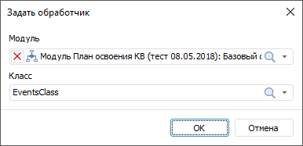

# Настройка связей между формами и элементами формы ввода

Настройка связей между формами и элементами формы ввода
-

# Настройка связей между формами и элементами формы ввода

Связи между формами ввода позволяют переходить из одной формы в другую
 и применяются для просмотра более подробной информации о выбранном элементе.

Связи между элементами формы позволяют переходить между листами
 формы. Создание связей между элементами формы применяется для создания
 многолистовых комбинированных форм ввода.

Для создания связей между формами используйте:

	- расшифровку измерения;

	- привязку к форме ввода при настройке расчёта.

Для создания связей между элементами формы используйте обработчик событий.

После завершения настройки связей между формами или элементами формы,
 если требуется, перейдите к шагу:

	- [Настройка оформления и вида отображения
	 формы](../Common/Design.htm);

	- [Расширение функциональности](../Custom_module/Advanced.htm);

	- [Работа с готовой формой ввода](../Work/FinishForm.htm).

## Расшифровка

Для детализации элементов измерений в табличной области, можно настроить
 переход к другому объекту репозитория.

Для настройки перехода используйте [расшифровку
 измерений](../Table/Detail_dimensions.htm).

## Алгоритм расчёта

Для детализации данных, используемых при расчёте значений в ячейке,
 можно настроить переход к другой форме ввода. Для настройки перехода используйте
 [привязку к форме ввода](../Table/Calculation_Practices.htm#bind).

## Обработчик событий

Для задания обработки событий, которые генерируются при работе пользователя
 с формами, используйте обработчик событий.

Обработчик событий - это [модуль](uidevenv.chm::/01_Development_Environment/02_Work_in_Development_Environment/DevEnv_Object/DevEnv_Module.htm),
 созданный на языке Fore. Обработчик событий позволяет задавать действия
 при наступлении определенных событий, расширяя функциональные возможности
 форм ввода.

Для подключения модуля нажмите кнопку  «Задать обработчик» вкладки «Конструктор», открывающую окно «Выбор модуля»:

Задайте:

	- Модуль. Выберите модуль
	 из раскрывающегося списка репозитория. Выбрать можно один модуль;

	- Класс. Выберите из раскрывающегося
	 списка класс, в котором располагается обработчик событий. Выбрать
	 можно один класс. Список становится доступным после выбора модуля,
	 если в нём описан класс, унаследованный от класса [ReportEvents](KeReport.chm::/Class/ReportEvents/ReportEvents.htm)
	 и содержащий реализацию методов для обработки событий форм ввода.

В классе для обработки событий может содержаться
 конструктор, который будет вызываться при каждой инициализации класса.
 Конструктор должен быть без параметров. Если в классе несколько конструкторов
 без параметров, то будет вызываться самый первый, расположенный в коде
 выше других.

Примечание.
 Инициализация класса-обработчика происходит каждый раз, когда в форме
 ввода выполняется какое-либо действие. При этом может генерироваться как
 одно событие, так и целая цепочка событий.

Завершите выбор, нажав кнопку «Ок».
 Кнопка становится доступной после выбора класса.

Для отмены использования обработчика событий выполните команду «Сбросить» кнопки  «Задать обработчик» вкладки «Конструктор».

### Пример модуля

Для выполнения примера [создайте
 модуль](UiDevEnv.chm::/01_Development_Environment/02_Work_in_Development_Environment/DevEnv_Object/DevEnv_Module.htm). Добавьте ссылки на системные сборки: Drawing,
 Express, Report, Tab.

	Class EventsClass: ReportEvents

	    Public Sub OnAfterRecalcSheet(Sheet: IPrxSheet);

	    Var

	        Tab: ITabSheet;

	        Range: ITabRange;

	        Style: ITabCellStyle;

	    Begin

	        // Получим таблицу листа формы
	 ввода

	        Tab := Sheet As ITabSheet;

	        // Выберем диапазон ячеек для раскрашивания

	        Range := Tab.Cells(0, 0, 10, 5);

	        // Зададим стиль оформления для выбранного диапазона

	        Style := Range.Style;

	        // Установим закраску фона ячеек выбранного диапазона зелёным цветом

	        Style.BackgroundBrush := New GxSolidBrush.Create(GxColor.FromName("Green"));

	    End Sub OnAfterRecalcSheet(Sheet: IPrxSheet);

	End Class EventsClass;

В результате при наступлении события, происходящего после вычисления
 листа формы ввода, фон диапазона ячеек A0:F10 будет перекрашен в зелёный
 цвет.

См. также:

[Начало
 работы с расширением «Интерактивные формы ввода данных» в веб-приложении](../../Web/Starting/Starting.htm) |
 [Построение формы ввода](../Starting/ConstructForm.htm) |
 [Работа с готовой формой ввода](../Work/FinishForm.htm)

		Справочная
		 система на версию 10.9
		 от 18/08/2025,
		 © ООО «ФОРСАЙТ»,
