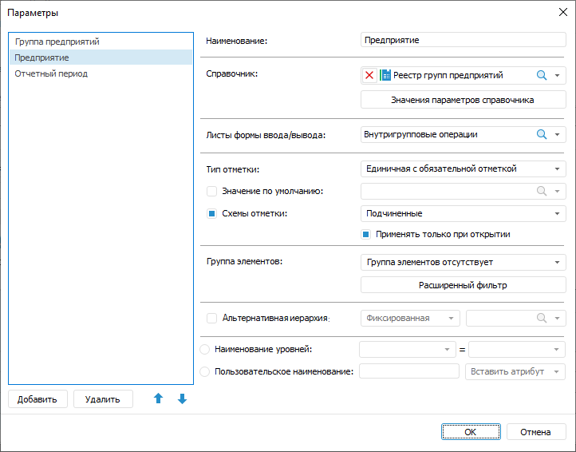
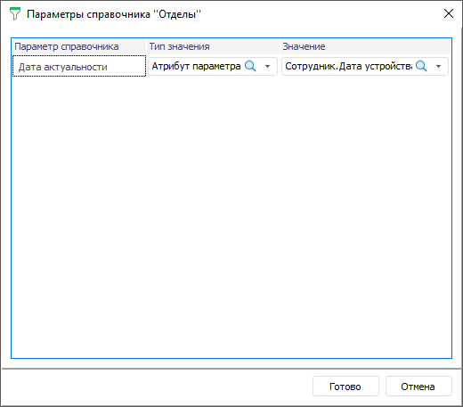
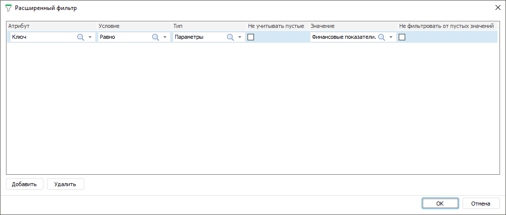
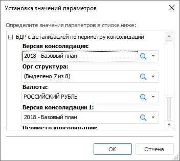

# Настройка параметров формы ввода

Настройка параметров формы ввода
-

# Настройка параметров формы ввода

Параметр предназначен для динамического управления данными, отображаемыми
 в форме ввода. Например, в качестве параметра реестровой формы ввода выбран
 список организаций, при изменении отметки в параметре, в рабочей области
 формы ввода будут отображаться реестровые данные, соответствующие выбранной
 организации.

При добавлении параметра автоматически создаётся элемент управления
 на листах, которые были выбраны при [определении
 свойств параметра](Parameters.htm#properties).

Для настройки параметров формы выполните шаги:

	- [Создайте](Parameters.htm#add) параметр.

	- [Задайте](Parameters.htm#properties) свойства параметра.

	- [Создайте связь](Parameters.htm#filter) с другим
	 параметром для управления доступными значениями параметра.

	- [Измените](Parameters.htm#size) размер элемента управления.

	- [Редактируйте](Parameters.htm#edit) параметр.

После завершения настройки параметров формы, если требуется, перейдите
 к шагу:

	- [Настройка
	 табличной области](../Table/AreaTable.htm);

	- [Настройка
	 редактора атрибута справочника](../Attribute/Attribute.htm);

	- [Настройка связей
	 между элементами формы](Links.htm);

	- [Настройка
	 оформления формы](../Common/Design.htm).

Для настройки параметров формы ввода/вывода используйте диалог «Параметры». Для вызова диалога нажмите
 кнопку  «Редактор параметров» вкладки «Конструктор» ленты инструментов:

Диалог состоит из списка параметров формы и панели настройки свойств.

[Создание
 параметра](javascript:TextPopup(this))

	Создайте параметр, нажав кнопку «Добавить»
	 диалога «Параметры».

[Определение
 свойств параметра](javascript:TextPopup(this))

	Задайте свойства параметра, используя панель свойств диалога «Параметры»:

		- Наименование. Задайте
		 наименование параметра;

		- Справочник. Укажите
		 справочник, к которому будет привязан параметр. Для этого выберите
		 справочник в раскрывающемся списке или нажмите кнопку  «Поиск»
		 и начните печатать название справочника;

		- Значения параметров справочника.
		 Задайте управление [параметрами](UiNavObj.chm::/reference_book/Master_RDS_reference_book/Parameters.htm)
		 справочника. Для этого нажмите кнопку «Значения
		 параметров справочника» будет открыт диалог «Параметры
		 справочника <Наименование
		 справочника>»:

	

	Задайте:

			- Параметр. В
			 списке выведены все параметры справочника. Если у справочника,
			 который является источником для параметра формы, отсутствуют
			 параметры, то список будет пустой;

			- Тип значения.
			 Выберите тип значения. Возможные варианты: не выбрано, значение,
			 атрибут параметра;

			- Значение. Зависит
			 от выбранного типа значения. Поле активно, если выбран тип
			 «Значение» или «Атрибут параметра»:

				- если выбран тип «Значение»,
				 то в поле указывается конкретное значение, соответствующее
				 типу атрибута справочника, на котором построен параметр
				 справочника;

				- если выбран тип «Атрибут
				 параметра», то в поле выбирается атрибут из раскрывающегося
				 списка, представляющего собой дерево из доступных параметров
				 формы с атрибутами;

	Если в справочнике, который является
	 источником для параметра, удален параметр, то параметр удаляется и
	 из диалога вместе с правилом управления;

	Примечание.
	 Настройка доступна в настольном приложении.

		- Листы формы ввода/вывода.
		 Выберите листы, на которых будет отображаться параметр на панели
		 «[Элементы
		 управления](../Starting/Starting.htm#elements)». Для этого выберите лист в раскрывающемся
		 списке или нажмите кнопку  «Поиск» и начните печатать название
		 листа;

		- Тип отметки. Задайте
		 возможное количество отмеченных элементов. Для этого выберите
		 один из вариантов в раскрывающемся списке: единичная с обязательной
		 отметкой, множественная отметка, единичная с необязательной отметкой;

		- Значение по умолчанию.
		 Задайте значение, которое будет отображаться до выбора элемента.
		 Для этого установите флажок «Значение
		 по умолчанию» и выберите элемент в раскрывающемся списке
		 или нажмите кнопку  «Поиск»
		 и начните печатать название элемента. Если в качестве источника
		 альтернативной иерархии выбран параметр, то флажок неактивный;

		- [Схемы
		 отметки](UiNavObj.chm::/reference_book/look-and-feel_Reference_book/UiMd_reference_book_look-and-feel_Scheme.htm). Выберите схему отметки для
		 автоматизации выделения элементов по заданным правилам из раскрывающегося
		 списка. Для этого установите флажок «Схемы
		 отметки» и выберите схему в раскрывающемся списке. Если
		 у справочника отсутствуют схемы отметки в списке будет только
		 вариант - схема отметки отсутствует. Если в качестве источника
		 альтернативной иерархии выбран справочник, то в раскрывающемся
		 списке будут схемы отметки альтернативного справочника. Если в
		 качестве источника альтернативной иерархии выбран параметр, то
		 флажок неактивный. Для применения схемы отметки только при открытии
		 формы ввода установите флажок «Применять
		 только при открытии». При открытии формы ввода на просмотр
		 или редактировании в диалоге «Установка
		 значений параметров» для данного параметра будет применена
		 указанная схема отметки и значения параметра будут ей соответствовать.
		 Если флажок установлен, то при работе с формой ввода отметку параметра
		 можно менять, данные значения будут сохранятся при обновлении
		 формы ввода и переключении между листами. Если флажок снят, то
		 отметка параметра всегда соответствует выбранной схеме отметки;

		- [Группа элементов](UiNavObj.chm::/reference_book/look-and-feel_Reference_book/UiMd_reference_book_look-and-feel_Group.htm).
		 Укажите группу элементов для ограничения списка доступных элементов.
		 Если у справочника отсутствуют группы элементов в списке будет
		 только вариант - группа элементов отсутствует. Если в качестве
		 источника альтернативной иерархии выбран справочник, то в раскрывающемся
		 списке будут группы элементов альтернативного справочника. Если
		 в качестве источника альтернативной иерархии выбран параметр,
		 то флажок неактивный. Настройка доступна, если отсутствует настройка
		 расширенного фильтра;

		- [Альтернативная иерархия](UiNavObj.chm::/reference_book/look-and-feel_Reference_book/Use_AlterHier_ForRefBook.htm).
		 Выберите альтернативную иерархию для отображения элементов альтернативного
		 справочника, вместо элементов справочника, на котором построен
		 параметр, или настройте динамический выбор альтернативной иерархии
		 в зависимости от атрибута другого параметра. Для этого установите
		 флажок «Альтернативная иерархия».
		 Задайте:

			- Тип альтернативной
			 иерархии. Выберите один из вариантов в раскрывающемся
			 списке: фиксированная или динамическая. По умолчанию фиксированная
			 альтернативная иерархия;

			- Источник альтернативной
			 иерархии. Зависит от выбранного типа альтернативной
			 иерархии:

				- если выбран тип «Фиксированная»,
				 то источником альтернативной иерархии является справочник.
				 Выберите доступный справочник в раскрывающемся списке
				 или нажмите кнопку  «Поиск» и начните печатать
				 название справочника. Доступен выбор только одного справочника.

	Если справочник не выбран, то при завершении
	 настройки параметра будет выводиться сообщение, что требуется выбрать
	 альтернативную иерархию для параметра. Если было установлено значение
	 по умолчанию для параметра, а при выборе альтернативной иерархии такого
	 элемента нет, то значение по умолчанию сбрасывается. Если была выбрана
	 схема отметки для параметра, то при выборе альтернативной иерархии
	 предыдущая схема отметки будет сброшена и выбрана первая схема отметки
	 из списка для альтернативной иерархии;

				- если выбран тип «Динамическая»,
				 то источником альтернативной иерархии является параметр.
				 Выберите атрибут параметра формы ввода в раскрывающемся
				 списке или нажмите кнопку  «Поиск» и начните печатать
				 название параметра.

	Если не выбран атрибут параметра для
	 альтернативной иерархии, то при завершении настройки параметра будет
	 выводиться сообщение, что требуется выбрать альтернативную иерархию
	 для параметра. При выборе источником альтернативной иерархии параметра
	 настройки «Значение по умолчанию»,
	 «Схема отметки» и «Группа
	 элементов» недоступны.

	Если в справочнике был удален атрибут,
	 который был задан в качестве ключа альтернативной иерархии для параметра,
	 то значение параметра в [элементе
	 управления](../Work/UseControls.htm) формы ввода станет пустым. Назначьте другой атрибут
	 параметра в качестве ключа альтернативной иерархии;

	Примечание.
	 Настройка доступна в настольном приложении.

		- Наименование уровней.
		 Установите переключатель для отображения [атрибутов
		 справочника](UiNavObj.chm::/reference_book/Master_RDS_reference_book/Attributes.htm), которые будут использоваться при
		 формировании наименований [уровней](UiNavObj.chm::/reference_book/Master_RDS_reference_book/Level.htm)
		 в элементе управления. В первом раскрывающемся списке выберите
		 уровень, для которого настраивается наименование. Во втором раскрывающемся
		 списке выберите атрибут справочника, который определит наименование.
		 Для каждого уровня можно задать разные атрибуты справочника.

	Заданное наименование для элемента «[все]» применяется ко всем уровням,
	 кроме тех, для которых наименование было указано явно;

	Примечание.
	 По умолчанию для всех уровней используется атрибут «Наименование».

		- Пользовательское наименование.
		 Установите переключатель для отображения пользовательского наименования
		 [уровней](UiNavObj.chm::/reference_book/Master_RDS_reference_book/Level.htm)
		 в элементе управления. В поле задайте наименование, которое будет
		 отображаться для всех уровней. При необходимости выберите [атрибут
		 справочника](UiNavObj.chm::/reference_book/Master_RDS_reference_book/Attributes.htm), который будет добавлен в пользовательское
		 наименование, в раскрывающемся списке «Вставить
		 атрибут».

	Порядок применения альтернативной иерархии, группы элементов, схем
	 отметки и расширенного фильтра описан ниже.

	Завершите выбор, нажав кнопку «ОК».

[Ограничение
 доступных значений параметра с помощью фильтра](javascript:TextPopup(this))

	Для ограничения доступных значений параметра формы настройте связи
	 с другими параметрами формы с помощью расширенного фильтра.

	Для вызова диалога расширенного фильтра нажмите кнопку «Расширенный фильтр»:

	

	Настройка расширенного фильтра доступна при отсутствии настройки
	 группы элементов. Порядок применения альтернативной иерархии, группы
	 элементов, схем отметки и расширенного фильтра описан ниже.

	Задайте расширенный фильтр:

	- Атрибут.
	 Выберите атрибут указанного справочника из раскрывающегося списка.
	 Для фильтрации элементов справочника по атрибутам [связанного
	 справочника](UiNavObj.chm::/reference_book/Master_RDS_reference_book/Link_Property.htm) выберите в списке доступных связанных
	 атрибутов атрибут справочника, выбранного при [создании
	 связи](UiNavObj.chm::/reference_book/Master_RDS_reference_book/Link.htm) с атрибутом указанного справочника. Связанные
	 атрибуты отображаются с первым уровнем вложенности и представляют
	 собой дерево из доступных связанных атрибутов;

Примечание.
 Если атрибут справочника содержит [множественные значения](UiNavObj.chm::/reference_book/Master_RDS_reference_book/Attributes/Attribute.htm),
 то при проверке условия фильтрации будут сравниваться все значения атрибута.
 Если хотя бы одно значение атрибута удовлетворяет условию, то элемент
 справочника будет автоматически удовлетворять условию.

	- Условие.
	 Задайте условие фильтрации в зависимости от [типа данных](UiNavObj.chm::/reference_book/Master_RDS_reference_book/Attributes/Attribute.htm)
	 атрибута. Возможные варианты: равно, не равно, больше, меньше, больше
	 или равно, меньше или равно, входит, не входит. Для атрибута строкового
	 типа данных доступны дополнительные варианты условия: начинается с,
	 заканчивается на, содержит, не содержит;

		- Тип.
		 Выберите тип фильтра. Возможные варианты: значение, параметры;

		- Не
		 учитывать пустые. Пустые значения атрибута не будут учитываться,
		 если установить флажок. Доступно только для типа «Параметры»;

		- Значение.
		 Зависит от выбранного атрибута и типа:

			- если выбран тип «Значение»,
			 то в поле указывается конкретное значение, соответствующее
			 [типу
			 данных](UiNavObj.chm::/reference_book/Master_RDS_reference_book/Attributes/Attribute.htm)
			 атрибута;

			- если выбран тип «Параметры»,
			 то в поле выбирается атрибут параметра из раскрывающегося
			 списка, представляющего собой дерево из доступных атрибутов
			 параметров, содержащихся в списке параметров формы;

			- если атрибут связанный и выбран тип «Значение»,
			 то в поле выбирается доступное значение связанного справочника
			 из раскрывающегося списка;

			- если атрибут связанный и выбран тип «Параметры»,
			 то в поле выбирается атрибут параметра из раскрывающегося
			 списка, представляющего собой дерево из доступных атрибутов
			 параметров и [связанных
			 справочников](UiNavObj.chm::/reference_book/Master_RDS_reference_book/Link_Property.htm);

		- Не
		 фильтровать от пустых значений. Значения атрибута не будут
		 фильтроваться при пустом значении, если установить флажок.

	Завершите выбор, нажав кнопку «ОК».

[Порядок применения
 альтернативной иерархии, группы элементов, схем отметки и расширенного
 фильтра](javascript:TextPopup(this))

	Если при настройке параметра были заданы альтернативная иерархия,
	 группа элементов или расширенный фильтр и схема отметки, то они будут
	 применены в следующем порядке:

		- Альтернативная иерархия.

		- Группа элементов или расширенный фильтр. Может быть выбрана
		 либо группа элементов, либо расширенный фильтр.

		- Схема отметки.

[Изменение
 размера элемента управления](javascript:TextPopup(this))

	Для изменения размеров элемента управления, задайте ширину, растянув/сжав
	 элемент управления за правый край на панели «Элементы
	 управления».

[Изменение
 порядка отображения элементов управления](javascript:TextPopup(this))

	Для изменения порядка отображения элементов управления на панели
	 «Элементы управления»:

		- выберите параметр в диалоге «Параметры»
		 и используйте кнопки  «Переместить
		 вверх»/ «Переместить
		 вниз»;

		- перетащите требуемый параметр на панели «Элементы
		 управления» с помощью механизма Drag&Drop.

[Редактирование
 параметра](javascript:TextPopup(this))

	Для редактирования параметра вызовите диалог «Параметры»,
	 нажав кнопку  «Редактор
	 параметров» вкладки «Конструктор»
	 ленты инструментов.

[Удаление
 параметра](javascript:TextPopup(this))

	Для удаления параметра нажмите кнопку «Удалить»
	 диалога «Параметры».

	Если параметр управляет другим параметром, то для удаления управляющего
	 параметра нужно убрать зависимость с управляемым параметром.

	Если атрибут параметра задан в качестве альтернативной иерархии
	 для другого параметра, то для удаления параметра, используемого для
	 альтернативной иерархии, необходимо изменить тип источника или источник
	 альтернативной иерархии или не использовать альтернативную иерархию.

## Открытие формы ввода с параметрами

При открытии формы ввода с параметрами отобразится диалог «Установка
 значений параметров»:

Вид полей для ввода параметров зависит от типа параметра. Если для параметра
 было указано значение по умолчанию, оно будет отображено в соответствующем
 поле.

Для остальных параметров необходимо ввести/выбрать (в зависимости от
 типа параметра) значения и нажать кнопку «ОК».

Примечание.
 При работе с параметрами формы ввода автоматически сохраняются последние
 введенные пользователем значения. При последующем открытии формы ввода
 будут отображены сохраненные значения параметров.

См. также:

[Начало
 работы с расширением «Интерактивные формы ввода данных» в веб-приложении](../../Web/Starting/Starting.htm) |
 [Построение формы ввода](../Starting/ConstructForm.htm) |
 [Работа с готовой формой ввода](../Work/FinishForm.htm)

		Справочная
		 система на версию 10.9
		 от 18/08/2025,
		 © ООО «ФОРСАЙТ»,
