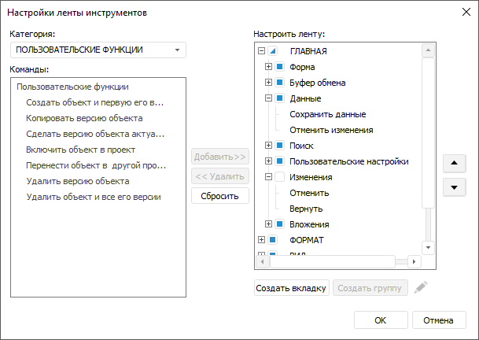
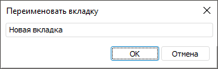
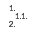

# Настройка ленты инструментов

Настройка ленты инструментов
-

# Настройка ленты инструментов

Для управления видимостью системных вкладок и групп и структурирования
 пользовательских кнопок в зависимости от выполняемых ими действий на ленте
 инструментов используйте диалог «Настройки
 ленты инструментов»:

[Для
 открытия диалога](javascript:TextPopup(this))

	Выполните команду «Настроить ленту
	 инструментов» контекстного меню ленты.

Примечание.
 Настройка доступна при создании и редактировании форм ввода в настольном
 приложении.

Диалог состоит из категорий и команд, которые можно добавить на ленту
 инструментов, и области настройки ленты.

Для настройки ленты инструментов выполните шаги:

	- Добавьте [пользовательскую вкладку](#add_tab).

	- Добавьте [пользовательскую группу](#add_group).

	- [Переименуйте](#rename) пользовательские вкладки
	 и группы.

	- Добавьте в группу [команду](#add_command).

	- [Измените расположение](#change_location) пользовательских
	 вкладок, пользовательских групп, команд.

	- [Определите видимость](#change_visibility) вкладок
	 и групп.

	- [Сбросьте](#reset) изменения, если требуется.

Добавление пользовательских вкладок и групп необходимо для структурирования
 пользовательских кнопок в зависимости от выполняемых ими действий, так
 как по умолчанию все созданные кнопки добавляются на вкладку «[Пользовательские функции](../Custom_module/Advanced.htm)».

## Добавление пользовательских вкладок

Для добавления пользовательских вкладок нажмите кнопку «Создать
 вкладку» в области настройки ленты.

В список «Настроить ленту» будет
 добавлена вкладка с наименованием «Новая
 вкладка» и группа в этой вкладке с наименованием «Новая
 группа». Пользовательские вкладки помечаются в списке добавлением
 к наименованию слова «(настраиваемая)».

Для удаления пользовательских вкладок выберите пользовательскую
 вкладку в списке «Настроить ленту»
 и нажмите кнопку «Удалить».

## Добавление пользовательских групп

Для добавления пользовательских групп выберите пользовательскую вкладку,
 в которую требуется добавить группу, и нажмите кнопку «Создать
 группу» в области настройки ленты. Во вкладку будет добавлена группа
 с наименованием «Новая группа».
 Пользовательские группы помечаются в списке добавлением к наименованию
 слова «(настраиваемая)».

Для удаления пользовательских групп из вкладки выберите пользовательскую
 группу в списке «Настроить ленту»
 и нажмите кнопку «Удалить».

## Переименование пользовательских вкладок и групп

Для переименования пользовательских вкладок и групп выберите вкладку
 или группу, которую требуется переименовать, и нажмите кнопку  «Переименовать». Будет открыт диалог
 «Переименовать вкладку/группу»:

Название диалога зависит от того, что было выбрано для переименования.

В открывшемся диалоге введите новое наименование вкладки или группы.
 Наименование должно отражать сущность выполняемых с помощью команд действий.

Для завершения редактирования наименования нажмите кнопку «ОК».

В списке вкладки и группы помечаются добавлением к наименованию слова
 «(настраиваемая)».

Наименования пользовательских вкладок и групп могут быть сохранены на
 разных языках в зависимости от текущего языка, выбранного в [окне регистрации](getstarted.chm::/GetStarted/Get_Started.htm),
 или с помощью ресурса, входящего в [состав
 объекта](UiNav.chm::/03_Objects/UiNav_Obj_BasicPropConsist.htm). Для получения подробной информации обратитесь
 к разделу «[Настройка
 мультиязычности](UiNav.chm::/Multilanguage/Multilanguage_setting.htm)».

## Добавление команд в пользовательскую группу

Для добавления команд в группу:

	- Выберите категорию. Раскрывающийся список «Категория»
	 содержит категории: главная, формат, вид, таблица, процессы, пользовательские
	 функции, соответствующие вкладкам ленты инструментов. Категория «Процессы» доступна, если включено
	 [отображение вкладки «Процессы»](../Work/Agreement.htm#process_tree).

	- Выберите команду. Список «Команды»
	 содержит команды, относящиеся к выбранной категории. Для категории
	 «Пользовательские функции»
	 в списке отображаются [созданные
	 пользователем кнопки](../Custom_module/Advanced.htm). Для остальных категорий в списке отображаются
	 все команды, соответствующие системным кнопкам, которые доступны при
	 просмотре формы ввода. Для раскрывающихся кнопок доступна только основная
	 команда, команды раскрывающегося меню не отображаются.

	- Выберите пользовательскую группу. Область «Настроить
	 ленту» отображает дерево категорий, групп и команд. Добавлять
	 команды можно только в пользовательские группы.

	- Нажмите кнопку «Добавить».

При добавлении команд в пользовательские группы команды будут дублироваться,
 отображаясь на пользовательских и системных вкладках, их настройки будут
 синхронизированы. Если до добавления в пользовательскую группу у команды
 была задана активность или в раскрывающемся меню кнопки была задана настройка,
 то при добавлении таких команд настройки сохраняются.

Если в режиме просмотра и редактирования функциональные возможности
 кнопки различаются, то это различие сохраняется и при добавлении такой
 кнопки в пользовательскую группу. Например, кнопка  «Нумерация» содержит команду «Настроить», которая отображается
 при редактировании формы, но не отображается при просмотре, при добавлении
 кнопки  «Нумерация»
 на пользовательскую вкладку в группу такое поведение сохранится.

Для удаления команд из группы выберите команду в списке «Настроить
 ленту» и нажмите кнопку «Удалить».

### Активность команд, добавленных из категории «Процессы»

Активность команд, добавленных на пользовательские вкладки из категории
 «Процессы»:

	- «Завершить»/«Согласовать»
	 и «Отклонить». Есть активные
	 шаги для текущего листа или выделены активные шаги в дереве процессов;

	- «Обновить дерево», «Множественное согласование», «Подсветка». Отображено дерево процессов;

	- «Применить отметку шага».
	 Отображено дерево процессов и выделен активный шаг.

В остальных случаях команды будут отображаться на пользовательской вкладке,
 но не будут активны.

## Изменение порядка расположения вкладок,
 групп и команд

Для создания логичной структуры вкладок, групп внутри вкладок и команд
 внутри групп измените их расположение с помощью кнопок  «Переместить
 вверх» и  «Переместить
 вниз». Перемещать можно только пользовательские вкладки, группы
 и команды. Группы можно перемещать только внутри вкладок. Команды только
 внутри групп.

## Определение видимости вкладок и групп

Для определения вкладок и групп, которые будут отображаться на ленте
 инструментов при просмотре формы, установите флажки напротив нужных вкладок
 и групп в диалоге «[Настройки
 ленты инструментов](#settings)». Управлять видимостью можно как системных,
 так и пользовательских вкладок и групп.

Примечание.
 В режиме редактирования все системные и пользовательские вкладки, а также
 расположенные на них группы отображаются на панели инструментов, даже
 если видимость этих вкладок и групп отключена. Внесённые в режиме редактирования
 изменения отображаются в режиме просмотра формы.

### Особенности настройки видимости

По умолчанию созданная пользовательская вкладка содержит одну группу
 без команд, настройка видимости вкладки недоступна, вкладка отображается
 на панели инструментов в режиме редактирования, но не отображается в режиме
 просмотра. Для настройки видимости вкладки добавьте команду хотя бы в
 одну группу вкладки. Флажок напротив вкладки будет активирован. Допустимые
 значения:

	- флажок для вкладки не установлен. Используется по умолчанию.
	 В режиме редактирования вкладка отображается на ленте инструментов,
	 в режиме просмотра вкладка скрыта;

	- флажок для вкладки установлен. Вкладка отображается на ленте
	 инструментов и в режиме редактирования, и в режиме просмотра;

	- флажок для вкладки установлен частично. Вкладка и все группы
	 в ней отображаются на ленте инструментов в режиме редактирования.
	 В режиме просмотра вкладка отображается на ленте инструментов, но
	 отдельные группы, для которых снят флажок в диалоге «Настройки
	 ленты инструментов», скрыты;

По умолчанию созданные группы не содержат команд, настройка видимости
 группы недоступна, группа отображается на панели инструментов в режиме
 редактирования, но не отображается в режиме просмотра. Для настройки видимости
 группы добавьте в неё хотя бы одну команду. Флажок напротив группы будет
 активирован. Допустимые значения:

	- флажок для группы не установлен. Используется по умолчанию.
	 В режиме редактирования группа отображается на вкладке ленты инструментов,
	 в режиме просмотра группа скрыта;

	- флажок для группы установлен. Группа отображается на вкладке
	 ленты инструментов и в режиме редактирования, и в режиме просмотра.

Если у скрытой вкладки включить видимость группы, вкладка автоматически
 станет видимой.

Если отключить видимость всех групп во вкладке, вкладка автоматически
 станет скрытой.

Вкладка «[Процессы](../Work/Agreement.htm#process_tree)»
 доступна для настройки видимости, если нажата кнопка «[Дерево процессов](../Work/Agreement.htm#process_tree)».

Группа «[Согласование](../Work/Agreement.htm#withuot_process_tree)»
 вкладки «Главная» ленты инструментов
 доступна для настройки видимости при установке флажка «[Автоматически запрашивать данные об активных
 процессах](Starting.htm#process)». Если вкладка «Главная»
 скрыта, то при установке данного флажка она отобразится с группой «Согласование».

Если на ленте инструментов скрыты все вкладки, то в режиме редактирования
 лента инструментов будет отображена, а в режиме просмотра - скрыта.

## Сброс изменений

Для сброса всех изменений на ленте инструментов и возвращения настроек
 по умолчанию нажмите кнопку «Сбросить».
 Будет выведено сообщение для подтверждения сброса настроек. Нажмите кнопку
 «Да» для подтверждения действия.

При сбросе настроек будут удалены все пользовательские вкладки и
 группы, видимость системных вкладок и групп будет восстановлена.

См. также:

[Начало
 работы с расширением «Интерактивные формы ввода данных» в веб-приложении](../../Web/Starting/Starting.htm) |
 [Начало работы с расширением «Интерактивные формы
 ввода данных» в настольном приложении](Starting.htm) | [Расширение
 функциональности](../Custom_module/Advanced.htm)

		Справочная
		 система на версию 10.9
		 от 18/08/2025,
		 © ООО «ФОРСАЙТ»,
