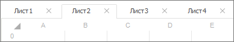
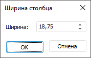
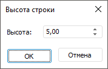

# Добавление нового листа и работа с ним

Добавление нового листа и работа с ним
-

# Добавление нового листа и работа с ним

При работе с формой ввода доступно добавление и удаление листов.

Если для получения формы ввода достаточно одного листа, то перейдите
 к шагу:

	- [Настройка параметров
	 формы](../Parameters/Parameters.htm);

	- [Настройка табличной области](../Table/AreaTable.htm);

	- [Настройка редактора атрибута
	 справочника](../Attribute/Attribute.htm).

Если нужно несколько листов, то добавьте лист.

Для работы с листами используйте вкладки листов:

[Работа
 с листами](javascript:TextPopup(this))

	Доступные операции при работе с листами:

		- добавление листа;

		- удаление листа.

	Для добавления листа нажмите кнопку  «Добавить лист», расположенную рядом
	 с вкладками листов. Будет добавлен лист с наименованием «Лист
	 N», где N - порядковый номер добавляемого листа.

	Для удаления листа нажмите кнопку  «Удалить лист», расположенную справа
	 на вкладке листа. Лист будет удален. В форме ввода должен присутствовать
	 хотя бы один лист. Единственный лист удалить нельзя.

[Операции
 с ячейками](javascript:TextPopup(this))

	Для работы с ячейкой выделите её.

	Доступные операции с ячейками:

		- добавление/удаление ячеек;

		- формат ячеек;

		- редактирование содержимого ячеек;

		- настройка [редактора
		 ячейки](UiNav.chm::/GUI/Format/UiReport_Table_Attribute_Format.htm#cell_editor). По умолчанию подбирается автоматически
		 в зависимости от типа данных.

### Добавление/удаление ячеек

	Для вставки ячейки/столбца/строки в раскрывающемся меню команды
	 «Вставить ячейки» в контекстном
	 меню ячейки выберите один из вариантов:

		- сдвинуть ячейки вниз;

		- сдвинуть ячейки вправо;

		- вставить строку ниже;

		- вставить строку выше;

		- вставить столбец слева;

		- вставить столбец справа.

	Для удаления ячейки/столбца/строки в раскрывающемся меню команды
	 «Удалить ячейки» в контекстном
	 меню ячейки выберите один из вариантов:

		- сдвинуть ячейки вверх;

		- сдвинуть ячейки влево;

		- удалить строки;

		- удалить столбцы.

### Формат ячеек

	Для отображения окна «Формат ячеек»
	 выделите одну или несколько ячеек:

		- нажмите кнопку  «Задать
		 оформление» на вкладке «Формат»
		 ленты инструментов.

	Заданное оформление будет применяться к области, выбранной в раскрывающемся
	 списке в группе «Текущий фрагмент»
	 вкладки «Формат» ленты
	 инструментов.

	Окно содержит вкладки:

		- [шрифт](UiNav.chm::/GUI/Format/UiReport_Table_Attribute_Type.htm);

		- [формат
		 числа](UiNav.chm::/GUI/Format/UiReport_Table_Attribute_Format.htm);

		- [выравнивание](UiNav.chm::/GUI/Format/UiReport_Table_Attribute_Arrange.htm);

		- [границы](UiNav.chm::/GUI/Format/UiReport_Table_Attribute_Border.htm);

		- [заливка](UiNav.chm::/GUI/Format/UiReport_Table_Attribute_View.htm);

		- [прочее](UiNav.chm::/GUI/Format/UiReport_Table_Attribute_Others.htm).

### Редактирование содержимого ячеек

	Для редактирования содержимого в ячейке:

		- выделите ячейку на листе отчета и введите необходимые данные;

		- дважды щёлкните по области выбранной ячейки;

		- выделите ячейку и нажмите клавишу F2, после чего введите
		 данные.

	С выделенными ячейками можно совершать операции:

		- [вырезать](UiNav.chm::/02_Navigator/UiNav_ObjectsOperations.htm#cut);

		- [копировать](UIReport.chm::/desktop/Table/Work/UiReport_Table_Work_Data_Edit.htm#copy);

		- [вставить](UIReport.chm::/desktop/Table/Work/UiReport_Table_Work_Data_Edit.htm#paste).

[Операции
 со столбцами](javascript:TextPopup(this))

	Для работы со столбцом выделите его, щёлкнув на заголовок.

	Доступные операции со столбцами:

		- изменение ширины столбца;

		- добавление/удаление столбца;

		- скрытие/отображение столбца.

### Изменение ширины столбца

	Для изменения ширины столбца:

		- используйте мышь. Наведите курсор на границу столбца в области
		 заголовка и перетащите границу на требуемое расстояние, удерживая
		 зажатой кнопку мыши. В области, где возможно перетаскивание, указатель
		 принимает вид двунаправленной стрелки;

		- выполните команду «Ширина
		 столбца» контекстного меню. После выполнения команды появится
		 одноименное окно:

	

	В появившемся окне введите значение.

### Добавление/удаление столбца

	Для добавления/удаления столбца выполните в контекстном меню заголовка
	 команды:

		- Вставить столбец слева;

		- Вставить столбец справа;

		- Удалить столбец.

	Примечание.
	 Для добавления/удаления столбца в [табличной
	 области](../Table/AreaTable.htm) используйте кнопки  «[Создать запись](../Work/New_entries.htm)»/ «[Удалить запись](../Work/New_entries.htm#delete)».

### Скрытие/отображение столбца

	Если требуется скрыть или отобразить скрытый столбец или диапазон
	 столбцов выполните в контекстном меню заголовка соответствующую команду:

		- Скрыть;

		- Отобразить. Команда
		 становится активной если на листе присутствуют скрытые столбцы.

	Настройка доступна при работе с готовой формой ввода.

[Операции
 со строками](javascript:TextPopup(this))

	Для работы со строками выделите их, щёлкнул на заголовок.

	Доступные операции со строками:

		- изменение высоты строки;

		- добавление/удаление строки;

		- скрытие/отображение строки.

### Изменение высоты строки

	Для изменения высоты строки:

		- используйте мышь. Наведите курсор на границу строки в области
		 заголовка и перетащите границу на требуемое расстояние, удерживая
		 зажатой кнопку мыши. В области, где возможно перетаскивание, указатель
		 принимает вид двунаправленной стрелки;

		- выполните команду «Высота
		 строки» контекстного меню. После выполнения команды появится
		 одноименное окно:

	

	В появившемся окне введите значение.

### Добавление/удаление строки

	Для добавления/удаления строки выполните в контекстном меню заголовка
	 команды:

		- Вставить строку сверху;

		- Вставить строку снизу;

		- Удалить строку.

	Примечание.
	 Для добавления/удаления строки в [табличной
	 области](../Table/AreaTable.htm) используйте кнопки  «[Создать запись](../Work/New_entries.htm)»/ «[Удалить запись](../Work/New_entries.htm#delete)»..

### Скрытие/отображение строки

	Если требуется скрыть или отобразить скрытую строку или диапазон
	 строк выполните в контекстном меню заголовка соответствующую команду:

		- Скрыть;

		- Отобразить. Команда
		 становится активной если на листе присутствуют скрытые строки.

	Настройка доступна при работе с готовой формой ввода.

См. также:

[Начало
 работы с расширением «Интерактивные формы ввода данных» в веб-приложении](../../Web/Starting/Starting.htm) |
 [Построение формы ввода](ConstructForm.htm) | [Работа
 с готовой формой ввода](../Work/FinishForm.htm)

		Справочная
		 система на версию 10.9
		 от 18/08/2025,
		 © ООО «ФОРСАЙТ»,
