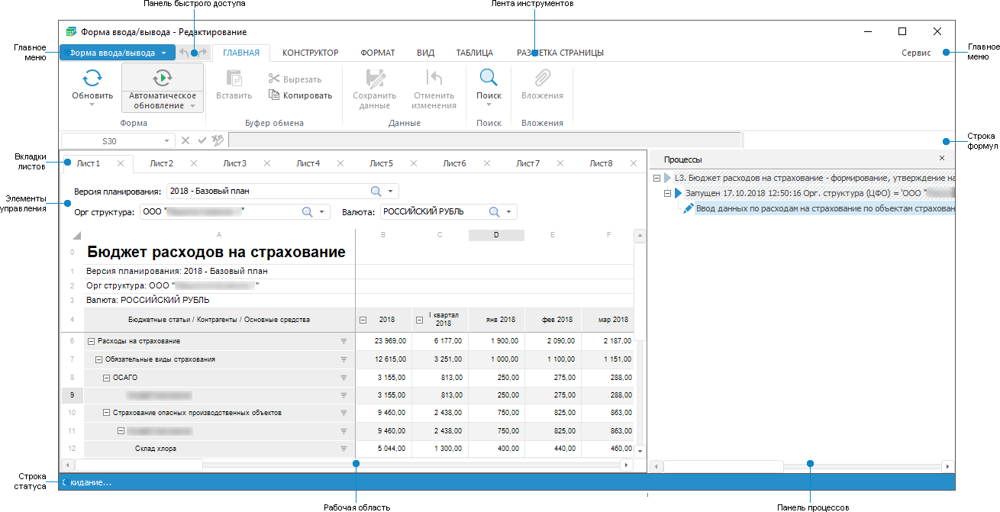
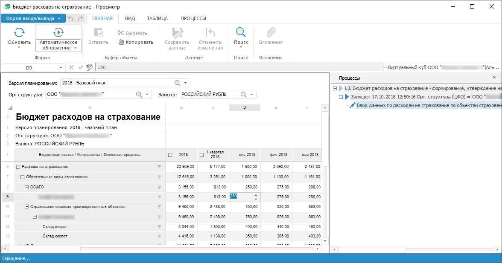
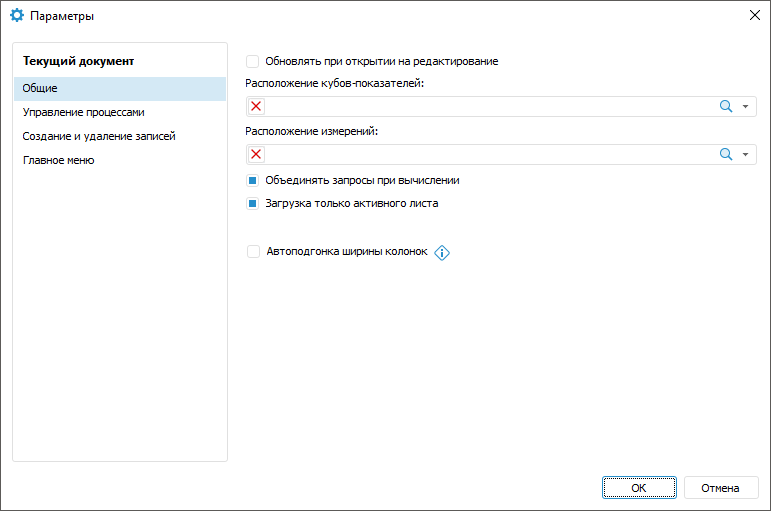
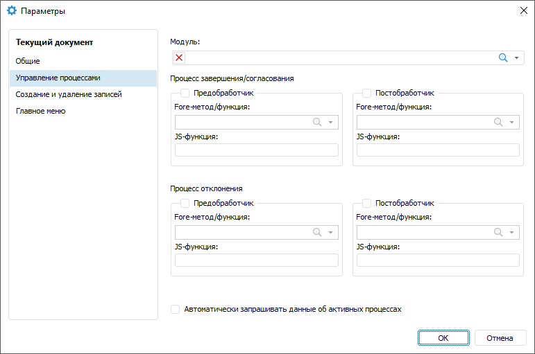
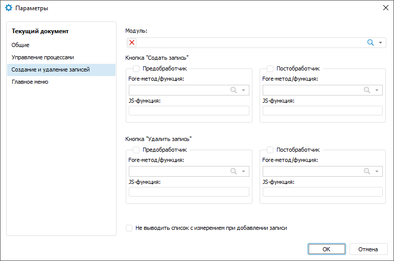
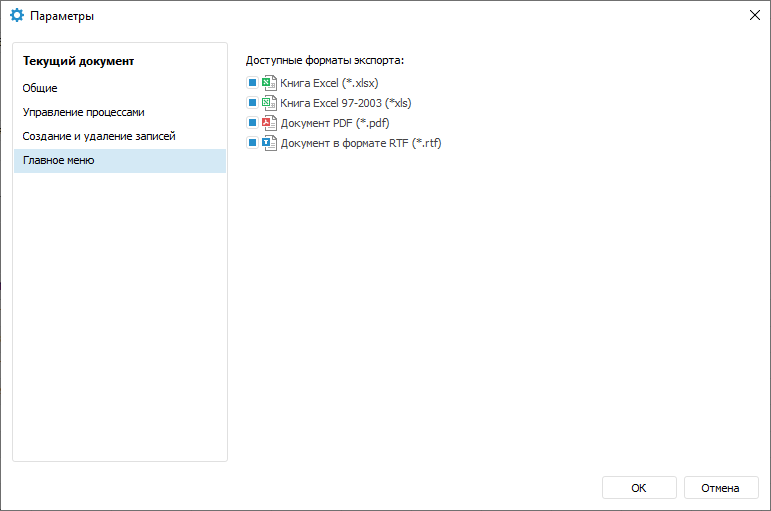

# Начало работы с расширением «Интерактивные формы ввода данных» в настольном приложении

Начало работы с расширением «Интерактивные формы ввода данных» в настольном приложении
-

# Начало работы с расширением «Интерактивные
 формы ввода данных» в настольном приложении

Для начала работы с расширением создайте новую или откройте готовую
 форму ввода.

[Создание новой
 формы ввода](javascript:TextPopup(this))

	Для создания новой формы ввода в [навигаторе
	 объектов](GetStarted.chm::/Interface/Interface_Navigator.htm):

		- нажмите кнопку «Новый объект >
		 Пользовательские объекты > Форма ввода/вывода»
		 в группе «Создать» на
		 вкладке «Главная» ленты
		 инструментов;

		- выполните команду «Создать >
		 Пользовательские объекты > Форма ввода/вывода»
		 в контекстном меню навигатора объектов.

[Открытие готовой
 формы ввода](javascript:TextPopup(this))

	Для открытия готовой формы ввода на редактирование в [навигаторе
	 объектов](GetStarted.chm::/Interface/Interface_Navigator.htm) выделите форму ввода и выполните одно
	 из действий:

		- нажмите кнопку  «Редактировать»
		 в группе «Открыть» на
		 вкладке «Главная» ленты
		 инструментов;

		- выполните команду «Редактировать»
		 в контекстном меню формы ввода;

		- нажмите кнопку F4.

	Для открытия готовой формы ввода на просмотр в [навигаторе
	 объектов](GetStarted.chm::/Interface/Interface_Navigator.htm) выделите форму ввода и выполните одно
	 из действий:

		- нажмите кнопку  «Открыть»
		 в группе «Открыть» на
		 вкладке «Главная» ленты
		 инструментов;

		- выполните команду «Открыть»
		 в контекстном меню формы ввода.

	Примечание.
	 Если в форме ввода содержатся [параметры](../../Web/Parameters/Parameters.htm),
	 то при открытии формы ввода задайте их значения.

Для построения формы смотрите статью
 «[Построение
 формы ввода](ConstructForm.htm)».

Для работы с готовой формой смотрите
 статью «[Работа
 с готовой формой ввода](../Work/FinishForm.htm)».

Основное окно расширения «Интерактивные
 формы ввода данных»:

[Окно формы
 ввода в режиме просмотра](javascript:TextPopup(this))

	

[Элементы
 окна формы ввода](javascript:TextPopup(this))

		- Главное меню. Содержит
		 список команд, предназначенных для выполнения различных операций
		 над формой. Также в режиме редактирования доступно сохранение
		 формы ввода.

		- [Лента
		 инструментов](GetStarted.chm::/Interface/Interface_Description.htm#minitocbookmark3).
		 Содержит кнопки для построения формы в режиме редактирования и
		 для работы с данными в режиме просмотра. Дополнительно можно [настроить отображаемые вкладки и группы](Ribbon.htm)
		 в режиме редактирования.

		- [Панель
		 быстрого доступа](GetStarted.chm::/Interface/Interface_Description.htm#quick_access_toolbar).
		 Содержит набор часто используемых команд.

		- Строка формул. Предназначена
		 для ввода формул в ячейки таблицы, отображения адресов выделенных
		 ячеек и [формул алгоритмов](../Table/Calculation_Practices.htm),
		 если значения ячеек по ним рассчитывается.

		- Рабочая область.
		 Предназначена для построения формы в режиме редактирования и для
		 ввода данных в режиме просмотра.

		- Вкладки листов.
		 Предназначены для работы с листами формы в режиме редактирования
		 и для переключения между ними в режиме просмотра.

		- [Панель
		 процессов](GetStarted.chm::/interface/interface_description.htm#quick_access_toolbar). Предназначена для настройки
		 свойств процесса в режиме редактирования и для управления процессом
		 в режиме просмотра.

		- Элементы управления.
		 Предназначена для отображения элементов управления, с помощью
		 которых будет осуществляться оперирование данными при [работе
		 с готовой формой](../Work/FinishForm.htm).

		- [Строка
		 статуса](GetStarted.chm::/Interface/Interface_Description.htm#status_line). Предназначена для отображения
		 значений базовых агрегатов выделенного диапазона ячеек.

## Настройка расширения «Интерактивные формы
 ввода данных»

Для настройки расширения «Интерактивные
 формы ввода данных» используйте диалог «Параметры».

Примечание.
 Диалог «Параметры» доступен только
 в настольном приложении. Используйте его при создании или редактировании
 формы.

[Для открытия
 диалога «Параметры»](javascript:TextPopup(this))

	Выполните команду «Сервис >
	 Параметры» в главном меню формы ввода.

	 Вкладка «Общие» Вкладка «Управление процессами»

	 Вкладка «Создание и удаление записей»

	 Вкладка «Главное меню»

		

		

		

		

Доступные настройки:

[Общие](javascript:TextPopup(this))

	Вкладка «Общие» содержит
	 настройки:

		- Обновлять при открытии
		 на редактирование. Установите флажок для автоматического
		 обновления формы ввода при её открытии на редактирование. По умолчанию
		 флажок снят;

		- Расположение кубов-показателей.
		 Укажите расположение папок, в которых располагаются показатели
		 для построения формы ввода. Для этого выберите папку с кубами-показателями
		 из раскрывающегося списка или нажмите кнопку  «Поиск» и начните печатать название
		 папки. Для удаления папки нажмите  «Очистить»;

		- Расположение измерений.
		 Укажите расположение папок, в которых располагаются измерения
		 для построения формы ввода. Для этого выберите папку с измерениями
		 из раскрывающегося списка или нажмите кнопку поиска  «Поиск»
		 и начните печатать название папки. Для удаления папки нажмите  «Очистить»;

	- Объединять запросы при вычислении.
	 Установите флажок для:

		- ускорения работы формы ввода при отображении нескольких
		 атрибутов из одного справочника на листе формы или при выводе
		 показателей одного источника, если между ними расположен показатель
		 из другого источника;

		- расчёта алгоритма для показателей, добавленных в шапку несколько
		 раз;

		- запуска частичного перерасчёта данных в табличных областях.
		 Перерасчёт происходит, если изменяемые данные являются входными
		 данными для другой табличной области, значения которой рассчитываются
		 с помощью алгоритма, выполняемого при изменении.

Примечание.
 Работа с алгоритмом расчёта доступна только при наличии установленного
 расширения «[Алгоритмы расчёта](CalculationAlgorithm.chm::/Purpose.htm)».

Особенности объединения запросов:

		- если флажок снят, то перерасчёт данных выполняется только
		 в одной табличной области на текущем листе формы ввода. В других
		 табличных областях перерасчёт не выполняется;

		- если флажок установлен и в форме ввода есть несколько табличных
		 областей, построенных на одном источнике, то при использовании
		 алгоритмов расчёта может произойти перерасчёт данных ячеек даже
		 в тех табличных областях, для которых алгоритм расчёта не подключён.
		 Во избежание этого снимите флажок, либо используйте [представление-куб](UiNavObj.chm::/Cube/CreateCube/Master_Conception/UiMd_Cube_CreateCube_Master_Conception.htm)
		 в качестве источника для таких табличных областей;

		- если флажок установлен и в форме ввода есть табличная область,
		 построенная на [кубе](uinavobj.chm::/Cube/CreateCube/UiMd_Cube_CreateCube.htm)
		 с вычисляемыми элементами, то данные куба будут недоступны для
		 вычисления. Вычисление элементов может быть настроено:

			- в [стандартном
			 кубе](uinavobj.chm::/Cube/CreateCube/Master_Standart/UiMd_Cube_CreateCube_Master_Standart.htm) на страницах «Привязка
			 фактов куба», «Отношения»,
			 «Вычисляемые факты»,
			 «Управление параметрами»,
			 «Управляющие измерения»,
			 «Агрегация данных»;

			- в [представлении-кубе](uinavobj.chm::/Cube/CreateCube/Master_Conception/UiMd_Cube_CreateCube_Master_Conception.htm)
			 на страницах «Фиксация измерений»,
			 «Управление параметрами»,
			 «Управляющие измерения»;

			- в [виртуальном
			 кубе](uinavobj.chm::/Cube/CreateCube/Master_Virtual_Cube/UiMd_Cube_CreateCube_Master_Virtual.htm) на страницах «Управление
			 параметрами», «Управляющие
			 измерения»;

			- в [вычисляемом
			 кубе](uinavobj.chm::/Cube/CreateCube/Master_Calculation/UiMd_Cube_CreateCube_Master_Calculation.htm) на страницах «Управление
			 формулами», «Управление
			 параметрами», «Управляющие
			 измерения», «Редактор
			 формул»;

			- в [автоматическом
			 кубе](uinavobj.chm::/Cube/CreateCube/Master_Auto/UiMd_Cube_CreateCube_Master_Auto.htm) на страницах «Управляющие
			 измерения», «Агрегация
			 данных», «Управление
			 параметрами», «Фиксация
			 измерений».

Для вычисления данных куба используйте алгоритмы
 расчёта;

		- при вычислении перед объединением запросов можно задать
		 пользовательское событие с помощью метода [IPrxReportUserEvents.EventOnBeforeExecuteCombined](KeReport.chm::/Interface/IPrxReportUserEvents/IPrxReportUserEvents.EventOnBeforeExecuteCombined.htm)
		 в среде разработки;

		- объединение запросов недоступно при работе с [глобальным кешем](UiNav.chm::/02_Navigator/Cache_In_Blob.htm).

После установки флажка для применения настройки
 необходимо сохранить и переоткрыть форму. По умолчанию флажок установлен.

		- Загрузка только активного
		 листа. Установите флажок для загрузки данных только активного
		 листа формы, данные неактивных листов будут загружены при обращении
		 к ним. При создании формы по умолчанию флажок установлен;

		- Автоподгонка ширины столбцов.
		 Установите флажок для автоматического изменения ширины столбцов
		 при изменении размеров окна при просмотре формы ввода в веб-приложении.
		 По умолчанию флажок снят. Такая настройка может быть использована
		 для карточек и таблиц, размеры которых не меняются в процессе
		 использования.

	Если указаны расположения папок кубов-показателей и измерений, то
	 при [построении табличной области](../Table/AreaTable.htm)
	 на вкладке «[Структура
	 табличной области](../Table/Table_Area_Structure.htm)» по умолчанию иерархия в дереве измерений и
	 в дереве показателей будет развёрнута до содержимого соответствующей
	 папки.

[Управление
 процессами](javascript:TextPopup(this))

	Вкладка «Управление процессами»
	 содержит настройки:

		- Модуль. Укажите
		 модуль, написанный на языке Fore, для задания обработчиков для
		 кнопок выполнения процесса. Все методы/функции для настройки обработчиков
		 должны содержаться в данном модуле;

		- Процесс завершения/согласования/Процесс
		 отклонения. Установите флажок для задания соответствующего
		 обработчика. Задание обработчика требуется, например, для проверки
		 достаточности введённых данных;

		- Автоматически запрашивать
		 данные об активных процессах. Установите флажок для согласования
		 активных шагов без отображения[
		 дерева процессов и выбора шагов](../Work/Agreement.htm). При этом будут отображаться
		 кнопки  «Завершить»/«Согласовать» и  «Отклонить»
		 на вкладке «Главная» ленты
		 инструментов. По умолчанию флажок снят.

	Примечание.
	 Вкладка «Управление процессами»
	 доступна только при установленном расширении «[Управление бизнес-процессами](BPM.chm::/Modeling_of_business_processes.htm)».

## Настройка предобработчика

	Для вывода текстового сообщения с произвольным текстом перед выполнением
	 действия кнопки  «Завершить»/«Согласовать» или  «Отклонить» на вкладке «Главная» или
	 на вкладке «Процессы» ленты
	 инструментов настройте предобработчик.

	Для настройки предобработчика:

		- Установите флажок «Предобработчик».

		-
Выберите функцию в списке «Fore метод/функция».
 Список содержит все функции выбранного модуля, соответствующие сигнатуре:

Function <Наименование функции>(<Report>: IPrxReport; [Var messageType: Integer]): String;

Параметр:

	- Report. В параметр
	 передаётся регламентный отчёт в формате IPrxReport.
	 При работе с этим объектом будут доступны все свойства и методы интерфейса
	 [IPrxReport](KeReport.chm::/Interface/IPrxReport/IPrxReport.htm);

	- messageType. Необязательная
	 переменная, используйте для определения формата выводимого сообщения.
	 Если переменная не задана, то будет применяться диалог подтверждения.
	 Для выведения текста сообщения в консоль среды разработки в настольном
	 приложении и отсутствия сообщения в веб-приложении уберите возвращаемое
	 значение в return. Пример такой функции представлен ниже. Допустимые
	 значения:

		- 0. Диалог подтверждения.
		 При нажатии кнопки «Да»
		 диалога выполняется заданное для кнопки действие. При нажатии
		 кнопки «Нет» диалога заданное
		 для кнопки действие выполняться не будет;

		- 1. Ошибка. При нажатии
		 кнопки «ОК» диалога заданное
		 для кнопки действие не выполняется;

		- 2. Предупреждение.
		 При нажатии кнопки «ОК»
		 диалога заданное для кнопки действие не выполняется;

		- 3. Информационное
		 сообщение. При нажатии кнопки «ОК»
		 диалога заданное для кнопки действие не выполняется.

Пример функции:

	Function MessageInformationBox(Report: IPrxReport; Var messageType: integer): String;

	    Begin

	        messageType := 3;

	    Return "Операция будет доступна, когда будут введены все данные";

	End Function MessageInformationBox;

Пример функции, при выполнении которой в веб-приложении сообщения не
 будет, а в настольном приложении текст сообщения будет выведен в консоль
 среды разработки:

	Function BeforeOper2(Report: IPrxReport): String;

	Begin

	    debug.WriteLine("BeforeOper2");

	    Return "";

	End Function BeforeOper2;

		-
Укажите наименование функции на языке JavaScript в поле «JS-функция»,
 которую необходимо запустить в веб-приложении после выполнения действия
 кнопки. Наименование функции:

javascript:<Наименование функции(пользовательские
 параметры, callback, args)>

Параметры:

	- Пользовательские параметры.
	 Требуемые пользовательские параметры. Необязательный параметр;

	- Callback. Функция обратного
	 вызова. Обязательный параметр;

	- Args. Аргументы функции.
	 Необязательный параметр.

Наличие угловых скобок при указании наименования функции с параметрами
 обязательно.

Пример наименования функции:

javascript:<AfterOperTest(callback)>

Если указаны JS-функция и Fore-функция, то
 в веб-приложении сначала выполняется Fore-функция, затем JS-функция, в
 настольном приложении выполняется только Fore-функция.

Добавление JS-функции осуществляется в разделе
 «[Разметка
 и оформление](Constructor.chm::/Desktop/Layout_and_design.htm)» конструктора бизнес-приложений.
 Нажмите кнопку  «Добавить»
 в области «Загрузка файлов» и
 загрузите файл в кодировке UTF-8. Функция должна иметь требуемую сигнатуру:

function <Наименование функции>(пользовательские
 параметры, callback, args)

{

…callback();

}

В качестве аргументов могут приходить параметры:

	- Report. Параметр для
	 управления [отчётом](dhtmlReport.chm::/Classes/RegularReport/Report/Report.htm);

	- DataEntryForm. Параметр
	 для управления формой ввода;

	- DataArea. Параметр
	 для управления [табличной
	 областью](dhtmlReport.chm::/Classes/RegularReport/DataArea/DataArea.htm).

Пример функции:

function addAttachments(callback,
 args)

{

                var
 rep = args.Report;

                var
 da = args.DataArea

                var
 grid = da.getGridView();

                var
 tabSheet = grid.getTabSheet();

                var
 tableSource = grid.getTableSource();

                var
 onMeasuresLoaded = (function(){

                               var
 tabSheetRange = tabSheet.getSelection().getRange();

                               attachFile(da,
 tabSheetRange);

                               tableSource.MeasuresLoaded.remove(onMeasuresLoaded,
 this, );

                });

                tableSource.MeasuresLoaded.addOne(onMeasuresLoaded,
 this, args);

                callback();

}

function attachFile(da,
 tabSheetRange) {

                var
 rep = da.getSource();

                var
 grid = da.getGridView();

                var
 tabSheet = grid.getTabSheet();

                if
 (tabSheetRange && tabSheetRange.isValid()) {

                               var
 cells = tabSheetRange.getCells();

                               if
 (cells.length == 1) {

                                               var
 cell = cells[0];

                                               var
 coord = cell.getCoord();

                                               var
 range = { top: coord.rowIndex, left: coord.colIndex, width: 1, height:
 1 };

                                               var
 views = rep.getGridViews(range);

                                               var
 gridKey = views.length ? views[0].key : undefined;

                                               var
 attachDlg = da.getGridView().showAttachmentDialog(gridKey, coord.rowIndex,
 coord.colIndex);

                               }

                }

}

	Если для кнопки задан предобработчик и условие заданное в предобработчике
	 не выполняется, то выполнение шага блокируется, шаг останется активным.

## Настройка постобработчика

	Для возможности выполнять требуемые действия
	 после выполнения действия кнопки  «Завершить»/«Согласовать»
	 или  «Отклонить»
	 на вкладке «Главная» или
	 на вкладке «Процессы» ленты
	 инструментов настройте постобработчик.

	Для настройки постобработчика:

		- Установите флажок «Постобработчик».

		-
Выберите метод в списке «Fore
 метод/функция». Список содержит все методы выбранного модуля, соответствующие
 сигнатуре:

Sub <Наименование
 метода>(<Report>: IPrxReport);

Параметр:

	- Report. В параметр
	 передаётся регламентный отчёт в формате IPrxReport.
	 При работе с этим объектом будут доступны все свойства и методы интерфейса
	 [IPrxReport](KeReport.chm::/Interface/IPrxReport/IPrxReport.htm).

Пример метода:

	Sub UpdateData(Report: IPrxReport);

	Var

	    SheetT: IPrxTable;

	    ItemIndex: Integer;

	Begin

	    ItemIndex := Report.ActiveSheet.Index;

	    SheetT := Report.Sheets.Item(ItemIndex) As IPrxTable;

	    SheetT.TabSheet.CellValue(10,10) := 1000000;

	End Sub UpdateData;

		-
Укажите наименование функции на языке JavaScript в поле «JS-функция»,
 которую необходимо запустить в веб-приложении после выполнения действия
 кнопки. Наименование функции:

javascript:<Наименование функции(пользовательские
 параметры, callback, args)>

Параметры:

	- Пользовательские параметры.
	 Требуемые пользовательские параметры. Необязательный параметр;

	- Callback. Функция обратного
	 вызова. Обязательный параметр;

	- Args. Аргументы функции.
	 Необязательный параметр.

Наличие угловых скобок при указании наименования функции с параметрами
 обязательно.

Пример наименования функции:

javascript:<AfterOperTest(callback)>

Если указаны JS-функция и Fore-функция, то
 в веб-приложении сначала выполняется Fore-функция, затем JS-функция, в
 настольном приложении выполняется только Fore-функция.

Добавление JS-функции осуществляется в разделе
 «[Разметка
 и оформление](Constructor.chm::/Desktop/Layout_and_design.htm)» конструктора бизнес-приложений.
 Нажмите кнопку  «Добавить»
 в области «Загрузка файлов» и
 загрузите файл в кодировке UTF-8. Функция должна иметь требуемую сигнатуру:

function <Наименование функции>(пользовательские
 параметры, callback, args)

{

…callback();

}

В качестве аргументов могут приходить параметры:

	- Report. Параметр для
	 управления [отчётом](dhtmlReport.chm::/Classes/RegularReport/Report/Report.htm);

	- DataEntryForm. Параметр
	 для управления формой ввода;

	- DataArea. Параметр
	 для управления [табличной
	 областью](dhtmlReport.chm::/Classes/RegularReport/DataArea/DataArea.htm).

Пример функции:

function addAttachments(callback,
 args)

{

                var
 rep = args.Report;

                var
 da = args.DataArea

                var
 grid = da.getGridView();

                var
 tabSheet = grid.getTabSheet();

                var
 tableSource = grid.getTableSource();

                var
 onMeasuresLoaded = (function(){

                               var
 tabSheetRange = tabSheet.getSelection().getRange();

                               attachFile(da,
 tabSheetRange);

                               tableSource.MeasuresLoaded.remove(onMeasuresLoaded,
 this, );

                });

                tableSource.MeasuresLoaded.addOne(onMeasuresLoaded,
 this, args);

                callback();

}

function attachFile(da,
 tabSheetRange) {

                var
 rep = da.getSource();

                var
 grid = da.getGridView();

                var
 tabSheet = grid.getTabSheet();

                if
 (tabSheetRange && tabSheetRange.isValid()) {

                               var
 cells = tabSheetRange.getCells();

                               if
 (cells.length == 1) {

                                               var
 cell = cells[0];

                                               var
 coord = cell.getCoord();

                                               var
 range = { top: coord.rowIndex, left: coord.colIndex, width: 1, height:
 1 };

                                               var
 views = rep.getGridViews(range);

                                               var
 gridKey = views.length ? views[0].key : undefined;

                                               var
 attachDlg = da.getGridView().showAttachmentDialog(gridKey, coord.rowIndex,
 coord.colIndex);

                               }

                }

}

[Создание
 и удаление записей](javascript:TextPopup(this))

	Вкладка «Создание и удаление записей»
	 содержит настройки:

		- Модуль. Укажите
		 модуль, написанный на языке Fore, для задания обработчиков для
		 кнопок  «[Создать запись](../Work/New_entries.htm)» и  «[Удалить
		 запись](../Work/New_entries.htm#delete)». Все методы/функции для настройки обработчиков
		 должны содержаться в данном модуле;

		- Кнопка «Создать запись»/
		 Кнопка «Удалить запись». Установите флажок для задания
		 соответствующего обработчика. Задание обработчика требуется, например,
		 для запрета добавления или удаления записи в зависимости от значения
		 атрибута справочника или выполнения определённого шага процесса;

		- Не выводить список с измерением
		 при добавлении записи. Установите флажок для скрытия списка
		 измерений при [добавлении записи](../Work/New_entries.htm)
		 в табличную область. По умолчанию флажок снят.

## Настройка предобработчика

	Для вывода текстового сообщения с произвольным текстом перед выполнением
	 действия кнопки  «Создать
	 запись» или  «Удалить
	 запись» на вкладке «Таблица» ленты
	 инструментов настройте предобработчик.

	Для настройки предобработчика:

		- Установите флажок «Предобработчик».

		-
Выберите функцию в списке «Fore метод/функция».
 Список содержит все функции выбранного модуля, соответствующие сигнатуре:

Function <Наименование функции>(<Report>: IPrxReport; [Var messageType: Integer]): String;

Параметр:

	- Report. В параметр
	 передаётся регламентный отчёт в формате IPrxReport.
	 При работе с этим объектом будут доступны все свойства и методы интерфейса
	 [IPrxReport](KeReport.chm::/Interface/IPrxReport/IPrxReport.htm);

	- messageType. Необязательная
	 переменная, используйте для определения формата выводимого сообщения.
	 Если переменная не задана, то будет применяться диалог подтверждения.
	 Для выведения текста сообщения в консоль среды разработки в настольном
	 приложении и отсутствия сообщения в веб-приложении уберите возвращаемое
	 значение в return. Пример такой функции представлен ниже. Допустимые
	 значения:

		- 0. Диалог подтверждения.
		 При нажатии кнопки «Да»
		 диалога выполняется заданное для кнопки действие. При нажатии
		 кнопки «Нет» диалога заданное
		 для кнопки действие выполняться не будет;

		- 1. Ошибка. При нажатии
		 кнопки «ОК» диалога заданное
		 для кнопки действие не выполняется;

		- 2. Предупреждение.
		 При нажатии кнопки «ОК»
		 диалога заданное для кнопки действие не выполняется;

		- 3. Информационное
		 сообщение. При нажатии кнопки «ОК»
		 диалога заданное для кнопки действие не выполняется.

Пример функции:

	Function MessageInformationBox(Report: IPrxReport; Var messageType: integer): String;

	    Begin

	        messageType := 3;

	    Return "Операция будет доступна, когда будут введены все данные";

	End Function MessageInformationBox;

Пример функции, при выполнении которой в веб-приложении сообщения не
 будет, а в настольном приложении текст сообщения будет выведен в консоль
 среды разработки:

	Function BeforeOper2(Report: IPrxReport): String;

	Begin

	    debug.WriteLine("BeforeOper2");

	    Return "";

	End Function BeforeOper2;

		-
Укажите наименование функции на языке JavaScript в поле «JS-функция»,
 которую необходимо запустить в веб-приложении после выполнения действия
 кнопки. Наименование функции:

javascript:<Наименование функции(пользовательские
 параметры, callback, args)>

Параметры:

	- Пользовательские параметры.
	 Требуемые пользовательские параметры. Необязательный параметр;

	- Callback. Функция обратного
	 вызова. Обязательный параметр;

	- Args. Аргументы функции.
	 Необязательный параметр.

Наличие угловых скобок при указании наименования функции с параметрами
 обязательно.

Пример наименования функции:

javascript:<AfterOperTest(callback)>

Если указаны JS-функция и Fore-функция, то
 в веб-приложении сначала выполняется Fore-функция, затем JS-функция, в
 настольном приложении выполняется только Fore-функция.

Добавление JS-функции осуществляется в разделе
 «[Разметка
 и оформление](Constructor.chm::/Desktop/Layout_and_design.htm)» конструктора бизнес-приложений.
 Нажмите кнопку  «Добавить»
 в области «Загрузка файлов» и
 загрузите файл в кодировке UTF-8. Функция должна иметь требуемую сигнатуру:

function <Наименование функции>(пользовательские
 параметры, callback, args)

{

…callback();

}

В качестве аргументов могут приходить параметры:

	- Report. Параметр для
	 управления [отчётом](dhtmlReport.chm::/Classes/RegularReport/Report/Report.htm);

	- DataEntryForm. Параметр
	 для управления формой ввода;

	- DataArea. Параметр
	 для управления [табличной
	 областью](dhtmlReport.chm::/Classes/RegularReport/DataArea/DataArea.htm).

Пример функции:

function addAttachments(callback,
 args)

{

                var
 rep = args.Report;

                var
 da = args.DataArea

                var
 grid = da.getGridView();

                var
 tabSheet = grid.getTabSheet();

                var
 tableSource = grid.getTableSource();

                var
 onMeasuresLoaded = (function(){

                               var
 tabSheetRange = tabSheet.getSelection().getRange();

                               attachFile(da,
 tabSheetRange);

                               tableSource.MeasuresLoaded.remove(onMeasuresLoaded,
 this, );

                });

                tableSource.MeasuresLoaded.addOne(onMeasuresLoaded,
 this, args);

                callback();

}

function attachFile(da,
 tabSheetRange) {

                var
 rep = da.getSource();

                var
 grid = da.getGridView();

                var
 tabSheet = grid.getTabSheet();

                if
 (tabSheetRange && tabSheetRange.isValid()) {

                               var
 cells = tabSheetRange.getCells();

                               if
 (cells.length == 1) {

                                               var
 cell = cells[0];

                                               var
 coord = cell.getCoord();

                                               var
 range = { top: coord.rowIndex, left: coord.colIndex, width: 1, height:
 1 };

                                               var
 views = rep.getGridViews(range);

                                               var
 gridKey = views.length ? views[0].key : undefined;

                                               var
 attachDlg = da.getGridView().showAttachmentDialog(gridKey, coord.rowIndex,
 coord.colIndex);

                               }

                }

}

## Настройка постобработчика

	Для возможности выполнять требуемые действия
	 после выполнения действия кнопки  «Создать запись» или  «Удалить
	 запись» на вкладке «Таблица» ленты
	 инструментов настройте постобработчик.

	Для настройки постобработчика:

		- Установите флажок «Постобработчик».

		-
Выберите метод в списке «Fore
 метод/функция». Список содержит все методы выбранного модуля, соответствующие
 сигнатуре:

Sub <Наименование
 метода>(<Report>: IPrxReport);

Параметр:

	- Report. В параметр
	 передаётся регламентный отчёт в формате IPrxReport.
	 При работе с этим объектом будут доступны все свойства и методы интерфейса
	 [IPrxReport](KeReport.chm::/Interface/IPrxReport/IPrxReport.htm).

Пример метода:

	Sub UpdateData(Report: IPrxReport);

	Var

	    SheetT: IPrxTable;

	    ItemIndex: Integer;

	Begin

	    ItemIndex := Report.ActiveSheet.Index;

	    SheetT := Report.Sheets.Item(ItemIndex) As IPrxTable;

	    SheetT.TabSheet.CellValue(10,10) := 1000000;

	End Sub UpdateData;

		-
Укажите наименование функции на языке JavaScript в поле «JS-функция»,
 которую необходимо запустить в веб-приложении после выполнения действия
 кнопки. Наименование функции:

javascript:<Наименование функции(пользовательские
 параметры, callback, args)>

Параметры:

	- Пользовательские параметры.
	 Требуемые пользовательские параметры. Необязательный параметр;

	- Callback. Функция обратного
	 вызова. Обязательный параметр;

	- Args. Аргументы функции.
	 Необязательный параметр.

Наличие угловых скобок при указании наименования функции с параметрами
 обязательно.

Пример наименования функции:

javascript:<AfterOperTest(callback)>

Если указаны JS-функция и Fore-функция, то
 в веб-приложении сначала выполняется Fore-функция, затем JS-функция, в
 настольном приложении выполняется только Fore-функция.

Добавление JS-функции осуществляется в разделе
 «[Разметка
 и оформление](Constructor.chm::/Desktop/Layout_and_design.htm)» конструктора бизнес-приложений.
 Нажмите кнопку  «Добавить»
 в области «Загрузка файлов» и
 загрузите файл в кодировке UTF-8. Функция должна иметь требуемую сигнатуру:

function <Наименование функции>(пользовательские
 параметры, callback, args)

{

…callback();

}

В качестве аргументов могут приходить параметры:

	- Report. Параметр для
	 управления [отчётом](dhtmlReport.chm::/Classes/RegularReport/Report/Report.htm);

	- DataEntryForm. Параметр
	 для управления формой ввода;

	- DataArea. Параметр
	 для управления [табличной
	 областью](dhtmlReport.chm::/Classes/RegularReport/DataArea/DataArea.htm).

Пример функции:

function addAttachments(callback,
 args)

{

                var
 rep = args.Report;

                var
 da = args.DataArea

                var
 grid = da.getGridView();

                var
 tabSheet = grid.getTabSheet();

                var
 tableSource = grid.getTableSource();

                var
 onMeasuresLoaded = (function(){

                               var
 tabSheetRange = tabSheet.getSelection().getRange();

                               attachFile(da,
 tabSheetRange);

                               tableSource.MeasuresLoaded.remove(onMeasuresLoaded,
 this, );

                });

                tableSource.MeasuresLoaded.addOne(onMeasuresLoaded,
 this, args);

                callback();

}

function attachFile(da,
 tabSheetRange) {

                var
 rep = da.getSource();

                var
 grid = da.getGridView();

                var
 tabSheet = grid.getTabSheet();

                if
 (tabSheetRange && tabSheetRange.isValid()) {

                               var
 cells = tabSheetRange.getCells();

                               if
 (cells.length == 1) {

                                               var
 cell = cells[0];

                                               var
 coord = cell.getCoord();

                                               var
 range = { top: coord.rowIndex, left: coord.colIndex, width: 1, height:
 1 };

                                               var
 views = rep.getGridViews(range);

                                               var
 gridKey = views.length ? views[0].key : undefined;

                                               var
 attachDlg = da.getGridView().showAttachmentDialog(gridKey, coord.rowIndex,
 coord.colIndex);

                               }

                }

}

[Главное
 меню](javascript:TextPopup(this))

	Вкладка «Главное меню» содержит
	 настройки:

		- Доступные форматы экспорта.
		 Установите флажки напротив форматов экспорта для определения доступных
		 форматов в главном меню при открытии формы ввода на просмотр.
		 При снятии флажка напротив формата, он будет скрыт из главного
		 меню и с панели быстрого доступа, если он был туда вынесен, при
		 открытии формы ввода на просмотр.

См. также:

[Начало
 работы с расширением «Интерактивные формы ввода данных» в веб-приложении](../../Web/Starting/Starting.htm) |
 [Построение форм ввода, контроля
 и согласования данных](../../DataEntryForms_Purpose.htm) | [Построение
 формы ввода](ConstructForm.htm) | [Работа с готовой
 формой ввода](../Work/FinishForm.htm)

		Справочная
		 система на версию 10.9
		 от 18/08/2025,
		 © ООО «ФОРСАЙТ»,
