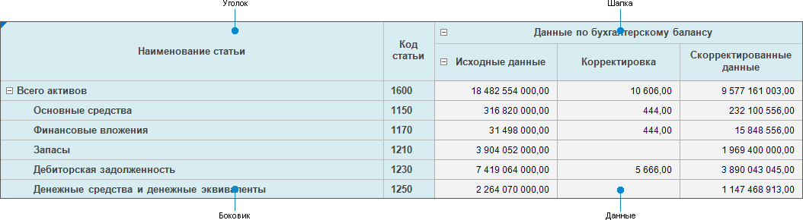

# Настройка табличной области

Настройка табличной области
-

# Настройка табличной области

Табличная область предназначена для создания табличных, реестровых и
 комбинированных форм ввода.

[Создание новой
 табличной области](javascript:TextPopup(this))

	Для создания новой табличной области нажмите кнопку  «Добавить
	 таблицу» вкладки «Конструктор»
	 ленты инструментов.

[Редактирование
 готовой табличной области](javascript:TextPopup(this))

	Для редактирования готовой табличной области:

		- выделите ячейку, принадлежащую табличной области:

			- нажмите кнопку  «Редактировать»
			 вкладки «Конструктор»
			 ленты инструментов;

			- выполните команду «Редактировать»
			 контекстного меню.

Примечание.
 Отмена настройки табличной области на каком-либо этапе приведёт к сбросу
 всех выполненных настроек. Для сохранения введенных настроек выполните
 первичную настройку табличной области.

Табличная область состоит из элементов:

Создание и редактирование выполняется с помощью диалога «Мастер
 табличной области», в котором настраиваются базовые свойства и
 структура табличной области.

Структура табличной области формы ввода строится на показателях и измерениях.

Показатели - это многомерные
 наборы данных, объединенные общими аналитическими признаками, служащие
 для сбора, хранения и отображения информации, объединенной единой тематикой.
 В качестве показателя может быть выбран любой из доступных типов кубов
 или база данных временных рядов.

Совет. Если куб,
 выбранный в качестве показателя, имеет параметризованные измерения и необходимо
 управление этими измерениями с помощью других измерений куба, то нужно
 настроить управляющие измерения в [кубе](UiNavObj.chm::/Cube/CreateCube/UiMd_Cube_CreateCube.htm).

Измерения - справочники
 репозитория, из которых состоит многомерная структура показателя.

Примечание.
 Если в качестве измерения используется [параметризованный](UiNavObj.chm::/reference_book/Master_RDS_reference_book/Parameters.htm)
 справочник со связанными атрибутами, то в табличной области учитываются
 настройки параметров в [связи](UiNavObj.chm::/reference_book/Master_RDS_reference_book/Link.htm).

Все измерения разделяются на группы:

	- Общие
	 измерения. Измерения, которые присутствуют во всех добавленных
	 в табличную область показателях;

	- Частные
	 измерения. Измерения, которые не присутствуют хотя бы в одном
	 из добавленных показателей.

С помощью измерений и показателей формируются боковик, шапка и область
 данных табличной области, настройка которых выполняется также с помощью
 диалога «Мастер табличной области».

## Настройка табличной области

Настройка табличной области состоит из этапов:

	- [Настройка базовых свойств](Basic_Properties.htm).

	- [Задание структуры табличной
	 области](Table_Area_Structure.htm).

	- [Настройка структуры боковика](Sidehead_Structure.htm).

	- [Настройка структура показателей](Factors_Structure.htm).

	- [Выбор алгоритмов расчёта](Calculation_Practices.htm).

### Первичная настройка табличной области

Если при создании табличной области нет возможности выполнить её полную
 настройку, то для сохранения уже введенных настроек выполните первичную
 настройку табличной области. Для этого:

	- Убедитесь, что:

		- для реестровой формы: добавлено хотя бы одно измерение в
		 боковик на странице «[Задание
		 структуры табличной области](Table_Area_Structure.htm)» и это же измерение на странице
		 «[Настройка
		 структуры показателей](Factors_Structure.htm)»;

		- для табличной или комбинированной формы: добавлены хотя
		 бы один показатель в шапку и одно измерение в боковик на странице
		 «[Задание
		 структуры табличной области](Table_Area_Structure.htm)» и ограничено количество выводимых
		 элементов в шапку на странице «[Настройка
		 структуры показателей](Factors_Structure.htm)»;

	- Нажмите кнопку «Готово»
	 на странице «[Настройка
	 структуры показателей](Factors_Structure.htm)» для построения табличной области на листе.

Последующая настройка табличной области проводится при её редактировании.

После завершения настройки табличной области, если требуется, перейдите
 к шагу:

	- [Настройка
	 редактора атрибута справочника](../Attribute/Attribute.htm);

	- [Настройка
	 параметров формы](../Parameters/Parameters.htm);

	- [Настройка
	 связей между элементами формы](../Parameters/Links.htm);

	- [Настройка
	 оформления формы](../Common/Design.htm).

## Настройка содержимого уголка табличной области

По умолчанию уголок табличной области не содержит заголовка. Для отображения
 заголовка используйте контекстное меню уголка:

	- Пусто. Ничего не отображается;

	- Произвольный текст.
	 Отображается введенный пользователем текст. Применяется ко всему уголку;

	- Наименование из шапки/боковика.
	 Выберите вид заголовка:

		- Измерение. Отображается
		 наименование измерения;

		- Атрибут. Отображается
		 наименование атрибута измерения;

		- Измерение.Атрибут.
		 Отображается наименование измерения и атрибута;

		- Пользовательское наименование.
		 Отображается отредактированное пользователем наименование.
		 При включении пользовательского наименования хотя бы для одной
		 строки или столбца в уголке, все ячейки уголка становятся редактируемыми.
		 Настраивается для каждого столбца/строки уголка. При переключении
		 вида заголовка на отображение наименования атрибута/измерения
		 пользовательское наименование сбрасывается.

## Добавление и удаление табличной области

Если в форму ввода требуется добавить несколько табличных областей,
 построенных на одинаковых показателях и измерениях, воспользуйтесь добавлением
 уже созданной табличной области на лист. Для этого выполните шаги:

	- Скопируйте табличную область. Для этого выделите ячейку или
	 диапазон ячеек, принадлежащий табличной области, и выполните команду
	 «Копировать таблицу» контекстного
	 меню. Копируются все заданные настройки табличной области и настройки
	 оформления.

	- Вставьте табличную область. Для этого выделите ячейку или диапазон
	 ячеек, куда требуется вставить табличную область, и выполните команду
	 «Вставить таблицу» контекстного
	 меню. Команда становится доступной, если была скопирована табличная
	 область.

Добавленная табличная область доступна для редактирования.

Для удаления табличной области выделите ячейку или диапазон ячеек, принадлежащий
 табличной области, и:

	- нажмите кнопку  «Удалить»
	 вкладки «Конструктор» ленты
	 инструментов;

	- выполните команду «Удалить»
	 контекстного меню.

См. также:

[Начало
 работы с расширением «Интерактивные формы ввода данных» в веб-приложении](../../Web/Starting/Starting.htm) |
 [Построение формы ввода](../Starting/ConstructForm.htm) |
 [Работа с готовой формой ввода](../Work/FinishForm.htm)

		Справочная
		 система на версию 10.9
		 от 18/08/2025,
		 © ООО «ФОРСАЙТ»,
