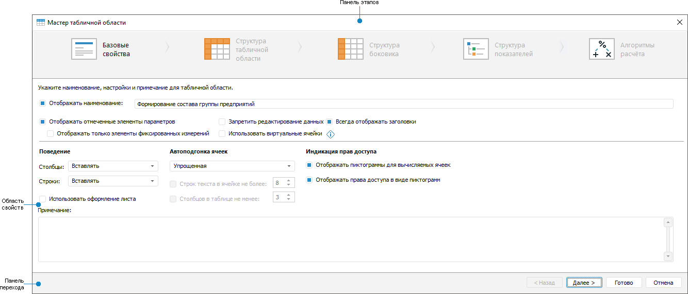
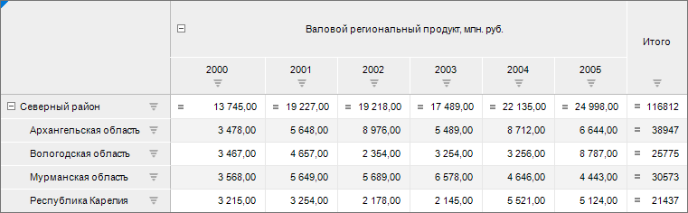
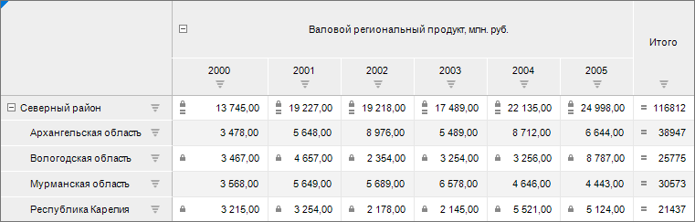

# Настройка базовых свойств

Настройка базовых свойств
-

# Настройка базовых свойств

Базовые свойства включают наименование табличной области и её настройки
 в целом.

Настройка базовых свойств табличной области выполняется на странице
 «Базовые свойства» диалога «Мастер табличной области»:

[Элементы страницы
 «Базовые свойства»](javascript:TextPopup(this))

		- Панель этапов. Содержит
		 кнопки наименования этапа для перехода к конкретному этапу настройки
		 табличной области.

		- Область свойств.
		 Содержит поля и отметки для настройки табличной области.

		- Панель переходов. Содержит кнопки для последовательного
		 перехода между этапами и завершения настройки табличной области.

Задайте параметры:

	- Наименование. Наименование
	 табличной области должно нести смысловую нагрузку, раскрывать её функциональность;

	- [Параметры
	 табличной области](Basic_Properties.htm#parameters). Настройки табличной области по отображению,
	 обновлению, поведению, подгонке и индикации ячеек;

	- Примечание. Необязательный
	 элемент. Примечание может содержать любую информацию по усмотрению
	 пользователя. Введенный текст можно увидеть только в этом окне при
	 создании/редактировании формы.

После настройки базовых свойств табличной области перейдите к этапу
 «[Задание структуры табличной области](Table_Area_Structure.htm)».

## Параметры табличной области

Для настройки табличной области задайте параметры:

	- Отображать наименование.
	 Для отображения на листе наименования формы ввода установите флажок.
	 В результате установки флажка над формой ввода будет отображено наименование
	 формы ввода, указанное в поле. По умолчанию флажок установлен;

	- Отображать отмеченные элементы
	 параметров. Для отображения на листе элементов параметров формы
	 ввода, которые связаны с измерениями табличной области через расширенные
	 фильтры, установите флажок. Убедитесь, что параметры уже созданы.
	 По умолчанию флажок установлен;

	- Отображать только элементы
	 фиксированных измерений. Для отображения на листе только параметров,
	 связанных с фиксированными измерениями, установите флажок. Список
	 параметров формируется на основе списка, сформированном при установке
	 флажка «Отображать отмеченные элементы
	 параметров». По умолчанию флажок «Отображать
	 только элементы фиксированных измерений» снят;

	- Запретить редактирование данных.
	 Для запрета редактирования данных в форме установите флажок. В результате
	 установки флажка данные табличной области будут доступны только для
	 чтения;

	- Использовать виртуальные ячейки.
	 Для ускорения работы с формой ввода установите флажок «Использовать
	 виртуальные ячейки», тогда при её открытии на редактирование
	 данные в табличной области по умолчанию отображаться не будут. Для
	 отображения данных включите автоматическое обновление данных в форме,
	 выполнив команду «Сервис >
	 Настройки» и установив флажок «[Обновлять при открытии
	 на редактирование](../Starting/Starting.htm#main_parameters)» или выполните [обновление
	 вручную](../Common/Refresh.htm).

Примечание.
 Настройка устанавливается для каждой табличной области отдельно.

	- Всегда отображать заголовки.
	 Для отображения на листе боковика при отсутствии отметки по измерениям
	 шапки и шапки при отсутствии отметки по измерениям боковика установите
	 флажок «Всегда отображать заголовки».
	 По умолчанию флажок установлен. Отсутствие отметки возможно при привязке
	 измерения боковика или шапки к параметру:

	- Поведение.
	 При добавлении табличной области на лист формы ввода поведение столбцов
	 и строк на листе может различным. Выберите поведение в раскрывающемся
	 списке «Столбцы» или «Строки»:

		- Вставлять. Добавление
		 табличной области на лист будет осуществляться с увеличением строк
		 или столбцов на листе со смещением. Количество строк или столбцов
		 при смещении будет равно количеству строк или столбцов добавляемой
		 табличной области. Например, информация, расположенная в строках
		 ниже, будет смещена вниз, а информация, расположенная в столбцах
		 справа, будет смещена вправо;

		- Захват смежных строк.
		 Добавление табличной области на лист будет осуществляться в строки
		 или столбцы табличного листа без смещения строк или столбцов на
		 листе. Положение информации на листе формы ввода не изменится.
		 Если форма ввода будет подключена к бизнес-процессу и в рамках
		 этого процесса будет изменяться количество элементов измерения,
		 то выберите поведение при добавлении табличной области «Захват смежных строк».

Для использования [оформления](../Starting/Sheets.htm#cells), применённого на
 табличном листе, установите флажок «Использовать
 оформление листа». Используйте флажок «Использовать
 оформление листа» только если табличная область не будет динамически
 перестраиваться, при этом меняя свой размер;

Примечание.
 [Запрет ввода данных](Heading/Advanced_Structure_Settings.htm#ban),
 устанавливаемый на этапе «[Структура
 показателей](Factors_Structure.htm)», будет недоступен при установленном флажке
 «Использовать оформление листа»;

	- [Автоподгонка
	 ячеек](UiAnalyticalArea.chm::/TableView/Autofit_cells.htm). Для оптимального подбора размера
	 ячеек выберите один режим из раскрывающегося списка:

		- Нет. Автоподбор
		 отсутствует;

		- Сначала по ширине, затем
		 по высоте. Сначала выполняется автоподбор размера столбцов,
		 затем строк;

		- Сначала по высоте, затем
		 по ширине. Сначала выполняется автоподбор размера строк,
		 затем столбцов;

		- Только по ширине.
		 Ширина столбца устанавливается минимально требуемой для отображения
		 текста самой длинной ячейки в столбце таблицы;

		- Только по высоте.
		 Устанавливается минимальная требуемая высота для отображения текста
		 самой высокой ячейки в строке таблицы;

		- Автоматически. Автоподбор
		 выполняется автоматически согласно установленным параметрам:

			- Строк текста в ячейке
			 не более. При установленном флажке ширина столбца подбирается
			 таким образом, чтобы для отображения текста самой длинной
			 строки в столбце ячейки требовалось не более N строк, указанных
			 в соответствующем редакторе чисел;

			- Столбцов в таблице
			 не менее. При установленном флажке в табличной области
			 всегда будет отображаться минимум N столбцов, указанных в
			 соответствующем редакторе чисел;

		- Упрощенная. Данный
		 режим установлен по умолчанию. Одновременная автоподгонка ширины,
		 высоты и видимых данных. Автоподгонка применяется для 25 строк/столбцов
		 из начала, середины и конца табличной области. Например, при выборе
		 50 столбцов автоподгонка применится ко всему выбранному диапазону
		 элементов - 25 столбцов из начала, 25 столбцов из конца табличной
		 области. При выборе 52 столбцов автоподгонка не применится к середине;

Примечание.
 Для [повышения
 производительности](setup.chm::/01_SysReq/Performance_Recommendations.htm) продукта «Форсайт. Аналитическая платформа»
 не рекомендуется использовать автоподгонку ячеек. Можно задать высоту
 ячейки вручную с помощью свойства [ITabSheet.DefaultHeight](TabSheet.chm::/Interface/ITabSheet/ITabSheet.DefaultHeight.htm),
 ширину ячейки - [ITabSheet.DefaultWidth](TabSheet.chm::/Interface/ITabSheet/ITabSheet.DefaultWidth.htm).
 Размер ячеек будет использоваться по умолчанию при создании новых строк
 и столбцов.

	- Индикация
	 прав доступа. Для отображения пиктограмм для ячеек, которые
	 нельзя [редактировать](UiAnalyticalArea.chm::/Working_with_table_data/Edit_and_save_data.htm),
	 установите флажки:

		- Отображать пиктограммы
		 вычисляемых ячеек. При установке данного флажка в ячейках
		 с [агрегированными
		 элементами](UiNavObj.chm::/Cube/Agregation.htm),
		 [вычисляемыми
		 элементами](UiAnalyticalArea.chm::/Work_with_dimensions/Edited_elements.htm), [вычисляемыми
		 показателями](Heading/Adding_Calculated_Indicators.htm), элементами, рассчитанными с помощью [подключенного
		 алгоритма расчёта](Calculation_Practices.htm), появится пиктограмма .

Если элементы рассчитаны с помощью подключенного
 алгоритма расчёта, то пиктограмма 
 не отображается при выполнении следующих условий:

			- В [блоке
			 расчёта](calculationalgorithm.chm::/Web/Calculation_block/Calculation_unit.htm) задан куб для [фильтрации
			 по данным](calculationalgorithm.chm::/Web/Calculation_block/FilteringByData.htm).

			- В таблице, поля которой связаны с [измерением
			 куба](UiNavObj.chm::/Cube/CreateCube/Master_Standart/UiMd_Cube_CreateCube_Master_Standart_3.htm), содержатся пустые значения.

При использовании алгоритма расчёта с фильтрацией
 данных пиктограмма  отображается, если в рассчитываемой
 ячейке имеются данные для расчёта.

		- Отображать права доступа
		 в виде пиктограмм. При установке данного флажка в ячейках
		 с отсутствием [прав
		 доступа](Admin.chm::/03_Admin/Admin_AdminObjects.htm)
		 на изменение появится пиктограмма .

По умолчанию флажки установлены.

[Пример
 использования индикации прав доступа](javascript:TextPopup(this))

	Для примера настройки индикации прав
	 доступа используем табличную область:

	

	Для элемента «Северный
	 район» настроена [агрегация
	 в источнике данных](UiNavObj.chm::/Cube/CreateCube/Master_Standart/UiMd_Cube_CreateCube_Master_Standart_7.htm), последний столбец «Итоги»
	 является вычисляемым показателем. В ячейках этих элементов выведена
	 пиктограмма .

	Настроим [права доступа
	 на элементы справочника НСИ](Admin.chm::/03_Admin/Admin_ElementAccess.htm), который является измерением
	 для боковика табличной области. Установим ограничения на изменение
	 для Северного района, Вологодской области и Республики Карелия:

	

	Так как в табличной области располагаются
	 ячейки, на которые у пользователя нет прав, а также ячейки вычисляемых
	 элементов, то в таблице будут отображены сразу все пиктограммы. Для
	 ячеек Северного района одновременно выведены обе пиктограммы.

См. также:

[Начало
 работы с расширением «Интерактивные формы ввода данных» в веб-приложении](../../Web/Starting/Starting.htm) |
 [Построение формы ввода](../Starting/ConstructForm.htm) |
 [Вставка и настройка табличной области](AreaTable.htm) |
 [Работа с готовой формой ввода](../Work/FinishForm.htm)

		Справочная
		 система на версию 10.9
		 от 18/08/2025,
		 © ООО «ФОРСАЙТ»,
