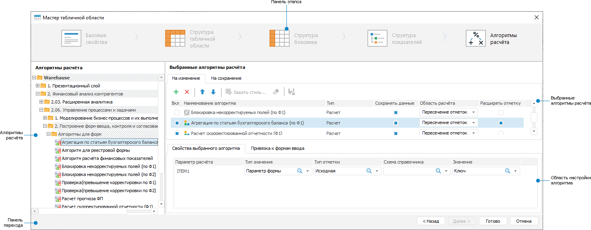
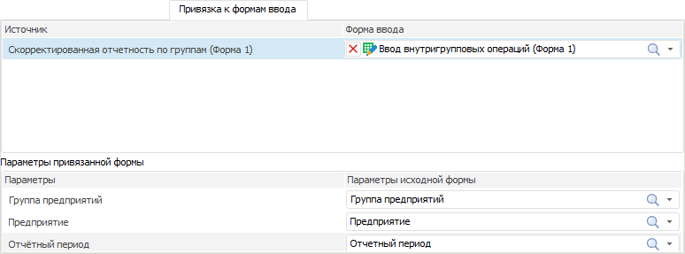
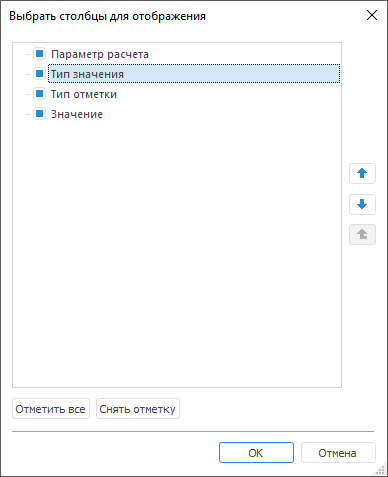

# Выбор алгоритмов расчёта

Выбор алгоритмов расчёта
-

# Выбор алгоритмов расчёта

	Для расчёта и контроля данных табличной области используйте созданные
	 [алгоритмы
	 расчёта](CalculationAlgorithm.chm::/Purpose.htm).

	Примечание.
	 Выбор алгоритма расчёта доступен только при наличии установленного
	 расширения «[Алгоритмы расчёта](CalculationAlgorithm.chm::/Purpose.htm)».

	Для выбора алгоритмов расчёта используйте страницу «Алгоритмы
	 расчёта» диалога «Мастер табличной
	 области»:

	

	[Элементы
	 страницы «Алгоритмы расчёта»](javascript:TextPopup(this))

			- Панель этапов.
			 Содержит кнопки наименования этапа для перехода к конкретному
			 этапу настройки табличной области.

			- Алгоритмы расчёта.
			 Представляет собой отфильтрованное дерево объектов репозитория,
			 в котором отображаются алгоритмы расчёта и папки, в которых
			 присутствуют [алгоритмы
			 расчёта](CalculationAlgorithm.chm::/desktop/Work/Construction_of_the_calculation_algorithm.htm).

			- Выбранные алгоритмы
			 расчёта. Содержит вкладки «На
			 изменение» и «На сохранение»,
			 отображающие списки добавленных алгоритмов с доступными настройками
			 на панели инструментов.

			- Область настройки алгоритмов.
			 Состоит из вкладок «Свойства
			 выбранного алгоритма», для настройки связи параметров
			 алгоритма и формы ввода, и «Привязка
			 к формам ввода», для детализации формул, используемых
			 в алгоритме расчёта.

			- Панель переходов.
			 Содержит кнопки для последовательного перехода между этапами
			 и завершения настройки табличной области.

	Для определения алгоритма расчёта:

		- [Добавьте](#addalgorithm) готовый алгоритм расчёта.

		- Настройте свойства выбранного алгоритма:

			- задайте [общие
			 настройки алгоритма](Calculation_Practices.htm#common);

			- настройте [связи
			 параметров алгоритма и формы](Calculation_Practices.htm#parameters);

			- [привяжите формы
			 ввода к алгоритму](Calculation_Practices.htm#bind) для детализации формул, используемых
			 в алгоритме расчёта.

	Совет.
	 Для настройки выводимых столбцов в таблицах на вкладках «Свойства
	 выбранного алгоритма» и «Привязка
	 к формам ввода» смотрите подраздел «[Настройка
	 таблицы вкладки](Calculation_Practices.htm#settings)» данной статьи.

	После выбора алгоритмов расчёта завершите создание табличной области,
	 нажав кнопку «Готово».

	Примечание.
	 Если при выполнении алгоритма расчёта возникнут какие-либо ошибки,
	 то расчёт алгоритма будет остановлен. Изменённые данные не будут сохранены
	 в приёмники данных.

	При работе с готовой формой ввода [формула](../Work/formula_description.htm),
	 по которой рассчитывается значение ячейки, будет отображена в [строке
	 формул](../Starting/Starting.htm#elements).

	Совет. Для ускорения
	 расчёта выбранных алгоритмов обратитесь к разделу «[Как
	 ускорить расчёт алгоритма?](CalculationAlgorithm.chm::/FAQ/Acceleration_of_Algorithm_Calculation.htm)».

	После завершения настройки табличной области, если требуется, перейдите
	 к шагу:

		- [Настройка
		 редактора атрибута справочника](../Attribute/Attribute.htm);

		- [Настройка
		 параметров формы](../Parameters/Parameters.htm);

		- [Настройка
		 связей между элементами формы](../Parameters/Links.htm);

		- [Настройка
		 оформления формы](../Common/Design.htm).

## Добавление, перемещение и удаление алгоритма
	 расчёта

	Выделите готовый алгоритм расчёта в области «Алгоритмы
	 расчёта» и переместите в область «Выбранные
	 алгоритмы расчёта» с помощью кнопки  «Добавить» на панели инструментов
	 или с помощью механизма Drag&Drop.

	В зависимости от варианта выполнения расчёта переместите алгоритм
	 на вкладку:

		- На изменение. Алгоритмы,
		 добавленные на эту вкладку, будут выполнены непосредственно при
		 изменении данных в форме ввода. Расчёт производится в ячейках,
		 использующих в формулах изменённые данные. Значения в ячейках,
		 рассчитанные при помощи подключенного алгоритма расчета, отображаются
		 как изменённые данные;

	Примечание.
	 Для запуска перерасчёта данных установите флажок «[Объединять
	 запросы при вычислении](../Starting/Starting.htm#multiexecutor)» на вкладке «Общие»
	 диалога «Параметры». Перерасчёт
	 происходит, если изменяемые данные являются входными данными для другой
	 табличной области, значения которой рассчитываются с помощью алгоритма,
	 выполняемого при изменении. Если флажок снят, то перерасчёт данных
	 выполняется только в одной табличной области на текущем листе формы
	 ввода. В других табличных областях перерасчёт не выполняется.

		- На сохранение. Алгоритмы,
		 добавленные на эту вкладку, будут выполнены только при сохранении
		 данных в форме ввода, при изменении данных расчёт не производится.
		 Расчёт производится в источниках по всем данным.

	Для настройки очередности выполнения алгоритмов расчёта используйте
	 кнопки  «Переместить вверх» и  «Переместить
	 вниз» на панели инструментов вкладки.

	Для удаления выбранного алгоритма расчёта:

		- нажмите кнопку  «Удалить» на панели инструментов
		 вкладки;

		- выполните команду «Удалить»
		 контекстного меню.

## Настройка свойств выбранного алгоритма
	 расчёта

	Для настройки свойств выбранного алгоритма расчёта выделите его
	 в области «Выбранные алгоритмы расчёта».
	 В зависимости от типа алгоритма будут доступны различные настройки.
	 Тип алгоритма определяется автоматически. В таблице области «Выбранные алгоритмы расчёта» в столбце
	 «Тип» указан тип алгоритма
	 расчёта:

		- Расчет. Алгоритм
		 содержит только блоки расчёта. Можно добавить на вкладки «На изменение» и «На
		 сохранение»;

		- Контроль. Алгоритм
		 содержит только блоки контроля. Можно добавить только на вкладку
		 «На изменение»;

		- Расчет/Контроль.
		 Алгоритм содержит как расчетные блоки, так и блоки контроля. Можно
		 добавить на вкладки «На изменение»
		 и «На сохранение».

### Общие настройки алгоритма расчёта

	Выполните общие настройки алгоритма расчёта в области «Выбранные
	 алгоритмы расчёта»:

		- при необходимости снимите флажок напротив алгоритма в столбце
		 «Вкл» для проведения отладки
		 работы алгоритмов расчёта в форме ввода. По умолчанию флажки установлены
		 у всех алгоритмов;

		- настройте [шрифт](UiNav.chm::/GUI/Format/UiReport_Table_Attribute_Type.htm),
		 [заливку](UiNav.chm::/GUI/Format/UiReport_Table_Attribute_View.htm)
		 и [прочее](UiNav.chm::/GUI/Format/UiReport_Table_Attribute_Others.htm)
		 для оформления ячеек, в которых сработал контроль. Для этого вызовите
		 диалог «Форматирование»,
		 нажав кнопку  «Задать
		 стиль». Например, если данные не прошли контроль, то ячейки
		 с ними будут подкрашены цветом, отличным от цвета, используемого
		 для оформления табличной области. Если настройки оформления были
		 заданы и в алгоритме расчёта, и в форме ввода, то они будут применяться
		 совместно. Если были заданы одни и те же настройки, то будут применяться
		 настройки, заданные в форме ввода. Доступно при типе расчёта «Контроль» на вкладке «На изменение»;

		- настройте блокировку сохранения изменённых
		 данных в табличной области при сработавшем контроле. Для этого
		 нажмите кнопку  «Блокировать
		 сохранение измененных данных в табличной области при сработавшем
		 контроле». При [сохранении
		 изменённых данных](../Work/DataEnter.htm#save), если хотя бы для одной табличной области
		 сработал контроль, будет выведено информационное сообщение, что
		 требуется корректировка введённых данных. При выполнении действий,
		 приводящих к обновлению табличной области: [сохранение](../Starting/ConstructForm.htm#save),
		 [создание копии](../Common/Save.htm), [обновление](../Common/Refresh.htm),
		 [смена значений параметров](../Work/UseControls.htm),
		 закрытие, [ввод при
		 согласовании](../Work/Agreement.htm#enter_data) формы ввода; [транспонирование](../Work/Transpose.htm#transpose)
		 и [редактирование](AreaTable.htm) табличной области
		 - будет выведено предупреждение, что изменённые данные не будут
		 сохранены, так как не удовлетворяют настройкам контролей. При
		 согласии продолжить действие изменённые данные будут сброшены
		 и действие выполнено. При отказе продолжить действие изменённые
		 данные останутся в табличной области. Доступно при типе расчёта
		 «Контроль» на вкладке
		 «На изменение»;

		- установите флажок напротив алгоритма
		 в столбце «Сохранять данные»
		 для сохранения данных в источник. При установке флажка данные
		 в ячейках, рассчитанные алгоритмом, сохраняются в источник при
		 [сохранении данных](../Work/DataEnter.htm#datasave)
		 или [сохранении формы
		 ввода](../Starting/ConstructForm.htm#save). Если данные в ячейках рассчитываются несколькими алгоритмами,
		 то сохраняются данные, рассчитанные последним алгоритмом с включённой
		 настройкой. Если флажок снят, то данные в ячейках, рассчитанные
		 алгоритмом, не сохраняются в источник, но сохраняются в самой
		 форме. Для отображения последних сохранённых данных источника
		 в ячейках, рассчитанных алгоритмом без сохранения данных, отключите
		 выполнение алгоритма или удалите его;

		- выберите из раскрывающегося списка «Область
		 расчёта» тип формирования области расчёта, который будет
		 использоваться при расчёте алгоритма:

			- пересечение отметок.
			 Для расчёта будет использовано пересечение отметки из алгоритма
			 по всем измерениям с отметкой в табличной области. Выбрано
			 по умолчанию;

			- период расчёта из алгоритма.
			 Для расчёта будет использовано пересечение отметки из алгоритма
			 по всем измерениям, кроме календарного, с отметкой в табличной
			 области;

			- вся отметка из алгоритма.
			 Для расчёта будет использована вся отметка из алгоритма без
			 учёта отметки в табличной области;

		- установите флажок напротив алгоритма
		 в столбце «Расширять отметку»
		 для увеличения диапазона загружаемых данных, на основании отметки,
		 указанной в алгоритме. Доступно на вкладке «На
		 изменение». При установке флажка в расчёте будут учитываться
		 все значения, указанные при настройке алгоритма, а не только выводимые
		 в табличной области.

	Примечание.
	 Расширение отметки не применяется, если для расчёта используется куб
	 с настроенным [управлением
	 измерениями](UiNavObj.chm::/Cube/CreateCube/Master_Standart/UiMd_Cube_CreateCube_Master_Standart_managed_dim.htm).

### Настройка связи параметров алгоритма расчёта
	 и формы ввода

	Выполните настройку связи [параметров
	 алгоритма расчёта](CalculationAlgorithm.chm::/Desktop/Work/Set_up_calculation_parameters.htm) и [параметров
	 формы ввода](../Parameters/Parameters.htm) на вкладке «Свойства
	 выбранного алгоритма», установив:

		- Тип значения. Укажите
		 значения, которые используются при расчёте алгоритма:

			- Параметр формы.
			 В расчёте используется значение [параметра](../Parameters/Parameters.htm)
			 формы ввода;

			- Константное значение. В расчёте используется постоянное
			 значение;

		- Тип отметки. В зависимости
		 от выбранного типа значения:

			- если установлен тип «Параметр
			 формы», укажите тип отметки, выбрав его из раскрывающегося
			 списка. Допустимые значения: исходная, первый элемент, последний
			 элемент, исходная+дочерние, исходная+дочерние (рекурсивно),
			 дочерние, дочерние (рекурсивно);

			- если установлен тип «Константное
			 значение», тип отметки недоступен;

		- Схема справочника.
		 Выберите из раскрывающегося списка [схему
		 отметки](UiNavObj.chm::/reference_book/look-and-feel_Reference_book/UiMd_reference_book_look-and-feel_Scheme.htm) справочника, используемого в качестве
		 параметра алгоритма. Если у справочника не настроена схема отметки,
		 то список будет пустой;

	Примечание.
	 Схема отметки справочника имеет больший приоритет, чем тип отметки.

		- Значение. В зависимости
		 от выбранного типа значения:

			- если установлен тип «Параметр
			 формы», укажите параметр или атрибут параметра формы,
			 выбрав его из раскрывающегося списка;

			- если установлен тип «Константное
			 значение», задайте значение константы.

	Примечание.
	 Для настройки связей доступны только параметры алгоритма типа «Отметка» и «Иерархия».

	Если алгоритм расчёта и форма ввода построены на одном источнике,
	 то параметры алгоритма автоматически будут привязаны к параметрам
	 формы ввода. По умолчанию:

		- Тип значения: Параметр формы;

		- Тип отметки: Исходная;

		- Схема справочника: не задана;

		- Значение: параметр, построенный на этом же справочнике.

### Настройка привязки форм ввода к алгоритму

	Привяжите формы ввода к алгоритму для детализации формул, используемых
	 в алгоритме расчёта, используя вкладку «Привязка
	 к формам ввода»:

	

	Примечание.
	 Вкладка «Привязка к формам ввода»
	 не активна для алгоритма типа «Контроль».
	 Если алгоритм расчёта типа «Расчёт/Контроль»,
	 то на вкладке будут отображаться только приёмники блоков расчёта и
	 блоков агрегации.

	Для этого укажите:

		- Источник. В списке
		 выведены объекты, которые являются [приёмниками](CalculationAlgorithm.chm::/desktop/Calculation_block/Master_calculation_block_page_consumer.htm)
		 в алгоритме расчёта;

		- Форма ввода. Выберите
		 привязываемую форму в раскрывающемся списке или нажмите кнопку  «Поиск» и введите название. Список
		 представляет собой отфильтрованное дерево объектов репозитория,
		 в котором указаны формы ввода и папки, содержащие формы ввода.
		 Для отмены привязки формы нажмите кнопку  «Очистить»;

	Примечание.
	 Убедитесь, что для привязываемой многолистовой формы установлен флажок
	 «[Загрузка
	 только активного листа](../Starting/Starting.htm#multiexecutor)» для ускорения открытия формы.

		- Параметры привязанной формы.
		 В списке выведены параметры формы, выделенной в поле «Форма
		 ввода»;

		- Параметры исходной формы.
		 Список содержит параметры исходной формы. Укажите для параметров
		 привязанной формы параметры исходной формы, значения которых будут
		 передаваться в параметры привязанной формы. Все параметры привязывать
		 необязательно. Выберите параметр в раскрывающемся списке или нажмите
		 кнопку  «Поиск»
		 и введите название.

	Привязанная форма будет открываться при [просмотре
	 описания формулы](../Work/formula_description.htm). Если не во все параметры привязанной
	 формы настроена передача параметров исходной формы, то при открытии
	 привязанной формы появится диалог для ввода значений параметров.

###

## Редактирование ранее настроенных форм

	При редактировании форм ввода, созданных в более ранних версиях
	 продукта «Форсайт. Аналитическая платформа»,
	 алгоритмы расчёта, добавленные для контроля вводимых данных, будут
	 отключены. При открытии такой формы ввода на редактирование будет
	 выводиться сообщение об отключении расчётов типа «Контроль»
	 и необходимости внесения изменений в самом алгоритме или изменения
	 настройки подключения алгоритмов в форме ввода.

## Настройка таблицы вкладки

	Количество отображаемых столбцов и их порядок расположения в таблице
	 можно настроить:

		- для изменения одного столбца установите/уберите флажок напротив
		 наименования столбца в контекстном меню таблицы, порядок расположения
		 останется прежним;

		- для изменения нескольких столбцов и изменения порядка следования
		 откройте диалог «Выбрать столбцы
		 для отображения», выполнив команду «Выбрать
		 столбцы» контекстного меню таблицы:

	

	Для изменения количества отображаемых
	 столбцов:

			- установите/уберите флажок напротив наименования столбца;

			- отметьте все столбцы, нажав кнопку «Отметить
			 все»;

			- снимите отметку со всех столбцов, нажав кнопку «Снять отметку».

	Для изменения порядка следования столбцов
	 используйте кнопки  «Переместить
	 вверх» и  «Переместить
	 вниз», выделив столбец.

См. также:

[Начало
 работы с расширением «Интерактивные формы ввода данных» в веб-приложении](../../Web/Starting/Starting.htm) |
 [Построение формы ввода](../Starting/ConstructForm.htm) |
 [Работа с готовой формой ввода](../Work/FinishForm.htm)

		Справочная
		 система на версию 10.9
		 от 18/08/2025,
		 © ООО «ФОРСАЙТ»,
