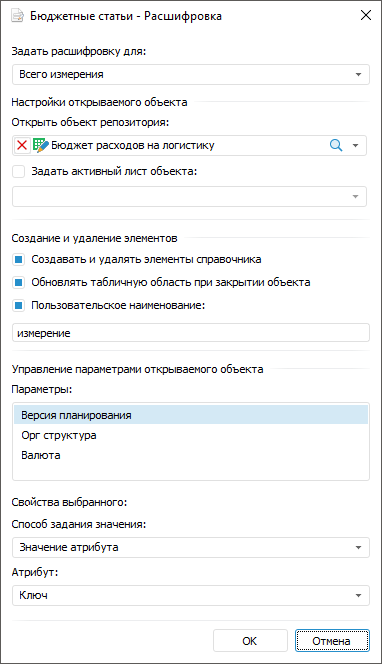

# Расшифровка измерений и уровней измерений

Расшифровка измерений и уровней измерений
-

# Расшифровка измерений и уровней измерений

Для настройки перехода от элемента измерения к объекту, детализирующему
 его значение, используйте команду «Расшифровка»
 в контекстном меню измерения. Например, при щелчке по элементу измерения,
 как по гиперссылке, в реестровой форме ввода может осуществляться переход
 в другую форму ввода в виде карточки, в которой детализирована информация
 по выбранному элементу.

Примечание.
 Убедитесь, что для многолистовых форм ввода, используемых для расшифровки,
 установлен флажок «[Загрузка
 только активного листа](../Starting/Starting.htm#multiexecutor)» для ускорения открытия формы.

Задайте расшифровку измерений для:

	- Измерений боковика.
	 Для этого выполните команду «Расшифровка»
	 в контекстном меню измерения в левой области «Доступные
	 измерения» на странице «[Структура боковика](Sidehead_Structure.htm)» диалога
	 «[Настройка
	 табличной области](AreaTable.htm)»;

	- Общих измерений шапки.
	 Для этого выполните команду «Расшифровка»
	 в контекстном меню общего измерения в области «Показатели
	 формы ввода» на странице «[Структура показателей](Factors_Structure.htm)» диалога
	 «[Настройка
	 табличной области](AreaTable.htm)».

После выполнения команды «Расшифровка»
 откроется диалог:

 

Настройте свойства:

	- Задать расшифровку для.
	 Выберите измерение или [уровень](UiNavObj.chm::/reference_book/Master_RDS_reference_book/Level.htm)
	 измерения из раскрывающегося списка, для которого требуется расшифровка.
	 В списке отображаются наименования уровней измерения и значение «Всего измерения». Для всего измерения
	 или каждого уровня измерения задайте свои настройки расшифровки. Если
	 задана расшифровка для всего измерения и для отдельных уровней, то
	 для этих уровней будет использоваться настроенная расшифровка, а для
	 остальных уровней - расшифровка, заданная для измерения;

	- Открыть объект репозитория.
	 Выберите объект репозитория из раскрывающегося списка, к которому
	 будет осуществляться переход по гиперссылке. Список отображается деревом
	 со всеми объектами репозитория, которые доступны для выбора: справочники
	 НСИ, отчёты, формы ввода. Выбрать можно только один объект;

	- Задать активный лист объекта.
	 Задайте лист, который будет открываться при переходе к выбранному
	 объекту, для этого установите флажок «Задать
	 активный лист объекта» и выберите лист из раскрывающегося списка.
	 Скрытые листы не отображаются в списке. Настройка доступна для форм
	 ввода, содержащих более одного листа;

	- Создавать
	 и удалять элементы справочника. Для активации кнопок  «Создать
	 запись» и  «Удалить
	 запись» вкладки «Таблица»
	 ленты инструментов установите флажок «Создавать
	 и удалять элементы справочника». Используйте кнопки для [добавления/удаления элементов в табличной
	 области](../Work/New_entries.htm), содержащую измерения с расшифровкой. Элемент будет добавлен
	 в корень справочника. Настройка доступна при расшифровке всего измерения
	 и/или первого уровня;

Примечание.
 При добавлении/удалении элементов с помощью кнопок  «Создать
 запись» и  «Удалить
 запись» происходит автоматическое обновление табличной области.

Если для расшифровки указан справочник НСИ, то кнопки  «Создать
 запись» и  «Удалить
 запись» будут доступны после выполнения [условий](../Work/New_entries.htm#active).

	- Обновлять табличную область
	 при закрытии объекта. Для обновления табличной области после
	 закрытия объекта, в котором производилось добавление или удаление
	 элементов измерения, независимо от того, были ли изменения в объекте,
	 установите флажок «Обновлять табличную
	 область при закрытии объекта». Если флажок снят, то табличная
	 область будет обновляться только если в объекте были сохранены данные.
	 Флажок становится доступным после установки флажка «Создавать
	 и удалять элементы справочника». Настройка доступна при расшифровке
	 всего измерения и/или первого уровня.

Свойство «Обновлять
 табличную область при закрытии объекта» выполняется при нажатии
 кнопки  «Сохранить
 данные» главного меню. Если в форме ввода для сохранения измененных
 данных используется [пользовательская
 кнопка](../Custom_module/Advanced.htm), то добавьте соответствующий признак в js-функции [постобработчика](../Custom_module/Advanced.htm#postprocessor):

function cbAfterSaveData(callback,
 args)

{

args.DataEntryForm.isChangedOnServer
 = true;

callback();

}

	- Пользовательское наименование.
	 Для разъяснения создаваемого измерения с расшифровкой введите наименование,
	 установив флажок «Пользовательское
	 наименование». Команда выполняется совместно с командой «Создавать и удалять элементы справочника».
	 Если флажок снят, то наименование по умолчанию будет совпадать с наименованием
	 измерения, для которого настраивается расшифровка. Настройка доступна
	 при расшифровке всего измерения и/или первого уровня;

	- Параметры. Для настройки
	 передачи атрибутов параметров между формой ввода и объектом репозитория
	 выберите параметр из списка. Список отображается для объектов, имеющих
	 параметры. Если у выбранного объекта есть параметры, то задайте значения
	 для параметров выбранного объекта:

		- Способ задания значения.
		 Выберите один из вариантов задания значения: значение атрибута,
		 параметр формы, вручную и не передавать.
		 По умолчанию выбран способ «Значение
		 атрибута»;

		- Выбор значения.
		 Выберите значение, которое будет передаваться в параметр объекта
		 при открытии формы или создании записи. В зависимости от выбранного
		 способа задания значения возможны:

			- Атрибут. При
			 выборе способа задания «Значение
			 атрибута» в раскрывающемся списке «Атрибут»
			 становятся доступными все атрибуты измерения;

			- Параметр. При
			 выборе способа задания «Параметр
			 формы» в раскрывающемся списке «Параметр»
			 становятся доступными все параметры формы ввода;

			- Значение. При
			 выборе способа задания «Вручную»
			 появляется поле ввода «Значение»,
			 в котором можно вручную отметить один элемент измерения;

При выборе способа задания «Не
 передавать» значения передаваться не будут.

Примечание.
 Для выполнения расшифровки измерений задайте значения для всех параметров
 объекта репозитория, иначе кнопка «ОК»
 будет неактивна.

При открытии объекта репозитория или создании записи в объект будут
 передаваться заданные значения параметра. При открытии объекта с
 параметрами, для которых были не заданы значения, укажите значения в открывшемся
 окне.

См. также:

[Начало
 работы с расширением «Интерактивные формы ввода данных» в веб-приложении](../../Web/Starting/Starting.htm) |
 [Построение формы ввода](../Starting/ConstructForm.htm) |
 [Работа с готовой формой ввода](../Work/FinishForm.htm)

		Справочная
		 система на версию 10.9
		 от 18/08/2025,
		 © ООО «ФОРСАЙТ»,
