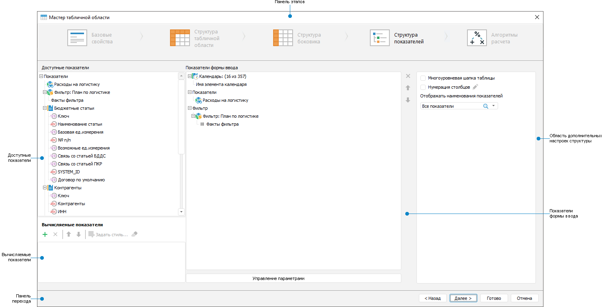

# Настройка структуры показателей

Настройка структуры показателей
-

# Настройка структуры показателей

Структура показателей включает элементы, которые должны выводиться в
 шапке табличной области.

Для настройки структуры показателей табличной области используйте страницу
 «Структура показателей» диалога
 «Мастер табличной области»:

[Элементы страницы
 «Структура показателей»](javascript:TextPopup(this))

		- Панель этапов. Содержит
		 кнопки наименования этапа для перехода к конкретному этапу настройки
		 табличной области.

		- Доступные показатели.
		 Содержит список показателей с их измерениями и общие измерения
		 боковика с атрибутами.

		- Вычисляемые показатели.
		 Содержит список добавленных вычисляемых показателей.

		- Показатели формы ввода.
		 Содержит список показателей с их измерениями и общие измерения
		 боковика с атрибутами, которые будут выводиться в шапке.

		- Область дополнительных
		 настроек структуры. Содержит дополнительные настройки структуры
		 шапки.

		- Панель перехода. Содержит кнопки для последовательного
		 перехода между этапами и завершения настройки табличной области.

Примечание.
 Если было применено [транспонирование](Table_Area_Structure.htm#transpose),
 то в области дополнительных настроек структуры флажок будет называться
 «Нумерация строк», остальные настройки
 не меняются.

Для настройки структуры показателей:

	- [Выберите](Heading/Selecting_Elements.htm) элементы
	 в общих измерениях и измерениях показателей шапки.

	- [Выберите](Heading/Displaying_Dimension_Attribute.htm)
	 атрибут измерения, который будет выведен в шапку.

	- [Добавьте](Heading/Adding_Calculated_Indicators.htm)
	 вычисляемые показатели.

	- [Используйте](Heading/Advanced_Structure_Settings.htm)
	 дополнительные настройки структуры показателей.

	- [Используйте](Heading/Advanced_Heading_Settings.htm)
	 дополнительные настройки отображения шапки.

	- [Настройте](parameter_management.htm) управление
	 параметрами, если используются параметрические объекты.

После настройки структуры шапки табличной области перейдите к этапу
 «[Выбор алгоритмов расчёта](Calculation_Practices.htm)» или
 завершите создание табличной области, нажав кнопку «Готово».

См. также:

[Начало
 работы с расширением «Интерактивные формы ввода данных» в веб-приложении](../../Web/Starting/Starting.htm) |
 [Построение формы ввода](../Starting/ConstructForm.htm) |
 [Настройка табличной области](AreaTable.htm) | [Работа
 с готовой формой ввода](../Work/FinishForm.htm)

		Справочная
		 система на версию 10.9
		 от 18/08/2025,
		 © ООО «ФОРСАЙТ»,
