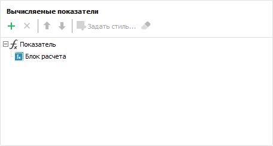
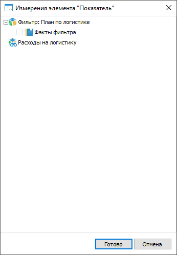
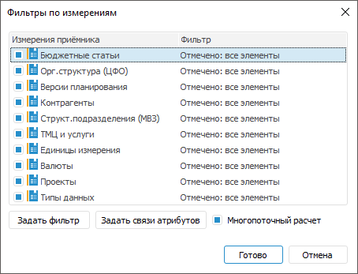
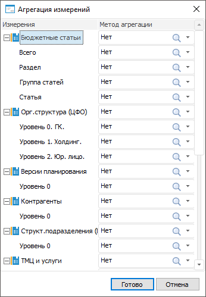

# Добавление вычисляемых показателей

Добавление вычисляемых показателей
-

# Добавление вычисляемых показателей

	При [настройке структуры показателей](../Factors_Structure.htm)
	 в мастере табличной области формы ввода добавьте вычисляемые показатели
	 для расчёта и контроля данных с помощью формул значений, полученных
	 на исходных элементах справочника.

	Примечание.
	 Работа с вычисляемыми показателями доступна только при наличии установленного
	 расширения «[Алгоритмы расчёта](CalculationAlgorithm.chm::/Purpose.htm)».

	Вычисляемый показатель представляет собой показатель, в который
	 входят все измерения боковика и общие измерения шапки.

	Примечание.
	 При создании формул для вычисляемых показателей можно использовать
	 ранее добавленные показатели.

	Для добавления вычисляемого показателя нажмите кнопку  «Добавить»
	 на панели «[Вычисляемые
	 показатели](../Factors_Structure.htm)». После выполнения действия будет добавлен показатель,
	 содержащий блок расчёта:

	

	По умолчанию новые показатели добавляются в конец списка с названием
	 «Показатель».

	[Дублирование
	 показателя](javascript:TextPopup(this))

		Для добавления копии показателя выполните команду «Дублировать»
		 в контекстном меню показателя. После выполнения действия сдублированный
		 показатель добавится в конец списка.

	[Переименование
	 показателя](javascript:TextPopup(this))

		Для переименования показателя выполните команду «Переименовать»
		 в контекстном меню показателя или щёлкните по наименованию выделенного
		 показателя на панели. Наименование должно отражать сущность вычислений
		 проводимых с помощью созданного показателя.

	[Изменение
	 порядка расчёта показателей](javascript:TextPopup(this))

		Для изменения порядка расчёта показателей используйте кнопки  «Переместить вверх» и  «Переместить
		 вниз». Если вычисляемый показатель рассчитывается на основе
		 другого вычисляемого показателя, то необходимо расположить зависимый
		 вычисляемый показатель ниже того, от которого он зависит.

	[Удаление
	 показателя](javascript:TextPopup(this))

		Для удаления выбранного показателя выполните одно из действий:

			- нажмите кнопку  «Удалить» на панели «Вычисляемые показатели»;

			- выполните команду «Удалить»
			 в контекстном меню показателя.

		После выполнения действия выбранный показатель будет удалён.

	Для отображения вычисляемых показателей в шапке переместите их с
	 помощью механизма Drag&Drop в область «Показатели
	 формы ввода» в любое место списка. Вычисляемый показатель добавляется
	 в табличную область с форматом числа «Общий». Для [изменения
	 формата числа](../../Common/Design.htm#number) используйте раскрывающийся список в группе «Число» вкладки «Формат»
	 ленты инструментов.

	При изменении данных в ячейках, участвующих в расчёте вычисляемого
	 показателя, значение этого показателя пересчитается.

## Настройка вычисляемых показателей

	Для настройки вычисляемых показателей:

		- [Добавьте
		 частные измерения показателей](Adding_Calculated_Indicators.htm#private_indicators).

		- [Настройте
		 фильтрацию по измерениям](Adding_Calculated_Indicators.htm#filter).

		- [Настройте
		 блок расчёта](Adding_Calculated_Indicators.htm#calculation).

		- [Добавьте
		 блоки контроля при необходимости](Adding_Calculated_Indicators.htm#control).

		- [Задайте
		 агрегацию для уровней измерений](Adding_Calculated_Indicators.htm#aggregation).

### Добавление частных измерений показателей

	Для добавления частных измерений показателей, значения которых будут
	 использоваться в вычислениях, выполните команду «Выбор
	 измерений» контекстного меню показателя. Будет открыто окно
	 для выбора частных измерений показателей:

	

	В окне отображаются все показатели формы с их частными измерениями.

	Установите флажок напротив измерения, которое будет использоваться
	 для расчёта. Если в нескольких показателях используется одно и тоже
	 измерение, то флажок автоматически будет установлен у данного измерения
	 во всех показателях, в которых он присутствует. Закончите выбор измерений,
	 нажав кнопку «Готово».

	Выбранные измерения отобразятся под вычисляемым показателем.

### Настройка фильтрации по измерениям

	Для ограничения элементов, по которым будет выполняться расчёт,
	 задайте фильтры по измерениям с помощью команды «Фильтры
	 по измерениям» контекстного меню показателя. Будет открыто
	 окно для настройки фильтрации измерений приёмника по элементам:

	

	По умолчанию у всех измерений вычисляемого показателя задана полная
	 отметка: формула вычисляемого показателя распространяется на все элементы
	 боковика, общие измерения шапки и частные измерения, если они были
	 добавлены. Для фиксации одного элемента измерения снимите флажок напротив
	 измерения. В открывшемся окне «Фиксация
	 отметки» выберите элемент измерения. Выбранный элемент можно
	 будет сменить при настройке формулы. Если флажок был снят с измерения,
	 то при его установке выдаётся предупреждение, что отметка для измерения,
	 заданная в формулах, будет сброшена.

	Для настройки фильтрации отмеченных измерений приёмника:

		- задайте фильтрацию измерений по
		 элементам:

			- нажмите кнопку «Задать
			 фильтр»;

			- дважды щёлкните по измерению.

	Будет открыт диалог «Настройка
	 фильтрации», в котором задайте настройки фильтрации.
	 Для получения подробной информации обратитесь к разделу «[Настройка
	 фильтрации измерения приёмника](CalculationAlgorithm.chm::/desktop/Calculation_block/Master_calculation_block_page_consumer.htm#filter)»;

		- задайте фильтрацию измерений по связям атрибутов. Нажмите
		 кнопку «Задать связи атрибутов».
		 Будет открыт диалог «Фильтрация
		 по связям атрибутов», в котором задайте настройки фильтрации.
		 Для получения подробной информации обратитесь к статье «[Настройка
		 фильтрации по связям атрибутов](UiModelling.chm::/2_Container_of_Modeling/2_3_Work_object/2_3_3_MetaModel/AttrLinksDimFilter.htm)».

	Снимите флажок «Многопоточный расчет»
	 для уменьшения нагрузки на расчёт блока расчёта, который выполняется
	 за секунду и меньше. При снятом флажке выполняется однопоточный расчёт.
	 Если расчёт выполняется в течение длительного времени, то установите
	 флажок «Многопоточный расчет»
	 для ускорения расчёта блока расчёта. Многопоточный расчёт доступен
	 на системах с многоядерными процессорами (число потоков равно числу
	 ядер процессора).

### Настройка блока расчёта

	Блок расчёта создается автоматически при добавлении показателя.
	 Для настройки формулы блока расчёта выполните команду «Редактор
	 формул» в контекстном меню блока или дважды щёлкните по блоку.
	 Будет открыт диалог «Редактор формул»,
	 в котором задайте формулу расчёта. Для использования в формулах доступны
	 все показатели, включая вычисляемые показатели табличной области.
	 При задании отметки в измерениях доступны все параметры формы ввода.
	 Если отметка измерения была зафиксирована, то в цепочке навигации
	 можно изменить элемент измерения, указанный при фиксации.
	 Для получения подробной информации обратитесь к статье «[Настройка
	 формул расчёта](CalculationAlgorithm.chm::/desktop/Calculation_block/Formula.htm)».

	Примечание.
	 Вычисляемый показатель может содержать только один блок расчёта, недоступный
	 для перемещения и удаления.

	Для переименования блока расчёта выполните команду «Переименовать»
	 в контекстном меню блока или щёлкните по наименованию выделенного
	 блока на панели.

### Добавление блоков контроля

	Для добавления блока контроля в вычисляемом показателе выполните
	 команду «Добавить блок контроля»
	 в контекстном меню показателя. Блоков контроля может быть несколько,
	 каждый из которых содержит формулу для контроля рассчитанных данных.

	[Настройка
	 стиля оформления](javascript:TextPopup(this))

		Для выделения данных в форме ввода, которые не соответствуют
		 контролю, настройте стиль оформления:

			- Выделите блок контроля.

			- Нажмите кнопку  «Задать
			 стиль» на панели «Вычисляемые
			 показатели». Будет открыт диалог «Форматирование»,
			 содержащий вкладки:

				- [Шрифт](uinav.chm::/gui/format/uireport_table_attribute_type.htm).
				 Настройки шрифта текста в ячейках: тип, размер, цвет и
				 прочее;

				- [Заливка](uinav.chm::/gui/format/uireport_table_attribute_view.htm).
				 Настройки заливки фона ячеек: тип заливки, её цвет, штриховка
				 и прочее;

				- [Прочее](uinav.chm::/gui/format/uireport_table_attribute_others.htm).
				 Настройки защиты ячейки, её печати и прочее.

			- Настройте стиль оформления и нажмите кнопку «ОК».

		После выполнения действий будет настроен стиль оформления данных
		 в форме ввода, которые не соответствуют заданному контролю.

		Для сброса заданного стиля и возврата к стилю по умолчанию выберите
		 блок контроля и нажмите кнопку  «Очистить» на панели «Вычисляемые
		 показатели». Сброс стиля выполняется для каждого блока
		 отдельно.

	[Дублирование
	 блока контроля](javascript:TextPopup(this))

		Для добавления копии блока контроля выполните команду «Дублировать» в контекстном меню
		 блока. После выполнения действия сдублированный блок контроля
		 добавится в конец списка вычисляемого показателя.

	[Изменение
	 порядка блоков контроля](javascript:TextPopup(this))

		Для изменения порядка расчёта блоков контроля используйте кнопки  «Переместить вверх» и  «Переместить
		 вниз». Блоки контроля перемещаются в рамках вычисляемого
		 показателя.

	[Удаление
	 блока контроля](javascript:TextPopup(this))

		Для удаления выбранного блока контроля выполните одно из действий:

			- нажмите кнопку  «Удалить» на панели «Вычисляемые показатели»;

			- выполните команду «Удалить»
			 в контекстном меню блока.

		После выполнения действия выбранный блок контроля будет удалён.

	Для переименования блока расчёта или блока контроля выполните команду
	 «Переименовать» в контекстном
	 меню блока или щёлкните по наименованию выделенного блока на панели.

	Для настройки формулы блока контроля выполните команду «Редактор
	 формул» в контекстном меню блока или дважды щёлкните по блоку.
	 Будет открыт диалог «Редактор формул»,
	 в котором задайте формулу контроля рассчитанных данных. Для использования
	 в формулах доступны все показатели, включая вычисляемые показатели
	 табличной области. При задании отметки в измерениях доступны все параметры
	 формы ввода. Если отметка измерения была зафиксирована, то в цепочке
	 навигации можно изменить элемент измерения, указанный при фиксации.
	 Для получения подробной информации обратитесь к статье «[Настройка
	 формул расчёта](CalculationAlgorithm.chm::/desktop/Calculation_block/Formula.htm)».

### Агрегация измерений

	Для объединения данных измерений по уровням используйте агрегацию
	 данных. Для этого выполните команду «Агрегация
	 измерений» в контекстном меню вычисляемого показателя. Будет
	 открыт диалог «Агрегация измерений»,
	 в котором задайте метод агрегации:

	

	В диалоге отображены все измерения боковика, общие измерения показателей,
	 частные измерения показателей, добавленные ранее, и их уровни.

	Задайте метод агрегации:

		- для всех уровней измерения, указав метод агрегации напротив
		 измерения. Выбранный метод отобразится у всех уровней этого измерения;

		- для каждого уровня, указав метод агрегации напротив уровня.

	В столбце «Метод агрегации»
	 из раскрывающегося списка выберите метод агрегации данных:

		- Сумма. Суммируются
		 элементы уровня;

		- Минимум. На уровне
		 выбирается минимальное значение;

		- Максимум. На уровне
		 выбирается максимальное значение;

		- Количество непустых.
		 Определяется количество непустых значений на уровне;

		- Количество пустых.
		 Определяется количество пустых значений на уровне;

		- Количество всех дочерних.
		 Определяется количество дочерних элементов на уровне;

		- Арифметическое среднее.
		 Определяется среднее значение элементов уровня с учетом пустых
		 значений;

		- Фактическое среднее.
		 Определяется среднее значение элементов уровня без учета пустых
		 значений;

		- Первое фактическое.
		 На уровне берется первое имеющееся (фактическое) значение;

		- Последнее фактическое.
		 На уровне берется последнее имеющееся (фактическое) значение;

		- Среднеквадратическое отклонение.
		 Определяется среднеквадратическое отклонение ряда по генеральной
		 совокупности;

		- Медиана. Определяется
		 медиана для значений на уровне;

		- Среднеквадратическое отклонение
		 по выборке. Определяется среднеквадратическое отклонение
		 ряда по выборке;

		- Количество различных значений.
		 Определяется количество различных значений на уровне.

См. также:

[Начало
 работы с расширением «Интерактивные формы ввода данных» в веб-приложении](../../../Web/Starting/Starting.htm) |
 [Настройка табличной области](../AreaTable.htm) | [Настройка
 структуры показателей](../Factors_Structure.htm) | [Дополнительные
 настройки структуры показателей](Advanced_Structure_Settings.htm) | [Как
 выполнять многопоточный расчёт?](CalculationAlgorithm.chm::/FAQ/MultiThreadedCalculation.htm)

		Справочная
		 система на версию 10.9
		 от 18/08/2025,
		 © ООО «ФОРСАЙТ»,
