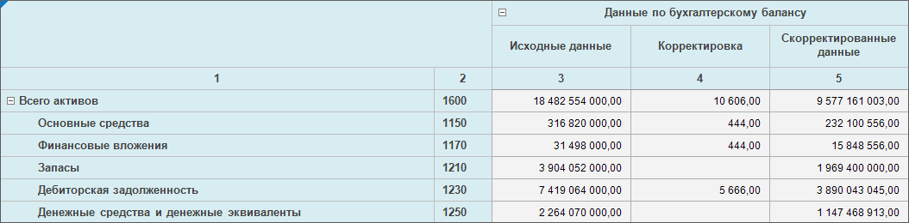
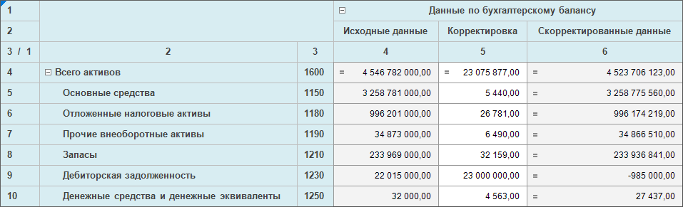

# Дополнительные настройки отображения шапки

Дополнительные настройки отображения шапки
-

# Дополнительные настройки отображения
 шапки

При [настройке структуры показателей](../Factors_Structure.htm)
 в мастере табличной области формы ввода можно дополнительно настроить
 отображение шапки:

	- [настройте](Advanced_Heading_Settings.htm#layeredheader)
	 многоуровневость шапки;

	- [настройте](Advanced_Heading_Settings.htm#numbering)
	 нумерацию столбцов;

	- [настройте](Advanced_Heading_Settings.htm#indictorname)
	 отображение наименований показателей;

	- [настройте](Advanced_Heading_Settings.htm#elementname)
	 отображение дополнительных наименований элементов общего измерения.

## Многоуровневая шапка таблицы

Для отображения в шапке уровней измерения в отдельных строках без повторения
 родительских элементов установите флажок «Многоуровневая
 шапка таблицы». При [транспонировании](../Table_Area_Structure.htm#transpose)
 таблицы настройка применяется для измерений, располагающихся в шапке после
 транспонирования. Если до транспонирования измерения в боковике были [объединены](../Merging_Dim.htm), то при транспонировании
 настройка объединения будет сброшена. Если применить объединение для измерений
 снова, то будет сброшена настройка многоуровневой шапки.

## Нумерация столбцов

Для нумерации столбцов шапки установите флажок «Нумерация
 столбцов». По умолчанию номера столбцов отобразятся отдельной строкой
 шапки после заголовков, начиная от уголка. Для настройки нумерации нажмите
 кнопку  «Редактировать», откроется окно «[Нумерация](../Numbering.htm)».
 Настройка доступна при установленном флажке «Нумерация
 столбцов».

Примечание.
 Нумерацию по столбцам можно настроить после создания табличной области.
 Для этого выделите ячейку или диапазон ячеек табличной области и выполните
 команду «По столбцам» раскрывающегося
 меню кнопки  «Нумерация»
 вкладки «Таблица» ленты инструментов.
 Для дополнительной настройки нумерации выполните команду «Настроить»
 раскрывающегося меню кнопки  «Нумерация» вкладки «Таблица»
 ленты инструментов, откроется окно «[Нумерация](../Numbering.htm)».

Отобразить или скрыть нумерацию можно при [работе
 с готовой формой](../../Work/Transpose.htm#numbering).

[Пример использования
 нумерации столбцов](javascript:TextPopup(this))

	Исходная таблица с нумерацией столбцов:

	

	Нумерация столбцов началась с первого
	 столбца боковика.

	Для этой таблицы установим нумерацию
	 по строкам:

	

	Нумерация столбцов также началась с первого
	 столбца боковика.

## Отображение наименований показателей

Выполните настройку отображения наименований показателей в шапке формы.
 Для этого в области дополнительных настроек структуры в раскрывающемся
 списке «Отображать наименование показателей»
 установите флажки напротив показателей. Используйте кнопку  «Поиск»
 для поиска нужного показателя. Раскрывающийся список содержит флажок «Все показатели» и список показателей,
 используемых в шапке. Для отображения названий всех показателей установите
 флажок «Все показатели». Для отображения
 названий отдельных показателей установите флажки напротив их наименований.
 По умолчанию флажки установлены и названия всех показателей отображаются
 в шапке табличной области.

Для получения подробной информации
 о вариантах настройки отображения наименований показателей в шапке формы
 обратитесь к разделу «[Примеры
 использования настройки отображения наименований показателей](hide_name.htm)».

## Отображение дополнительных наименований элементов
 общего измерения

Выполните настройку отображения дополнительных наименований элементов
 в шапке формы, выбрав один или несколько атрибутов общего измерения. Для
 этого в области «Показатели формы ввода»:

	- Выберите общее измерение.

	- Выполните команду «Наименования»
	 контекстного меню измерения.

	- Установите флажок напротив атрибута.

См. также:

[Начало
 работы с расширением «Интерактивные формы ввода данных» в веб-приложении](../../../Web/Starting/Starting.htm) |
 [Настройка табличной области](../AreaTable.htm) | [Настройка
 структуры показателей](../Factors_Structure.htm) | [Дополнительные
 настройки отображения шапки](Advanced_Heading_Settings.htm)

		Справочная
		 система на версию 10.9
		 от 18/08/2025,
		 © ООО «ФОРСАЙТ»,
