# Примеры использования настройки отображения наименований показателей

Примеры использования настройки отображения наименований показателей
-

# Примеры использования настройки отображения наименований показателей

Для настройки отображения наименований показателей используйте табличную
 область, шапка которой состоит из следующих измерений:

	- [показатели](hide_name.htm#without_dimensions);

	- [показатели и
	 общее измерение](hide_name.htm#with_shared_dimensions);

	- [показатели
	 и общее измерение, хотя бы у одного из показателей есть частное измерение](hide_name.htm#with_shared_and_private_dimensions);

	- [показатели, частные измерения
	 и общее измерение](hide_name.htm#all_dimensions);

	- [показатель и фильтр](hide_name.htm#with_filter).

## Показатели

Исходная таблица содержит в шапке показатели «Цена реализованной продукции»
 и «Стоимость реализованной продукции»:

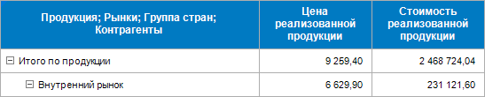

Возможны следующие варианты настройки отображения наименований показателей:

	- для скрытия наименования одного показателя снимите флажок с
	 наименования показателя «Стоимость реализованной продукции» в поле
	 «Отображать наименования показателей»
	 в раскрывающемся списке. Отображение таблицы остается без изменений.

Аналогично отображение таблицы остается без
 изменений при скрытии наименования только показателя «Цена реализованной
 продукции». Это связано с тем, что после скрытия наименования показателя
 останется пустая ячейка в строке, то такое наименование не скроется.

	- для скрытия наименований всех показателей в поле «Отображать
	 наименования показателей» в раскрывающемся списке снимите флажок
	 «Все показатели». После этого
	 в поле «Отображать наименования показателей»
	 будет выведено «Не отображать». Отображение
	 таблицы остается без изменений. Это связано с тем, что при скрытии
	 наименований показателей должен исчезнуть заголовок целиком, то такие
	 наименования не скроются.

## Показатели и общее измерение

Исходная таблица содержит в шапке следующие измерения:

	- показатели «Объем реализованной продукции», «Цена реализованной
	 продукции» и «Стоимость реализованной продукции»;

	- общее измерение - календарный справочник. Для ограничения перечня
	 элементов выбран элемент «2018»:

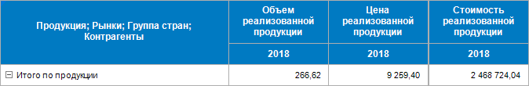

Возможны следующие варианты настройки отображения наименований показателей:

	- для скрытия наименования одного показателя в поле «Отображать
	 наименования показателей» в раскрывающемся списке снимите флажок
	 с наименования показателя «Объем реализованной продукции». Отображение
	 таблицы остается без изменений.

Аналогично отображение таблицы остается без
 изменений при скрытии наименования только одного из показателей, а также
 при одновременном скрытии наименований двух показателей. Это связано с
 тем, что после скрытия наименования показателя останется пустая ячейка
 в строке, то такое наименование не скроется;

	- для скрытия наименований всех показателей в поле «Отображать
	 наименования показателей» в раскрывающемся списке снимите флажок
	 «Все показатели». После этого
	 в поле «Отображать наименования показателей»
	 будет выведено «Не отображать»,
	 а таблица примет вид:

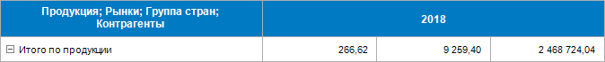

## Показатели и общие
 измерение, хотя бы у одного из показателей есть частное измерение

Исходная таблица содержит в шапке следующие измерения:

	- показатели «Объем реализованной продукции», «Цена реализованной
	 продукции» и «Стоимость реализованной продукции»;

	- частное измерение «Группа стран» у показателя «Объем реализованной
	 продукции». Для ограничения перечня элементов у частного измерения
	 «Группа стран» выбран элемент «Страны дальнего зарубежья»;

	- общее измерение - календарный справочник. Для ограничения перечня
	 элементов выбран элемент «2018»:

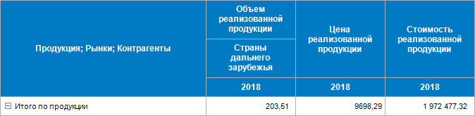

Возможны следующие варианты настройки отображения наименований показателей:

	- для скрытия наименования показателя с частным измерением в поле
	 «Отображать наименования показателей»
	 в раскрывающемся списке снимите флажок с наименования показателя «Объем
	 реализованной продукции», тогда таблица примет вид:

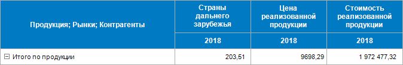

	- для скрытия наименования показателя без частного измерения в
	 поле «Отображать наименования показателей»
	 в раскрывающемся списке снимите флажок с наименования показателя «Цена
	 реализованной продукции». Отображение таблицы остается без изменений.

Аналогично отображение таблицы остается без
 изменений при скрытии наименования только показателя «Стоимость реализованной
 продукции», а также при одновременном скрытии наименований показателей,
 у которых отсутствуют частные измерения. Это связано с тем, что после
 скрытия наименования показателя/показателей необходимо отобразить строку,
 в которой находятся элементы частного измерения, но у показателя/показателей
 частные измерения отсутствуют.

	- для скрытия наименований всех показателей в поле «Отображать
	 наименования показателей» в раскрывающемся списке снимите флажок
	 «Все показатели». После этого
	 в поле «Отображать наименования показателей»
	 будет выведено «Не отображать»,
	 а таблица примет вид:

В результате скрытия наименований показателей
 скроется только наименование показателя «Объем реализованной продукции»
 с частным измерением, другие наименования показателей не скроются из-за
 наличия частного измерения у показателя «Объем реализованной продукции».

## Показатели с частными измерениями и общее
 измерение

Исходная таблица содержит в шапке следующие измерения:

	- показатели «Объем реализованной продукции» и «Цена реализованной
	 продукции»;

	- частное измерение «Группа стран» у показателя «Объем реализованной
	 продукции» и частное измерение «Рынки» у показателя «Цена реализованной
	 продукции». Для ограничения перечня элементов у частного измерения
	 «Группа стран» выбран элемент «Страны дальнего зарубежья», а у частного
	 измерения «Группа стран» выбран элемент «Внешний рынок»;

	- общее измерение - календарный справочник. Для ограничения перечня
	 элементов выбран элемент «2018»:

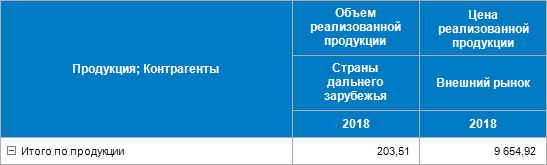

При наличии частных измерений у всех показателей возможны следующие
 варианты настройки отображения наименований показателей:

	- для скрытия наименования одного показателя в поле «Отображать
	 наименования показателей» в раскрывающемся списке снимите флажок
	 с наименования показателя «Объем реализованной продукции», тогда таблица
	 примет вид:

	- для скрытия наименования одного показателя в поле «Отображать
	 наименования показателей» в раскрывающемся списке снимите флажок
	 с наименования показателя «Цена реализованной продукции», тогда таблица
	 примет вид:

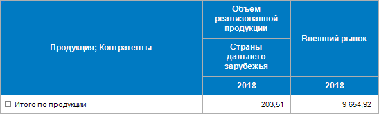

	- для скрытия наименований всех показателей в поле «Отображать
	 наименования показателей» в раскрывающемся списке снимите флажок
	 «Все показатели». После этого
	 в поле «Отображать наименования показателей»
	 будет выведено «Не отображать»,
	 а таблица примет вид:

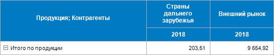

## Показатель и фильтр

[Фильтр](../Table_Area_Structure.htm#filters) выводится в
 шапку табличной области, если во всех его частных измерениях [отмечено](Selecting_Elements.htm)
 более одного элемента. При выделении нескольких элементов измерения поведение
 будет зависеть от выбранного [типа
 фильтрации](../Table_Area_Structure.htm#filtering).

Рассмотрим варианты настройки отображения наименований показателей с
 фильтром в шапке таблицы:

	- Исходная таблица содержит следующие измерения:

		- показатель «Объем реализованной продукции»;

		- [фильтр](../Table_Area_Structure.htm#filters)
		 «Фильтр: Бюджет продаж для показателя Объем реализованной продукции»
		 с выбранными элементами в частных измерениях;

		- общее измерение - календарный справочник. Для ограничения
		 перечня элементов выбран элемент «2018»:

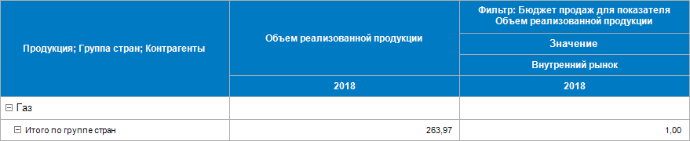

Для скрытия наименования показателя в поле
 «Отображать наименования показателей»
 в раскрывающемся списке снимите флажок с наименования показателя «Объем
 реализованной продукции». Отображение таблицы остается без изменений.
 Это связано с тем, что фильтры, добавленные [старым
 механизмом фильтрации](../Table_Area_Structure.htm#filtering), считаются показателями с частными измерениями,
 а у скрываемого наименования показателя частные измерения отсутствуют,
 то такие наименования не скроются.

	- Исходная таблица содержит следующие измерения:

		- показатель «Объем реализованной продукции»;

		- частное измерение «Группа стран» у показателя «Объем реализованной
		 продукции». Для ограничения перечня элементов у частного измерения
		 «Группа стран» выбран элемент «Страны дальнего зарубежья»;

		- [фильтр](../Table_Area_Structure.htm#filters)
		 «Фильтр: Бюджет продаж для показателя Объем реализованной продукции» с
		 выбранными элементами в частных измерениях;

		- общее измерение - календарный справочник. Для ограничения
		 перечня элементов выбран элемент «2018»:

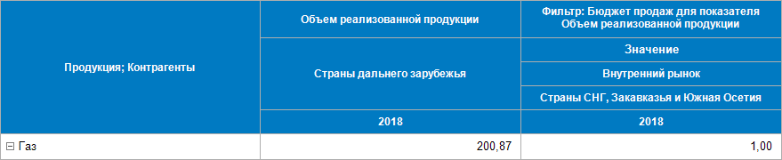

Для скрытия наименования показателя в поле
 «Отображать наименования показателей»
 в раскрывающемся списке снимите флажок с наименования показателя «Объем
 реализованной продукции», тогда таблица примет вид:

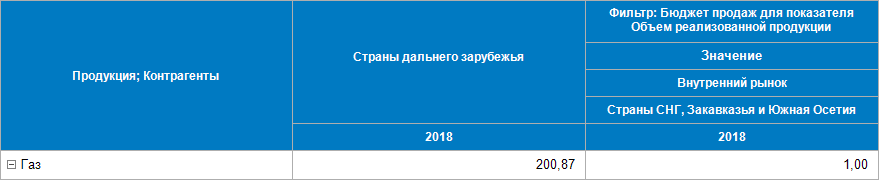

См. также:

[Настройка
 табличной области](../AreaTable.htm) | [Настройка
 структуры показателей](../Factors_Structure.htm) | [Дополнительные
 настройки отображения шапки](Advanced_Heading_Settings.htm)

		Справочная
		 система на версию 10.9
		 от 18/08/2025,
		 © ООО «ФОРСАЙТ»,
