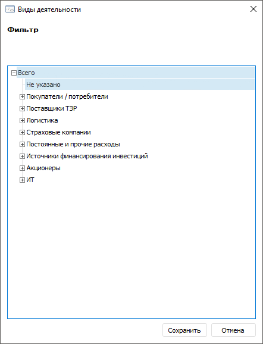
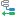
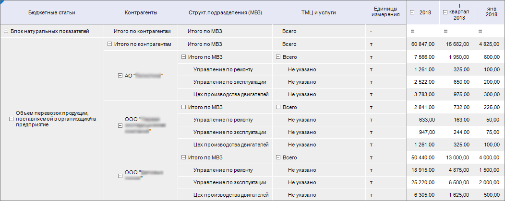
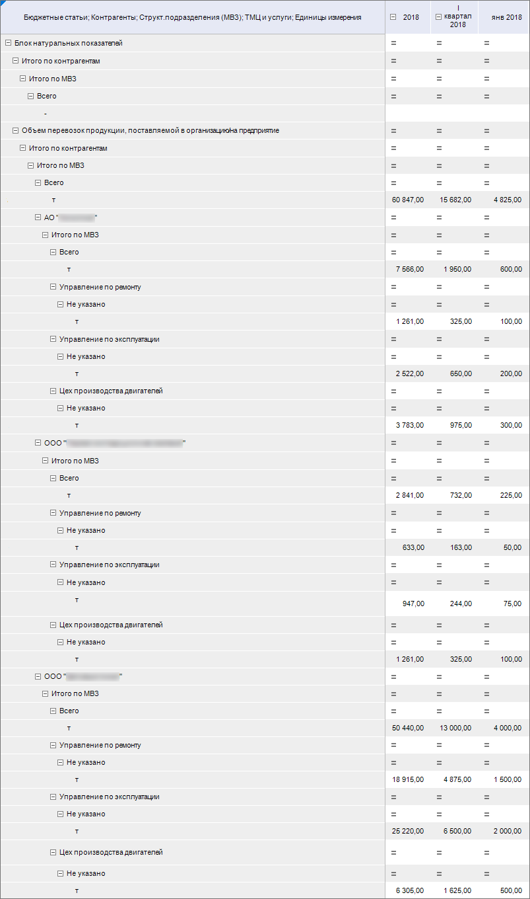
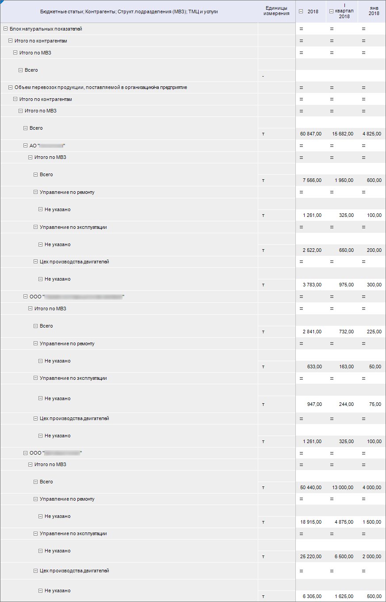
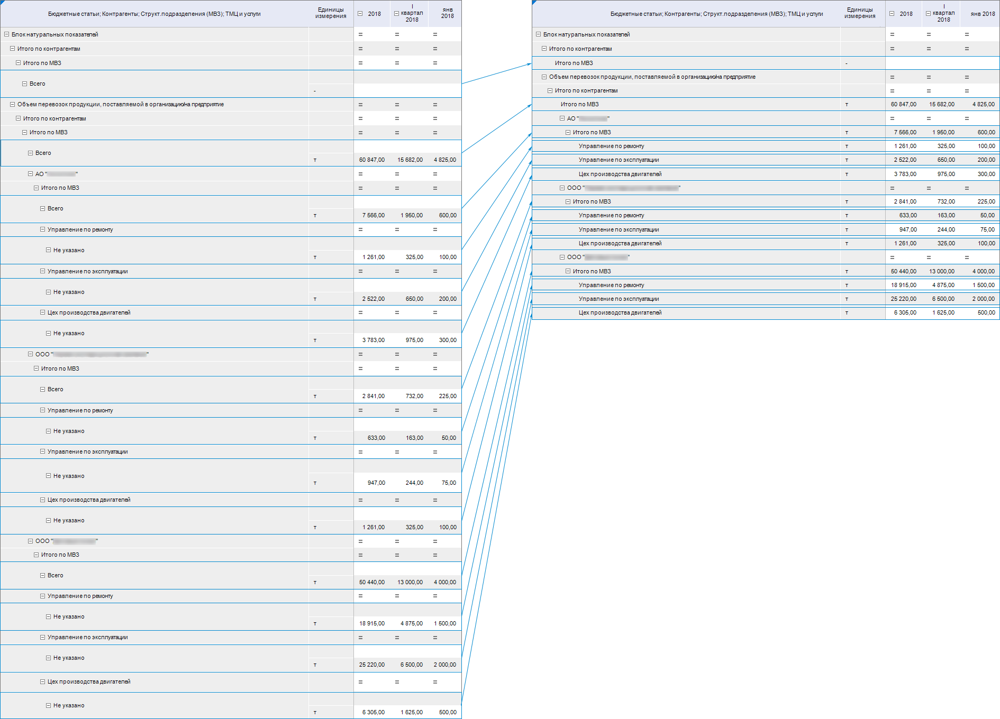
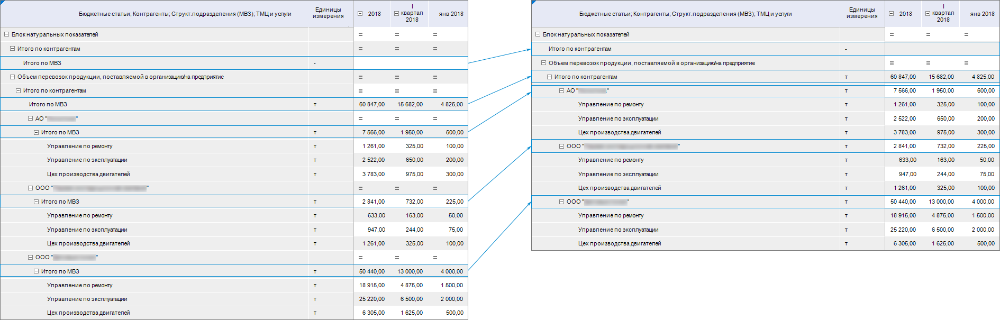
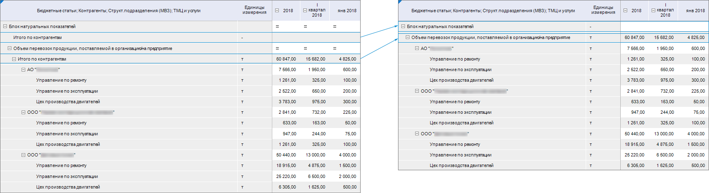

# Объединение измерений и поджатие элементов измерений

Объединение измерений и поджатие элементов измерений
-

# Объединение измерений и поджатие элементов измерений

Если в боковик выведено несколько измерений,
 то для более компактного отображения боковика табличной области используйте
 настройки объединения и поджатия. Настройки производятся при создании
 или редактировании табличной области на странице «[Структура
 боковика](Sidehead_Structure.htm)» диалога «[Настройка
 табличной области](AreaTable.htm)».

## Объединение

Доступны варианты объединения:

	- Полное
	 объединение. Отображение всех измерений в одном столбце. Для
	 настройки полного объединения установите флажок «Объединить
	 измерения» в области дополнительных настроек структуры;

	- Частичное
	 объединение. В одном столбце
	 отображаются только выбранные измерения. Для настройки частичного
	 объединения выберите измерение в левой области «Доступные
	 измерения» и установите
	 флажок «Объединить с предыдущим» в контекстном меню измерения. Флажок
	 доступен для всех измерений, кроме первого.

Примечание.
 Для объединения измерений [табличного](uinavobj.chm::/reference_book/master_table_reference_book/Master_Table.htm)
 и [вычисляемого](uinavobj.chm::/reference_book/reference_book/Master_Calculation_reference_book/Master_Calculation.htm)
 справочников должны быть добавлены [уровни](uinavobj.chm::/reference_book/Master_Table_reference_book/UiMd_reference_book_Master_Table_page4.htm).

В результате выполнения действий в окне «Настройка
 табличной области» у объединённых измерений появится пиктограмма .

## Поджатие

Для объединения элементов одного измерения с элементами другого используйте
 поджатие измерений. При использовании поджатия элемент измерения, который
 поджимают, перестанет отображаться в отдельной строке, а его значения
 будут отображены в строке элемента измерения, к которому поджимают. При
 поджатии [тип области и оформление](../Common/Design.htm#format)
 поджимаемого элемента измерения изменятся на тип области и оформление
 элемента измерения, к которому поджимают.

Примечание.
 Поджатие доступно только для объединённых измерений.

Для поджатия элементов:

	- Установите флажок «Поджимать
	 элементы» в контекстном меню измерения.

	- Выполните команду «Настроить»
	 или выберите схему отметки в раскрывающемся списке «Схема
	 отметки» для определения отметки элементов измерения в контекстном
	 меню измерения. Команда и схема отметки доступны после установки флажка
	 «Поджимать элементы».

	- В результате выполнения команды «Настроить»
	 откроется окно. В окне выделите элементы измерения, которые необходимо
	 поджать:

Для каждого элемента измерения, к которому
 настраивается поджатие, проверяется наличие поджимаемых элементов нижележащего
 измерения:

		- если поджимаемый элемент один, то происходит поджатие;

		- если поджимаемых элементов несколько, то поджимается только
		 один, выделенный первым.

Примечание.
 Выбор нескольких элементов необходим для ситуаций, когда в результате
 применения фильтрации общих измерений или фильтрации с помощью показателя,
 будут оставаться различные элементы поджимаемого измерения под каждым
 элементом верхнего измерения.

	- Сохраните изменения, нажав кнопку
	 «Сохранить».

Примечание.
 Если в боковике правее поджатых измерений располагаются неподжатые, то
 поджатие будет происходить в том случае, когда у неподжатых измерений
 отображено по одному элементу. Такое поведение сохранится при транспонировании.

В результате выполнения действий в окне «Настройка
 табличной области» у поджатого измерения появится пиктограмма .

Если у измерения в боковик выводится дополнительные наименования элементов,
 то происходит объединение только первых выводимых наименований. Дополнительные
 наименования не объединяются.

Если у измерения было настроено поджатие, а после измерение было перемещено
 на первое место, то при обратном перемещении измерения настройка поджатия
 сохранится.

[Пример использования
 объединения с поджатием](javascript:TextPopup(this))

	Для примера использования объединения измерений используем табличную
	 область, в боковик которой выведено 5 измерений: «Бюджетные
	 статьи», «Контрагенты»,
	 «Структурные подразделения (МВЗ)»,
	 «ТМЦ и услуги» и «Единицы
	 измерения», вид таблицы без использования объединения:

	

	Каждое измерение находится в своём столбце.

	Используем полное объединение: установим флажок «Объединить
	 измерения» в области оформления, таблица примет вид:

	

	Все измерения отображаются в одном столбце.

	Используем частичное объединение: снимем флажок «Объединить
	 с предыдущим» с измерения «Единицы
	 измерения», таблица примет вид:

	

	Измерение «Единицы измерения»
	 выведено в отдельный столбец.

	Используем частичное объединение с поджатием: установим флажок «Поджимать элементы» в контекстном
	 меню измерений «Контрагенты»,
	 «Структурные подразделения (МВЗ)»,
	 «ТМЦ и услуги». Для каждого
	 измерения укажем элементы, которые требуется поджать. Эти элементы
	 перестанут отображаться в отдельных строках и подожмутся к элементам
	 вышестоящего измерения. Значения поджатых элементов будут отображены
	 в элементах вышестоящего измерения:

		- для измерения «ТМЦ и услуги»
		 укажем элементы «Всего»
		 и «Не указано»:

	

		- для измерения «Структурные
		 подразделения (МВЗ)» укажем элемент «Итого
		 по МВЗ»:

	

		- для измерения «Контрагенты»
		 укажем «Итого по контрагентам»:

	

	В результате частичного объединения с поджатием боковик приобрёл
	 более компактный вид.

См. также:

[Начало
 работы с расширением «Интерактивные формы ввода данных» в веб-приложении](../../Web/Starting/Starting.htm) |
 [Настройка структуры боковика](Sidehead_Structure.htm)

		Справочная
		 система на версию 10.9
		 от 18/08/2025,
		 © ООО «ФОРСАЙТ»,
