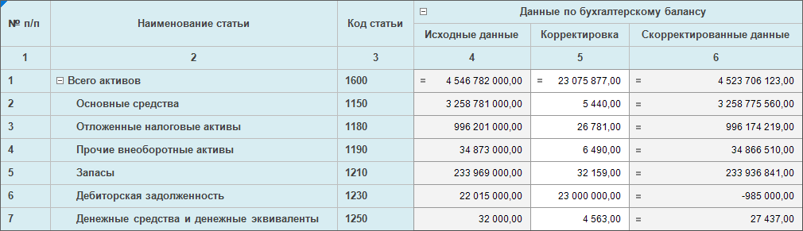
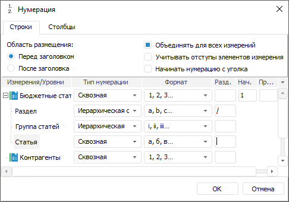
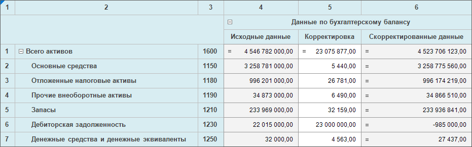
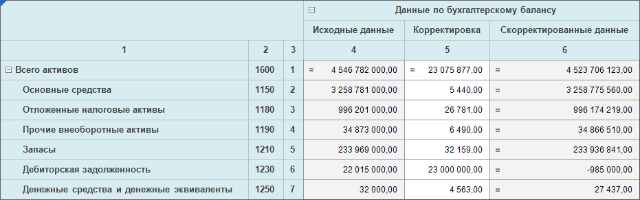
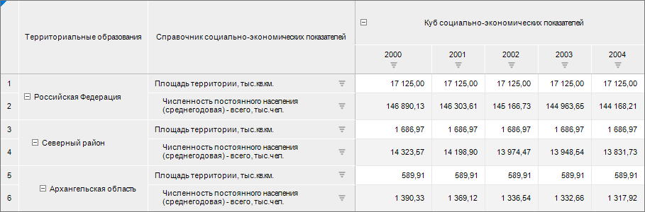
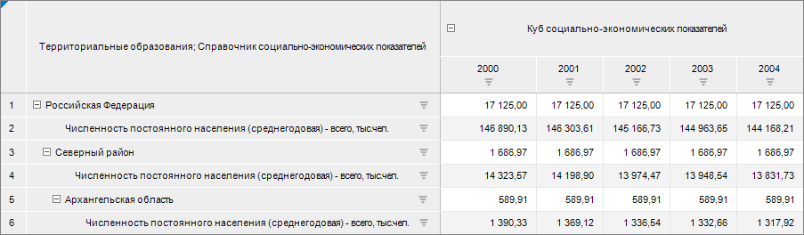
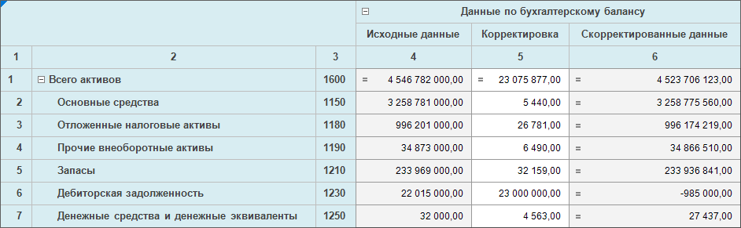

# Настройка нумерации: Формы ввода

Настройка нумерации: Формы ввода
-

# Настройка нумерации

Для табличной области можно включить и настроить нумерацию строк и столбцов.

## Включение нумерации

Для включения нумерации для строк и столбцов:

	- при создании табличной области установите флажки:

		- «[Нумерация
		 строк](Sidehead/Advanced_Sidehead_Settings.htm#numbering)» на странице «Структура
		 боковика» для отображения и настройки номеров строк;

		- «[Нумерация
		 столбцов](Heading/Advanced_Heading_Settings.htm#numbering)» на странице «Структура
		 показателей» для отображения и настройки номеров столбцов;

	- при редактировании формы ввода:

		- нажмите кнопку  «Нумерация» на вкладке «Таблица» ленты инструментов;

		- установите флажки:

			- «По строкам»
			 в раскрывающемся меню кнопки  «Нумерация» для отображения
			 номеров строк;

			- «По столбцам»
			 в раскрывающемся меню кнопки  «Нумерация» для отображения
			 номеров столбцов.

Примечание.
 Включить/отключить отображение нумерации можно при просмотре [готовой
 формы ввода](../Work/Transpose.htm#numbering).

Настройки по умолчанию:

	- для строк:

		- номера строк отобразятся отдельным столбцом боковика перед
		 заголовками;

		- нумерация начинается со строк с данными;

		- применяется сквозная нумерация;

	- для столбцов:

		- номера столбцов отобразятся отдельной строкой шапки после
		 заголовков;

		- нумерация начинается с первого столбца боковика;

		- применяется сквозная нумерация.

При [включении заголовков в уголке](AreaTable.htm#corner)
 появляется возможность задать заголовок:

	- для столбца с номерами строк;

	- для строки с номерами столбцов.

Примечание.
 Настройка наименования уголка доступна только через контекстное меню.

Разделение уголка на строки/столбцы доступно только при отображении наименований
 измерений/атрибутов.

Вводить в данную ячейку можно произвольный текст, например: «№
 п/п».

При отключении отображения заголовков в уголке заголовок столбца нумерации
 строк перестанет отображаться. При повторном включении заголовков в уголке
 текст для столбца/строки с нумерацией снова отобразится.

## Настройка нумерации

Для настройки нумерации:

	- при создании табличной области нажмите кнопку  «Редактировать».
	 Кнопка становится доступной после установки флажков «[Нумерация
	 строк](Sidehead/Advanced_Sidehead_Settings.htm#numbering)»/«[Нумерация
	 столбцов](Heading/Advanced_Heading_Settings.htm#numbering)»;

	- при редактировании формы ввода выполните команду «Настроить»
	 раскрывающегося меню кнопки  «Нумерация» вкладки «Таблица»
	 ленты инструментов.

откроется окно «Нумерация»:

Окно содержит вкладки «Строки»
 и «Столбцы», наличие вкладок зависит
 от включенной нумерации: если включена нумерация по строкам, то отображается
 вкладка «Строки», если включена
 нумерация по столбцам, то отображается вкладка «Столбцы»,
 если включена нумерация по строкам и столбцам, то отображаются обе вкладки.

Доступные настройки:

	- Область размещения.
	 Для определения места расположения столбца с нумерацией относительно
	 заголовков установите переключатель в одно из положений: «Перед
	 заголовком» или «После заголовка».

	 Перед заголовком После заголока

		

		

	- Объединять для всех измерений.
	 Для сквозной нумерации всех измерений установите флажок «Объединять
	 для всех измерений». Доступно если боковик или шапка состоят
	 из двух и более измерений. По умолчанию флажок включен. При снятом
	 флажке элементы нумеруются в пределах каждого элемента первого измерения,
	 выведённого в боковик. При объединении измерений боковика с поджатием
	 логика нумерации не меняется.

		 Установлен флажок Снят флажок

			

			Применим объединение измерений боковика с поджатием:

			

			

			Применим объединение измерений боковика с поджатием:

			

	- Учитывать отступы элементов измерения. Для отображения отступов нумерации
	 в соответствии с отступами размещения элементов измерений в табличной
	 области установите флажок «Учитывать отступы элементов измерения»:

	- Начать нумерацию с уголка.
	 Для нумерации с учётом строк/столбцов уголка установите флажок «Начать нумерацию с уголка»:

	- Настройки нумерации для измерений
	 и уровней. В области настройки нумерации для измерений и [уровней
	 измерений](UiNavObj.chm::/reference_book/Master_RDS_reference_book/Level.htm) укажите:

		- Тип нумерации. Настройте
		 тип нумерации для измерения/уровня. Доступные типы:

			- Наследовать от родителя.
			 Позволяет по цепочке изменить тип нумерации, формат, разделитель.
			 Доступен только для уровней измерения. Выбран по умолчанию
			 для уровней измерения;

			- Сквозная. Позволяет
			 установить сквозную нумерацию элементов уровня независимо
			 от нумерации родительского уровня. Выбран по умолчанию для
			 измерения;

			- Иерархическая.
			 При установке нумерация уровня будет подчинена родительскому
			 уровню;

			- Иерархическая с префиксом.
			 При установке нумерация уровня будет подчинена родительскому
			 уровню, номер родительского элемента будет включен в префикс;

		- Формат.
		 Настройте формат нумерации. Доступен для типов нумерации: сквозная,
		 иерархическая и иерархическая с префиксом. Доступные варианты:

			- 1, 2, 3. Установлено по умолчанию;

			- a, b, c;

			- A, B, C;

			- i, ii, iii;

			- I, II, III;

			- а, б, в;

			- А, Б, В;

Примечание.
 Если закончились буквы алфавита, то нумерация продолжается сначала с повторным
 символом.

		- Разделитель. Для
		 добавления символа после номера или для нумерации с префиксом
		 укажите любой один символ в поле. Если символ не задан, то разделителя
		 после номера и между номером и префиксом, если задан иерархический
		 тип нумерации с префиксом, не будет. Доступен для типов нумерации:
		 сквозная, иерархическая и иерархическая с префиксом. По умолчанию
		 не задан;

		- Начальное значение.
		 Для определения начального значения нумерации введите значение
		 в поле. Доступно для первого измерения. По умолчанию установлено
		 значение «1». В зависимости
		 от указанного формата нумерации начальное значение в табличной
		 области преобразуется под формат, при этом в окне настроек значение
		 останется числовым;

		- Префикс. Для добавления
		 символов перед номером, укажите любые символы в поле. Префикс
		 будет добавлен для указанного измерения. Для применения префикса
		 ко всем измерениям установите для остальных измерений тип нумерации
		 «Иерархическая с префиксом».
		 По умолчанию не задан.

Отобразить или скрыть нумерацию можно при [работе
 с готовой формой](../Work/Transpose.htm#numbering).

## Настройка оформления нумерации

Для настройки оформления нумерации используйте вкладку «[Формат](../Common/Design.htm#format)» ленты инструментов.

См. также:

[Начало
 работы с расширением «Интерактивные формы ввода данных» в веб-приложении](../../Web/Starting/Starting.htm) |
 [Построение формы ввода](../Starting/ConstructForm.htm) |
 [Работа с готовой формой ввода](../Work/FinishForm.htm)

		Справочная
		 система на версию 10.9
		 от 18/08/2025,
		 © ООО «ФОРСАЙТ»,
