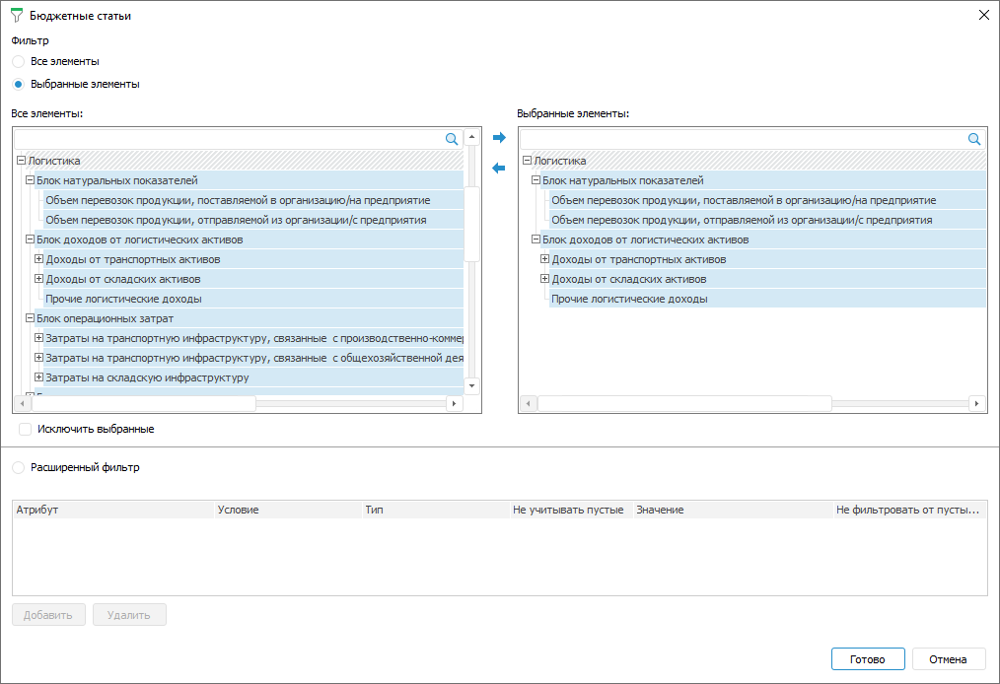
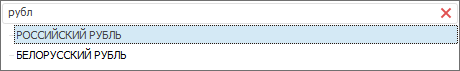
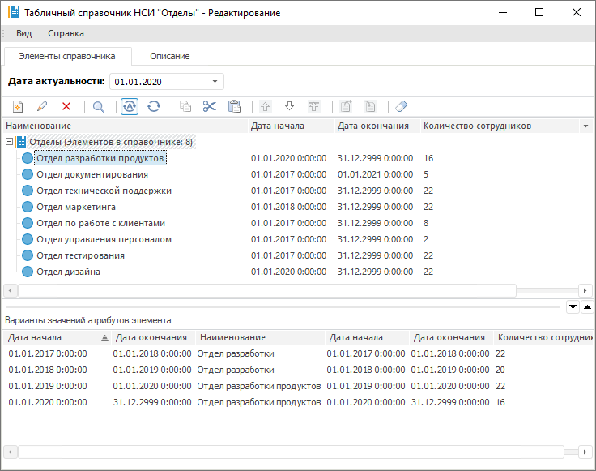
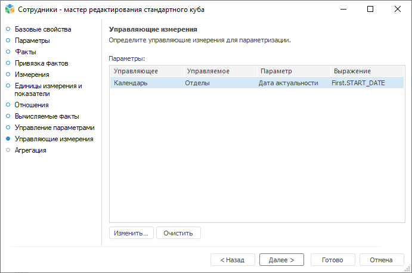
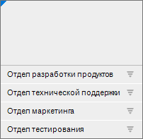
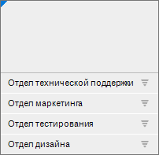
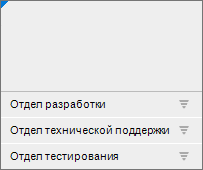

# Отметка элементов и управление параметрами измерения: Формы ввода

Отметка элементов и управление параметрами измерения: Формы ввода
-

# Отметка элементов и управление параметрами измерения

При работе с измерениями в табличной области доступны:

	- [отметка элементов](#selection);

	- [управление параметрами](#parameter).

## Отметка элементов измерения

Отметка по измерениям позволяет ограничить перечень элементов измерений,
 на основании которых будет построена табличная область.

Для отметки элементов измерения:

	- Откройте окно с помощью команды «Редактировать»
	 в контекстном меню измерения при настройке:

		- [фиксированных
		 измерений](Table_Area_Structure.htm#settings);

		- [элементов измерения
		 боковика](Sidehead/SettingDimension.htm);

		- [структуры показателей
		 формы ввода](Heading/Selecting_Elements.htm).

	- В открывшемся окне выберите один из вариантов фильтра:

		- Все
		 элементы. Отмечены будут все элементы. Недоступен для фиксированных
		 измерений с отключенной агрегацией;

		- Выбранные
		 элементы. Отмечены будут только нужные элементы. Список
		 элементов формируется в области «Выбранные
		 элементы» с помощью кнопок:

			-  «Выбрать
			 элементы». Добавляет элементы, выделенные в области
			 «Все элементы», в
			 область «Выбранные элементы»;

			-  «Исключить
			 элементы». Удаляет выделенные элементы из области «Выбранные элементы».

При настройке [элементов
 измерения боковика](Sidehead/SettingDimension.htm) и [структуры
 показателей формы ввода](Heading/Selecting_Elements.htm) доступна множественная отметка элементов.
 Для этого:

			- выделите диапазон элементов с помощью мыши;

			- выделите первый элемент диапазона, зажмите клавишу SHIFT
			 и выделите последний элемент диапазона;

			- зажмите клавишу CTRL и выделите требуемые элементы;

			- используйте команды контекстного меню. Доступны команды
			 «Отметить все» и «Снять отметку со всех».

Примечание.
 Если в область «Выбранные элементы»
 были добавлены дочерние элементы без родительских, то родительские элементы
 также отображаются в области, но при этом не считаются выбранными и не
 участвуют в фильтрации.

Фильтрация будет производиться по всем элементам,
 содержащимся в области «Выбранные элементы».
 При необходимости фильтрации по всем элементам, кроме тех, которые содержатся
 в области «Выбранные элементы»,
 установите флажок «Исключить выбранные».

Для фиксированных измерений с отключённой
 агрегацией можно выбрать только один элемент и флажок «Исключить
 выбранные» недоступен.

Для поиска элемента в каждой из областей
 начните вводить наименование искомого элемента в строку  «Поиск».
 При вводе слова целиком или его части в области будет отображаться список
 элементов, наименования которых содержат искомое сочетание символов:

Для очистки строки поиска нажмите кнопку
  «Очистить»;

		- Расширенный
		 фильтр. Добавьте правила в расширенный фильтр, нажав кнопку
		 «Добавить». Задайте:

			- Атрибут.
			 Выберите атрибут указанного справочника из раскрывающегося
			 списка. Для фильтрации элементов справочника по атрибутам
			 [связанного
			 справочника](UiNavObj.chm::/reference_book/Master_RDS_reference_book/Link_Property.htm) выберите в списке доступных
			 связанных атрибутов атрибут справочника, выбранного при [создании
			 связи](UiNavObj.chm::/reference_book/Master_RDS_reference_book/Link.htm) с атрибутом указанного справочника.
			 Связанные атрибуты отображаются с первым уровнем вложенности
			 и представляют собой дерево из доступных связанных атрибутов.

Примечание.
 Если атрибут справочника содержит [множественные значения](UiNavObj.chm::/reference_book/Master_RDS_reference_book/Attributes/Attribute.htm),
 то при проверке условия фильтрации будут сравниваться все значения атрибута.
 Если хотя бы одно значение атрибута удовлетворяет условию, то элемент
 справочника будет автоматически удовлетворять условию.

			- Условие.
			 Задайте условие фильтрации в зависимости от [типа данных](UiNavObj.chm::/reference_book/Master_RDS_reference_book/Attributes/Attribute.htm)
			 атрибута. Возможные варианты: равно, не равно, больше, меньше,
			 больше или равно, меньше или равно, входит, не входит. Для
			 атрибута строкового типа данных доступны дополнительные варианты
			 условия: начинается с, заканчивается на, содержит, не содержит.

			- Тип.
			 Выберите тип фильтра. Возможные варианты: значение, параметр.

			- Не
			 учитывать пустые. Пустые значения не будут учитываться,
			 если установить флажок. Доступно только для типа «Параметр».

			- Значение.
			 Зависит от выбранного атрибута и типа:

				- если выбран тип «Значение»,
				 то в поле указывается конкретное значение, соответствующее
				 [типу
				 данных](UiNavObj.chm::/reference_book/Master_RDS_reference_book/Attributes/Attribute.htm)
				 атрибута;

				- если выбран тип «Параметры»,
				 то в поле выбирается атрибут параметра из раскрывающегося
				 списка, представляющего собой дерево из доступных атрибутов
				 параметров, содержащихся в списке параметров формы;

				- если атрибут связанный и выбран тип «Значение»,
				 то в поле выбирается доступное значение связанного справочника
				 из раскрывающегося списка;

				- если атрибут связанный и выбран тип «Параметры»,
				 то в поле выбирается атрибут параметра из раскрывающегося
				 списка, представляющего собой дерево из доступных атрибутов
				 параметров и [связанных
				 справочников](UiNavObj.chm::/reference_book/Master_RDS_reference_book/Link_Property.htm).

			- Не
			 фильтровать от пустых значений. Пустые значения атрибута
			 не будут фильтроваться, если установить флажок.

Примечание.
 Если для измерения настроена [альтернативная иерархия](UiNavObj.chm::/reference_book/look-and-feel_Reference_book/Use_AlterHier_ForRefBook.htm)
 и расширенный фильтр от параметра, то расширенный фильтр будет применяться
 к альтернативному справочнику.

Нажмите кнопку «Удалить»
 для удаления расширенного фильтра.

	- Завершите выбор, нажав кнопку «Готово».

## Порядок применения настроек расширенного фильтра

Если для построения табличной области формы ввода используется куб с
 настроенным [управлением
 измерениями](UiNavObj.chm::/Cube/CreateCube/Master_Standart/UiMd_Cube_CreateCube_Master_Standart_managed_dim.htm) и настроено применение расширенного фильтра,
 то сначала применяются настройки куба, а затем расширенный фильтр.

[Пример применения
 настроек](javascript:TextPopup(this))

	Для построения табличной области использовался куб. У куба имеется
	 три измерения: «Сотрудники»,
	 «Отделы» и «Календарь».

	Справочник НСИ «Отделы»
	 имеет [параметр](UiNavObj.chm::/reference_book/Master_RDS_reference_book/Parameters.htm)
	 «Дата актуальности» и [атрибут](UiNavObj.chm::/reference_book/Master_RDS_reference_book/Attributes.htm)
	 «Количество сотрудников»:

	

	Количество элементов справочника зависит от года:

		- в 2017 есть элементы: «Отдел
		 разработки», «Отдел документирования»,
		 «Отдел технической поддержки»,
		 «Отдел по работе с клиентами».
		 «Отдел управления персоналом»,
		 «Отдел тестирования»;

		- в 2018 году добавляется элемент «Отдел
		 маркетинга»;

		- в 2020 году добавляется элемент «Отдел
		 дизайна».

	В 2019 году элемент «Отдел
	 разработки» меняет название на «Отдел
	 разработки продуктов».

	Значения атрибута «Количество
	 сотрудников» для элемента «Отдел
	 разработки» меняется в зависимости от года:

		- в 2017 году - 22 сотрудника;

		- в 2018 году - 20 сотрудников;

		- в 2019 году - 22 сотрудника;

		- в 2020 году - 16 сотрудников.

	Справочник НСИ «Сотрудники»
	 имеет атрибут «Дата устройства»
	 и [заимствованный
	 атрибут](UiNavObj.chm::/reference_book/Master_RDS_reference_book/Attributes.htm) «Отдел»,
	 для которого [настроена
	 связь](UiNavObj.chm::/reference_book/Master_RDS_reference_book/Link.htm)  со справочником НСИ «Отделы»:

	

	У куба в качестве [управляющего
	 измерения](UiNavObj.chm::/Cube/CreateCube/Master_Standart/UiMd_Cube_CreateCube_Master_Standart_managed_dim.htm) выбран «Календарь»:

	

	В форме ввода настроен один [параметр](../Parameters/Parameters.htm)
	 «Сотрудник», источником которого
	 также является справочник «Сотрудники».

	При [построении табличной области](AreaTable.htm) в показатель
	 выводим куб, в общие измерения - «Календарь»,
	 в боковик - «Отделы»,
	 в фиксированные измерения - «Сотрудники».

	Настраиваем [расширенный
	 фильтр](Select_dimension_elements.htm) для измерения «Сотрудники»:

		- атрибут - ключ;

		- условие - равно;

		- тип - параметр;

		- значение - Сотрудник. Ключ.

	Настраиваем [расширенный
	 фильтр](Select_dimension_elements.htm) для измерения «Отделы»:

		- атрибут - количество сотрудников;

		- условие - равно;

		- тип - значение;

		- значение - 22.

	Настраиваем [расширенный
	 фильтр](Select_dimension_elements.htm) для измерения «Календарь»:

		- атрибут - дата начала периода;

		- условие - равно;

		- тип - параметр;

		- значение - Сотрудник. Дата устройства.

	В настроенной форме ввода в зависимости от выбранного значения в
	 параметре «Сотрудник» фильтрация
	 будет применена в следующем порядке:

		- Применяется расширенный фильтр для общего измерения «Календарь». В измерение «Календарь» передается значение
		 атрибута «Дата устройства».

		- Происходит управление измерением. В боковике остаются отделы,
		 для которых значение атрибута параметра «Дата
		 устройства» попадает в диапазон дат актуальности отдела.

		- Применяется расширенный фильтр для измерения боковика «Отделы». Из отделов, оставшихся
		 на выбранную дату, остаются отделы, количество сотрудников которых
		 равно 22.

	Если в параметре сотрудник выбрано значение «Петров»,
	 то боковик табличной области примет вид:

	

	Дата устройства Петрова на работу 08.10.2019, для данной даты отсутствует
	 отдел дизайна, при этом элемент «Отдел
	 разработки» меняет наименование на «Отдел
	 разработки продуктов». После применения расширенного фильтра
	 для справочника «Отделы»
	 в боковике остаются только те отделы, в которых работает 22 человека.

	Если в параметре сотрудник выбрано значение «Владимиров»,
	 то боковик табличной области примет вид:

	

	Дата устройства Владимирова на работу 15.02.2020, для данной даты
	 актуальны все отделы. После применения расширенного фильтра для справочника
	 «Отделы» в боковике остаются
	 только те отделы, в которых работает 22 человека. Элемент «Отдел
	 разработки продуктов» не отображается, так как с 2020 года
	 количество сотрудников становится равным 16.

	Если в параметре сотрудник выбрано значение «Михайлов»,
	 то боковик табличной области примет вид:

	

	Дата устройства Михайлова на работу 20.10.2017, для данной даты
	 отсутствуют отделы маркетинга и дизайна. После применения расширенного
	 фильтра для справочника «Отделы»
	 в боковике остаются только те отделы, в которых работает 22 человека.
	 Элемент «Отдел разработки продуктов»
	 меняет наименование на «Отдел разработки».

## Управление параметрами измерения

Управление параметрами измерения используется для [динамического
 изменения значений элементов измерения](Sidehead/Advanced_Structure_Settings.htm#parameter) в зависимости от значений параметра
 формы или для [ограничения
 доступных значений частного измерения показателя](Heading/Advanced_Structure_Settings.htm#parameter).

Для настройки управления параметрами измерения выберите измерение и
 выполните команду «Управление параметрами»
 контекстного меню. Будет открыто окно «[Управление параметрами](parameter_management.htm)».

Пример настройки управления параметрами
 измерения представлен в статье «[Как настроить управление
 параметрами измерения боковика](../../FAQ/Sidehead_dimensions.htm)».

См. также:

[Начало
 работы с расширением «Интерактивные формы ввода данных» в веб-приложении](../../Web/Starting/Starting.htm) |
 [Настройка табличной области](AreaTable.htm) | [Построение
 формы ввода](../Starting/ConstructForm.htm)

		Справочная
		 система на версию 10.9
		 от 18/08/2025,
		 © ООО «ФОРСАЙТ»,
