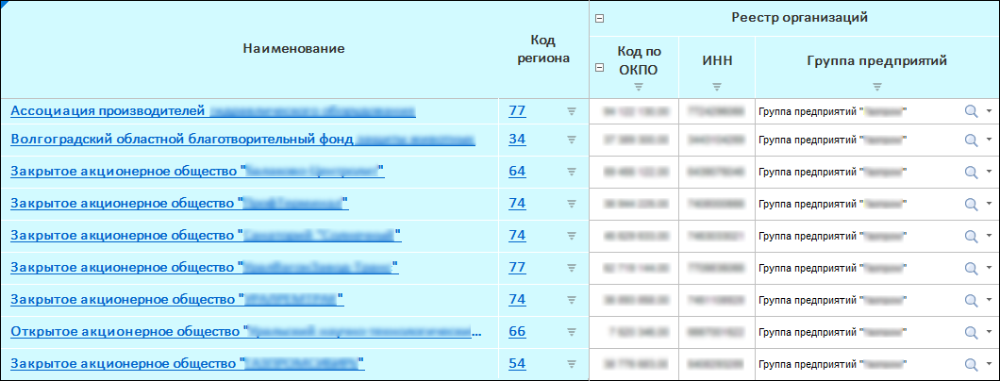

# Дополнительные настройки отображения боковика

Дополнительные настройки отображения боковика
-

# Дополнительные настройки отображения боковика

При [настройке структуры боковика](../Sidehead_Structure.htm)
 в мастере табличной области формы ввода можно дополнительно настроить
 отображение боковика:

	- настройте отображение заголовков строк;

	- настройте отображение дополнительных наименований элементов
	 измерений боковика;

	- настройте нумерацию строк.

## Заголовки строк

Для отображения заголовков строк боковика в табличной области установите
 флажок «Заголовки строк» в области
 дополнительных настроек структуры. По умолчанию флажок установлен.

## Отображение дополнительных наименований элементов измерений

Выполните настройку отображения наименований элементов в боковике формы.
 Для этого в левой области:

	- Выберите измерение.

	- Выполните команду «Наименования»
	 контекстного меню измерения.

	- Выберите один или несколько атрибутов измерения, установив флажок
	 напротив атрибута.

Примечание.
 Если выбрано несколько атрибутов, то каждый выбранный атрибут будет отображаться
 в табличной области в отдельном столбце.

[Пример
 отображения дополнительного атрибута](javascript:TextPopup(this))

	Пример отображения дополнительного атрибута
	 в наименовании элемента боковика. Исходная таблица:

	

	Таблица с выведенным дополнительным атрибутом
	 «Код региона»:

	

## Нумерация строк

Для нумерации строк боковика установите флажок «Нумерация
 строк» в области дополнительной настройки структуры. По умолчанию
 номера строк отобразятся отдельным столбцом боковика перед заголовками.
 Нумерация начинается со строк с данными. Для настройки нумерации нажмите
 кнопку  «Редактировать», откроется окно «[Нумерация](../Numbering.htm)».
 Настройка доступна при установленном флажке «Нумерация
 строк».

Примечание.
 Нумерацию по строкам можно настроить после создания табличной области
 при редактировании. Для этого выделите ячейку или диапазон ячеек табличной
 области и выполните команду «По строкам»
 раскрывающегося меню кнопки  «Нумерация» вкладки «Таблица»
 ленты инструментов. Для дополнительной настройки нумерации выполните команду
 «Настроить» раскрывающегося меню
 кнопки  «Нумерация»
 вкладки «Таблица» ленты инструментов,
 откроется окно «[Нумерация](../Numbering.htm)».

Отобразить или скрыть нумерацию можно при [работе
 с готовой формой](../../Work/Transpose.htm#numbering).

См. также:

[Начало
 работы с расширением «Интерактивные формы ввода данных» в веб-приложении](../../../Web/Starting/Starting.htm) |
 [Настройка табличной области](../AreaTable.htm) | [Настройка
 структуры боковика](../Sidehead_Structure.htm) | [Дополнительные
 настройки структуры боковика](Advanced_Structure_Settings.htm)

		Справочная
		 система на версию 10.9
		 от 18/08/2025,
		 © ООО «ФОРСАЙТ»,
