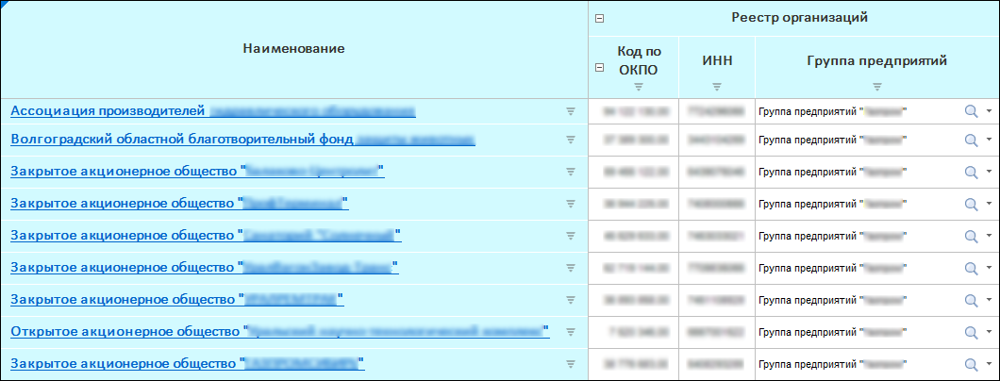
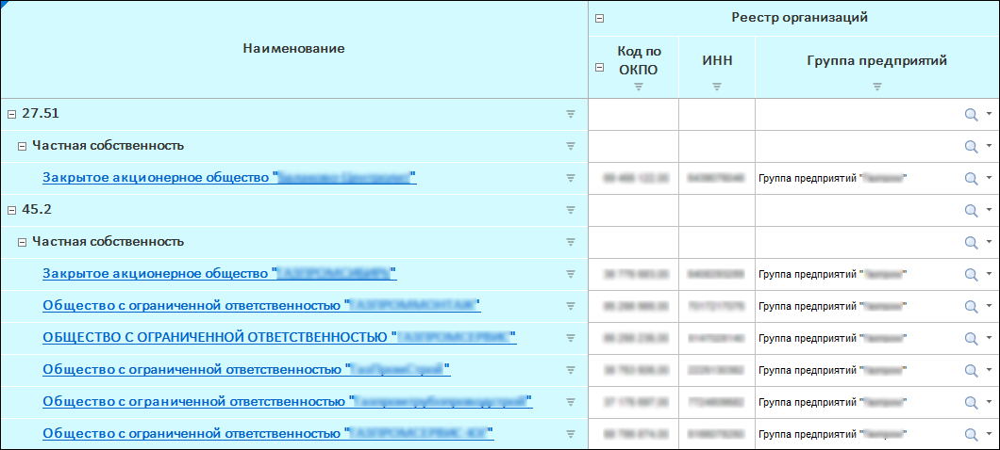
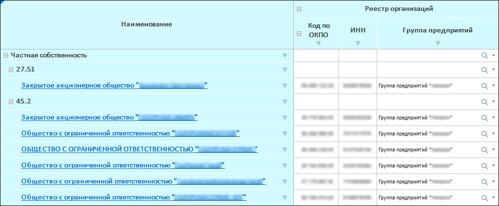
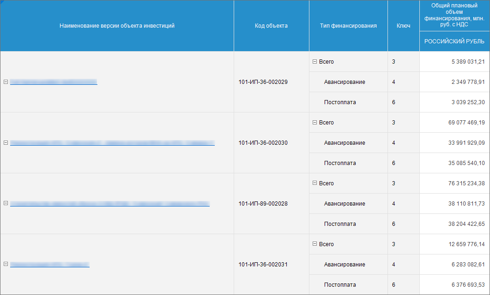
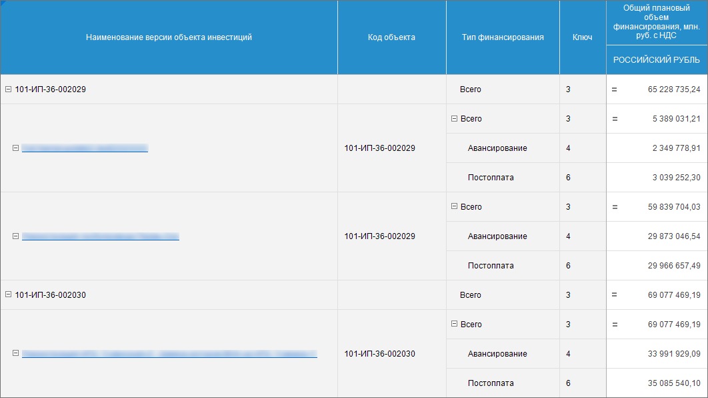
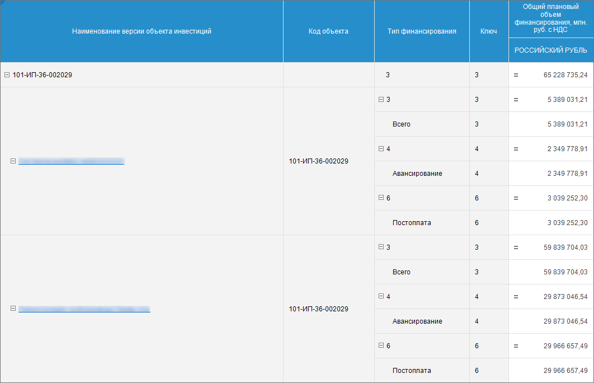
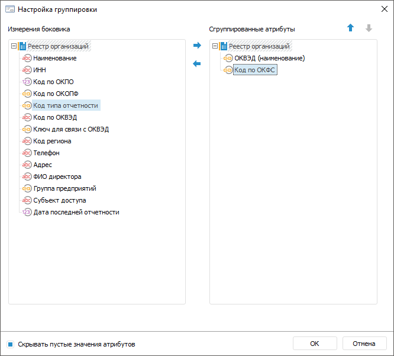
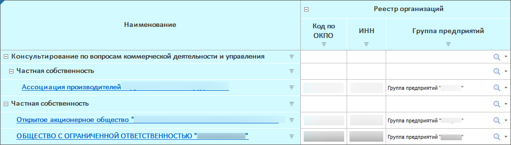
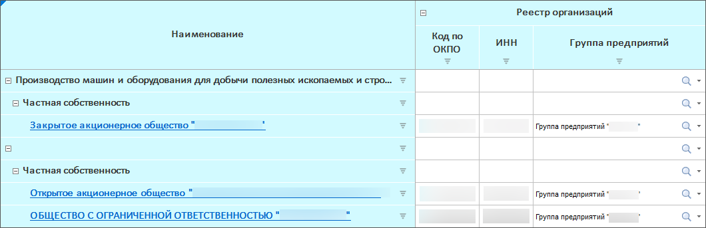

# Дополнительные настройки структуры боковика

Дополнительные настройки структуры боковика
-

# Дополнительные настройки структуры боковика

При [настройке структуры боковика](../Sidehead_Structure.htm)
 в мастере табличной области формы ввода можно дополнительно настроить
 структуру боковика:

	- [измените](#moveoutset) порядок расположения измерений
	 в боковике;

	- [сгруппируйте](#group) элементы для объединения измерений
	 по заданному атрибуту;

	- [настройте
	 управление](Advanced_Structure_Settings.htm#parameter) параметрами измерения;

	- [объедините измерения и подожмите
	 их элементы](../Merging_Dim.htm) для более компактного отображения боковика;

	- [выполните расшифровку](../Detail_dimensions.htm)
	 измерений и уровней измерений для настройки перехода от элемента измерения
	 к объекту, детализирующему его значение. Команда выполняется в левой области.

## Изменение расположения измерений

Для изменения порядка расположения измерений в боковике используйте
 кнопки  «Переместить вверх» и  «Переместить
 вниз», выбрав измерение в левой области.

## Группировка измерений

Группировка измерений боковика применяется для объединения элементов
 по заданным атрибутам. Группировка распространяется на элементы одного
 измерения. Если в боковике отображается несколько измерений, напротив
 группировочного элемента будет отображён первый элемент следующего измерения.
 Если и для следующего измерения настроена группировка, то будет отображён
 группировочный элемент следующего измерения. Группировку можно настроить
 для каждого измерения, отображаемого в боковике, кроме измерения, для
 которого настроена альтернативная иерархия. Группировку можно настроить
 для конкретного [уровня](UiNavObj.chm::/reference_book/Master_RDS_reference_book/Level.htm)
 справочника.

[Пример для боковика
 с одним измерением](javascript:TextPopup(this))

	До применения группировки форма имела вид:

	

	Настроим группировку по атрибутам «ОКВЭД»
	 и «Код по ОКФС».

	После использования группировки таблица приобретёт вид:

	

	Отобразились дополнительные строки с наименованиями атрибутов.

	При изменении расположения атрибутов, по которым группируются данные,
	 таблица примет вид:

	

[Пример для
 боковика с несколькими измерениями](javascript:TextPopup(this))

	В боковике формы выводятся атрибуты двух измерений: «Версии
	 объекта инвестиций» с атрибутами «Наименование
	 версии объекта инвестиций» и «Код
	 объекта» и «Тип финансирования»
	 с атрибутами «Тип финансирования»
	 и «Ключ». Каждый атрибут
	 измерения отображается в своём столбце. До применения группировки
	 форма имела вид:

	

	Настроим группировку по атрибуту «Код
	 объекта» измерения «Версии
	 объекта инвестиций».

	После использования группировки таблица приобретёт вид:

	

	Отобразились дополнительные строки с наименованиями атрибутов. В
	 строке группировочного атрибута первого измерения отображается первый
	 элемент второго измерения.

	Настроим группировку по атрибуту «Код
	 объекта» измерения «Версии
	 объекта инвестиций» и «Ключ»
	 измерения «Тип финансирования».

	После использования группировки таблица приобретёт вид:

	

	Теперь в строку с группировочным элементом первого измерения выводится
	 группировочный элемент второго измерения.

Для выполнения группировки измерений:

	- Нажмите кнопку «Группировка»
	 для вызова окна.

	- Выделите измерение или атрибуты измерения для группировки
	 в области «Измерения боковика»
	 и переместите с помощью кнопки  «Добавить в сгруппированные атрибуты»
	 или механизма Drag&Drop в область «Сгруппированные
	 атрибуты». При перемещении атрибута он будет удалён из области
	 «Измерения боковика» и отображён
	 в области «Сгруппированные атрибуты».

	- Удалите атрибуты, если они не должны участвовать в группировке.
	 Для этого выделите атрибут в области «Сгруппированные
	 атрибуты» и переместите с помощью кнопки  «Удалить из сгруппированных атрибутов»
	 или механизма Drag&Drop. При перемещении атрибута он будет удалён
	 из области «Сгруппированные атрибуты»
	 и отображен в области «Измерения
	 боковика».

	- Выберите уровень справочника, для которого настраивается группировка.
	 Для этого выберите наименование [уровня](UiNavObj.chm::/reference_book/Master_RDS_reference_book/Level.htm)
	 в контекстном меню измерения в области «Сгруппированные
	 атрибуты». По умолчанию выбран вариант «Без
	 уровня». В этом случае группировка применяется ко всем уровням
	 сразу.

	- Разместите атрибуты в нужном порядке с помощью кнопок  «Переместить
	 вверх» и  «Переместить
	 вниз». Расположение атрибутов в области «Сгруппированные
	 атрибуты» влияет на расположение элементов в боковике таблицы.
	 Перемещать можно несколько атрибутов одновременно.

	- Установите флажок «Скрывать
	 пустые значения атрибутов» для отображения только тех атрибутов,
	 значения которых заданы. По умолчанию флажок установлен. Скрывать
	 пустые значения атрибутов требуется, если у элементов значения некоторых
	 атрибутов не заданы. При скрытых пустых значениях атрибутов в таблице
	 будут выведены сначала сгруппированные элементы, а после - элементы,
	 не включенные в группы, то есть те, у которых отсутствует значения
	 атрибутов, по которым настроена группировка.

[Пример
 использования флажка «Скрывать пустые значения атрибутов»](javascript:TextPopup(this))

	До применения группировки форма имела
	 вид:

	

	Настроим группировку по атрибутам «ОКВЭД» и «Код
	 по ОКФС». Флажок «Скрывать
	 пустые значения атрибутов» установлен.

	После использования группировки таблица
	 примет вид:

	

	Отобразились дополнительные строки с
	 наименованиями атрибутов. Отсутствуют пустые значения атрибутов.

	Если снять флажок «Скрывать
	 пустые значения атрибутов», то таблица примет вид:

	

	Пустые значения атрибутов отображаются.
	 Сгруппированные элементы расположены по порядку.

	- Завершите группировку нажав кнопку «ОК».

Для настройки агрегации на группировочные элементы используйте [блок
 агрегации](CalculationAlgorithm.chm::/desktop/Aggregation_block/Aggregation_block.htm) в инструменте «Алгоритмы
 расчёта».

## Управление параметрами измерения

[Управление параметрами
 измерения](../Select_dimension_elements.htm#parameter) необходимо для динамического изменения значений элементов
 измерения в зависимости от значений параметра формы. Настройка доступна,
 если в справочнике, использованном в качестве измерения, настроены [параметры](UiNavObj.chm::/reference_book/Master_RDS_reference_book/Parameters.htm).

Для получения информации о примере
 выполнения настройки управления параметрами измерения смотрите статью
 «[Как
 настроить управление параметрами измерения боковика](../../../FAQ/Sidehead_dimensions.htm)».

См. также:

[Начало
 работы с расширением «Интерактивные формы ввода данных» в веб-приложении](../../../Web/Starting/Starting.htm) |
 [Настройка табличной области](../AreaTable.htm) | [Настройка
 структуры боковика](../Sidehead_Structure.htm) | [Дополнительные
 настройки отображения боковика](Advanced_Sidehead_Settings.htm)

		Справочная
		 система на версию 10.9
		 от 18/08/2025,
		 © ООО «ФОРСАЙТ»,
