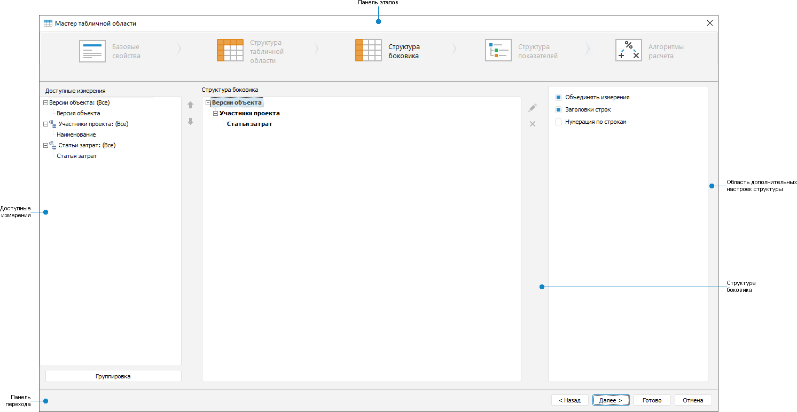

# Настройка структуры боковика: Формы ввода

Настройка структуры боковика: Формы ввода
-

# Настройка структуры боковика

Структура боковика включает элементы измерения, которые будут выводиться
 в боковике табличной области, и последовательность их отображения.

Для настройки структуры боковика используйте страницу «Структура
 боковика» диалога «Мастер табличной
 области»:

[Элементы страницы
 «Структура боковика»](javascript:TextPopup(this))

		- Панель этапов. Содержит
		 кнопки наименования этапа для перехода к конкретному этапу настройки
		 табличной области.

		- Доступные измерения.
		 Содержит дерево измерений боковика.

		- Структура боковика.
		 Содержит структуру отображения измерений в боковике.

		- Область дополнительных
		 настроек структуры. Содержит дополнительные настройки отображения
		 структуры боковика.

		- Панель переходов. Содержит кнопки для последовательного
		 перехода между этапами и завершения настройки табличной области.

Примечание.
 Если было применено [транспонирование](Table_Area_Structure.htm#transpose),
 то страница будет называться «Структура
 шапки», в области дополнительных настроек структуры флажки будут
 называться «Заголовки столбцов»
 и «Нумерация столбцов», добавится
 флажок «[Многоуровневая
 шапка таблицы](Heading/Advanced_Heading_Settings.htm#layeredheader)», остальные настройки не меняются.

Для определения структуры боковика:

	- [Выберите](Sidehead/SettingDimension.htm) элементы
	 в измерениях боковика.

	- [Используйте](Sidehead/Advanced_Structure_Settings.htm)
	 дополнительные настройки структуры боковика.

	- [Используйте](Sidehead/Advanced_Sidehead_Settings.htm)
	 дополнительные настройки отображения боковика.

После настройки структуры боковика табличной области перейдите к этапу
 «[Настройка структуры показателей](Factors_Structure.htm)».

См. также:

[Начало
 работы с расширением «Интерактивные формы ввода данных» в веб-приложении](../../Web/Starting/Starting.htm) |
 [Построение формы ввода](../Starting/ConstructForm.htm) |
 [Вставка и настройка табличной области](AreaTable.htm) |
 [Работа с готовой формой ввода](../Work/FinishForm.htm)

		Справочная
		 система на версию 10.9
		 от 18/08/2025,
		 © ООО «ФОРСАЙТ»,
