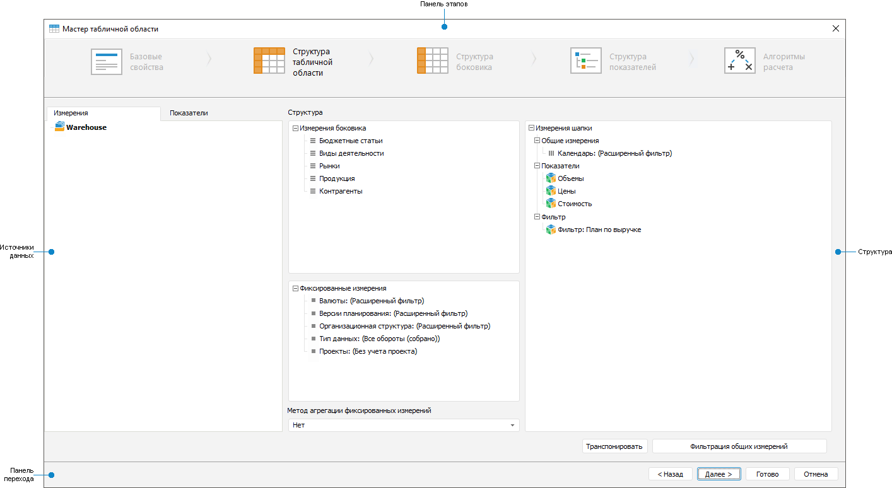
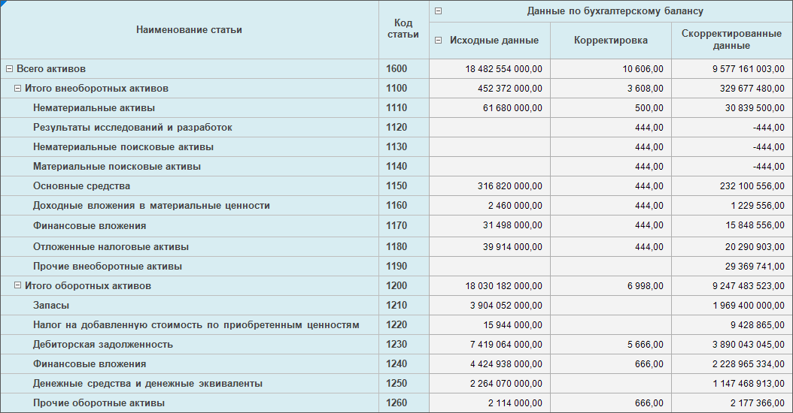
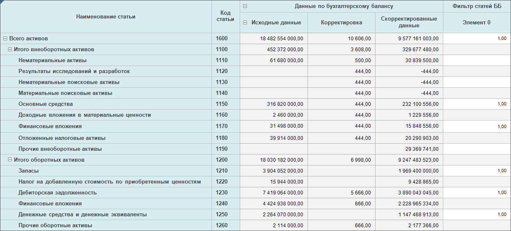
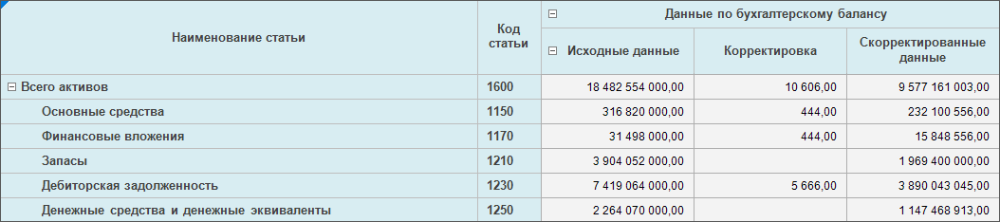
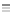
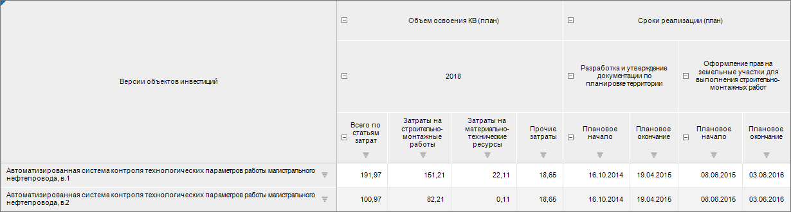
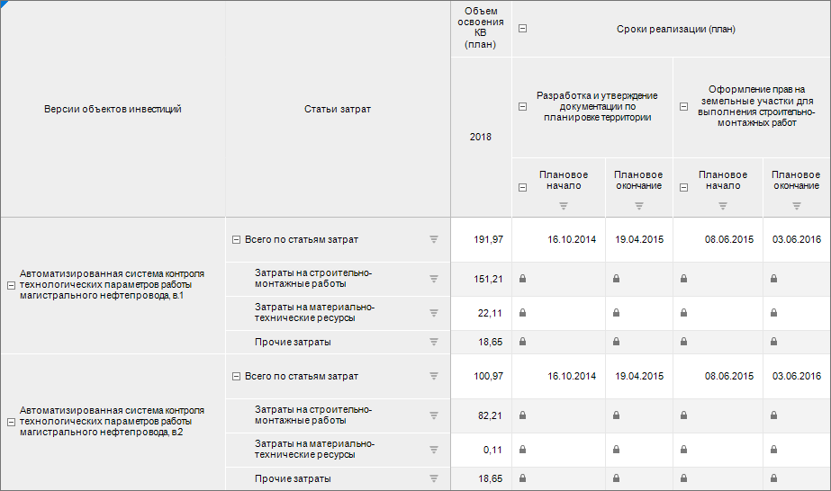
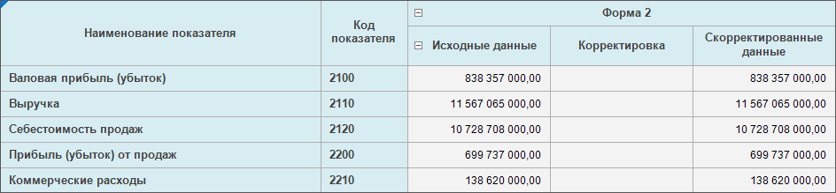
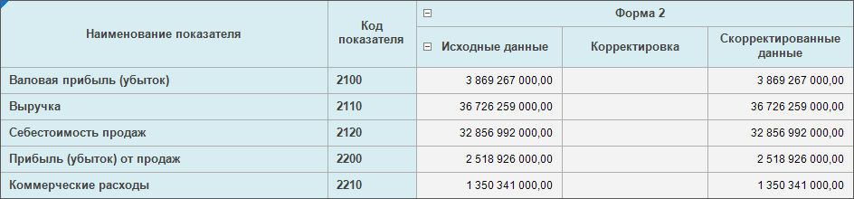
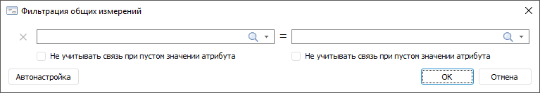

# Задание структуры табличной области: Формы ввода в настольном приложении

Задание структуры табличной области: Формы ввода в настольном приложении
-

# Задание структуры табличной области

Структура табличной области включает:

	- Измерения боковика.
	 Измерения, которые располагаются в боковике табличной области. В боковике
	 могут располагаться [общие измерения](AreaTable.htm#shared)
	 показателей, при необходимости можно перенести в боковик [частные
	 измерения](AreaTable.htm#private) показателей;

	- Измерения шапки. Показатели
	 и измерения, которые располагаются в шапке табличной области. В шапке
	 могут располагаться [общие и частные
	 измерения](AreaTable.htm#dimensions) показателей. Частные измерения показателей отображаются
	 под показателем в дереве «Измерения
	 шапки» области «Структура»
	 в ветке «Показатели». В дереве
	 «Измерения шапки» также может
	 располагаться фильтр.

Фильтр -
 это куб, предназначенный для фильтрации выводимых в боковике элементов
 измерений для различных значений параметров. В ячейках фильтра может быть
 установлено значение или ячейка остается пустой. В боковик будут выводится
 элементы, у которых есть значения. Структура фильтра может не совпадать
 со структурой показателя, для которого будет проводится фильтрация:

		- если в показателе есть измерения, отсутствующие в фильтре,
		 то при фильтрации эти измерения не учитываются;

		- если в фильтре есть измерения, которых нет в показателе,
		 то при фильтрации по этим измерениям будет учитываться первый
		 выделенный элемент;

		- если в измерении показателя есть элемент, отсутствующий
		 в фильтре, то при фильтрации элемент не будет выведен в боковик.

Таким образом, при смене значения параметра
 будут изменяться отображаемые элементы боковика без редактирования табличной
 области.

Фильтр не выводится
 в шапку табличной области, если во всех его частных измерениях [отмечено](Heading/Selecting_Elements.htm)
 не более одного элемента. При выделении нескольких элементов измерения
 поведение будет зависеть от выбранного типа фильтрации:

		- старый тип: фильтрация произойдет по первому выделенному
		 элементу, остальные будут выведены в шапку;

		- новый тип: фильтрация произойдет по первому выделенному
		 элементу, остальные будут проигнорированы.

Для определения типа фильтрации создайте
 глобальную переменную [NEW_D_CUBE](UiNav.chm::/02_Navigator/UiNav_GlobalVariables.htm#extend)
 или измените её значение.

Примечание.
 При использовании фильтра недоступны [агрегация
 фиксированных измерений](#aggregation), группировка измерений [альтернативных
 иерархий](#alt_hierarchy) и [отображение
 итоговых значений](../Custom_module/Advanced.htm#display_of_totals).

В разделе «Добавление,
 перемещение и удаление измерений, показателей и фильтра» данной
 статьи приведен [пример](Table_Area_Structure.htm#filterexampe),
 показывающий работу фильтра;

	- Фиксированные измерения.
	 О[бщие измерения](AreaTable.htm#shared) показателей, элементы
	 которых не выводятся ни в шапку, ни в боковик.

Примечание.
 Если [общее измерение](AreaTable.htm#shared) не добавлено в
 измерения боковика или в общие измерения шапки табличной области, то оно
 будет являться [частным измерением](AreaTable.htm#private)
 показателей.

Для задания структуры табличной области используйте страницу «Структура табличной области» диалога
 «Мастер табличной области»:

[Элементы страницы
 «Структура табличной области»](javascript:TextPopup(this))

		- Панель этапов. Содержит
		 кнопки наименования этапа для перехода к конкретному этапу настройки
		 табличной области.

		- Источники данных.
		 Состоит из вкладок «Измерения»
		 и «Показатели», которые
		 содержат деревья объектов репозитория.

		- Структура. Содержит
		 области для задания и настройки измерений боковика, шапки и фиксированных
		 измерений.

		- Панель переходов. Содержит кнопки для последовательного
		 перехода между этапами и завершения настройки табличной области.

Для определения структуры табличной области:

	- [Добавьте](#add) измерения, показатели и фильтр в
	 структуру.

	- [Настройте](#settings) фиксированные измерения.

Для дополнительных настроек структуры табличной области:

	- [добавьте](#filter) фильтр для общих измерений при
	 выделении элементов на основе значений атрибутов;

	- [транспонируйте](Table_Area_Structure.htm#transpose)
	 таблицу.

После настройки структуры табличной области перейдите к этапу «[Настройка
 структуры боковика](Sidehead_Structure.htm)».

## Добавление, перемещение и удаление измерений, показателей
 и фильтра

Для добавления показателя:

	- Перейдите на вкладку «Показатели»
	 области «Источники данных».
	 На этой вкладке отображается дерево объектов репозитория, дерево отфильтровано
	 - отображаются только кубы и папки, в которых они находятся.

	- Выберите нужный куб или несколько кубов и с помощью механизма
	 Drag&Drop переместите его/их в дерево «Измерения
	 шапки» области «Структура»
	 в ветку «Показатели».

Для добавления фильтра:

	- Перейдите на вкладку «Показатели»
	 области «Источники данных».
	 На этой вкладке отображается дерево объектов репозитория, дерево отфильтровано
	 - отображаются только кубы и папки, в которых они находятся.

	- Выберите нужный куб и с помощью механизма Drag&Drop переместите
	 его в дерево «Измерения шапки»
	 области «Структура» в ветку
	 «Фильтр». Добавить можно только
	 один фильтр.

Фильтр применяется для фильтрации общих измерений по пустым значениям.

[Пример
 использования фильтра](javascript:TextPopup(this))

	Для примера использования фильтра используем табличную область:

	

	Добавим фильтр в показатели формы. Фильтр построен на тех же измерениях,
	 что и показатель табличной области, отличается только измерением фактов.
	 Он будет выведен в шапке:

	

	Переместим фильтр в ветку «Фильтр».
	 В результате в таблице будут отображены только те строки, в которых
	 в фильтре были проставлены единицы:

	

Для добавления измерений:

	- Перейдите на вкладку «Измерения» области
	 «Источники данных». На этой
	 вкладке отображается отфильтрованное дерево объектов репозитория -
	 отображаются справочники, являющиеся общими измерениями для показателей,
	 и папки, включающие справочники.

	- Добавьте одно или несколько измерений в дерево «Измерения
	 шапки» области «Структура»
	 в ветку «Общие измерения».

	- Добавьте один или несколько справочников в качестве измерений
	 боковика.

	- Добавьте справочники в дерево «Фиксированные
	 измерения».

Примечание.
 Если были [заданы папки](../Starting/Starting.htm#main_parameters),
 содержащие показатели и измерения, то иерархия в дереве измерений и в
 дереве показателей будет развернута до содержимого соответствующей папки.

Для перемещения измерения в другую панель:

	- выполните команду контекстного меню «Переместить
	 в шапку/Переместить в боковик/Переместить в фиксированные измерения»;

	- используйте механизм Drag&Drop.

Набор команд зависит от панели, в которой расположено измерение. Перемещать
 можно одно или несколько измерений одновременно. Для выделения нескольких
 измерений используйте клавишу SHIFT или CTRL.

Для перемещения показателя в ветку фильтра и наоборот:

	- выполните команду контекстного меню «Переместить
	 в фильтр/Переместить в показатели»;

	- используйте механизм Drag&Drop.

Примечание.
 Для перемещения показателя из шапки табличной области в боковик нажмите
 кнопку «Транспонировать».

Для удаления измерений и показателей выполните команду контекстного
 меню «Удалить». Удалять можно
 одно или несколько измерений и/или показателей одновременно. Для отметки
 нескольких измерений и/или показателей используйте клавишу SHIFT или CTRL.

Примечание.
 Изменить количество отображаемых показателей и их расположение можно при
 работе с [готовой формой ввода](../Work/View.htm).

### Особенности вынесения частных измерений показателей в общие

Для придания табличной области требуемого вида частные измерения показателей
 можно вынести в общие измерения боковика.

Под каждым показателем в дереве «Измерения
 шапки» области «Структура»
 в ветке «Показатели» отображаются
 его частные измерения.

Для перемещения частных измерений показателей в общие измерения боковика
 или обратно выделите частное измерение и:

	- выполните команду контекстного меню «Переместить
	 в боковик/Переместить в шапку»;

	- используйте механизм Drag&Drop.

Примечание.
 В общие измерения можно выносить все частные измерения, кроме параметрических.

У вынесенного в дерево «Измерения боковика»
 области «Структура» частного измерения
 появится пиктограмма .

После перемещения частного измерения в боковик, с ним можно продолжить
 работать как с [измерением боковика](Sidehead_Structure.htm).

В результате переноса измерения в боковик:

	- будут добавлены строки элементов перенесённого измерения;

	- значения показателей, в которых отсутствует перенесённое измерение,
	 будут располагаться у первого элемента перенесённого измерения. Для
	 остальных ячеек показателей редактирование недоступно, в ячейках отображается
	 пиктограмма .

[Пример использования
 вынесения](javascript:TextPopup(this))

	Для примера используем форму ввода с двумя показателями: «Сроки реализации (план)» и «Объем освоения КВ (план)». У показателей
	 общим является измерение «Версии
	 объектов инвестиций», которое выведено в боковик. Частные измерения
	 показателя «Сроки реализации (план)»:
	 «Типовые этапы» и «Сроки реализации». Частные измерения
	 показателя «Объем освоения КВ (план)»:
	 «Календарь», «Участники
	 проекта», «Валюта»,
	 «Учет НДС», «Статьи
	 затрат». Значения измерений «Участники
	 проекта», «Валюта»,
	 «Учет НДС» зафиксированы.
	 В шапку выведены значения измерений:

		- типовые этапы:
		 разработка и утверждение документации по планировке территории,
		 оформление прав на земельные участки для выполнения строительно-монтажных
		 работ;

		- сроки реализации:
		 плановое начало, плановое окончание;

		- календарь: 2018;

		- статьи затрат:
		 всего по статьям затрат, затраты на строительно-монтажные работы,
		 затраты на материально технические ресурсы, прочие затраты.

	

	Перенесём измерение «Статьи затрат»
	 в общие. Тогда таблица примет вид:

	

	В таблице после переноса частного измерения в боковик значения показателя,
	 у которого отсутствует перенесённое в боковик измерение, будут располагаться
	 у первого элемента, для остальных ячеек редактирование будет недоступно.

## Настройка фиксированных измерений

Настройка [фиксированных
 измерений](UiSelection.chm::/Selection/Dimension.htm#variant_of_location) выполняется командами контекстного меню и
 с помощью раскрывающегося списка «Метод
 агрегации фиксированных измерений» области «Структура».

[Агрегация
 фиксированных измерений](javascript:TextPopup(this))

	Агрегация позволяет объединять значения элементов, отмеченных в
	 [фиксированных
	 измерениях](UiSelection.chm::/Selection/Dimension.htm#variant_of_location).

	Примечание.
	 При использовании фильтра агрегация фиксированных измерений недоступна.

	Для задания агрегации выберите метод:

		- Нет. Агрегация не
		 производится. Выбран по умолчанию;

		- Сумма. Суммируются
		 значения элементов фиксированных измерений;

		- Минимум. У элементов
		 фиксированных измерений выбирается минимальное значение;

		- Максимум. У элементов
		 фиксированных измерений выбирается максимальное значение;

		- Арифметическое среднее. Определяется среднее
		 значение элементов фиксированных измерений с учётом пустых
		 значений.

	Если в раскрывающемся списке «Метод
	 агрегации фиксированных измерений» выбран вариант «Нет»,
	 то отметить можно только один элемент в дереве «Фиксированные
	 измерения». При выборе другого метода агрегации будет доступна
	 множественная отметка для элементов в дереве «Фиксированные
	 измерения».

	Для примера использования агрегации фиксированных измерений используем
	 табличную область, в фиксированных измерениях которой есть календарное
	 измерение. В календарном измерении выбран один элемент. При отсутствии
	 агрегации таблица имеет вид:

	

	Настроим агрегацию: выберем метод агрегации «Сумма»
	 и в календарном измерении выберем три элемента. Таблица примет
	 вид:

	

	В результате применения агрегации значения элементов были просуммированы.

[Отметка элементов
 фиксированных измерений](javascript:TextPopup(this))

	Отметка позволяет ограничить список элементов [фиксированных
	 измерений](UiSelection.chm::/Selection/Dimension.htm#variant_of_location), на основании которых будет построена
	 табличная область.

	Для задания отметки выполните шаги:

		- Выберите группу элементов в раскрывающемся списке «Группы элементов» контекстного
		 меню измерения. Выбор группы элементов не является обязательным
		 шагом.

		- Задайте отметку элементов измерения в дереве «Фиксированные
		 измерения». Для этого:

			- выполните команду «[Редактировать](Select_dimension_elements.htm)»
			 контекстного меню измерения. В зависимости от выбранного метода
			 в раскрывающемся списке «Метод
			 агрегации фиксированных измерений»:

				- отметить можно только один элемент, если выбран
				 вариант «Нет»;

				- доступна множественная отметка;

	Примечание.
	 При выборе расширенного фильтра при отметке измерения, можно настроить
	 привязку значения фиксированного измерения к параметру формы. В этом
	 случае при изменении значения параметра автоматически будет меняться
	 значение фиксированного измерения.

			- выберите схему отметки в раскрывающемся меню «Схема отметки» контекстного
			 меню измерения. В зависимости от выбранного метода в раскрывающемся
			 списке «Метод агрегации фиксированных
			 измерений»:

				- будет отмечен первый элемент, заданный в выбранной
				 схеме, если выбран вариант «Нет»;

				- будут отмечены элементы, заданные в выбранной схеме.

	Для сброса установленной отметки выполните
	 команду «Схема отметки >
	 Сбросить» контекстного меню, которая становится доступной после
	 выбора отметки.

	Если использование фильтра привело к
	 множественной отметке по измерению, то для фиксированных измерений
	 с отключенной агрегацией в качестве отметки будет взят первый отмеченный
	 элемент.

	Примечание.
	 Команды «Схема отметки», «Группы элементов» доступны, если
	 в справочниках настроены [схема
	 отметки](UiNavObj.chm::/reference_book/look-and-feel_Reference_book/UiMd_reference_book_look-and-feel_Scheme.htm), [группы
	 элементов](UiNavObj.chm::/reference_book/look-and-feel_Reference_book/UiMd_reference_book_look-and-feel_Group.htm).

[Альтернативные
 иерархии](javascript:TextPopup(this))

	Выберите альтернативную иерархию для отображения элементов альтернативного
	 справочника, вместо элементов справочника, на котором построен боковик,
	 или настройте динамический выбор альтернативной иерархии в зависимости
	 от атрибута параметра, указав вариант альтернативной иерархии в диалоге
	 «Альтернативные иерархии».

	Примечание.
	 При использовании фильтра [группировка
	 измерений](Sidehead/Advanced_Structure_Settings.htm#group) альтернативных иерархий недоступна.

	Для вызова диалога выполните команду «Альтернативные
	 иерархии» контекстного меню измерения:

	

	Задайте:

		- Тип
		 альтернативной иерархии. Установите переключатель на одном
		 из вариантов: фиксированная, динамическая или не применяется.
		 По умолчанию альтернативная иерархия не применяется;

		- Источник
		 альтернативной иерархии. Зависит от выбранного типа альтернативной
		 иерархии:

			- если выбран тип «Фиксированная»,
			 то источником альтернативной иерархии является справочник.
			 Выберите доступный справочник в раскрывающемся списке или
			 нажмите кнопку  «Поиск»
			 и начните печатать название справочника. Доступен выбор только
			 одного справочника;

			- если выбран тип «Динамическая»,
			 то источником альтернативной иерархии является параметр. Выберите
			 атрибут параметра формы ввода в раскрывающемся списке или
			 нажмите кнопку  «Поиск»
			 и начните печатать название параметра. При динамическом выборе
			 альтернативной иерархии боковик будет отстраиваться в зависимости
			 от выбранного значения атрибута. Если значение атрибута выбранного
			 элемента в параметре не является ключом альтернативной иерархии,
			 то будет выведено соответствующее сообщение. При выборе данной
			 настройки «Схема отметки»
			 и «Группа элементов»
			 недоступны, также для данного измерения недоступна группировка;

	Совет.
	 Для получения подробной информации о настройке динамического выбора
	 альтернативной иерархии в зависимости от атрибута параметра обратитесь
	 к статье «[Как
	 настроить динамическое изменение отображаемых элементов измерения
	 боковика](../../FAQ/Select_alternative_hierarchy.htm)».

			- если выбран тип «Не
			 применяется», то список недоступен.

	Если не выбран справочник или атрибут
	 параметра в качестве источника альтернативной иерархии, то после нажатия
	 кнопки «ОК» будет применена
	 основная иерархия.

	Если атрибут справочника, который был
	 задан в качестве ключа альтернативной иерархии, удален, то при первом
	 открытии формы ввода будет выведено сообщение от удалении атрибута
	 и применении основной иерархии для измерения;

	Примечание.
	 Команда «Альтернативные иерархии»
	 доступна, если в справочниках настроены [альтернативные
	 иерархии](UiNavObj.chm::/reference_book/look-and-feel_Reference_book/Attributes_as_alt_hier.htm).

## Фильтрация общих измерений

Для выделения элементов на основе значений атрибутов для измерений,
 содержащихся во всех показателях формы ввода, нажмите кнопку «Фильтрация
 общих измерений», откроется диалог:

Используется только для тех измерений, которые содержат [связанные
 атрибуты](UiNavObj.chm::/reference_book/Master_RDS_reference_book/Link.htm).

В раскрывающихся списках содержатся атрибуты, сгруппированные по измерениям.

Порядок настройки фильтрации:

	- В левом раскрывающемся списке выберите связанный атрибут из
	 текущего измерения.

	- В правом раскрывающемся списке выберите связанный атрибут из
	 связанного измерения.

	- Для исключения из фильтрации пустых значений установите флажок
	 «Не учитывать связь при пустом значении
	 атрибута» под соответствующим атрибутом.

Можно добавить одну или несколько связей. В результате будет настроена фильтрация
 по связям атрибутов.

Для удаления связи нажмите кнопку  «Удалить», расположенную рядом с
 ней.

Для автоматического определения связи атрибутов измерений нажмите кнопку
 «Автонастройка».

## Транспонирование

Для размещения измерений боковика в шапке и измерений шапки в боковике
 нажмите кнопку «Транспонировать».

При этом изменится название следующего этапа на «[Структура шапки](Sidehead_Structure.htm)», все настройки
 этапа останутся прежние.

Транспонировать табличную область можно при:

	- редактировании формы ввода. Для этого нажмите кнопку  «Транспонировать»
	 на вкладке «Таблица» ленты
	 инструментов;

	- [работе с готовой формой](../Work/Transpose.htm#transpose).

См. также:

[Начало
 работы с расширением «Интерактивные формы ввода данных» в веб-приложении](../../Web/Starting/Starting.htm) |
 [Построение формы ввода](../Starting/ConstructForm.htm) |
 [Вставка и настройка табличной области](AreaTable.htm) |
 [Работа с готовой формой ввода](../Work/FinishForm.htm)

		Справочная
		 система на версию 10.9
		 от 18/08/2025,
		 © ООО «ФОРСАЙТ»,
