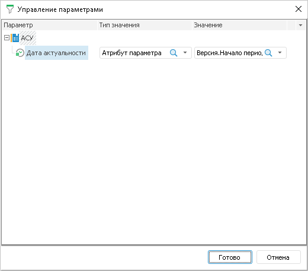

# Управление параметрами: Формы ввода в настольном приложении

Управление параметрами: Формы ввода в настольном приложении
-

# Управление параметрами

Если в форме ввода используются параметрические измерения или показатели,
 то для их параметров можно задать значения или настроить управление через
 параметры формы ввода.

[Для открытия
 диалога](javascript:TextPopup(this))

	Нажмите кнопку «Управление параметрами»
	 на странице «[Структура
	 показателей](Factors_Structure.htm)» или выполните соответствующую команду контекстного
	 меню для измерения на странице «[Структура табличной области](Table_Area_Structure.htm)»
	 или «[Структура
	 боковика](Sidehead_Structure.htm)» диалога «Мастер
	 табличной области».

В столбце «Параметр» отображаются
 только те кубы/измерения, в структуре которых имеются параметры. Если
 один и тот же куб добавлен в форме ввода в качестве показателя несколько
 раз, то в диалоге можно будет настроить управление для каждого экземпляра
 куба. Если параметрическое измерение добавлено в шапку и боковик, то в
 диалоге управления параметрами измерение будет отображено в одном экземпляре.

Примечание.
 Частные измерения куба не отображаются. Управление параметрами частных
 измерений должно быть настроено в самом кубе.

В столбце «Тип значения» определите
 каким образом будет формироваться значение для параметра. Доступные варианты:

	- Не выбрано. Данный пункт
	 выбран по умолчанию, при этом параметру ни какое значение не передаётся;

	- Значение. Фиксированное
	 значение параметра. При выборе этого пункта задайте в столбце «Значение» фиксированное значение
	 для параметра. Тип редактора для указания значения определяется автоматически
	 в соответствии с типом данных, который может принимать параметр;

	- Атрибут параметра. В
	 качестве значения будет передаваться значение одного из атрибутов
	 параметра формы ввода. В столбце «Значение»
	 выберите параметр формы ввода и его атрибут.

При нажатии на кнопку «Готово»
 все настройки будут сохранены и заданные значения будут переданы в кубы/измерения.

См. также:

[Начало
 работы с расширением «Интерактивные формы ввода данных» в веб-приложении](../../Web/Starting/Starting.htm) |
 [Настройка табличной области](AreaTable.htm) | [Настройка
 структуры показателей](Factors_Structure.htm)

		Справочная
		 система на версию 10.9
		 от 18/08/2025,
		 © ООО «ФОРСАЙТ»,
