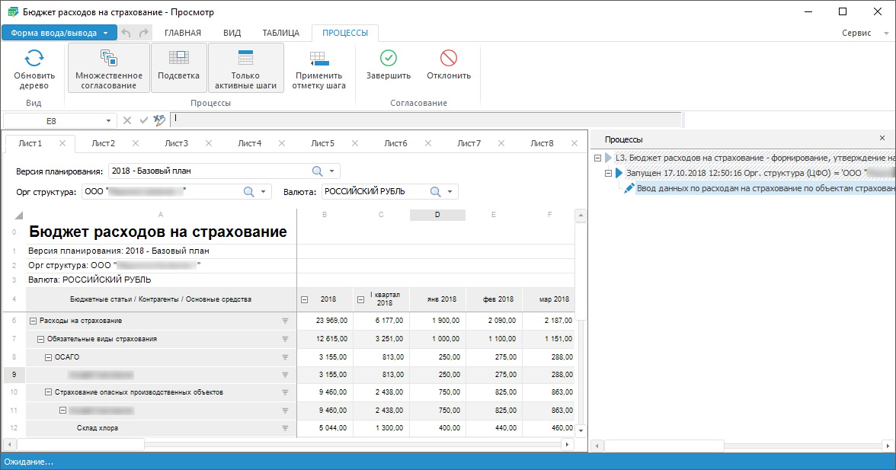

# Ввод и согласование данных в бизнес-процессах

Ввод и согласование данных в бизнес-процессах
-

# Ввод и согласование данных в бизнес-процессах

Для выполнения шагов процесса ввода или согласования данных используйте:

	- панель и вкладку «Процессы»;

	- кнопки  «Завершить»/«Согласовать» и  «Отклонить» на вкладке «Главная» ленты
	 инструментов, если установлен флажок «[Автоматически запрашивать
	 данные об активных процессах](../Starting/Starting.htm#process)».

Для добавления обработчиков для кнопок  «Завершить»/«Согласовать»
 и  «Отклонить» на вкладке «Главная»
 или вкладке «Процессы» ленты инструментов
 используйте диалог «[Параметры](../Starting/Starting.htm#process)».

Примечание.
 Работа с бизнес-процессами доступна только при установленном расширении
 «[Управление бизнес-процессами](BPM.chm::/Modeling_of_business_processes.htm)».

Для корректной работы бизнес-процессов в форме ввода [отметка
 по измерениям](BPM.chm::/Desktop/Facility_Agreement/Configuring_the_Authorization_Object.htm) объекта полномочий должна полностью содержаться
 в [отметке по измерениям](../Table/Select_dimension_elements.htm)
 формы ввода, используемой в шаге процесса. Отметка по измерениям формы
 ввода не изменяется при настройке фильтрации данных [табличной
 области](../Table/AreaTable.htm):

	- [добавление фильтра](../Table/Table_Area_Structure.htm#add);

	- [фильтрация
	 общих измерений по связанным атрибутам](../Table/Table_Area_Structure.htm#filter);

	- [фильтрация данных в столбцах
	 таблицы](FilterSearch.htm#filter).

Параметры фильтрации влияют только на отображение данных.

Особенности взаимодействия формы ввода с [объектом
 полномочий](BPM.chm::/Desktop/Facility_Agreement/Create_Authorization_Object.htm):

	- если в объекте полномочий содержится несколько кубов с отметками
	 по измерениям, например: куб А и куб B, то в форме ввода должен содержаться
	 хотя бы один источник данных с отметкой, которая одновременно содержится
	 в отметках куба А и куба В;

	- если в нескольких формах ввода используются данные из одного объекта
	 полномочий, то результат выполнения/отклонения шагов может быть сохранен
	 во всех формах ввода, если они были указанны в [мастере
	 шага](BPM.chm::/Desktop/Process/StepsProcess/Data_Entry.htm#data_entry_form). Ввод и согласование данных будут доступны
	 в любой из указанных форм ввода.

Способы ввода и согласования данных в бизнес-процессах:

	- [с использованием
	 дерева процессов](#process_tree). На панели «Процессы»
	 формируется дерево запущенных процессов в зависимости от отметок по
	 измерениям, расположенным в табличных областях на всех загруженных
	 листах формы ввода. По умолчанию при создании формы ввода установлен
	 флажок «[Загрузка
	 только активного листа](../Starting/Starting.htm#multiexecutor)» для ускорения работы. Если флажок снят,
	 то при открытии формы ввода загружаются данные всех листов. Такой
	 способ ввода и согласования данных позволяет управлять одним конкретным
	 шагом или несколькими выбранными шагами бизнес-процессов;

	- [без
	 использования дерева процессов](#withuot_process_tree). Список запущенных процессов
	 не отображается, но их управление зависит от отметок по измерениям,
	 расположенным в табличных областях только на активном листе формы
	 ввода. Такой способ ввода и согласования данных позволяет управлять
	 общими шагами на основе отметок активного листа без возможности выбора
	 управления конкретными шагами бизнес-процессов.

Примечание.
 При открытии формы ввода в бизнес-процессах параметры и отметка по измерениям
 объекта полномочий передаются в форму ввода, а при открытии формы ввода
 в навигаторе объектов отметка по измерениям формы ввода передаётся в бизнес-процессы
 в зависимости от способа ввода и согласования данных. В открытой форме
 ввода может отличаться количество шагов для завершения, согласования и
 отклонения в зависимости от полученной отметки.

В зависимости от выбранного способа ввода и согласования данных отличается
 подсвечиваемый диапазон ячеек, доступный для редактирования:

	- если дерево процессов используется, то подсвечиваемые диапазоны
	 ячеек объединяются по отметкам измерений, содержащимся на всех загруженных
	 листах формы ввода;

	- если дерево процессов не используется, то подсвечивается диапазон
	 ячеек только по отметке измерений, содержащейся на активном листе
	 формы ввода.

## Ввод и согласование данных с использованием
 дерева процессов

Для отображения панели и вкладки «Процессы»
 нажмите кнопку  «Дерево процессов», расположенную
 на вкладке «Вид» ленты инструментов.

Панель «Процессы» содержит дерево
 [процессов](BPM.chm::/Desktop/Starting/Monitoring_process_execution.htm),
 связанных с формой ввода:

В дереве процессов отображаются только запущенные шаги процессов, доступные
 для пользователя в данной форме ввода. Если форма не указана в шаге процесса,
 то панель будет пустая.

Для закрытия панели переведите в ненажатое состояние кнопку  «Дерево
 процессов» или нажмите кнопку  «Закрыть» на панели процессов.

В зависимости от настроек процесса можно выполнять шаги:

	- [ввод
	 и редактирование данных](BPM.chm::/Desktop/Process/StepsProcess/Data_Entry.htm);

	- [согласование
	 данных](BPM.chm::/Desktop/Process/StepsProcess/Agreement.htm).

Для настройки и выполнения шага выберите его на панели «Процессы».
 При выборе шага происходит переход к табличной области, привязанной к
 шагу, если источник данных находится на другом листе, то при выборе шага
 происходит переход на этот лист к табличной области. При множественном
 выделении шагов переход не осуществляется.

Для определения настроек выполнения шагов процесса используйте вкладку
 «Процессы». Настройка доступна
 только в настольном приложении.

Доступные операции:

	- Обновление дерева процесса.
	 Если были изменены настройки запущенных процессов, запущен ещё один
	 процесс доступный для этого пользователя в данной форме или выполнены
	 шаги доступные другим пользователям, то обновите дерево процессов.
	 Для этого нажмите кнопку  «Обновить дерево процессов»;

	- Выбор нескольких шагов.
	 Для выполнения ввода или согласования данных одновременно для нескольких
	 шагов нескольких процессов выберите их в дереве процессов. Для этого:

		- Нажмите кнопку  «Множественное выделение».

		- Выберите шаги. Выделенные шаги могут быть разных типов.

Если были выбраны несколько шагов, а потом
 кнопка  «Множественное
 выделение» была переведена в ненажатое состояние, то выделенным
 останется первый выделенный шаг;

	- Настройка подсветки диапазона.
	 Для настройки подсветки диапазона, доступного на этом шаге, нажмите
	 кнопку  «Подсветка».
	 При множественном выделении шагов подсвечиваемые диапазоны объединяются.
	 При зажатой кнопке выделите шаг/шаги на панели процессов при этом
	 на форме ввода подсветится диапазон, на который у пользователя есть
	 права, данные недоступные для редактирования заблокированы. По умолчанию
	 кнопка нажата;

	- Отображение активных шагов
	 процессов. Для отображения только активных шагов запущенных
	 процессов доступных для пользователя в данной форме ввода нажите кнопку
	  «Только активные шаги». При переведении
	 кнопки в ненажатое состояние будут отображены все шаги запущенных
	 процессов доступных для пользователя в данной форме. По умолчанию
	 кнопка нажата;

	- Применение отметки шага.
	 Для применения отметки шага, настроенной при создании шага в процессе,
	 нажмите кнопку  «Применить
	 отметку шага». Отметка будет перестроена согласно настройкам
	 шага. Кнопка становится активной, если был выбран один шаг;

	- Завершение шага или отклонение.
	 Кнопки завершения шага и отклонения становятся активными, если был
	 выбран хотя бы один шаг. В зависимости от типа шага процесса кнопка
	 завершения шага меняет наименование: для активного шага процесса «Ввод данных» наименование кнопки
	  «Завершить», для шага «Согласование» -
	  «Согласовать». При множественном
	 выделении шагов разных типов наименование кнопки выбирается в зависимости
	 от типа первого выделенного шага. Название кнопки отклонения неизменно:
	  «Отклонить».

На шаге «Ввод
 данных»:

		- Введите данные или редактируйте их в доступном диапазоне.

		- Сохраните данные, нажав кнопку  «Сохранить изменения» на вкладке
		 «Главная» ленты инструментов.

Примечание.
 Если данные были введены или изменены, для них был [настроен контроль](../Table/Calculation_Practices.htm)
 и они не прошли этот контроль, то при сохранении будет выведено информационное
 сообщение, что требуется корректировка введенных данных.

		- Нажмите кнопку  «Завершить»
		 для завершения шага и перехода к следующему шагу.

Если нажать кнопку  «Завершить» без сохранения данных,
 то будет предложено сохранить их перед завершением шага.

Примечание.
 Если данные были введены или изменены, для них был [настроен контроль](../Table/Calculation_Practices.htm)
 и они не прошли этот контроль, то при завершении шага будет выведено предупреждение,
 что измененные данные не будут сохранены, так как не удовлетворяют настройкам
 контролей. При согласии продолжить без сохранения измененные данные будут
 сброшены и выведено окно подтверждения завершения шага. При отказе продолжить
 без сохранения измененные данные останутся в табличной области.

На шаге «Согласование» проверьте корректность
 введенных данных и нажмите кнопку  «Согласовать» в случае когда данные
 верны, в противном случае нажмите кнопку  «Отклонить». Табличная область на
 этом шаге процесса не обновляется, права доступа обновляются только для
 текущей отметки шага.

После нажатия кнопки  «Завершить»/«Согласовать»
 завершенный шаг пропадает из дерева процессов, если отображаются только
 активные шаги. Если отображаются все шаги доступных процессов, то шаг
 станет неактивным и пиктограмма, обозначающая [тип
 шага](BPM.chm::/Desktop/Process/StepsProcess/CreateStepsProcess.htm#open_wizard), изменит цвет в зависимости от [статуса
 шага](BPM.chm::/Desktop/Starting/Monitoring_process_execution.htm#status).

Кнопка  «Отклонить» используется для возвращения
 к предыдущему шагу процесса.

Если шаг/шаги уже были выполнены и нет активных
 шагов в дереве процессов доступных для пользователя в этой форме, то кнопки
 завершения шага и отклонения недоступны.

## Ввод и согласование данных без использования
 дерева процессов

Для отображения кнопок  «Завершить»/«Согласовать» и  «Отклонить» на вкладке «Главная» ленты
 инструментов установите флажок «[Автоматически
 запрашивать данные об активных процессах](../Starting/Starting.htm#process)».

Если для пользователя есть активные шаги при данных значениях параметров,
 если параметры есть, на текущем активном листе, то:

	- станут активными кнопки  «Завершить»/«Согласовать» и  «Отклонить». Для активного шага процесса
	 «Ввод данных» наименование
	 кнопки  «Завершить», для шага «Согласование» -
	  «Согласовать», если форма подключена
	 к нескольким процессам, то первым будет первый шаг последнего запущенного
	 процесса;

	- отобразится подсветка всех диапазонов, связанных с активными
	 шагами. При вводе данных несвязанные ячейки будут заблокированы;

	- если на листе несколько активных шагов, то при нажатии на кнопки
	  «Завершить»/«Согласовать»
	 и  «Отклонить» действие будет применено
	 сразу ко всем активным шагам, при этом будет выведено сообщение для
	 подтверждения действия. Если действие должно быть применено не ко
	 всем активным шагам, то используйте панель и вкладку «Процессы»,
	 с помощью которых произведите требуемые действия. При этом кнопки
	  «Завершить»/«Согласовать»
	 и  «Отклонить» перестанут отображаться
	 на вкладке «Главная» ленты
	 инструментов. При закрытии панели «Процессы»
	 кнопки  «Завершить»/«Согласовать»
	 и  «Отклонить» снова отобразятся на
	 вкладке «Главная» ленты инструментов.
	 Комментарии, введенные при выполнении шагов, будут относится ко всем
	 выполняемым шагам.

Закончив согласование, перейдите к шагу, если требуется:

	- [Расширение функциональности](../Custom_module/Advanced.htm);

	- [Работа с готовыми формами ввода](FinishForm.htm);

	- [Печать формы ввода](../Common/ParamPage.htm).

См. также:

[Начало
 работы с расширением «Интерактивные формы ввода данных» в веб-приложении](../../Web/Starting/Starting.htm) |
 [Работа с готовой формой ввода](FinishForm.htm)

		Справочная
		 система на версию 10.9
		 от 18/08/2025,
		 © ООО «ФОРСАЙТ»,
