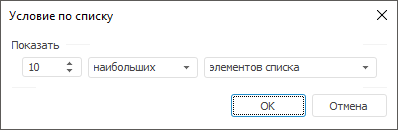
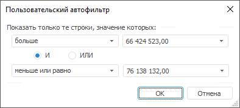

# Сортировка и фильтрация: Формы ввода

Сортировка и фильтрация: Формы ввода
-

# Сортировка и фильтрация

Используйте сортировку и фильтрацию, если требуется.

## Сортировка

Данные в таблице можно отсортировать по столбцам и/или по строкам.

Установка сортировки для выбранного столбца/строки осуществляется с
 помощью значков сортировки, расположенных в заголовках строк/столбцов.
 Значки отображаются при включении сортировки. Для включения сортировки
 нажмите кнопку  «Сортировка» на вкладке «Таблица»
 ленты инструментов.

При последовательном нажатии на любой из значков его вид изменяется,
 и, соответственно, меняется вид сортировки:

	- .
	 Сортировка по убыванию (в случае с текстовыми значениями - от Я до
	 А);

	- .
	 Сортировка по возрастанию (в случае с текстовыми значениями - от А
	 до Я).

## Фильтрация

Фильтрация данных позволяет отобразить в таблице только те данные, которые
 соответствуют заданным условиям.

Фильтрация данных в столбцах таблицы осуществляется при помощи кнопок  «Настройки фильтрации» в заголовках
 столбцов. Для отображения кнопок  «Настройки фильтрации» нажмите кнопку
  «Фильтрация» на вкладке «Таблица»
 ленты инструментов.

В результате применения фильтрации в таблице будут отображаться все
 элементы отмеченные в списке, сформированном из всех значений фильтруемых
 строк. У столбцов, для которых настроена фильтрация, кнопка примет вид: .

В меню кнопки  «Настройки
 фильтрации» доступны команды:

	- Снять фильтр. Операция
	 предназначена для отображения всех строк. Доступна если для столбца
	 была настроена фильтрация;

	- Первые N. Операция предназначена
	 для вывода указанного количества элементов списка в окне «Условие
	 по списку»:

В данном окне можно установить параметры:

		- Количество строк.
		 Поле ввода, с помощью которого можно определить количество отображаемых
		 строк;

		- Признак. Определяет
		 какие элементы будут отображаться - наибольшие или наименьшие;

		- Условие выбора.
		 Определяет каким образом задается количество элементов - явно
		 или в процентах от количества элементов;

Примечание.
 Данный фильтр будет недоступен, если в фильтруемых строках отсутствуют
 числовые значения.

	- Настроить фильтр. Операция,
	 предназначенная для определения условий фильтрации в окне «Пользовательский
	 автофильтр»:

В данном окне можно установить параметры:

		- Условие
		 выбора. Раскрывающийся список, определяющий условие для
		 отображения элементов:

			- равно;

			- не равно;

			- больше;

			- больше или равно;

			- меньше;

			- меньше или равно;

			- начинается с;

			- не начинается с;

			- заканчивается на;

			- не заканчивается на;

			- содержит;

			- не содержит;

		- Значение.
		 Раскрывающийся список, определяющий значение условия для отображения
		 элементов. Данный список элементов содержит все значения столбца,
		 отсортированные без учета регистра. Регистр учитывается только
		 при совпадении значений;

		- Условия
		 фильтрации. Переключатель, определяющий порядок использования
		 двух условий одновременно:

			- И. Отображаются
			 строки, удовлетворяющие обоим условиям;

			- ИЛИ. отображаются
			 строки, удовлетворяющие хотя бы одному из двух условий.

Для выключения фильтрации сразу для всех столбцов переведите кнопку
  «Фильтрация» на вкладке «Таблица»
 ленты инструментов в ненажатое состояние.

Настройка и сохранение фильтрации в табличной области формы ввода доступно
 с помощью [пользовательских настроек](Custom_settings.htm).

Закончив выполнять сортировку и фильтрацию, перейдите к шагу, если требуется:

	- [Добавление новых записей](New_entries.htm);

	- [Использование интерактивных элементов
	 для управления отметкой](UseControls.htm);

	- [Настройка вида отображения](View.htm);

	- [Поиск и замена](Find_and_Replace.htm);

	- [Экспорт формы ввода](../Common/Export.htm);

	- [Предварительный просмотр и
	 печать формы ввода](../Common/ParamPage.htm).

См. также:

[Начало
 работы с расширением «Интерактивные формы ввода данных» в веб-приложении](../../Web/Starting/Starting.htm) |
 [Работа с готовой формой ввода](FinishForm.htm)

		Справочная
		 система на версию 10.9
		 от 18/08/2025,
		 © ООО «ФОРСАЙТ»,
