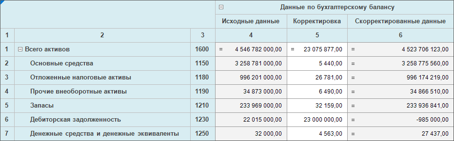

# Нумерация и транспонирование

Нумерация и транспонирование
-

# Нумерация и транспонирование

Используйте нумерацию и транспонирование, если требуется.

## Нумерация

Для табличной области можно настроить нумерацию строк и столбцов.

Для включения нумерации для строк и столбцов нажмите кнопку  «Нумерация» на вкладке «Таблица»
 ленты инструментов. Если при создании или редактировании табличной области
 не была настроена нумерация, то по умолчанию:

	- номера строк отобразятся отдельным столбцом боковика перед заголовками.
	 Нумерация начинается со строк с данными;

	- номера столбцов отобразятся отдельной строкой шапки после заголовков.
	 Нумерация начнется с первого столбца боковика.

Для включения нумерации только для строк установите флажок «По
 строкам» в раскрывающемся меню кнопки  «Нумерация».

Для включения нумерации только для столбцов установите флажок «По столбцам» в раскрывающемся меню
 кнопки  «Нумерация».

В веб-приложении можно настроить область размещения нумерации. Для этого
 выполните команду «По строкам >
 Перед заголовком»/«По строкам >
 После заголовка» или «По столбцам >
 Перед заголовком»/«По столбцам >
 После заголовка» в раскрывающемся меню кнопки  «Нумерация».

Настройку нумерации необходимо проводить [при
 создании или редактировании табличной области](../Table/Numbering.htm).

## Транспонирование

Табличную область можно транспонировать: измерения боковика располагать
 в шапке, а измерения шапки - в боковике.

Для транспонирования табличной области нажмите кнопку  «Транспонировать»
 на вкладке «Таблица» ленты инструментов.

Примечание.
 Транспонировать табличную область можно при [редактировании](../Table/Table_Area_Structure.htm#transpose).

При транспонировании:

	- сохраняется [поведение
	 размещения строк/столбцов](../Table/Basic_Properties.htm#behavior);

	- сохраняются настройки, привязанные к измерениям/уровням/элементам:
	 [группировка](../Table/Sidehead/Advanced_Structure_Settings.htm#group),
	 [объединение](../Table/Merging_Dim.htm), [поджатие](../Table/Merging_Dim.htm#press),
	 [расшифровка](../Table/Detail_dimensions.htm), [нумерация](../Table/Numbering.htm)
	 и применяются для соответствующих измерений/уровней/элементов там,
	 где они размещаются после транспонирования;

	- сохраняются настройки, привязанные к уголку: если отображались
	 наименования измерений из шапки, после транспонирования будут отображаться
	 наименования измерений, располагающиеся в шапке после транспонирования;
	 если отображались наименования измерений из боковика, после транспонирования
	 будут отображаться наименования измерений, располагающиеся в боковике
	 после транспонирования;

	- сохраняется настройка «[Многоуровневая
	 шапка таблицы](../Table/Heading/Advanced_Heading_Settings.htm#layeredheader)» для шапки: настройка применяется для измерений,
	 располагающихся в шапке после транспонирования. Если измерения, находящиеся
	 до транспонирования в боковике, были объединены и была настроена многоуровневая
	 шапка таблицы, то при просмотре формы ввода кнопка  «Транспонировать»
	 на вкладке «Таблица» ленты
	 инструментов будет не активна;

	- автофильтр сбрасывается.

При повторном транспонировании табличная область примет первоначальный
 вид.

Примечание.
 Если в форме ввода есть табличная область, для которой была настроена
 [блокировка сохранения
 измененных данных](../Table/Calculation_Practices.htm#block) при сработавшем контроле, и измененные данные, которые
 не были сохранены, то будет выведено предупреждение, что измененные данные
 не будут сохранены, так как не удовлетворяют настройкам контролей. При
 согласии продолжить действие измененные данные будут сброшены и действие
 выполнено. При отказе продолжить действие измененные данные останутся
 в табличной области.

См. также:

[Начало
 работы с расширением «Интерактивные формы ввода данных» в веб-приложении](../../Web/Starting/Starting.htm) |
 [Работа с готовыми формами](FinishForm.htm)

		Справочная
		 система на версию 10.9
		 от 18/08/2025,
		 © ООО «ФОРСАЙТ»,
