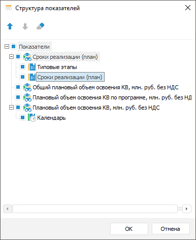

# Настройка внешнего вида: Формы ввода

Настройка внешнего вида: Формы ввода
-

# Настройка внешнего вида

Для настройки внешнего вида готовой формы ввода:

	- Настройте вид отображения.

	- [Настройте оформление](../Common/Design.htm#format).

	- Настройте отображаемые показатели.

Настройки вида отображения, оформления и отображаемых показателей формы
 ввода относятся к [пользовательским настройкам](Custom_settings.htm).
 При просмотре [готовой формы ввода](FinishForm.htm) доступно
 сохранение настроенного вида отображения, оформления и отображаемых показателей
 формы.

Закончив настройку внешнего вида форм, перейдите к шагу, если требуется:

	- [Добавление новых записей](New_entries.htm);

	- [Использование интерактивных элементов
	 для управления отметкой](UseControls.htm);

	- [Сортировка и фильтрация](FilterSearch.htm);

	- [Поиск и замена](Find_and_Replace.htm);

	- [Экспорт формы ввода](../Common/Export.htm);

	- [Предварительный просмотр и
	 печать формы ввода](../Common/ParamPage.htm).

## Настройка вида отображения форм

Для настройки вида отображения форм выполните шаги:

	- Настройте масштаб.

	- Настройте разметку.

	- Настройте размеры строк/столбцов.

	- Настройте отображение элементов рабочей
	 области;

	- Отобразите панель и вкладку «[Процессы](Agreement.htm)».

Для настройки используйте вкладу «Вид»
 ленты инструментов.

[Изменение
 масштаба](javascript:TextPopup(this))

	Для изменения масштаба:

		- нажмите кнопку  «Масштаб». После чего будет открыто
		 раскрывающееся меню:

	

	Выполните одно из действий:

			- установите переключатель напротив одного из фиксированных
			 значений масштаба;

			- выполните команду «Произвольный».
			 После чего будет открыто окно «Масштаб»
			 для указания произвольного значения масштаба:

	

		- установите фокус на листе и, удерживая клавишу CTRL, прокрутите
		 колесико мыши. При прокручивании колесика вверх масштаб будет
		 увеличиваться, при прокручивании вниз - уменьшаться.

	Для отображения полноразмерной формы нажмите кнопку  «100%».

[Закрепление
 областей](javascript:TextPopup(this))

	Для постоянного отображения на экране областей формы при прокрутке,
	 закрепите нужные области:

		- для закрепления первой строки выполните команду «Закрепить
		 верхнюю строку» в раскрывающемся меню кнопки  «Закрепить
		 области»;

		- для закрепления крайнего левого столбца выполните команду
		 «Закрепить первую колонку»
		 в раскрывающемся меню кнопки  «Закрепить области»;

		- для закрепления области, включающей несколько строк и столбцов:

			- выделите ячейку, левый верхний угол которой будет определять
			 закрепленные строки и столбцы;

			- выполните команду «Закрепить
			 области» в раскрывающемся меню кнопки  «Закрепить
			 области».

	Для снятия закрепления с областей выполните команду «Закрепить
	 области > Снять закрепление областей» группы «Разметка».

[Отображение
 элементов графического интерфейса](javascript:TextPopup(this))

	Для отображения/скрытия полос прокрутки, строки формул, заголовков
	 и сетки установите/снимите флажок.

[Подгонка
 размеров строк/столбцов](javascript:TextPopup(this))

	Для автоматического подбора размера по содержимому строки/столбца
	 нажмите кнопки «Подогнать высоту
	 строки»/«Подогнать ширину
	 столбца».

[Отображение
 панели и вкладки «Процессы»](javascript:TextPopup(this))

	Для отображения панели и вкладки «Процессы»
	 нажмите кнопку  «Дерево
	 процессов». Панель и вкладка «Процессы»
	 используется при выполнении шагов процесса ввода или согласования
	 данных, если форма ввода связана с [процессом](BPM.chm::/Modeling_of_business_processes.htm).

	Примечание.
	 Кнопка  «Дерево процессов» доступна только
	 при установленном расширении «[Управление бизнес-процессами](BPM.chm::/Modeling_of_business_processes.htm)».

## Настройка отображаемых показателей

Для настройки отображаемых показателей в табличной области при просмотре
 готовой формы используйте диалог «Структура
 показателей». Данная настройка является [пользовательской](Custom_settings.htm),
 т.е. настроенные с помощью данного диалога состав и порядок показателей
 будет сохранен для данного пользователя и будет отображаться при просмотре
 только для него. Для вызова диалога выделите ячейки, принадлежащие табличной
 области, и нажмите кнопку  «Структура
 показателей» на вкладке «Таблица»
 ленты инструментов:

В окне отображается список показателей табличной области с их частными
 измерениями и измерениями, выведенными в шапку. Показатели, которые используются
 в качестве фильтров, в списке не отображаются.

Для скрытия показателей, частных измерений показателей и измерений,
 выведенных в шапку, снимите флажок напротив них.

Для изменения порядка отображения показателей, частных измерений показателей
 и измерений, выведенных в шапку, используйте кнопки  «Переместить вверх» и  «Переместить
 вниз».

Для сохранения настроек выполните команду «Форма
 ввода/вывода > Сохранить» в главном меню.

Для возвращения к исходным настройкам используйте кнопку  «Очистить».

Если при редактировании формы ввода для табличной области была настроена
 [агрегация фиксированных
 измерений](../Table/Table_Area_Structure.htm#aggregation), то при скрытии измерений показателей отметка по элементам
 скрываемых измерений останется прежней и значения будут агрегироваться.
 Если агрегация была выключена, то отмечается первый элемент из текущей
 отметки скрываемых измерений. При включении видимости измерений отметка
 восстанавливается до той, которая была до скрытия.

При скрытии измерений показателей сохраняются заданные настройки [фильтрации](FilterSearch.htm#filter).

См. также:

[Начало
 работы с расширением «Интерактивные формы ввода данных» в веб-приложении](../../Web/Starting/Starting.htm) |
 [Работа с готовой формой ввода](FinishForm.htm)

		Справочная
		 система на версию 10.9
		 от 18/08/2025,
		 © ООО «ФОРСАЙТ»,
