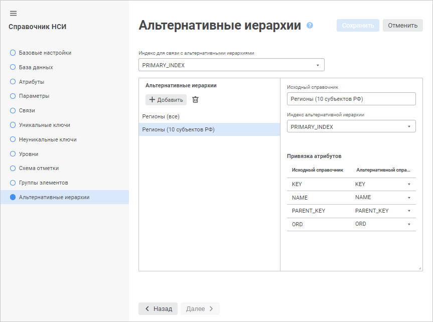
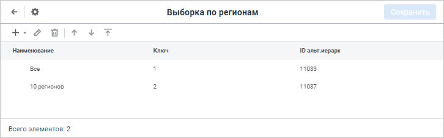
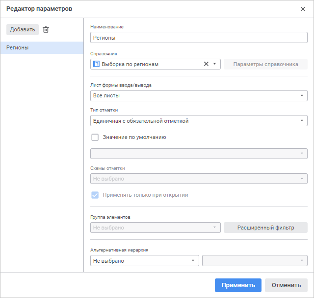
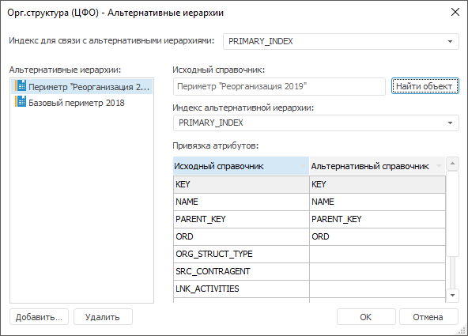
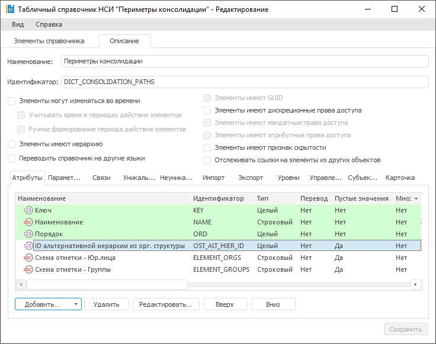
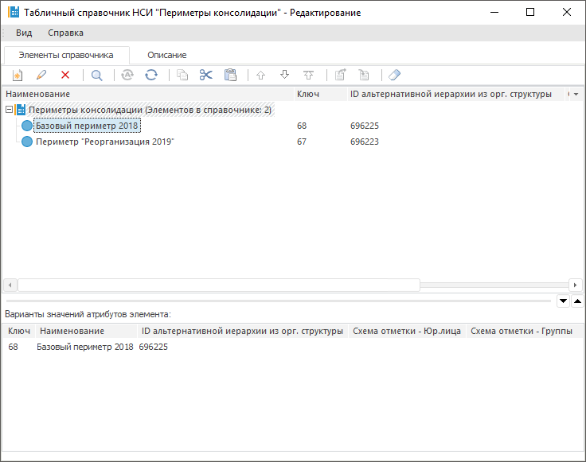
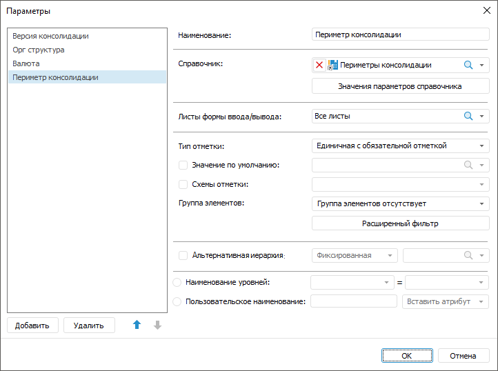

# Как настроить динамическое изменение отображаемых элементов измерения боковика

Как настроить динамическое изменение отображаемых элементов измерения боковика
-

# Как настроить динамическое изменение отображаемых элементов измерения
 боковика?

Для динамического изменения отображаемых элементов измерения боковика
 в веб-приложении настройте источники данных:

	- Настройте [альтернативные
	 иерархии](UiNavObj.chm::/reference_book/look-and-feel_Reference_book/Attributes_as_alt_hier.htm) справочника, который будет отображаться
	 в качестве измерения боковика.

	- Настройте справочник, к которому будет привязан параметр, управляющий
	 альтернативными иерархиями:

		- Добавьте [атрибут](UiNavObj.chm::/reference_book/Master_RDS_reference_book/Attributes/Attribute.htm)
		 для управления иерархиями.

		- Укажите ключ справочника альтернативной иерархии в качестве
		 значения атрибута.

Затем произведите настройки в форме ввода открыв её на редактирование:

	- [Добавьте параметр](../Web/Parameters/Parameters.htm)
	 для управления альтернативными иерархиями.

	- Настройте [структуру
	 боковика](../Web/Table/Select_dimension_elements.htm). Укажите альтернативную иерархию для измерения:

		- Выберите тип альтернативной иерархии «Динамический».

		- Выберите атрибут для управления иерархиями в параметре.

В результате при изменении значения параметра боковик табличной области
 будет отстраиваться в соответствии с альтернативной иерархией, соответствующей
 этому значению.

[Пример
 настройки динамического изменения отображаемых элементов измерения боковика
 в настольном приложении](javascript:TextPopup(this))

	Для динамического изменения отображаемых элементов измерения боковика
	 в настольном приложении настройте источники данных:

		- Настройте [альтернативные
		 иерархии](UiNavObj.chm::/reference_book/look-and-feel_Reference_book/Attributes_as_alt_hier.htm) справочника, который будет отображаться
		 в качестве измерения боковика.

	

		- Настройте справочник, к которому будет привязан параметр, управляющий
		 альтернативными иерархиями:

			- Добавьте [атрибут](UiNavObj.chm::/reference_book/Master_RDS_reference_book/Attributes/Attribute.htm)
			 для управления иерархиями.

	

			- Укажите ключ справочника альтернативной иерархии в качестве
			 значения атрибута.

	

	Затем произведите настройки в форме ввода открыв её на редактирование:

		- [Добавьте
		 параметр](../Desktop/Parameters/Parameters.htm) для управления альтернативными иерархиями.

	

		- Настройте [структуру
		 боковика](../Desktop/Table/Sidehead_Structure.htm). Укажите альтернативную иерархию для измерения:

			- Выберите тип альтернативной иерархии «Динамический».

			- Выберите атрибут для управления иерархиями в параметре.

	В результате при изменении значения параметра боковик табличной
	 области будет отстраиваться в соответствии с альтернативной иерархией,
	 соответствующей этому значению.

См. также:

[Вопросы и ответы](FAQ.htm)

		Справочная
		 система на версию 10.9
		 от 18/08/2025,
		 © ООО «ФОРСАЙТ»,
