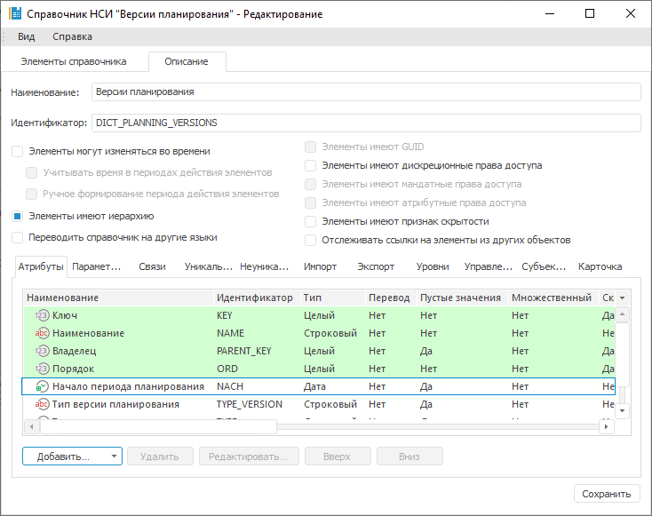
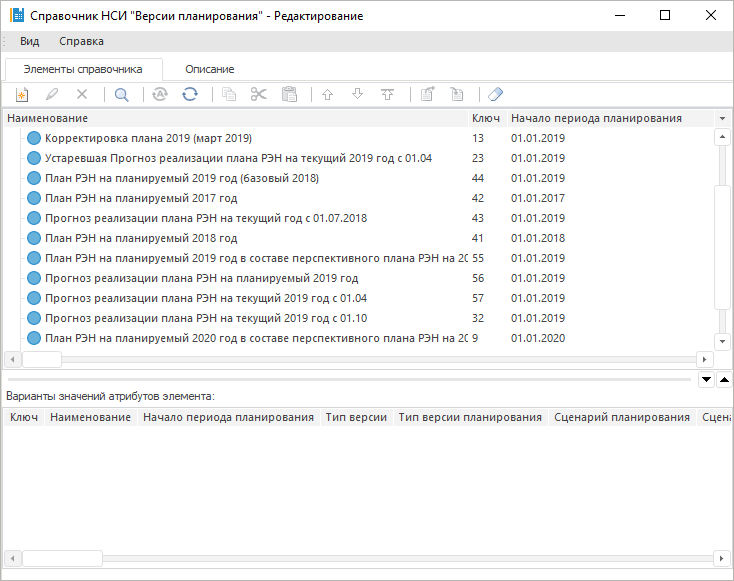
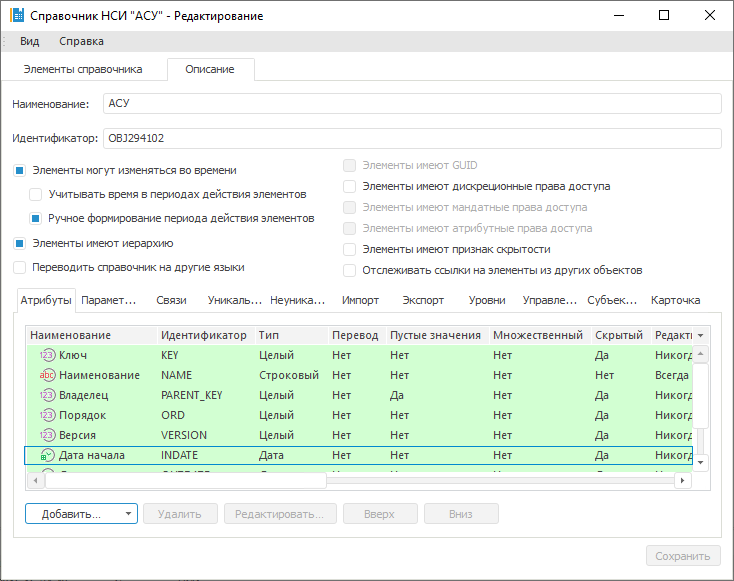
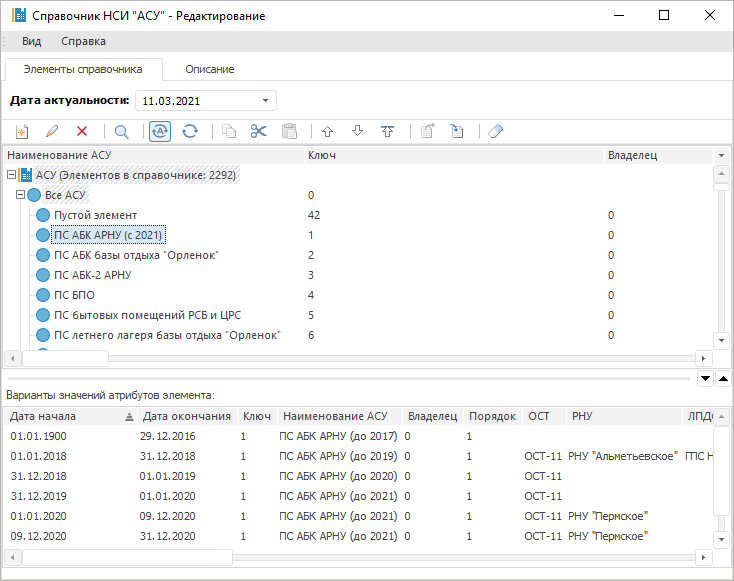
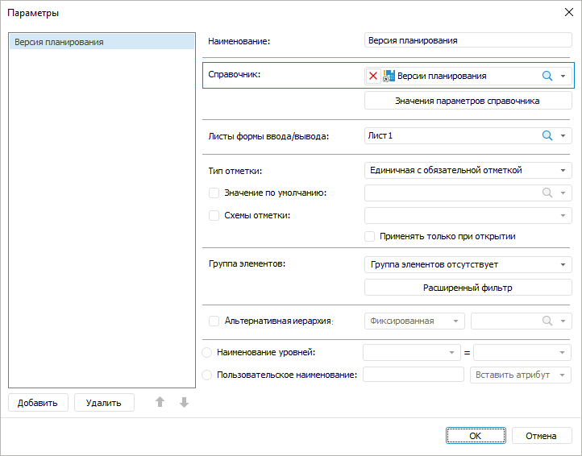
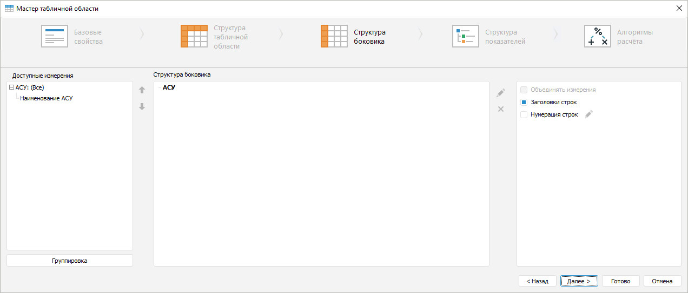
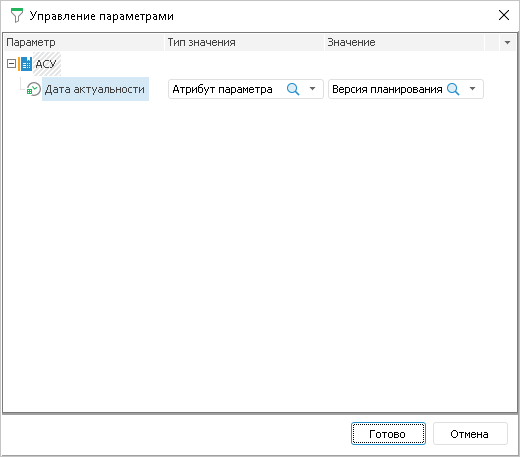
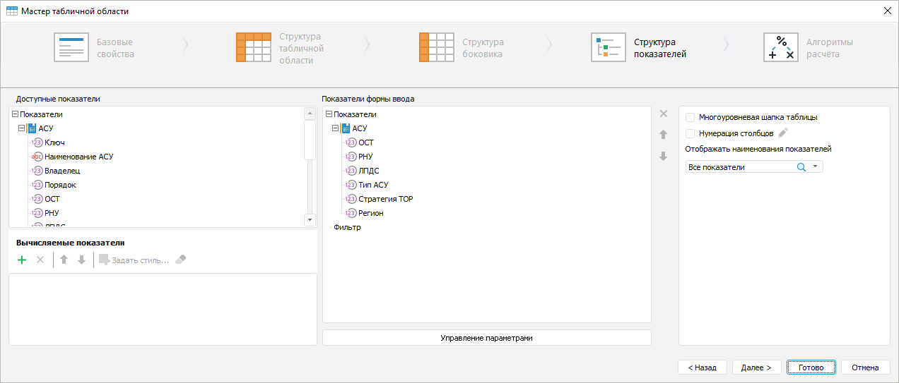

# Как настроить управление параметрами измерения боковика

Как настроить управление параметрами измерения боковика
-

# Как настроить управление параметрами измерения боковика

Для управления параметрами измерения боковика:

	- Настройте [справочник
	 НСИ](UiNavObj.chm::/reference_book/Master_RDS_reference_book/Master_RDS.htm),
	 используемый в качестве параметра формы ввода.

		- [Добавьте
		 атрибут](UiNavObj.chm::/reference_book/Master_RDS_reference_book/Attributes.htm), который будет управлять параметром
		 измерения боковика:

		- Заполните справочник значениями:

Для разных элементов есть различные значения
 атрибута «Начало периода планирования».

	- Настройте справочник, используемый в качестве измерения боковика.

		- [Добавьте
		 параметр](UiNavObj.chm::/reference_book/Master_RDS_reference_book/Parameters.htm) справочника. В примере добавлен параметр
		 «[Дата
		 актуальности](UiNavObj.chm::/reference_book/Master_RDS_reference_book/base_settings.htm#change_in_time)»:

		- Заполните справочник значениями:

Для элемента «ПС
 АБК АРНУ» для разных дат указаны различные значения атрибутов справочника:
 «Наименование», «ОСТ»,
 «РНУ» и прочие.

	- Добавьте в форму ввода [параметр](../Desktop/Parameters/Parameters.htm).
	 Задайте в настройках справочник, настроенный в шаге 1:

	- Добавьте в форму ввода [табличную
	 область](../Desktop/Table/AreaTable.htm).

		- Добавьте в качестве [измерения
		 боковика](../Desktop/Table/Table_Area_Structure.htm#add) справочник, настроенный в шаге 2:

		- Выполните команду «Управление параметрами» контекстного
		 меню измерения. В открывшемся диалоге укажите:

			- Параметр - Дата актуальности;

			- Тип значения - Атрибут параметра;

			- Значение - атрибут «Начало
			 периода планирования» параметра «Версия
			 планирования»:

		- Выведите остальные [атрибуты
		 измерения боковика](../Desktop/Table/Heading/Displaying_Dimension_Attribute.htm) в шапку:

		- Завершите настройку табличной области.

В результате в форме ввода при изменении значения параметра будут изменяться
 наименование, ОСТ, РНУ и прочие атрибуты элемента боковика.

См. также:

[Вопросы и ответы](FAQ.htm) |
 [Настройка структуры
 боковика](../Desktop/Table/Sidehead_Structure.htm)

		Справочная
		 система на версию 10.9
		 от 18/08/2025,
		 © ООО «ФОРСАЙТ»,
