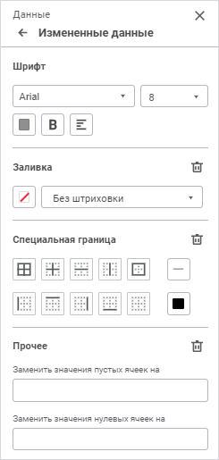

# Настройка измененных данных

Настройка измененных данных
-

# Настройка измененных данных

Для настройки оформления данных, измененных в таблице, но еще не сохраненных
 в табличной области используйте группу параметров «Измененные
 данные» [панели параметров](../Starting/Starting.htm#elements):

[Для открытия
 группы параметров «Измененные данные»](javascript:TextPopup(this))

	Для открытия на панели параметров группы параметров «Измененные
	 данные»:

		- Выделите ячейку или диапазон ячеек, принадлежащих табличной
		 области.

		- Нажмите кнопку  «Параметры» панели инструментов.

		- Выберите тип области «Данные»
		 в раскрывающемся меню заголовка панели параметров.

Задайте параметры:

[Шрифт](javascript:TextPopup(this))

	Для настройки шрифта выберите:

		- Шрифт. Выберите
		 один из шрифтов в раскрывающемся списке. При необходимости можно
		 загрузить [пользовательские
		 шрифты](Setup.chm::/UiWebSetup/03_Setup_Web/General_for_linux/Loading_Custom_Fonts.htm);

		- Размер. Установите
		 требуемый размер шрифта. Размер задаётся в пунктах, и его можно
		 выбрать из раскрывающегося списка или ввести вручную. Диапазон
		 допустимых значений: [6; 36];

		- Цвет. Выберите цвет
		 шрифта в раскрывающейся палитре цветов. Для выбора доступны стандартные
		 и пользовательские цвета. По умолчанию палитра содержит только
		 стандартные цвета.

	Для создания пользовательского цвета:

			- Нажмите кнопку  «Добавить
			 цвет». Откроется расширенная палитра цветов.

			- Выберите цвет в расширенной
			 палитре цветов, на странице браузера с помощью пипетки или
			 задайте код цвета в формате RGB/HEX.

	После выполнения действий пользовательский
	 цвет будет создан и добавлен в палитру.

	Примечание.
	 Максимально возможное количество пользовательских цветов в палитре
	 равно 23.

	Для удаления пользовательского цвета
	 из палитры выполните команду «Удалить»
	 контекстного меню выбранного цвета.

		- Начертание. Выберите
		 начертание шрифта:

			- B Полужирное
			 начертание. Доступно также по нажатию сочетания клавиш
			 CTRL+B;

			- I Курсивное
			 начертание. Доступно также по нажатию сочетания клавиш
			 CTRL+I;

			- U
			 Подчеркивание текста.
			 Доступно также по нажатию сочетания клавиш CTRL+U;

	Примечание.
	 Сочетание клавиш CTRL+U, как правило, зарезервировано в браузере для
	 открытия исходного кода текущей страницы. Чтобы использовать указанное
	 сочетание клавиш для подчёркивания текста, переопределите его в настройках
	 используемого браузера.

			- S
			 Зачеркивание текста.
			 Доступно также по нажатию сочетания клавиш ALT+SHIFT+5.

	При нажатой кнопке будет использоваться
	 соответствующий стиль начертания. Доступно использование нескольких
	 стилей одновременно;

		- Выравнивание текста в ячейке.
		 Выберите выравнивание текста относительно ячейки в раскрывающемся
		 списке кнопки  «По
		 левому краю»:

			- 
			 По левому краю. Используется по умолчанию. Доступно
			 также по нажатию сочетания клавиш CTRL+SHIFT+L;

			-  По
			 центру. Доступно также по нажатию сочетания клавиш
			 CTRL+SHIFT+E;

			-  По
			 правому краю. Доступно также по нажатию сочетания клавиш
			 CTRL+SHIFT+R;

	Примечание.
	 Сочетание клавиш CTRL+SHIFT+R, как правило, зарезервировано в браузере
	 для обновления текущей страницы. Чтобы использовать указанное сочетание
	 клавиш для выравнивания текста по правому краю, переопределите его
	 в настройках используемого браузера.

			-  По
			 ширине.

	Выбрать можно только один вариант.

[Заливка](javascript:TextPopup(this))

	Для настройки заливки задайте параметры:

		- Цвет заливки. В
		 раскрывающейся палитре цветов кнопки «Цвет
		 заливки» выберите тип заливки и выполните соответствующие
		 настройки.

	Доступны следующие типы заливки:

			- Без заливки.
			 Нажмите кнопку  «Без цвета». По умолчанию
			 заливка не используется;

			- Сплошная заливка.
			 Откройте вкладку «Один цвет»
			 и выберите цвет однотонной заливки;

			- Двухцветная заливка.
			 Откройте вкладку «Два цвета»
			 и выберите начальный и конечный цвета двухцветного градиента.
			 При необходимости укажите угол наклона.

	Для выбора доступны стандартные и пользовательские
	 цвета. По умолчанию палитра содержит только стандартные цвета.

	Для создания пользовательского цвета:

			- Нажмите кнопку 
			 «Добавить цвет». Откроется
			 расширенная палитра цветов.

			- Выберите цвет в расширенной палитре цветов, на странице
			 браузера с помощью пипетки или задайте код цвета в формате
			 RGB/HEX.

	После выполнения действий пользовательский
	 цвет будет создан и добавлен в палитру:

	Примечание.
	 Максимально возможное количество пользовательских цветов в палитре
	 равно 23.

	Для удаления пользовательского цвета
	 из палитры выполните команду «Удалить»
	 контекстного меню выбранного цвета.

		- Тип штриховки. При
		 необходимости добавьте штриховку. По умолчанию параметр принимает
		 значение «Без штриховки».
		 В раскрывающемся списке содержатся образцы всех возможных штриховок;

		- Цвет штриховки.
		 Параметр отображается после выбора типа штриховки. В раскрывающейся
		 палитре выберите цвет.

	Для выбора доступны стандартные и пользовательские
	 цвета. По умолчанию палитра содержит только стандартные цвета.

	Для создания пользовательского цвета:

			- Нажмите кнопку  «Добавить
			 цвет». Откроется расширенная палитра цветов.

			- Выберите цвет в расширенной
			 палитре цветов, на странице браузера с помощью пипетки или
			 задайте код цвета в формате RGB/HEX.

	После выполнения действий пользовательский
	 цвет будет создан и добавлен в палитру.

	Примечание.
	 Максимально возможное количество пользовательских цветов в палитре
	 равно 23.

	Для удаления пользовательского цвета
	 из палитры выполните команду «Удалить»
	 контекстного меню выбранного цвета.

		- Изображение. Для
		 настройки заливки с изображением используйте параметр «Изображение».
		 По умолчанию переключатель неактивен, настройка заливки ячейки
		 выполняется стандартным способом. Для использования изображения
		 в качестве заливки активируйте переключатель. Для добавления в
		 ячейку изображения нажмите кнопку  «Выберите файл».

	Откроется диалог выбора изображения.
	 Порядок работы с диалогом зависит от используемого браузера. После
	 выбора изображения название файла отобразится в соответствующем поле,
	 заливка ячейки на листе отчёта будет выполнена с использованием изображения.

	Для удаления изображения нажмите кнопку  «Удалить» рядом с названием текстуры.

	Для замены изображения повторно нажмите
	 кнопку  «Выберите
	 файл».

	После выбора изображения будут отображены
	 следующие элементы:

			- Скачать. Нажмите
			 кнопку «Скачать» для
			 экспорта изображения, использованного в качестве заливки;

			- Растянуть изображение.
			 По умолчанию флажок снят, изображение в ячейке соответствует
			 своему исходному размеру. Для того, чтобы подогнать размер
			 изображения под размер ячейки, установите флажок.

	Для сброса заданных настроек заливки нажмите кнопку  «Удалить»
	 рядом с названием вкладки «Заливка».

[Специальная
 граница](javascript:TextPopup(this))

	Для настройки границы выберите:

		- Тип границы. Нажмите
		 соответствующие кнопки типов границ, которые необходимо отобразить:

			- . Все;

			- . Внутренние;

			- . Горизонтальные;

			- . Вертикальные;

			- . Внешние;

			- . Левая;

			- . Верхняя;

			- . Правая;

			- . Нижняя;

			- . Без границы;

		- Тип линии. В раскрывающемся
		 списке кнопки «Линия»
		 выберите тип линии;

		- Цвет. Выберите цвет
		 границы в раскрывающейся палитре цветов. Для выбора доступны стандартные
		 и пользовательские цвета. По умолчанию палитра содержит только
		 стандартные цвета.

	Для создания пользовательского цвета:

			- Нажмите кнопку  «Добавить
			 цвет». Откроется расширенная палитра цветов.

			- Выберите цвет в расширенной
			 палитре цветов, на странице браузера с помощью пипетки или
			 задайте код цвета в формате RGB/HEX.

	После выполнения действий пользовательский
	 цвет будет создан и добавлен в палитру.

	Примечание.
	 Максимально возможное количество пользовательских цветов в палитре
	 равно 23.

	Для удаления пользовательского цвета
	 из палитры выполните команду «Удалить»
	 контекстного меню выбранного цвета.

	Для изменения непрозрачности цвета используйте
	 бегунок или введите значение в процентах при необходимости.

	Для сброса цвета линии границы нажмите
	 кнопку  «Без цвета».

	Для удаления настроек границ нажмите кнопку  «Удалить».

[Прочее](javascript:TextPopup(this))

	Для заполнения пустых или нулевых ячеек введите текст, число или
	 символы в соответствующих полях.

	Значения, которыми заполняются пустые ячейки, в том числе и числовые,
	 не будут сохранены в источнике.

	Для удаления заполнения пустых или нулевых ячеек нажмите кнопку
	  «Удалить».

См. также:

[Настройка оформления
 и вида отображения формы](Design.htm)

		Справочная
		 система на версию 10.9
		 от 18/08/2025,
		 © ООО «ФОРСАЙТ»,
