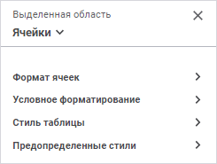
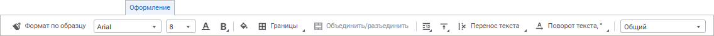
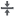

# Настройка оформления и вида отображения формы

Настройка оформления и вида отображения формы
-

# Настройка оформления и вида отображения
 формы ввода

Для настройки внешнего вида формы ввода:

	- Настройте [вид отображения](Design.htm#view).

	- Настройте [оформление](Design.htm#format).

Завершив настройку, перейдите к следующему шагу, если требуется:

	- [Экспорт формы](Export.htm);

	- [Работа с готовыми формами ввода](../Work/FinishForm.htm).

## Настройка вида отображения форм

Для настройки вида отображения форм доступны следующие настройки:

[Изменение масштаба](javascript:TextPopup(this))

	Для изменения [масштаба](../Starting/Starting.htm#elements):

		- выберите одно из фиксированных значений масштаба с помощью
		 кнопки  «Выбрать»,
		 расположенной рядом с текущим значением масштаба:

	

		- измените текущее значение масштаба на произвольное:

	

	Для изменения масштаба всей формы ввода используйте средства браузера.

[Закрепление
 областей](javascript:TextPopup(this))

	Для постоянного отображения на экране областей формы при прокрутке,
	 закрепите нужные области:

		- для закрепления первой строки:

			- выполните команду «Закрепить
			 верхнюю строку» в раскрывающемся меню кнопки «Закрепить» вкладки «Вид» панели инструментов;

			- выполните команду «Вид
			 > Закрепить > Закрепить верхнюю строку» главного
			 меню;

		- для закрепления крайнего левого столбца:

			- выполните команду «Закрепить
			 первый столбец» в раскрывающемся меню кнопки «Закрепить» вкладки «Вид» панели инструментов;

			- выполните команду «Вид
			 > Закрепить > Закрепить первый столбец» главного
			 меню;

		- для закрепления области, включающей несколько строк и столбцов:

			- Выделите ячейку, левый верхний угол которой будет определять
			 закрепленные строки и столбцы.

			- Выполните действие:

				- выполните команду «Закрепить
				 области» в раскрывающемся меню кнопки «Закрепить»
				 вкладки «Вид»
				 панели инструментов;

				- выполните команду «Вид
				 > Закрепить > Закрепить области» главного
				 меню.

	Для отключения закрепления первой строки, крайнего левого столбца,
	 области снимите флажок у выбранного способа закрепления, выполнив
	 соответственно указанные выше команды.

[Изменение размеров
 строк/столбцов](javascript:TextPopup(this))

	Изменение размеров строк/столбцов можно производить несколькими
	 способами:

		- Ручное изменение размеров.
		 Для ручного изменения размеров выполните следующие действия:

			- для строки.
			 Подведите указатель мыши к нижней границе строки в области
			 заголовка, щёлкните по границе и, удерживая её, перетащите
			 на требуемое расстояние. Актуальная высота строки отобразится
			 во всплывающей подсказке;

			- для столбца.
			 Подведите указатель мыши к правой границе столбца в области
			 заголовка, щёлкните по границе и, удерживая её, перетащите
			 на требуемое расстояние. Актуальная ширина столбца отобразится
			 во всплывающей подсказке;

		- Точное изменение размеров.
		 Для точного задания размеров выполните следующие действия:

			- для строки.
			 Выполните команду контекстного меню 
			 «Изменить размер строки»
			 выделенной строки или заголовка строки. В появившемся окне
			 введите (измените) значение высоты строки в пикселях или миллиметрах:

	

			- для столбца.
			 Выполните команду контекстного меню 
			 «Изменить размер столбца»
			 выделенного столбца или заголовка столбца. В появившемся окне
			 введите (измените) значение ширины столбца в пикселях или
			 миллиметрах:

	

		- Быстрая подгонка размеров.
		 Для быстрой подгонки размера по содержимому строки/столбца выполните
		 одно из действий:

			- дважды щёлкните по нижней границе заголовка строки/по
			 правой границе заголовка столбца;

			- выполните команду  «Подогнать высоту строки»/ «Подогнать
			 ширину столбца» контекстного меню выделенной ячейки
			 или заголовка строки/столбца;

			- нажмите кнопку  «Подогнать высоту строки»/ «Подогнать
			 ширину столбца» вкладки «Вид»
			 панели инструментов;

			- выполните команду главного меню «Вид
			 > Подогнать высоту
			 строки»/«Вид >
			 Подогнать ширину столбца»
			 выделенной ячейки или заголовка строки/столбца.

	Каждый из вышеперечисленных способов изменения размеров строк/столбцов
	 может быть применён как к одной строке/столбцу, так и к группе строк/столбцов.
	 Изменённый размер применится для каждой строки/столбца из группы.

[Отображение/скрытие
 элементов графического интерфейса](javascript:TextPopup(this))

	Для того чтобы отобразить/скрыть заголовки строк/столбцов, сетку,
	 полосы прокрутки, вкладки листов, и строку формул установите/снимите
	 отметку напротив нужного элемента:

		- выполнив соответствующую команду в раскрывающемся меню кнопки
		 «Показать» вкладки «Вид» панели инструментов;

		- выполнив соответствующую команду «Вид
		 > Показать > <Команда>»
		 главного меню.

## Настройка оформления форм

Для настройки используйте [панель
 параметров](../Starting/Starting.htm#elements):

[Для открытия
 панели параметров](javascript:TextPopup(this))

	Для открытия панели параметров:

		- Выделите ячейку или диапазон ячеек.

		- Нажмите кнопку  «Параметры» панели инструментов.

Панель параметров состоит из областей «Заголовок»
 и «Группы параметров».

Выберите:

	- Заголовок. В области
	 заголовка отображается:

		- Принадлежность выделенной
		 ячейки к области или листу формы ввода. Если ячейка принадлежит
		 к табличной или атрибутной области, то отображается «Таблица
		 <Порядковый
		 номер области>»,
		 если к листу, то отображается «Выделенная
		 область»;

		- Тип области. Доступные
		 типы областей: таблица, боковик, шапка, данные, ячейки. Для выбора
		 типа используйте раскрывающийся список. Если выделена ячейка или
		 диапазон ячеек принадлежащий листу, то доступен только тип «Ячейки». Если в выделенном диапазоне
		 ячеек присутствуют ячейки принадлежащие и областям, и листу, то
		 будет доступен только тип «Ячейки».
		 Если выделенная ячейка или диапазон ячеек принадлежит табличной
		 или атрибутной области то доступны все типы областей.

Название боковой панели зависит от выбранного
 типа области. По умолчанию открывается панель настройки для форматирования
 ячеек;

	- Группы параметров. В
	 области отображаются доступные группы параметров для выбранного типа
	 области:

		- для таблицы доступны группы параметров «[Размещение](Layout.htm)»,
		 «[Данные](Format_Data.htm)»,
		 «[Фильтрация](Filter.htm)»,
		 «[Параметры](Parameters.htm)»,
		 «[Стиль
		 таблицы](../Work/Table_Styles.htm#standard)» и «[Предопределённые
		 стили](../Work/Table_Styles.htm#predefined)»;

		- для боковика/шапки доступны группы параметров «[Размещение](Layout.htm)», «[Оформление](Format.htm)»
		 и «[Предопределённые
		 стили](../Work/Table_Styles.htm#predefined)»;

		- для данных доступны группы параметров «[Оформление](Format.htm)»,
		 «[Измененные
		 данные](Changed_Data.htm)», «[Условное
		 форматирование](Conditional_Formatting.htm)» и «[Предопределённые
		 стили](../Work/Table_Styles.htm#predefined)»;

		- для уголка доступны группы параметров «[Оформление](Format.htm)»
		 и «[Предопределённые
		 стили](../Work/Table_Styles.htm#predefined)»;

		- для ячеек доступны группы параметров «[Формат
		 ячеек](Format.htm)», «[Условное
		 форматирование](Conditional_Formatting.htm)», «[Стиль таблицы](../Work/Table_Styles.htm#standard)»
		 и «[Предопределённые
		 стили](../Work/Table_Styles.htm#predefined)»;

		- для измерений/уровней/элементов доступна группа параметров
		 «[Оформление](Format.htm)».

### Быстрая настройка оформления ячеек

Для быстрой настройки оформления ячеек формы ввода используйте вкладку
 «Оформление» панели инструментов:

Задайте параметры:

[Формат
 по образцу](javascript:TextPopup(this))

	Для применения оформления ячейки или диапазона ячеек к нескольким
	 ячейкам, строкам, столбцам используйте формат по образцу.

	Копирование формата по образцу доступно для ячейки или диапазона
	 ячеек листа. Копируется формат ячейки:

			- [шрифт](Format.htm#parameters);

			- [заливка](Format.htm#parameters),
			 кроме заливки с изображением;

			- [специальная
			 граница](Format.htm#parameters);

			- [специальный
			 формат](Format.htm#special_format);

			- [выравнивание](Format.htm#alignment);

			- [гиперссылка](Format.htm#hyperlink);

			- [замена
			 значений пустых и нулевых ячеек](Format.htm#print);

			- [стиль
			 таблицы](../Work/Table_Styles.htm#standard). Копирование стиля таблицы происходит без
			 создания нового стиля таблицы, такой стиль применяется как
			 стиль ячейки;

			- [предопределённые
			 стили](../Work/Table_Styles.htm#predefined).

	Для копирования формата:

		- Выделите ячейку или диапазон ячеек на листе.

		- Нажмите кнопку  «Формат
		 по образцу», курсор изменит вид на .

		Для множественного копирования оформления дважды нажмите кнопку
		  «Формат по образцу».

		- Выделите ячейку, диапазон ячеек, строку или столбец, для
		 которых необходимо применить скопированное оформление. После применения
		 оформления курсор примет исходный вид.

		При множественном копировании для окончания использования копирования
		 оформления нажмите клавишу ESC или нажмите кнопку  «Формат
		 по образцу».

		Для применения скопированного оформления к ячейкам [таблицы](../Table/AreaTable.htm)
		 снимите флажок «[Очищать
		 стили](Parameters.htm#clear_style)».

[Шрифт](javascript:TextPopup(this))

	Для настройки оформления шрифта выполните необходимые настройки:

		- Шрифт. Выберите
		 один из доступных стилей шрифта в раскрывающемся списке. При необходимости
		 можно загрузить [пользовательские
		 шрифты](Setup.chm::/UiWebSetup/03_Setup_Web/General_for_linux/Loading_Custom_Fonts.htm);

		- Размер шрифта. Установите
		 требуемый размер шрифта. Размер задаётся в пунктах, его можно
		 выбрать из раскрывающегося списка или ввести вручную. Диапазон
		 допустимых значений: [8; 36];

		- Цвет. Нажмите кнопку
		 
		 «Цвет шрифта» и выберите
		 цвет шрифта в раскрывающейся палитре цветов. Для выбора доступны
		 стандартные и пользовательские цвета. По умолчанию палитра содержит
		 только стандартные цвета.

	Для создания пользовательского цвета:

			- Нажмите кнопку  «Добавить
			 цвет». Откроется расширенная палитра цветов.

			- Выберите цвет в расширенной
			 палитре цветов, на странице браузера с помощью пипетки или
			 задайте код цвета в формате RGB/HEX.

	После выполнения действий пользовательский
	 цвет будет создан и добавлен в палитру.

	Примечание.
	 Максимально возможное количество пользовательских цветов в палитре
	 равно 23.

	Для удаления пользовательского цвета
	 из палитры выполните команду «Удалить»
	 контекстного меню выбранного цвета.

	Примечание.
	 Цветовая индикация кнопки  «Цвет
	 шрифта» изменится на выбранный цвет.

		- Начертание. Выберите
		 начертание шрифта из раскрывающегося списка:

			- B. Жирное начертание.
			 Доступно также по нажатию сочетания клавиш CTRL+B;

			- I.
			 Курсивное начертание. Доступно также по нажатию сочетания
			 клавиш CTRL+I;

			- U.
			 Подчеркивание текста. Доступно также по нажатию сочетания
			 клавиш CTRL+U;

	Примечание.
	 Сочетание клавиш CTRL+U, как правило, зарезервировано в браузере для
	 открытия исходного кода текущей страницы. Чтобы использовать указанное
	 сочетание клавиш для подчёркивания текста, переопределите его в настройках
	 используемого браузера.

			- S.
			 Зачеркивание текста. Доступно также по нажатию сочетания клавиш
			 ALT+SHIFT+5.

	При нажатой кнопке будет использоваться
	 соответствующий стиль начертания. Доступно использование нескольких
	 стилей одновременно, например, нажатие кнопок «B»
	 и «I»
	 даёт жирное курсивное начертание.

[Цвет заливки](javascript:TextPopup(this))

	Для настройки заливки ячейки или диапазона ячеек листа:

		- Выделите ячейку или диапазон ячеек листа.

		- Нажмите кнопку  «Цвет
		 заливки».  Откроется палитра цветов.

		- Выберите один из способов заливки. Доступны следующие типы
		 заливки:

			- Без заливки.
			 Нажмите кнопку  «Без
			 цвета». По умолчанию заливка не используется;

			- Сплошная заливка.
			 Откройте вкладку «Один цвет»
			 и выберите цвет однотонной заливки;

			- Двухцветная заливка.
			 Откройте вкладку «Два цвета»
			 и выберите начальный и конечный цвета двухцветного градиента.
			 При необходимости укажите угол наклона.

	Примечание. Для
	 сплошной заливки цветовая индикация кнопки 
	 «Цвет заливки» изменится на
	 выбранный цвет, а для двухцветной заливки на цвет, выбранный в качестве
	 начального цвета.

	Для выбора доступны стандартные и пользовательские цвета. По умолчанию
	 палитра содержит только стандартные цвета.

	Для создания пользовательского цвета:

		- Нажмите кнопку 
		 «Добавить цвет». Откроется
		 расширенная палитра цветов.

		- Выберите цвет в расширенной палитре цветов, на странице
		 браузера с помощью пипетки или задайте код цвета в формате RGB/HEX.

	После выполнения действий пользовательский
	 цвет будет создан и добавлен в палитру.

	Примечание.
	 Максимально возможное количество пользовательских цветов в палитре
	 равно 23.

	Для удаления пользовательского цвета из палитры выполните команду
	 «Удалить» контекстного меню
	 выбранного цвета.

[Границы](javascript:TextPopup(this))

	Для установки границ ячеек доступны следующие режимы:

		- .
		 Отобразить все границы;

		- .
		 Отобразить только внутренние границы;

		- .
		 Отобразить внутреннюю горизонтальную границу;

		- .
		 Отобразить внутреннюю вертикальную границу;

		- . Отобразить только внешние границы;

		- .
		 Отобразить левую границу;

		- .
		 Отобразить верхнюю границу;

		- . Отобразить правую границу;

		- .
		 Отобразить нижнюю границу.

	Для отмены отображения границ выделенного диапазона:

		- .
		 Не отображать границы.

[Объединение/разъединение
 ячеек](javascript:TextPopup(this))

	Для объединения ячеек отметьте диапазон ячеек и нажмите кнопку 
	 «Объединить/разъединить».

	Для разъединения объединенных ячеек отметьте объединенную ячейку
	 и нажмите кнопку  «Объединить/разъединить».

	У кнопки меняется значок в зависимости от состояния ячеек.

	Объединённая ячейка будет содержать те данные, которые содержала
	 первая ячейка выделяемого диапазона. После объединения данные остальных
	 ячеек не пропадают, а просто скрываются. Таким образом, после разъединения
	 данные всех ячеек диапазона будут восстановлены.

	Примечание.
	 Возможность объединения/разъединения ячеек также доступна в контекстном
	 меню выделенного диапазона ячеек.

[Выравнивание](javascript:TextPopup(this))

	Для определения способа расположения значения внутри ячейки используйте
	 группу настроек «Выравнивание».
	 Значение может быть выровнено по горизонтали и по вертикали с учётом
	 заданных отступов от границ ячейки и угла поворота. Для строковых
	 значений дополнительно может быть задан способ переноса.

	Задайте способы расположения значений внутри ячейки:

		- Выравнивание. Задайте
		 способ выравнивания значений:

			- По
			 горизонтали. Возможные варианты:

				- 
				 По значению. Выравнивание зависит от содержимого
				 ячейки (ячеек). Если ячейка содержит только цифры (включая
				 разделители разрядов, знак отделения дробной части и знак
				 процента), то выравнивание будет производиться по правому
				 краю, в противном случае - по левому;

				- 
				 По левому краю. Значение прижимается к левой границе
				 ячейки;

				- 
				 По центру. Значение размещается на равном расстоянии
				 от левой и правой границ ячейки с учётом заданных отступов;

				- 
				 По правому краю. Значение прижимается к правой
				 границе ячейки;

				- 
				 По ширине. Значение размещается по ширине ячейки;

			- По
			 вертикали. Возможные варианты:

				- 
				 По верхнему краю. Значение прижимается к верхней
				 границе ячейки;

				- 
				 По центру. Значение размещается на равном расстоянии
				 от верхней и нижней границ ячейки с учётом заданных отступов;

				- 
				 По нижнему краю. Значение прижимается к нижней
				 границе ячейки;

		- Перенос. Задайте
		 способ переноса текста в ячейке:

			- 
			 Не переносить. Перенос производиться не будет. Весь
			 текст располагается в одну строку;

			- 
			 По словам. Текст ячейки будет переноситься по словам.
			 Расположение переноса определяется шириной ячейки;

		- Поворот текста.
		 Выбери значение угла наклона текста в ячейке. Значение по умолчанию
		 0.

[Формат](javascript:TextPopup(this))

	Для изменения настроек формата данных, в раскрывающемся списке выберите
	 один из поддерживаемых форматов данных. В зависимости от выбранного
	 формата будут доступны различные настройки:

		- Общий.
		 Равносильно отмене форматирования;

		- Числовой.
		 Формат установлен по умолчанию. Для отображения менее/более точных
		 значений нажмите необходимое количество раз на кнопку  «Уменьшить
		 число десятичных знаков»/ «Увеличить
		 число десятичных знаков». Минимальное число десятичных
		 знаков: 0. Значение по умолчанию: 2;

		- Процентный.
		 При выборе процентного формата для отображения менее/более точных
		 значений нажмите необходимое количество раз на кнопку  «Уменьшить число десятичных знаков»/ «Увеличить число десятичных знаков».
		 Минимальное число десятичных знаков: 0. Значение по умолчанию:
		 2.

	При использовании процентного формата
	 значение чисел умножается на 100 и добавляется знак «% ». Ввод чисел
	 в ячейку при данном формате будет по-разному обрабатываться в зависимости
	 от использования знака «%». Например, при вводе «40%» в ячейке будет
	 отражено «40%», при этом значение в ячейке «0,4». Если вводится «40»,
	 то в ячейке отображается «4000%», при этом значение в ячейке будет
	 «40»;

		- Денежный.
		 При выборе денежного формата доступны выполните необходимые настройки:

			- укажите обозначение валюты
			 из раскрывающегося списка;

			- нажмите необходимое количество
			 раз на кнопку  «Уменьшить
			 число десятичных знаков»/ «Увеличить число десятичных знаков»
			 для отображения менее/более точных значений. Минимальное число
			 десятичных знаков: 0. Значение по умолчанию: 2;

		- Дата.
		 При выборе формата «Дата»
		 данные отобразятся в формате «ДД.ММ.ГГГГ»;

		- Время.
		 При выборе формата «Время»
		 данные отобразятся в формате «ЧЧ:ММ»;

		- Экпоненциальный.
		 Данный формат используется для представления числа в экспоненциальном
		 виде. При выборе экспоненциального формата для отображения менее/более
		 точных значений нажмите необходимое количество раз на кнопку  «Уменьшить число десятичных знаков»/ «Увеличить число десятичных знаков».
		 Минимальное число десятичных знаков: 0. Значение по умолчанию:
		 2;

		- Текстовый.
		 Равносильно отмене форматирования. Текстовый формат устанавливается
		 по умолчанию для ячеек, содержащих нечисловые значения;

		- Дополнительный.
		 Автоматическое преобразование в предустановленный вариант. Значение
		 по умолчанию: «Почтовый индекс»;

		- Пользовательский.
		 Содержит кодовые представления всех доступных форматов данных.

	Примечание.
	 Для расширенной настройки формата данных используйте группу параметров
	 «[Формат
	 ячеек](../../../uireport/Web/Table/Attribute/Format.htm)» панели параметров.

Для задания смешанного форматирования текста в ячейке измените [параметры
 шрифта](Design.htm#font) выделенной части текста. Доступно для [текстового
 формата данных](Design.htm#data_format). Смешанное форматирование не копируется при использовании
 [формата по образцу](#sample).

Смешанное форматирование текста в ячейках сохраняется при использовании
 [автозаполнения](UiNav.chm::/GUI/UiExpress_Tabl_Operation_AutoFillData.htm)
 ячеек данными.

Примечание.
 Для ячейки сохраняется форматирование первого символа текста при замене/удалении
 текста из неё.

Для сброса всех заданных настроек выполните команду «Очистить
 формат» из раскрывающегося списка кнопки 
  «Очистить» вкладки «Данные» [панели
 инструментов](../Starting/Starting.htm#elements).

См. также:

[Построение
 формы ввода](../Starting/ConstructForm.htm) | [Работа с готовой
 формой ввода](../Work/FinishForm.htm)

		Справочная
		 система на версию 10.9
		 от 18/08/2025,
		 © ООО «ФОРСАЙТ»,
