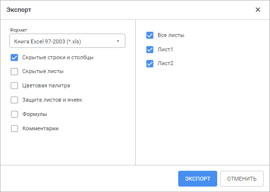
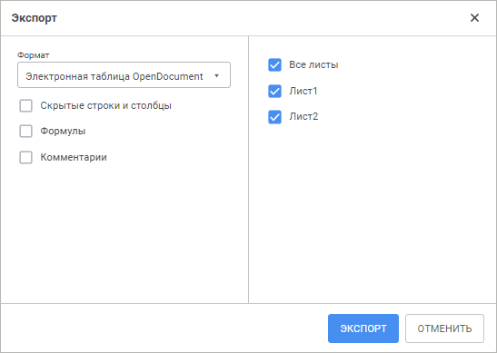
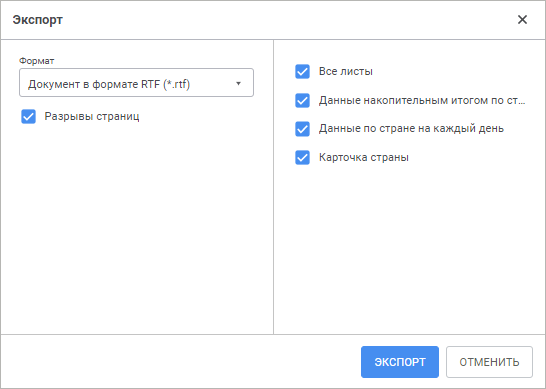

# Экспорт формы ввода

Экспорт формы ввода
-

# Экспорт формы ввода

При необходимости сохранить форму в другом формате воспользуйтесь экспортом
 форм.

Для экспорта формы ввода во внешние форматы:

	- Выполните команду «Файл >
	  Экспорт»
	 главного меню.

	- Выберите формат:

		- книга Excel 97-2003 (*.xls);

		- книга Excel (*.xlsx);

		- электронная таблица OpenDocument (*.ods);

		- документ PDF (*.pdf);

		- документ в формате RTF (*.rtf);

		- изображение (*.png).

После выбора формата внешнего файла будет открыт диалог для задания
 параметров экспорта. Порядок работы с диалогом зависит от используемого
 браузера.

Для разных форматов экспорта вид данного окна меняется, но всегда присутствуют
 настройки:

	- Формат. При необходимости
	 измените формат экспорта, выбрав новый формат из раскрывающегося списка;

	- Все листы. Установите
	 данный флажок для экспорта формы ввода целиком;

	- Листы формы ввода. Отметьте
	 флажками листы формы ввода, которые будут экспортироваться. В данном
	 списке отсутствуют скрытые листы.

Примечание.
 При экспорте в форматы XLS и XLSX в списке листов присутствуют скрытые
 листы, если в диалоге «Экспорт»
 установлен флажок «Скрытые листы».

Закончив выполнять экспорт формы, перейдите, если требуется, к предварительному
 просмотру и печати формы.

## Особенности экспорта

При экспорте форм ввода в файлы различных форматов учитывайте особенности:

[Экспорт
 в файл формата XLS и XLSX](javascript:TextPopup(this))

	При сохранении формы ввода в файл формата XLS и XLSX окно «Экспорт» имеет вид:

	

	Задайте параметры:

		- Скрытые строки и столбцы.
		 При установленном флажке скрытые области, если они имеются, будут
		 экспортироваться, с ними можно будет работать средствами Microsoft
		 Excel;

		- Скрытые листы. При
		 установленном флажке в списке листов доступны для отметки скрытые
		 листы формы ввода. При экспорте формы ввода целиком скрытые листы
		 также будут экспортированы;

		- Цветовая палитра. При
		 установленном флажке, в случае использования оригинальных цветов,
		 появляется возможность заменить палитру, используемую в Microsoft
		 Excel, на палитру, используемую в «Форсайт. Аналитическая платформа».
		 При снятии флажка будет подобран наиболее подходящий цвет из палитры
		 Microsoft Excel, палитра не будет изменена;

	Примечание.
	 Параметр доступен только при экспорте в формат XLS.

		- Экспандеры. По умолчанию
		 флажок снят. При установленном флажке экспортируются отображаемые
		 [экспандеры](UiAnalyticalArea.chm::/TableView/Layout/Layout_Dim.htm#expanders)
		 вместе с табличной областью формы ввода в текущем виде. Если экспандеры
		 свернуты, то экспортируются все вложенные элементы табличной области
		 и содержащиеся в нем свернутые\развернутые экспандеры. Экспандеры
		 доступны для работы средствами Microsoft Excel;

	Примечание.
	 Параметр доступен только для экспорта в файл формата XLSX.

		- Защита листов и ячеек.
		 При установленном флажке будет экспортироваться защита листов
		 и [ячеек](Format.htm);

		- Формулы. При установленном
		 флажке будут экспортироваться формулы, расположенные на листе
		 формы ввода. Если флажок снят, экспортируются только значения.

	Примечание.
	 Не экспортируются формулы с использованием оператора OR.

	Если в Excel [функция](../Starting/Organizational_FormulaLine.htm)
	 не поддерживается, то в ячейке с формулой будет отображаться текстовое
	 или числовое значение.

	Если экспортируемая форма ввода содержит
	 [формулы](../Starting/Organizational_FormulaLine.htm),
	 имеющие ссылки на другие листы формы, которые не были включены в экспорт,
	 то в качестве результата вычисления таких формул будет указана ошибка
	 вычисления;

		- Комментарии. При
		 установленном флажке будут экспортироваться комментарии, расположенные
		 на листе отчёта. В офисном приложении комментарии будут отображаться
		 как примечания.

	Примечание.
	 Параметр доступен только при экспорте в формат XLSX.

	Особенности экспорта формул:

		- при расчёте формул с функциями Irr,
		 TBillEq, TBillPrice,
		 TBillYield в экспортированных
		 файлах возникает ошибка в связи с особенностями их реализации
		 в документах Microsoft Excel;

		- результаты расчёта формул с функцией Rand
		 отличаются в экспортированных файлах от соответствующих значений
		 в форме ввода в связи с особенностями их реализации в документах
		 Microsoft Excel;

		- результаты расчёта формул с функциями GetSelectionEl,
		 GetSelection, JarqueBeraStat,
		 NormsDist, OddlPrice,
		 OddlYield, RedemptionYield,
		 RndPermutation, RndSample, Slope,
		 Sum, TimeValue
		 экспортируются в виде текста.

	Условное форматирование ячеек экспортируется с ограничениями:

		- поддерживается только в Microsoft Excel 2007 и выше;

		- некоторые обозначения в результирующем файле могут
		 не совпадать с обозначениями в форме ввода.

	При экспорте существуют ограничения на количество строк и столбцов:

		- XLS. Максимальное
		 число столбцов - 256, максимальное число строк - 65536;

		- XLSX. Максимальное
		 число столбцов - 16385, максимальное число строк - 1048576.

[Экспорт
 в файл формата ODS](javascript:TextPopup(this))

	При сохранении формы ввода в файл формата ODS окно «Экспорт»
	 имеет вид:

	

	Задайте параметры:

		- Скрытые строки и столбцы.
		 При установленном флажке скрытые области, если они имеются, будут
		 экспортироваться, с ними можно будет работать средствами OpenOffice
		 или LibreOffice;

		- Формулы. При установленном
		 флажке будут экспортироваться формулы, расположенные на листе
		 формы ввода. По умолчанию флажок снят и экспортируются только
		 значения формул;

		- Комментарии. При
		 установленном флажке будут экспортироваться комментарии, расположенные
		 на листе отчёта. В офисном приложении комментарии будут отображаться
		 как примечания.

	Особенности экспорта формул:

		- функция PercentRank
		 экспортируется без учёта параметра Significance;

		- функции OddfPrice,
		 OddfYield возвращают ошибочные
		 результаты в связи с их некорректной реализацией в документах
		 OpenOffice;

		- при расчёте формул с функциями NormsInv,
		 Irr, Prob,
		 TBillEq, TBillYield
		 в экспортированных файлах возникает ошибка в связи с особенностями
		 их реализации в документах OpenOffice;

		- результаты расчёта формул с функциями MDuration,
		 PercentRank, Price,
		 Rand, RndPermutation,
		 RndSample, TBillPrice,
		 YieldF отличаются в экспортированных
		 файлах от соответствующих значений в форме ввода в связи с особенностями
		 их реализации в документах OpenOffice;

		- результаты расчёта формул с функциями Aggregate,
		 GetSelectionEl, GetSelection, JarqueBeraStat,
		 NormInv, NormsDist,
		 OddfPrice, OddlPrice,
		 OddfYield, OddlYield,
		 RedemptionYield, RndPermutation, RndSample,
		 Slope, Sum,
		 TimeValue экспортируются
		 в виде текста.

	При экспорте в данный формат не будут экспортированы скрытые страницы.

	При экспорте существуют ограничения на количество строк и столбцов:

		- максимальное число столбцов - 1024;

		- максимальное число строк - 1048576.

	Примечание.
	 ODS-файл с результатами экспорта формы ввода рекомендуется открывать
	 с помощью пакетов OpenOffice или LibreOffice. При попытке открыть
	 файл с помощью Microsoft Excel могут возникнуть искажения внешнего
	 вида формы.

[Экспорт
 в файл формата PDF](javascript:TextPopup(this))

	В результирующем файле формата PDF форма ввода будет выглядеть так
	 же, как форма, открытая на [предварительный
	 просмотр](../Work/ParamPage/Tuning_ParamPage.htm#preview) перед печатью.

	При экспорте в данный формат необходимо помнить, что:

		- текстура ячеек в результирующем файле и в форме ввода может
		 различаться;

		- отображение символов китайского или арабского языка может
		 быть неполным или некорректным;

		- не поддерживается экспорт листа формы ввода при снятом флажке
		 «[Печатать
		 лист вместе с отчётом](../Work/ParamPage/Print_params.htm#print_sheet)» в настройках параметров [печати](../Work/ParamPage/Tuning_ParamPage.htm#print).

[Экспорт
 в файл формата RTF](javascript:TextPopup(this))

	При сохранении формы ввода в файл формата RTF окно «Экспорт»
	 имеет вид:

	

	Используйте флажок «Разрывы страниц»
	 для настройки экспорта разрывов страниц между листами формы ввода.
	 По умолчанию флажок установлен и разрывы страниц экспортируются.

	При экспорте в данный формат необходимо помнить, что:

		- параметры шрифта и межстрочного интервала в результирующем
		 файле и в форме ввода могут различаться;

		- не поддерживается экспорт верхнего и нижнего отступов ячейки;

		- не поддерживается экспорт поворота текста ячейки;

		- не поддерживается экспорт листа формы ввода при снятом флажке
		 «[Печатать
		 лист вместе с отчётом](../Work/ParamPage/Print_params.htm#print_sheet)» в настройках параметров
		 печати.

См. также:

[Построение
 формы ввода](../Starting/ConstructForm.htm) | [Работа с готовой
 формой ввода](../Work/FinishForm.htm)

		Справочная
		 система на версию 10.9
		 от 18/08/2025,
		 © ООО «ФОРСАЙТ»,
