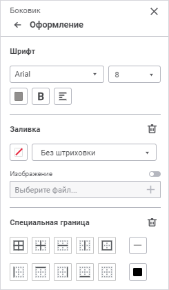
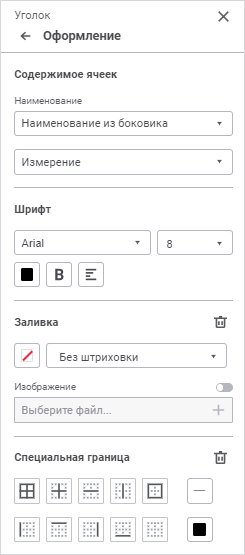
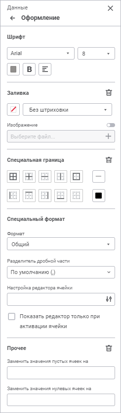
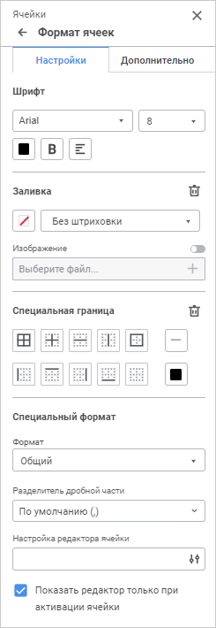
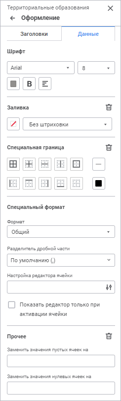
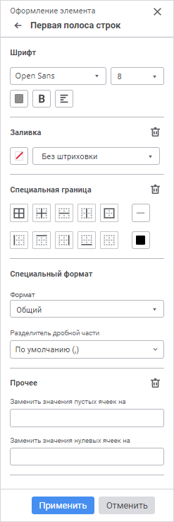
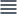
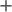
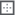

# Настройка оформления

Настройка оформления
-

# Настройка оформления

Для настройки оформления выбранного типа области используйте следующие
 группы параметров [панели параметров](../Starting/Starting.htm#elements):

	- Оформление. Предназначена
	 для настройки оформления боковика, шапки, уголка, данных, измерений,
	 уровней измерений, элементов измерений таблицы;

	- Формат ячеек. Предназначена
	 для настройки оформления ячеек;

	- Оформление элемента.
	 Предназначена для настройки [оформления
	 элементов стиля](../Work/Table_Styles.htm#create_style): вся таблица, первая полоса строк, вторая полоса
	 строк, первая полоса столбцов, вторая полоса столбцов, заголовки столбцов,
	 последняя полоса строк, заголовки строк, последняя полоса столбцов,
	 угол таблицы.

[Для открытия
 группы параметров «Оформление»](javascript:TextPopup(this))

	Для открытия на панели параметров группы параметров «Оформление»:

		- через [панель
		 параметров](../Starting/Starting.htm#elements):

			- Выделите ячейку или диапазон ячеек таблицы.

			- Нажмите кнопку  «Параметры» панели инструментов.
			 Будет открыта панель параметров.

			- Выберите требуемый тип области в раскрывающемся меню
			 заголовка панели параметров.

			- Перейдите в группу параметров «Оформление»;

		- через [рабочую
		 область](../Starting/Starting.htm#elements):

			- Выделите ячейку или диапазон
			 ячеек таблицы на рабочей области.

			- Выполните действие:

				- выполните команду контекстного
				 меню «Оформление»
				 для ячейки или диапазона ячеек, принадлежащих одному типу
				 области, или выберите требуемый тип области в раскрывающемся
				 списке команды  «Оформление»
				 для диапазона ячеек, принадлежащих разным типам областей;

				- нажмите сочетание клавиш
				 CTRL+1. Тип области открытой вкладки будет соответствовать
				 типу области выделенных ячеек. Если выделен диапазон ячеек
				 различных типов областей, будет открыта группа параметров
				 «Формат ячеек».

	Примечание.
	 При вызове команды  «Оформление»
	 для типа области «Ячейки»
	 будет открыта группа параметров «Формат
	 ячеек».

[Для
 открытия группы параметров «Формат ячеек»](javascript:TextPopup(this))

	Для открытия на панели параметров группы параметров «Формат
	 ячеек»:

		- через [панель
		 параметров](../../../uireport/Web/organizational_management/Starting.htm#structure_window):

			- Выделите ячейку или диапазон
			 ячеек.

			- Нажмите кнопку  «Параметры»
			 панели инструментов.

			- Выберите тип области «Ячейки» в раскрывающемся
			 меню заголовка панели параметров;

		- через [рабочую
		 область](../../../uireport/Web/organizational_management/Starting.htm#structure_window):

			- Выделите ячейку или диапазон
			 ячеек, не принадлежащих таблице, или диапазон ячеек таблицы,
			 принадлежащих разным типа областей.

			- Выполните действие:

				- выполните команду 
				 «Оформление» контекстного
				 меню;

				- нажмите сочетание клавиш
				 CTRL+1.

[Для открытия
 группы параметров «Оформление элемента»](javascript:TextPopup(this))

	Для открытия на панели параметров группы параметров «Оформление
	 элемента»:

		- Выделите ячейку или диапазон ячеек таблицы.

		- Нажмите кнопку 
		 «Параметры» панели инструментов.
		 Будет открыта панель параметров.

		- Выберите тип области «Ячейки»
		 в раскрывающемся меню заголовка панели параметров.

		- Перейдите в группу параметров «Стиль
		 таблицы».

		- >Выполните команду контекстного меню «Редактировать»
		 для изменяемого стиля в стилях с листа.

		- В группе параметров «Создать
		 стиль таблицы» выберите настраиваемый элемент и нажмите
		 кнопку  «Редактировать».

	 Боковик/шапка Уголок Данные Ячейки Измерение/уровень/элемент Элемент стиля

		

		

		

		

		

		

Параметры оформления зависят от выбранного типа области:

	- Боковик/шапка. Доступны
	 настройки: шрифт, заливка и специальная граница;

	- Уголок. Доступны настройки:
	 содержимое ячеек, шрифт, заливка и специальная граница;

	- Данные. Доступны настройки:
	 шрифт, заливка, специальная граница, прочее;

	- Ячейки. Панель содержит
	 вкладки:

		- Настройки. Настройки
		 оформления ячеек: шрифт, заливка, специальная граница, специальный
		 формат;

		- Дополнительно. Настройки
		 выравнивания, гиперссылок и прочее настройки ячеек: выравнивание,
		 гиперссылка, прочее;

	- Измерение/уровень/элемент.
	 Панель содержит вкладки:

		- Заголовок.
		 Настройки заголовков: шрифт, заливка, специальная граница;

		- Данные.
		 Настройки данных: специальный формат, шрифт, заливка, специальная
		 граница, прочее;

	- Элемент стиля. Доступны
	 настройки: шрифт, заливка, специальная граница, специальный формат,
	 прочее. После выполнения необходимых настроек нажмите кнопку «Применить».

Задайте параметры:

[Шрифт](javascript:TextPopup(this))

	Для настройки шрифта выберите:

		- Шрифт. Выберите
		 один из шрифтов в раскрывающемся списке. При необходимости можно
		 загрузить [пользовательские
		 шрифты](Setup.chm::/UiWebSetup/03_Setup_Web/General_for_linux/Loading_Custom_Fonts.htm);

		- Размер. Установите
		 требуемый размер шрифта. Размер задаётся в пунктах, и его можно
		 выбрать из раскрывающегося списка или ввести вручную. Диапазон
		 допустимых значений: [6; 36];

		- Цвет. Выберите цвет
		 шрифта в раскрывающейся палитре цветов. Для выбора доступны стандартные
		 и пользовательские цвета. По умолчанию палитра содержит только
		 стандартные цвета.

	Для создания пользовательского цвета:

			- Нажмите кнопку  «Добавить
			 цвет». Откроется расширенная палитра цветов.

			- Выберите цвет в расширенной
			 палитре цветов, на странице браузера с помощью пипетки или
			 задайте код цвета в формате RGB/HEX.

	После выполнения действий пользовательский
	 цвет будет создан и добавлен в палитру.

	Примечание.
	 Максимально возможное количество пользовательских цветов в палитре
	 равно 23.

	Для удаления пользовательского цвета
	 из палитры выполните команду «Удалить»
	 контекстного меню выбранного цвета.

		- Начертание. Выберите
		 начертание шрифта:

			- B Полужирное
			 начертание. Доступно также по нажатию сочетания клавиш
			 CTRL+B;

			- I Курсивное
			 начертание. Доступно также по нажатию сочетания клавиш
			 CTRL+I;

			- U
			 Подчеркивание текста.
			 Доступно также по нажатию сочетания клавиш CTRL+U;

	Примечание.
	 Сочетание клавиш CTRL+U, как правило, зарезервировано в браузере для
	 открытия исходного кода текущей страницы. Чтобы использовать указанное
	 сочетание клавиш для подчёркивания текста, переопределите его в настройках
	 используемого браузера.

			- S
			 Зачеркивание текста.
			 Доступно также по нажатию сочетания клавиш ALT+SHIFT+5.

	При нажатой кнопке будет использоваться
	 соответствующий стиль начертания. Доступно использование нескольких
	 стилей одновременно;

		- Выравнивание текста в ячейке.
		 Выберите выравнивание текста относительно ячейки в раскрывающемся
		 списке кнопки  «По
		 левому краю»:

			- 
			 По левому краю. Используется по умолчанию. Доступно
			 также по нажатию сочетания клавиш CTRL+SHIFT+L;

			-  По
			 центру. Доступно также по нажатию сочетания клавиш
			 CTRL+SHIFT+E;

			-  По
			 правому краю. Доступно также по нажатию сочетания клавиш
			 CTRL+SHIFT+R;

	Примечание.
	 Сочетание клавиш CTRL+SHIFT+R, как правило, зарезервировано в браузере
	 для обновления текущей страницы. Чтобы использовать указанное сочетание
	 клавиш для выравнивания текста по правому краю, переопределите его
	 в настройках используемого браузера.

			-  По
			 ширине.

	Выбрать можно только один вариант.

[Заливка](javascript:TextPopup(this))

	Для настройки заливки задайте параметры:

		- Цвет заливки. В
		 раскрывающейся палитре цветов кнопки «Цвет
		 заливки» выберите тип заливки и выполните соответствующие
		 настройки.

	Доступны следующие типы заливки:

			- Без заливки.
			 Нажмите кнопку  «Без цвета». По умолчанию
			 заливка не используется;

			- Сплошная заливка.
			 Откройте вкладку «Один цвет»
			 и выберите цвет однотонной заливки;

			- Двухцветная заливка.
			 Откройте вкладку «Два цвета»
			 и выберите начальный и конечный цвета двухцветного градиента.
			 При необходимости укажите угол наклона.

	Для выбора доступны стандартные и пользовательские
	 цвета. По умолчанию палитра содержит только стандартные цвета.

	Для создания пользовательского цвета:

			- Нажмите кнопку 
			 «Добавить цвет». Откроется
			 расширенная палитра цветов.

			- Выберите цвет в расширенной палитре цветов, на странице
			 браузера с помощью пипетки или задайте код цвета в формате
			 RGB/HEX.

	После выполнения действий пользовательский
	 цвет будет создан и добавлен в палитру:

	Примечание.
	 Максимально возможное количество пользовательских цветов в палитре
	 равно 23.

	Для удаления пользовательского цвета
	 из палитры выполните команду «Удалить»
	 контекстного меню выбранного цвета.

		- Тип штриховки. При
		 необходимости добавьте штриховку. По умолчанию параметр принимает
		 значение «Без штриховки».
		 В раскрывающемся списке содержатся образцы всех возможных штриховок;

		- Цвет штриховки.
		 Параметр отображается после выбора типа штриховки. В раскрывающейся
		 палитре выберите цвет.

	Для выбора доступны стандартные и пользовательские
	 цвета. По умолчанию палитра содержит только стандартные цвета.

	Для создания пользовательского цвета:

			- Нажмите кнопку  «Добавить
			 цвет». Откроется расширенная палитра цветов.

			- Выберите цвет в расширенной
			 палитре цветов, на странице браузера с помощью пипетки или
			 задайте код цвета в формате RGB/HEX.

	После выполнения действий пользовательский
	 цвет будет создан и добавлен в палитру.

	Примечание.
	 Максимально возможное количество пользовательских цветов в палитре
	 равно 23.

	Для удаления пользовательского цвета
	 из палитры выполните команду «Удалить»
	 контекстного меню выбранного цвета.

		- Изображение. Для
		 настройки заливки с изображением используйте параметр «Изображение».
		 По умолчанию переключатель неактивен, настройка заливки ячейки
		 выполняется стандартным способом. Для использования изображения
		 в качестве заливки активируйте переключатель. Для добавления в
		 ячейку изображения нажмите кнопку  «Выберите файл».

	Откроется диалог выбора изображения.
	 Порядок работы с диалогом зависит от используемого браузера. После
	 выбора изображения название файла отобразится в соответствующем поле,
	 заливка ячейки на листе отчёта будет выполнена с использованием изображения.

	Для удаления изображения нажмите кнопку  «Удалить» рядом с названием текстуры.

	Для замены изображения повторно нажмите
	 кнопку  «Выберите
	 файл».

	После выбора изображения будут отображены
	 следующие элементы:

			- Скачать. Нажмите
			 кнопку «Скачать» для
			 экспорта изображения, использованного в качестве заливки;

			- Растянуть изображение.
			 По умолчанию флажок снят, изображение в ячейке соответствует
			 своему исходному размеру. Для того, чтобы подогнать размер
			 изображения под размер ячейки, установите флажок.

	Для сброса заданных настроек заливки нажмите кнопку  «Удалить»
	 рядом с названием вкладки «Заливка».

[Специальная
 граница](javascript:TextPopup(this))

	Для настройки границы выберите:

		- Тип границы. Нажмите
		 соответствующие кнопки типов границ, которые необходимо отобразить:

			- . Все;

			- . Внутренние;

			- . Горизонтальные;

			- . Вертикальные;

			- . Внешние;

			- . Левая;

			- . Верхняя;

			- . Правая;

			- . Нижняя;

			- . Без границы;

		- Тип линии. В раскрывающемся
		 списке кнопки «Линия»
		 выберите тип линии;

		- Цвет. Выберите цвет
		 границы в раскрывающейся палитре цветов. Для выбора доступны стандартные
		 и пользовательские цвета. По умолчанию палитра содержит только
		 стандартные цвета.

	Для создания пользовательского цвета:

			- Нажмите кнопку  «Добавить
			 цвет». Откроется расширенная палитра цветов.

			- Выберите цвет в расширенной
			 палитре цветов, на странице браузера с помощью пипетки или
			 задайте код цвета в формате RGB/HEX.

	После выполнения действий пользовательский
	 цвет будет создан и добавлен в палитру.

	Примечание.
	 Максимально возможное количество пользовательских цветов в палитре
	 равно 23.

	Для удаления пользовательского цвета
	 из палитры выполните команду «Удалить»
	 контекстного меню выбранного цвета.

	Для изменения непрозрачности цвета используйте
	 бегунок или введите значение в процентах при необходимости.

	Для сброса цвета линии границы нажмите
	 кнопку  «Без цвета».

	Для удаления настроек границ нажмите кнопку  «Удалить».

[Содержимое
 ячеек](javascript:TextPopup(this))

	Доступно для типа области «Уголок».

	По умолчанию уголок табличной области не содержит заголовка. Для
	 отображения заголовка выберите в раскрывающемся меню поля «Наименование»:

		- Не показывать наименование.
		 Ничего не отображается;

		- Наименование из шапки/боковика.
		 При выборе данного варианта появится дополнительное поле, в котором
		 выберите вид заголовка:

			- Измерение. Отображается
			 наименование измерения;

			- Атрибут. Отображается
			 наименование атрибута измерения;

			- Измерение.Атрибут.
			 Отображается наименование измерения и атрибута;

			- Пользовательское наименование.
			 Отображается отредактированное пользователем наименование.
			 При включении пользовательского наименования хотя бы для одной
			 строки или столбца в уголке, все ячейки уголка становятся
			 редактируемыми. Настраивается для каждого столбца/строки уголка.
			 При переключении вида заголовка на отображение наименования
			 атрибута/измерения пользовательское наименование сбрасывается;

		- Произвольное наименование.
		 Отображается введенный пользователем в поле текст. Применяется
		 ко всему уголку.

[Специальный
 формат](javascript:TextPopup(this))

	Для изменения настроек формата данных, в раскрывающемся списке выберите
	 один из поддерживаемых форматов данных. В зависимости от выбранного
	 формата будут доступны различные настройки:

		- Общий.
		 Равносильно отмене форматирования. При выборе общего формата доступны
		 настройки:

			- Разделитель дробной
			 части. Выберите вид делителя в раскрывающемся списке;

	Для ячеек, данных, измерений, уровней
	 измерений, элементов измерений таблицы доступны дополнительные настройки:

			- Настройка редактора
			 ячейки. По умолчанию параметр отображения устанавливается
			 в соответствии с выбранным типом параметра. Параметры отображения
			 задаются в виде специально сформированной строки, в которой
			 указывается вид редактора, значение по умолчанию и т.д. Строка
			 может быть отредактирована как непосредственно в поле ввода,
			 так и при помощи панели «[Настройка отображения](Display_setting.htm)».
			 Для открытия панели нажмите кнопку  «Настроить»;

			- Показать редактор только
			 при активации ячейки. Снимите флажок «Показывать
			 редактор только при активации ячейки» для отображения
			 всегда активного редактора ячейки. Если флажок установлен,
			 то редактор отображается только при активации ячейки;

		- Числовой.
		 Формат установлен по умолчанию. При выборе числового формата доступны
		 настройки:

			- Десятичных знаков.
			 Выберите число отображаемых знаков после запятой;

			- Отрицательные числа.
			 Выберите вид отображения отрицательных чисел;

			- Разделитель групп разрядов.
			 Установите флажок для применения настройки разделителя группы
			 разрядов. По умолчанию снят;

			- Разделитель дробной
			 части. Выберите вид делителя в раскрывающемся списке;

			- Разделитель группы
			 разрядов. Выберите вид делителя в раскрывающемся списке;

	Для ячеек, данных, измерений, уровней
	 измерений, элементов измерений таблицы доступны дополнительные настройки:

			- Настройка редактора
			 ячейки. По умолчанию параметр отображения устанавливается
			 в соответствии с выбранным типом параметра. Параметры отображения
			 задаются в виде специально сформированной строки, в которой
			 указывается вид редактора, значение по умолчанию и т.д. Строка
			 может быть отредактирована как непосредственно в поле ввода,
			 так и при помощи панели «[Настройка отображения](Display_setting.htm)».
			 Для открытия панели нажмите кнопку  «Настроить»;

			- Показать редактор только
			 при активации ячейки. Снимите флажок «Показывать
			 редактор только при активации ячейки» для отображения
			 всегда активного редактора ячейки. Если флажок установлен,
			 то редактор отображается только при активации ячейки;

		- Процентный.
		 При выборе процентного формата доступны настройки:

			- Десятичных знаков.
			 Выберите число отображаемых знаков после запятой;

			- Разделитель дробной
			 части. Выберите вид делителя в раскрывающемся списке;

	Для ячеек, данных, измерений, уровней
	 измерений, элементов измерений таблицы доступны дополнительные настройки:

			- Настройка редактора
			 ячейки. По умолчанию параметр отображения устанавливается
			 в соответствии с выбранным типом параметра. Параметры отображения
			 задаются в виде специально сформированной строки, в которой
			 указывается вид редактора, значение по умолчанию и т.д. Строка
			 может быть отредактирована как непосредственно в поле ввода,
			 так и при помощи панели «[Настройка отображения](Display_setting.htm)».
			 Для открытия панели нажмите кнопку  «Настроить»;

			- Показать редактор только
			 при активации ячейки. Снимите флажок «Показывать
			 редактор только при активации ячейки» для отображения
			 всегда активного редактора ячейки. Если флажок установлен,
			 то редактор отображается только при активации ячейки.

	При использовании процентного формата
	 значение чисел умножается на 100 и добавляется знак «%». Ввод чисел
	 в ячейку при данном формате будет по-разному обрабатываться в зависимости
	 от использования знака «%». Например, при вводе «40%» в ячейке будет
	 отражено «40%», при этом значение в ячейке 0,4. Если вводится «40»,
	 то в ячейке отображается «4000%», при этом значение в ячейке будет
	 40;

		- Денежный.
		 При выборе денежного формата доступны настройки:

			- Десятичных знаков.
			 Задаёт число отображаемых знаков после запятой;

			- Обозначение.
			 Задаёт обозначение валюты;

			- Отрицательные числа.
			 Выберите вид отображения отрицательных чисел;

			- Разделитель дробной
			 части. Выберите вид делителя в раскрывающемся списке;

			- Разделитель группы
			 разрядов. Выберите вид делителя в раскрывающемся списке;

	Для ячеек, данных, измерений, уровней
	 измерений, элементов измерений таблицы доступны дополнительные настройки:

			- Настройка редактора
			 ячейки. По умолчанию параметр отображения устанавливается
			 в соответствии с выбранным типом параметра. Параметры отображения
			 задаются в виде специально сформированной строки, в которой
			 указывается вид редактора, значение по умолчанию и т.д. Строка
			 может быть отредактирована как непосредственно в поле ввода,
			 так и при помощи панели «[Настройка отображения](Display_setting.htm)».
			 Для открытия панели нажмите кнопку  «Настроить»;

			- Показать редактор только
			 при активации ячейки. Снимите флажок «Показывать
			 редактор только при активации ячейки» для отображения
			 всегда активного редактора ячейки. Если флажок установлен,
			 то редактор отображается только при активации ячейки;

		- Дата.
		 При выборе формата «Дата»
		 доступны настройки:

			- Тип. Выберите
			 формат отображения даты в раскрывающемся списке;

	Для ячеек, данных, измерений, уровней
	 измерений, элементов измерений таблицы доступны дополнительные настройки:

			- Настройка редактора
			 ячейки. По умолчанию параметр отображения устанавливается
			 в соответствии с выбранным типом параметра. Параметры отображения
			 задаются в виде специально сформированной строки, в которой
			 указывается вид редактора, значение по умолчанию и т.д. Строка
			 может быть отредактирована как непосредственно в поле ввода,
			 так и при помощи панели «[Настройка отображения](Display_setting.htm)».
			 Для открытия панели нажмите кнопку  «Настроить»;

			- Показать редактор только
			 при активации ячейки. Снимите флажок «Показывать
			 редактор только при активации ячейки» для отображения
			 всегда активного редактора ячейки. Если флажок установлен,
			 то редактор отображается только при активации ячейки;

		- Время.
		 При выборе формата «Время»
		 доступны настройки:

			- Тип. Выберите
			 формат отображения времени в раскрывающемся списке;

	Для ячеек, данных, измерений, уровней
	 измерений, элементов измерений таблицы доступны дополнительные настройки:

			- Настройка редактора
			 ячейки. По умолчанию параметр отображения устанавливается
			 в соответствии с выбранным типом параметра. Параметры отображения
			 задаются в виде специально сформированной строки, в которой
			 указывается вид редактора, значение по умолчанию и т.д. Строка
			 может быть отредактирована как непосредственно в поле ввода,
			 так и при помощи панели «[Настройка отображения](Display_setting.htm)».
			 Для открытия панели нажмите кнопку  «Настроить»;

			- Показать редактор только
			 при активации ячейки. Снимите флажок «Показывать
			 редактор только при активации ячейки» для отображения
			 всегда активного редактора ячейки. Если флажок установлен,
			 то редактор отображается только при активации ячейки;

		- Экспоненциальный.
		 Данный формат используется для представления числа в экспоненциальном
		 виде. При выборе экспоненциального формата доступны настройки:

			- Десятичных знаков.
			 Выберите число отображаемых знаков после запятой;

			- Разделитель дробной
			 части. Выберите вид делителя в раскрывающемся списке;

	Для ячеек, данных, измерений, уровней
	 измерений, элементов измерений таблицы доступны дополнительные настройки:

			- Настройка редактора
			 ячейки. По умолчанию параметр отображения устанавливается
			 в соответствии с выбранным типом параметра. Параметры отображения
			 задаются в виде специально сформированной строки, в которой
			 указывается вид редактора, значение по умолчанию и т.д. Строка
			 может быть отредактирована как непосредственно в поле ввода,
			 так и при помощи панели «[Настройка отображения](Display_setting.htm)».
			 Для открытия панели нажмите кнопку  «Настроить»;

			- Показать редактор только
			 при активации ячейки. Снимите флажок «Показывать
			 редактор только при активации ячейки» для отображения
			 всегда активного редактора ячейки. Если флажок установлен,
			 то редактор отображается только при активации ячейки;

		- Текстовый.
		 Равносильно отмене форматирования. Текстовый формат устанавливается
		 по умолчанию для ячеек, содержащих нечисловые значения. Для ячеек,
		 данных, измерений, уровней измерений, элементов измерений таблицы
		 доступны дополнительные настройки:

			- Настройка редактора
			 ячейки. По умолчанию параметр отображения устанавливается
			 в соответствии с выбранным типом параметра. Параметры отображения
			 задаются в виде специально сформированной строки, в которой
			 указывается вид редактора, значение по умолчанию и т.д. Строка
			 может быть отредактирована как непосредственно в поле ввода,
			 так и при помощи панели «[Настройка отображения](Display_setting.htm)».
			 Для открытия панели нажмите кнопку  «Настроить»;

			- Показать редактор только
			 при активации ячейки. Снимите флажок «Показывать
			 редактор только при активации ячейки» для отображения
			 всегда активного редактора ячейки. Если флажок установлен,
			 то редактор отображается только при активации ячейки;

		- Дополнительный.
		 При выборе дополнительного формата доступны настройки:

			- Тип. Для автоматического
			 преобразования значения выберите предустановленный вариант:

				- Почтовый индекс;

				- Номер телефона;

				- Табельный номер;

	Для ячеек, данных, измерений, уровней
	 измерений, элементов измерений таблицы доступны дополнительные настройки:

			- Настройка редактора
			 ячейки. По умолчанию параметр отображения устанавливается
			 в соответствии с выбранным типом параметра. Параметры отображения
			 задаются в виде специально сформированной строки, в которой
			 указывается вид редактора, значение по умолчанию и т.д. Строка
			 может быть отредактирована как непосредственно в поле ввода,
			 так и при помощи панели «[Настройка отображения](Display_setting.htm)».
			 Для открытия панели нажмите кнопку  «Настроить»;

			- Показать редактор только
			 при активации ячейки. Снимите флажок «Показывать
			 редактор только при активации ячейки» для отображения
			 всегда активного редактора ячейки. Если флажок установлен,
			 то редактор отображается только при активации ячейки;

		- Пользовательский.
		 Содержит кодовые представления всех доступных форматов данных.
		 При выборе пользовательского формата доступны настройки:

			- Тип.
			 Для автоматического преобразования значения выберите предустановленный
			 вариант:

				- Валюта.
				 Выберите формат отображения валюты в раскрывающемся списке;

				- Дата и время.
				 Выберите формат отображения времени в раскрывающемся списке;

				- Числа. Выберите
				 формат числа в раскрывающемся списке;

				- Прочее.
				 Выберите другой формат отображения в раскрывающемся списке;

			- Разделитель
			 дробной части. Выберите вид делителя в раскрывающемся
			 списке;

			- Разделитель
			 группы разрядов. Выберите вид делителя в раскрывающемся
			 списке;

	Для ячеек, данных, измерений, уровней
	 измерений, элементов измерений таблицы доступны дополнительные настройки:

			- Настройка
			 редактора ячейки. По умолчанию параметр отображения
			 устанавливается в соответствии с выбранным типом параметра.
			 Параметры отображения задаются в виде специально сформированной
			 строки, в которой указывается вид редактора, значение по умолчанию
			 и т.д. Строка может быть отредактирована как непосредственно
			 в поле ввода, так и при помощи панели «[Настройка отображения](Display_setting.htm)».
			 Для открытия панели нажмите кнопку  «Настроить»;

			- Показать
			 редактор только при активации ячейки. Снимите флажок
			 «Показывать редактор только
			 при активации ячейки» для отображения всегда активного
			 редактора ячейки. Если флажок установлен, то редактор отображается
			 только при активации ячейки.

[Выравнивание](javascript:TextPopup(this))

	Для определения способа расположения значения внутри ячейки используйте
	 группу настроек «Выравнивание».
	 Значение может быть выровнено по горизонтали и по вертикали с учётом
	 заданных отступов от границ ячейки и угла поворота. Для строковых
	 значений дополнительно может быть задан способ переноса.

	Задайте способы расположения значений внутри ячейки:

		- Выравнивание. Задайте
		 способ выравнивания значений:

			- По
			 горизонтали. Возможные варианты:

				- По значению.
				 Выравнивание зависит от содержимого ячейки (ячеек). Если
				 ячейка содержит только цифры (включая разделители разрядов,
				 знак отделения дробной части и знак процента), то выравнивание
				 будет производиться по правому краю, в противном случае -
				 по левому. Значение по умолчанию;

				- По левому краю.
				 Значение прижимается к левой границе вывода;

				- По центру.
				 Значение размещается на равном расстоянии от левой и правой
				 границ ячейки с учётом заданных отступов;

				- По правому краю.
				 Значение прижимается к правой границе вывода;

				- По ширине.
				 Значение размещается по ширине ячейки;

			- По
			 вертикали. Возможные варианты:

				- По верхнему краю.
				 Значение прижимается к верхней границе вывода;

				- По центру.
				 Значение размещается на равном расстоянии от верхней и
				 нижней границ вывода с учётом заданных отступов;

				- По нижнему краю.
				 Значение прижимается к нижней границе вывода. Значение
				 по умолчанию.

		- Отступы. Задайте
		 отступы элемента от границ ячейки: в каждом поле задайте размер
		 отступа от соответствующей границы ячейки;

		- Поворот текста.
		 Задайте угол наклона текста в ячейке;

		- Перенос. Задайте
		 способ переноса текста в ячейке:

			- Не переносить.
			 Перенос производиться не будет. Весь текст располагается в
			 одну строку;

			- По словам. Текст
			 ячейки будет переноситься по словам. Расположение переноса
			 определяется шириной ячейки.

[Гиперссылка](javascript:TextPopup(this))

	Текст и изображение, помещенные в ячейку, могут являться гиперссылкой.
	 При щелчке по содержимому такой ячейки будет выполняться заданное
	 действие.

	Примечание.
	 Гиперссылка настраивается для всей ячейки, т.е. отсутствует возможность
	 отдельной настройки гиперссылки только для изображения в ячейке или
	 части текста.

	Для настройки гиперссылки задайте параметры:

		- Рассматривать как ссылку.
		 Установите флажок для преобразования текста ячейки в гиперссылку.
		 По умолчанию флажок снят и текст в ячейке не является гиперссылкой;

	Примечание.
	 По умолчанию для всех гиперссылок используется подчёркнутый текст
	 синего цвета.

		- Отдельный текст.
		 Установите флажок и введите отдельный текст для гиперссылки в
		 соответствующем поле. В этом случае текст в ячейке будет перекрываться
		 данным текстом. Если гиперссылка с отдельным текстом задается
		 для ячейки с изображением, текст располагается поверх изображения.
		 По умолчанию флажок снят и текст гиперссылки совпадает с текстом
		 в ячейке;

	Примечание.
	 Задание отдельного текста для гиперссылки доступно только при установленном
	 флажке «Рассматривать как ссылку».

		- Изображение. Установите
		 флажок для добавления изображения в ячейку и настройки гиперссылки.
		 По умолчанию флажок снят и гиперссылка настраивается для текста
		 ячейки.

	Для добавления изображения нажмите кнопку  «Выберите
	 файл». Откроется диалог выбора изображения. После выбора изображения
	 название выбранного файла отобразится в соответствующем поле, в ячейке
	 на листе формы появится выбранное изображение.

	Для удаления изображения нажмите кнопку  «Удалить» рядом с названием изображения.

	Для замены изображения повторно нажмите
	 кнопку  «Выберите
	 файл»;

		- Требуемое действие.
		 Выберите в раскрывающемся списке действие, которое будет происходить
		 при нажатии на гиперссылку.

	Примечание.
	 Выбор действия для гиперссылки доступен только при установленном флажке
	 «Рассматривать как ссылку».

	В раскрывающемся списке параметра «Требуемое
	 действие» доступны действия:

		- Не определено. Гиперссылка
		 не вызывает действие при срабатывании;

		- Открыть ссылку.
		 При выборе данного действия появляется поле для ввода ссылки,
		 которая будет осуществлять переход на html-страницу в отдельной
		 вкладке браузера;

		- Открыть лист отчёта.
		 При выборе данного действия появляется раскрывающийся список.
		 Выберите в нём лист, на который будет осуществлен переход при
		 нажатии на гиперссылку;

		- Показать диапазон ячеек.
		 При выборе данного действия появится поле для ввода диапазона.
		 Введите вручную или выделите на рабочей области диапазон ячеек,
		 который будет выделяться при нажатии на ссылку. Доступные варианты
		 ввода или выделения диапазона ячеек:

			- позиционирование на одной ячейке. Введите адрес ячейки
			 или выделите её на рабочей области. Например: «А2»;

			- позиционирование на диапазоне ячеек. Введите через двоеточие
			 сначала адрес верхней левой ячейки, с которой начинается диапазон,
			 а затем адрес нижней правой ячейки, на которой заканчивается
			 диапазон, или выделите диапазон ячеек на рабочей области.
			 Например: «A2:B5»;

			- позиционирование на одной строке. Введите через двоеточие
			 номер строки или щёлкните по ней на рабочей области. Например:
			 «5:5»;

			- позиционирование на нескольких строках. Введите через
			 двоеточие сначала номер первой строки, а затем номер второй
			 строки, или выделите строки на рабочей области. Например:
			 «1:5»;

			- позиционирование на одном столбце. Введите через двоеточие
			 название столбца или щёлкните по нему на рабочей области.
			 Например: «Е:Е»;

			- позиционирование на нескольких столбцах. Введите через
			 двоеточие сначала название первого столбца, а затем название
			 второго столбца, или выделите столбцы на рабочей области.
			 Например: «А:Е»;

			- позиционирование на комбинированной области. Введите
			 через точку с запятой адреса диапазонов ячеек и отдельных
			 ячеек, из которых состоит данная область, или выделите разные
			 диапазоны ячеек и отдельные ячейки на рабочей области с зажатой
			 клавишей CTRL. Например: «I8:J13;L13:N17;Q12»;

			- позиционирование на всей таблице. Введите значение «TABLE»
			 или щёлкните на уголок таблицы.

	Для показа диапазона ячеек на другом
	 листе добавьте наименование листа в формате «<наименование
	 листа>!» перед вышеперечисленными вариантами ввода диапазона
	 ячеек. Например: «Лист3!A2:C322», «Лист2!А:Е»;

		- Показать объект в центре
		 экрана. При выборе данного действия появляются раскрывающиеся
		 списки для выбора листа формы и объекта на листе формы соответственно.

	В первом раскрывающемся списке выберите
	 лист формы, на котором находится необходимый объект.

	Во втором раскрывающемся списке выберите
	 объект среди доступных на выбранном листе формы. На этот объект будет
	 осуществлен переход при нажатии на ссылку. Объектами являются диаграммы,
	 карты, рисунки и т.д.;

	Примечание.
	 Раскрывающийся список выбора объекта активируется только после выбора
	 листа формы.

		- Открыть объект репозитория.
		 При выборе данного действия появляется раскрывающийся список.
		 Выберите в нём объект репозитория, который будет открываться при
		 нажатии на гиперссылку.

Для быстрого выбора объекта в поле для поиска введите его название/идентификатор/ключ
 в зависимости от настроек отображения. Поиск будет выполняться автоматически
 по мере ввода текста. Список будет содержать объекты, наименования/идентификаторы/ключи
 которых содержат вводимый текст.

Для настройки отображения объектов репозитория в списке нажмите кнопку
 «Отображение объекта» и выберите
 в раскрывающемся меню вариант отображения:

		- Наименование. Объекты
		 отображаются под своими наименованиями. Вариант по умолчанию;

		- Идентификатор. Объекты
		 отображаются под своими идентификаторами;

		- Ключ. Объекты отображаются
		 под своими ключами.

Выбрать можно несколько вариантов. Идентификатор
 и ключ будут указаны в скобках;

	Примечание.
	 Для открытия объекта из другого репозитория используйте действие «Открыть ссылку».

		- Выполнить процедуру/функцию.
		 При выборе данного действия появляются дополнительные поля:

			- Модуль. Выберите
			 модуль среды разработки, подключенный к форме;

			- Процедура/функция.
			 Укажите имя процедуры/функции, которую необходимо запустить
			 при нажатии на гиперссылку;

			- JS-функция.
			 Укажите имя js-функции, которую необходимо запустить в веб-приложении
			 при нажатии на гиперссылку. Это может быть как системная,
			 так и пользовательская js-функция. Наименование функции:

	javascript:<Наименование
	 функции(пользовательские параметры, callback, args)>

	Параметры:

		- пользовательские параметры.
		 Требуемые пользовательские параметры;

		- callback. Обязательный
		 параметр. Функция обратного вызова;

		- args. Аргументы
		 функции.

	Примечание.
	 Наличие угловых скобок при указании наименования функции с параметрами
	 обязательно.

	Пример наименования функции:

	javascript:<AfterOperTest(callback)>

	Функция должна иметь требуемую сигнатуру:

	function <Наименование
	 функции>(пользовательские параметры, callback, args)

	{

	…callback();

	}

	В качестве аргументов могут приходить
	 параметры:

		- Report. Параметр
		 для управления отчётом;

		- DataEntryForm.
		 Параметр для управления формой ввода;

		- DataArea. Параметр
		 для управления табличной областью.

	Для получения подробной информации о
	 сигнатуре и подключении js-функции к форме ввода обратитесь к разделу
	 «[Подключение
	 пользовательской js-функции](dhtmlFAQ.chm::/FAQ/js_to_link.htm)».

	Пример функции:

	function addAttachments(callback,
	 args)

	{

	                var
	 rep = args.Report;

	                var
	 da = args.DataArea

	                var
	 grid = da.getGridView();

	                var
	 tabSheet = grid.getTabSheet();

	                var
	 tableSource = grid.getTableSource();

	                var
	 onMeasuresLoaded = (function(){

	                               var
	 tabSheetRange = tabSheet.getSelection().getRange();

	                               attachFile(da,
	 tabSheetRange);

	                               tableSource.MeasuresLoaded.remove(onMeasuresLoaded,
	 this, );

	                });

	                tableSource.MeasuresLoaded.addOne(onMeasuresLoaded,
	 this, args);

	                callback();

	}

	function attachFile(da,
	 tabSheetRange) {

	                var
	 rep = da.getSource();

	                var
	 grid = da.getGridView();

	                var
	 tabSheet = grid.getTabSheet();

	                if
	 (tabSheetRange && tabSheetRange.isValid()) {

	                               var
	 cells = tabSheetRange.getCells();

	                               if
	 (cells.length == 1) {

	                                               var
	 cell = cells[0];

	                                               var
	 coord = cell.getCoord();

	                                               var
	 range = { top: coord.rowIndex, left: coord.colIndex, width: 1, height:
	 1 };

	                                               var
	 views = rep.getGridViews(range);

	                                               var
	 gridKey = views.length ? views[0].key : undefined;

	                                               var
	 attachDlg = da.getGridView().showAttachmentDialog(gridKey, coord.rowIndex,
	 coord.colIndex);

	                               }

	                }

	}}

	Примечание.
	 Допускается указывать только имя процедуры/функции или только имя
	 js-функции.

	Подключенный модуль позволяет:

			- обрабатывать ввод данных «на лету»;

			- выводить диалог подтверждения выполняемого действия;

			- выполнять дополнительные действия перед и/или после
			 возникновения какого-либо события;

			- выводить информационные сообщения, содержащие определенную
			 информацию (например, идентификатор измененного элемента управления)
			 и др.

	В зависимости от того, где находится
	 реализация процедуры/функции, различается способ указания пути к ней.
	 Процедура/функция реализована в:

			- модуле/форме репозитория:
			 <наименование процедуры/функции>;

			- одном из объектов сборки
			 репозитория: <наименование
			 процедуры/функции>.

	Примечание.
	 Сигнатура процедуры/функции может содержать параметры.

	Для сброса заданных настроек гиперссылки нажмите кнопку  «Удалить» рядом с названием вкладки
	 «Гиперссылка».

[Прочее](javascript:TextPopup(this))

	Для заполнения пустых или нулевых ячеек введите текст, число или
	 символы в соответствующих полях.

	Значения, которыми заполняются пустые ячейки, в том числе и числовые,
	 не будут сохранены в источнике.

	Для удаления заполнения пустых или нулевых ячеек нажмите кнопку
	  «Удалить».

	Для типа области «Ячейки»
	 доступны дополнительные настройки:

		- для управления защитой ячейки от редактирования, скрытия
		 содержимого ячейки или запрета выделения задайте:

			- Защищаемая ячейка.
			 При установке флажка содержимое ячеек будет защищено от редактирования;

			- Скрыть формулы.
			 При установке флажка содержимое ячеек, содержащих формулу,
			 будет скрыто и недоступно для редактирования. При этом данные,
			 полученные по формуле, будут отображены в ячейке;

			- Запретить выделение.
			 При установке флажка ячейка станет невыделяемой при открытии
			 формы в режиме просмотра. Контекстное меню для такой ячейки
			 вызываться не будет. При попытке выделения запрещенной для
			 выделения ячейки фокус остается на предыдущей выделенной ячейке
			 до тех пор, пока не будет выделена другая ячейка, доступная
			 для выделения. Перемещение в таблице с помощью клавиатуры
			 осуществляется по разрешенным ячейкам. При выделении диапазона
			 ячеек, в котором есть невыделяемые ячейки, все невыделяемые
			 ячейки остаются невыделенными;

			- Текст подсказки.
			 Введите текст всплывающей подсказки для защищенной ячейки;

		- для определения необходимости вывода содержимого ячейки
		 на печать установите/снимите флажок «Выводить
		 на печать». При снятии флага «Выводить
		 на печать» содержимое ячейки на печать не выводится. При
		 экспорте текст и гиперссылки, содержащиеся в такой ячейке, а также
		 настройки ее фона экспортироваться не будут. По умолчанию этот
		 флаг установлен для всех ячеек данных.

См. также:

[Настройка оформления
 и вида отображения формы](Design.htm)

		Справочная
		 система на версию 10.9
		 от 18/08/2025,
		 © ООО «ФОРСАЙТ»,
