# Настройка размещения: Формы ввода, веб-приложение

Настройка размещения: Формы ввода, веб-приложение
-

# Настройка размещения

Для настройки размещения табличной области, боковика, шапки используйте
 группу параметров «Размещение»
 [панели параметров](../Starting/Starting.htm#elements).

[Для открытия
 группы параметров «Размещение»](javascript:TextPopup(this))

	Для открытия на панели параметров группы параметров «Размещение»:

		- Выделите ячейку или диапазон ячеек, принадлежащих табличной
		 области.

		- Нажмите кнопку  «Параметры» панели инструментов.

		- Выберите требуемый тип области в раскрывающемся меню заголовка
		 панели параметров.

	 Таблица Боковик Шапка

		

		

		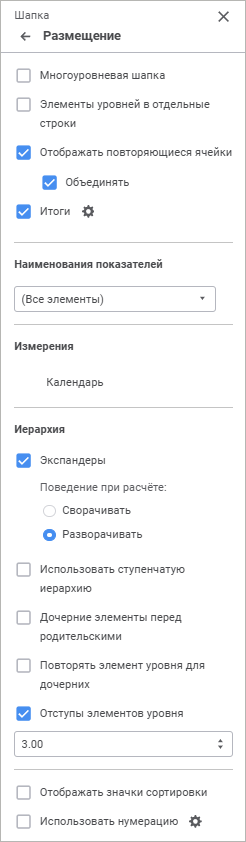

Параметры размещения зависят от выбранного типа области.

Задайте параметры:

[Автоподгонка
 ячеек](javascript:TextPopup(this))

	Доступно для типа области «Таблица».

	Для оптимального подбора размера ячеек выберите один режим из раскрывающегося
	 списка:

		- Нет. Автоподбор
		 отсутствует;

		- Только по ширине.
		 Ширина столбца устанавливается минимально требуемой для отображения
		 текста самой длинной ячейки в столбце табличной области;

		- Только по высоте.
		 Устанавливается минимальная требуемая высота для отображения текста
		 самой высокой ячейки в строке табличной области;

		- Сначала по ширине, затем
		 по высоте. Сначала выполняется автоподбор размера столбцов,
		 затем строк;

		- Сначала по высоте, затем
		 по ширине. Сначала выполняется автоподбор размера строк,
		 затем столбцов;

		- Автоматически. Автоподбор
		 выполняется автоматически согласно установленным параметрам:

			- Строк текста в ячейке
			 не более. При установленном флажке ширина столбца подбирается
			 таким образом, чтобы для отображения текста самой длинной
			 строки в столбце ячейки требовалось не более N строк, указанных
			 в поле;

			- Столбцов в таблице
			 не менее. При установленном флажке в табличной области
			 всегда будет отображаться минимум N столбцов, указанных в
			 поле;

		- Упрощенная. Данный
		 режим установлен по умолчанию. Одновременная автоподгонка ширины,
		 высоты и видимых данных. Автоподгонка применяется для 25 строк/столбцов
		 из начала, середины и конца табличной области:

			- Максимальная ширина
			 боковика. Задайте ширину боковика, по умолчанию значение
			 500;

			- Максимальная высота
			 строки. Задайте высоту строки, по умолчанию 50.

	Например, при выборе 50 столбцов автоподгонка
	 применится ко всему выбранному диапазону элементов - 25 столбцов из
	 начала, 25 столбцов из конца табличной области. При выборе 52 столбцов
	 автоподгонка не применится к середине.

[Многоуровневый
 боковик/шапка](javascript:TextPopup(this))

	Доступно для типов области «Боковик»,
	 «Шапка».

	Для отображения в боковике/шапке уровней измерения в отдельных строках
	 без повторения родительских элементов установите флажок «Многоуровневый
	 боковик»/«Многоуровневая шапка».

	При [транспонировании](../Table/Table_Area_Structure.htm#transpose)
	 табличной области настройка применяется для измерений, располагающихся
	 в шапке после транспонирования.

[Элементы уровней
 в отдельные столбцы/строки](javascript:TextPopup(this))

	Доступно для типов области «Боковик»,
	 «Шапка».

	Для размещения элементов разных уровней в разных столбцах/строках,
	 установите флажок «Элементы уровней
	 в отдельные столбцы/строки».

	Слева показана исходная табличная область, справа - табличная область
	 после размещения элементов разных уровней в разных столбцах:

	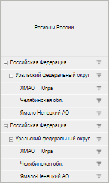
	 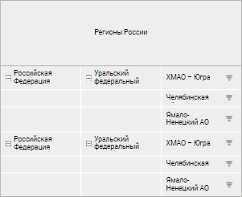

	Примечание.
	 Размещение элементов разных уровней в разных столбцах/строках зависит
	 от использования [многоуровневого
	 боковика/шапки](Layout.htm#layeredheader). При установке или снятии флажка «Многоуровневый
	 боковик/шапка» автоматически устанавливается или снимается
	 флажок «Элементы уровней в отдельные
	 столбцы/строки». Если флажок «Многоуровневый
	 боковик/шапка» снят, то можно отдельно установить флажок «Элементы уровней в отдельные столбцы/строки».

[Отображение
 повторяющихся ячеек](javascript:TextPopup(this))

	Доступно для типов области «Боковик»,
	 «Шапка».

	Для отображения/скрытия повторяющихся ячеек в табличной области
	 установите/снимите флажок «Отображать
	 повторяющиеся ячейки». По умолчанию повторяющиеся ячейки отображаются.
	 Если флажок снят, наименование уровня будет отображаться в отдельной
	 строке перед элементами уровня и в объединенной ячейке напротив элементов
	 уровня.

	Слева показана табличная область с установленным флажком «Элементы уровней в отдельные столбцы»,
	 справа - с установленными флажками «Элементы
	 уровней в отдельные столбцы» и «Отображать
	 повторяющиеся ячейки»:

	 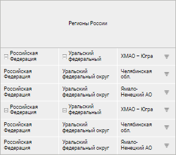

	При установке флажка «Объединять»
	 повторяющиеся элементы будут отображаться только для первой ячейки
	 уровня, при снятии флажка - элементы будут повторяться для каждого
	 элемента уровня.

	Слева показана табличная область с установленными флажками «Элементы уровней в отдельные столбцы»
	 и «Отображать повторяющиеся ячейки»,
	 справа - с установленными флажками «Элементы
	 уровней в отдельные столбцы», «Отображать
	 повторяющиеся ячейки» и «Объединять»:

	 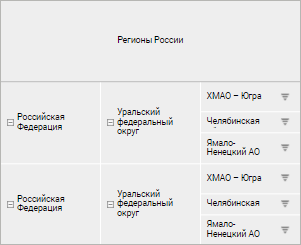

	Примечание.
	 Флажок «Объединять» установлен
	 по умолчанию и доступен, если установлен флажок «Отображать
	 повторяющиеся ячейки».

[Наименование
 показателей](javascript:TextPopup(this))

	Доступно для типа области «Шапка».

	Для настройки отображения наименований показателей поставьте или
	 снимите отметку у требуемых показателей в раскрывающемся списке «Наименования показателей». По умолчанию
	 выбраны все показатели и отображаются все наименования.

	Используйте команды «Отметить все»
	 и «Снять отметку со всех»
	 в контекстном меню списка наименований для установки/снятия отметок
	 сразу всех наименований.

	При [транспонировании](../Table/Table_Area_Structure.htm#transpose)
	 табличной области настройка применяется для показателей, расположившихся
	 в боковике после транспонирования, и становится недоступна для измерений
	 в шапке.

	Для получения подробной информации о вариантах настройки отображения
	 наименований показателей в шапке формы обратитесь к разделу «[Примеры
	 использования настройки отображения наименований показателей](hide_name.htm)».

[Итоги](javascript:TextPopup(this))

	Доступно для типов области «Боковик»,
	 «Шапка».

	Для настройки отображения и расчёта итогов:

		- установите флажок «Итоги».
		 Будет применены итоги по умолчанию или последние настроенные итоги;

		- нажмите кнопку  «Настройка» рядом с флажком «Итоги», будет отображена [группа параметров](../Work/totals.htm) «Итоги
		 по строкам»/«Итоги по
		 столбцам».

	Для отображения/скрытия итогов для данного измерения установите/снимите
	 флажок «[Отображать
	 итог](Layout.htm#dimensions)» в контекстном меню измерения.

[Измерения](javascript:TextPopup(this))

	Доступно для типа областей «Боковик»,
	 «Шапка».

	Для отображения/скрытия итогов для данного измерения установите/снимите
	 флажок «Отображать итог» в
	 контекстном меню измерения. По умолчанию флажок установлен. Флажок
	 доступен, если установлен флажок «[Итоги](Layout.htm#totals)».

	Для создания более компактного вида таблицы используйте команды
	 контекстного меню выбранного измерения параметра «Измерения»:

		- [Объединить
		 с предыдущим](../Table/Merging_Dim.htm#merging). Доступно,
		 если в боковик/шапку таблицы выведено несколько измерений;

		- [Поджимать
		 элементы](../Table/Merging_Dim.htm#tucking). Доступно только
		 для [объединённых измерений](../Table/Merging_Dim.htm#merging)
		 боковика/шапки таблицы;

		- [Настроить](../Table/Merging_Dim.htm#tucking).
		 Доступно при настройке поджатия элементов;

		- Группировать. Доступно
		 только для типа области «Боковик».
		 Для объединения элементов по заданным атрибутам выполните следующие
		 действия:

			- Выполните команду «Группировать»
			 контекстного меню выбранного измерения. Будет открыто окно
			 «Настройка группировки»:

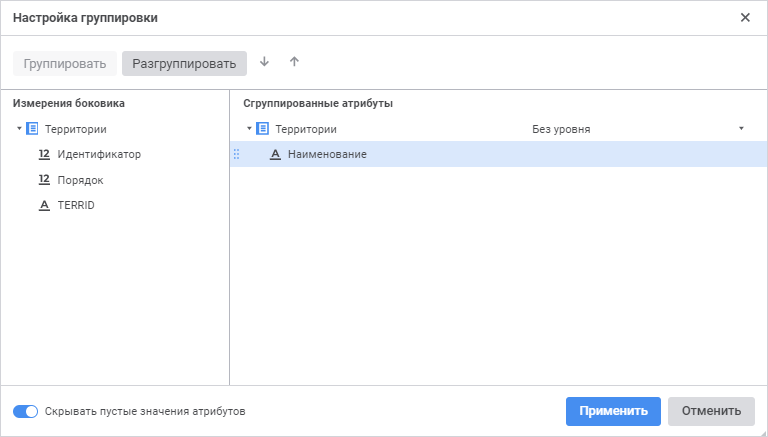

	- Добавьте необходимые атрибуты в область «Сгруппированные
	 атрибуты». Для этого:

		- Выделите атрибут в области «Измерения
		 боковика».

		- Выполните одно из действий:

			- с помощью механизма Drag&Drop переместите атрибут
			 в область «Сгруппированные
			 атрибуты»;

			- нажмите кнопку «Группировать».

Примечание.
 [Скрытые
 атрибуты](UiNavObj.chm::/reference_book/Master_Calendar_reference_book/UiMd_reference_book_Master_Calendar_page3Attr.htm) измерения недоступны для группировки.

	- Выберите уровень справочника, для которого настраивается группировка.
	 Для этого выберите наименование [уровня](UiNavObj.chm::/reference_book/Master_RDS_reference_book/Level.htm)
	 из раскрывающегося списка измерения в области «Сгруппированные
	 атрибуты». По умолчанию выбран вариант «Без
	 уровня». В этом случае группировка применяется ко всем уровням
	 сразу.

	- Разместите атрибуты в нужном порядке:

		- Выделите атрибут в области «Сгруппированные
		 атрибуты».

		- Используйте кнопки 
		 «Переместить вверх» и
		   «Переместить
		 вниз».

Расположение атрибутов в области «Сгруппированные
 атрибуты» влияет на расположение элементов в боковике таблицы.

	- Удалите атрибуты, если они не должны участвовать в группировке.
	 Для этого:

		- Выделите атрибут в области
		 «Сгруппированные атрибуты».

		- Выполните одно из действий:

			- с помощью механизма Drag&Drop переместите атрибут
			 в область «Измерения боковика»;

			- нажмите кнопку «Разгруппировать».

	- Активируйте переключатель «Скрывать
	 пустые значения атрибутов» для отображения только тех атрибутов,
	 значения которых заданы. По умолчанию переключатель активен. Скрывать
	 пустые значения атрибутов требуется, если у элементов значения некоторых
	 атрибутов не заданы. При скрытых пустых значениях атрибутов в таблице
	 будут выведены сначала сгруппированные элементы, а после - элементы,
	 не включенные в группы, то есть те, у которых отсутствует значения
	 атрибутов, по которым настроена группировка.

В результате выполненных действий будут назначены
 атрибуты, по которым осуществляется группировка элементов. Группировка
 распространяется на элементы одного измерения.

Примечание.
 Группировку можно настроить для каждого измерения, отображаемого в боковике,
 кроме измерения, для которого настроена альтернативная иерархия.

	Группировку элементов боковика также можно настроить с помощью [редактора табличной области](../Table/Table_Area_Structure.htm).

[Иерархия](javascript:TextPopup(this))

	Доступно для типов области «Боковик»,
	 «Шапка».

	Для настройки отображения иерархии установите или снимите флажки:

		- Экспандеры. Отображение/скрытие
		 экспандеров для родительских элементов иерархии. По умолчанию
		 флажок установлен.

	Для определения поведения экспандеров
	 при обновлении отчёта установите один из переключателей:

			- Сворачивать.
			 При обновлении отчёта иерархия измерений будет сворачиваться;

			- Разворачивать.
			 По умолчанию. При обновлении отчёта иерархия измерений будет
			 разворачиваться.

	Примечание.
	 Для табличной области доступна возможность настройки пиктограмм экспандеров.
	 Для получения подробной информации о настройке пользовательских экспадеров
	 обратитесь к статье «[Отображение
	 пользовательских экспандеров](UiAnalyticalArea.chm::/TableView/Layout/User_expanders.htm)».

	Пример табличной области с экспандерами:

	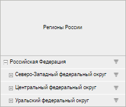

	При скрытии экспандеров все нераскрытые
	 дочерние элементы будут раскрыты в табличной области:

	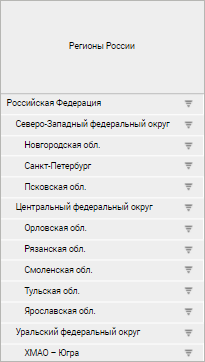

		- Использовать ступенчатую
		 иерархию. Если по столбцам/строкам расположено несколько
		 измерений, то для разграничения элементов измерений в боковике/шапке
		 рекомендуется использовать ступенчатую иерархию. По умолчанию
		 флажок снят.

	Пример табличной области без использования
	 ступенчатой иерархии:

	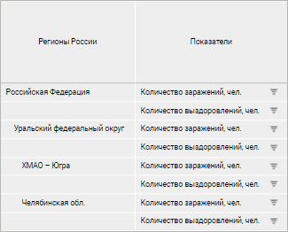

	Пример табличной области с использованием
	 ступенчатой иерархии:

	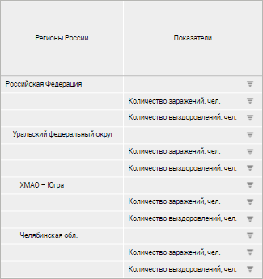

		- Дочерние элементы перед
		 родительскими. Размещение дочерних элементов иерархии перед
		 родительскими:

	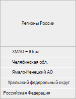

	По умолчанию флажок снят.

		- Повторять элемент уровня
		 для дочерних. Размещение родительских элементов до и после
		 дочерних:

	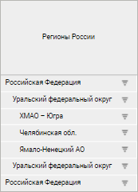

	По умолчанию флажок снят.

		- Отступы элементов уровня.
		 Отступы для наименований дочерних элементов. По умолчанию флажок
		 установлен и задан отступ 3 мм. Для изменения отступа введите
		 или выберите его размер в числовом редакторе.

	В табличной области ниже установлен отступ
	 15 мм и дочерние элементы отображены перед родительскими:

	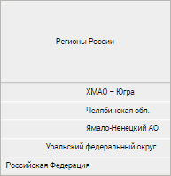

[Сортировка](javascript:TextPopup(this))

	Для сортировки данных в табличной области по строкам и/или по столбцам
	 установите соответствующие флажки «По
	 строкам»/«По столбцам»
	 для области «Таблица» и «Отображать значки сортировки» для
	 шапки и боковика. После установки флажков в заголовках строк/столбцов
	 отображаются значки сортировки /.
	 Флажки установлены по умолчанию. При последовательном нажатии на любой
	 из значков его вид изменяется, и, соответственно, меняется вид сортировки:

		- . Сортировка по убыванию (в случае с
		 текстовыми значениями - от Я до А);

		- . Сортировка по возрастанию (в случае
		 с текстовыми значениями - от А до Я);

		- . Сортировка отключена.

	Примечание.
	 Для типа области «Боковик»
	 сортировка доступна только по строкам, а для типа области «Шапка»
	 - только по столбцам.

[Заголовки](javascript:TextPopup(this))

	Доступно для типа области «Таблица».

	Для отображения/скрытия заголовков боковика или шапки используйте
	 флажки:

		- Заголовки строк.
		 По умолчанию установлен. При установке флажка отображается боковик,
		 при снятии флажка скрывается уголок и боковик.

		- Заголовки столбцов.
		 По умолчанию установлен. При установке флажка отображается шапка,
		 при снятии флажка скрывается уголок и шапка.

		- Всегда отображать заголовки.
		 По умолчанию установлен. При установке флажка отображается боковик/шапка
		 при отсутствующей отметке в измерениях шапки/боковика, при снятии
		 флажка вместо табличной области будет отображаться ячейка со значением
		 «Нет данных».  Отсутствие
		 отметки возможно при привязке измерения к параметру.

[Нумерация](javascript:TextPopup(this))

	Доступно для типов области «Боковик»,
	 «Шапка».

	Для настройки нумерации:

		- установите флажок «Использовать
		 нумерацию». Будет применена [нумерация
		 по умолчанию](Numbering.htm) или последняя настроенная нумерация.

		- нажмите кнопку 
		 «Настройка» рядом с наименованием
		 флажка. Будет открыто окно «[Настройка нумерации](Numbering.htm)».

	По умолчанию флажок снят.

См. также:

[Настройка оформления
 и вида отображения формы](Design.htm)

		Справочная
		 система на версию 10.9
		 от 18/08/2025,
		 © ООО «ФОРСАЙТ»,
