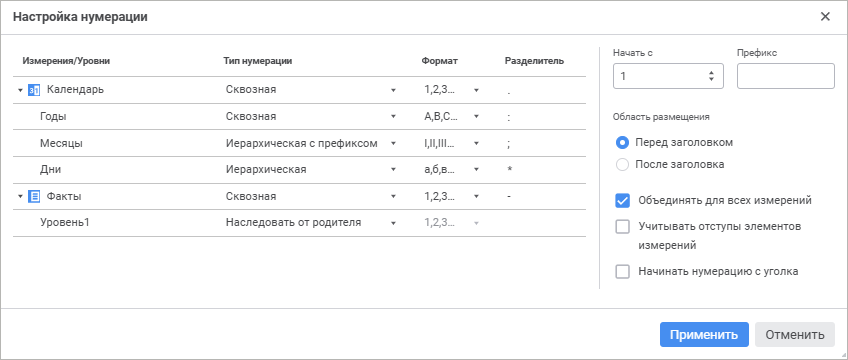
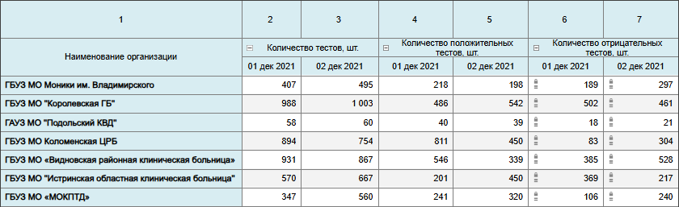
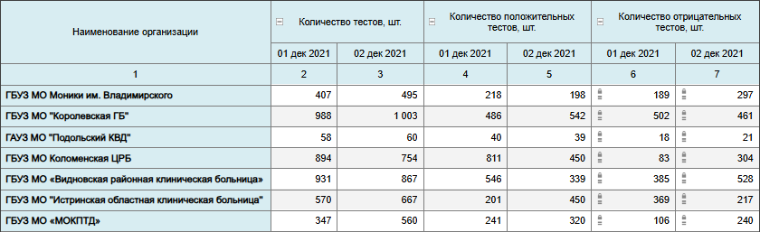
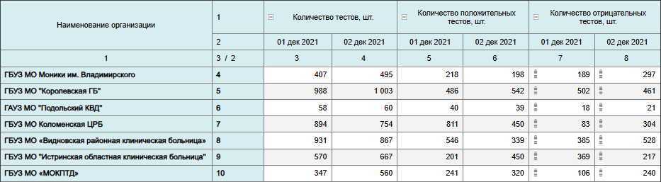

# Настройка нумерации: Формы ввода, веб-приложение

Настройка нумерации: Формы ввода, веб-приложение
-

# Настройка нумерации

Для табличной области можно включить и настроить нумерацию строк и столбцов.

Для включения и настройки нумерации используйте панель «[Размещение](../../../uireport/Web/Table/Attribute/Layout.htm)».

[Для открытия
 группы параметров «Размещение»](javascript:TextPopup(this))

	Для открытия на панели параметров группы параметров «Размещение»:

		- Выделите ячейку или диапазон ячеек, принадлежащих табличной
		 области.

		- Нажмите кнопку  «Параметры» панели инструментов.

		- Выберите требуемый тип области в раскрывающемся меню заголовка
		 панели параметров.

Для включения нумерации установите флажок «Использовать
 нумерацию». Будет применена нумерация по умолчанию или последняя
 настроенная нумерация. Настройки по умолчанию:

	- для строк:

		- номера строк отобразятся отдельным столбцом боковика перед
		 заголовками;

		- нумерация начинается со строк с данными;

		- применяется сквозная нумерация;

	- для столбцов:

		- номера столбцов отобразятся отдельной строкой шапки после
		 заголовков;

		- нумерация начинается с уголка;

		- применяется сквозная нумерация.

Для настройки нумерации нажмите кнопку  «Настройка»
 рядом с наименованием флажка. Будет открыто окно «Настройка
 нумерации»:

Доступные настройки:

	- Настройки нумерации для измерений
	 и уровней. В области настройки нумерации для измерений и [уровней
	 измерений](UiNavObj.chm::/reference_book/Master_RDS_reference_book/Level.htm) укажите:

		- Тип
		 нумерации. Настройте тип нумерации для измерения/уровня.
		 Доступные типы:

			- Наследовать от родителя.
			 Позволяет по цепочке изменить тип нумерации, формат, разделитель.
			 Доступен только для уровней измерения. Выбран по умолчанию
			 для уровней измерения;

			- Сквозная. Позволяет
			 установить сквозную нумерацию элементов уровня независимо
			 от нумерации родительского уровня. Выбран по умолчанию для
			 измерения;

			- Иерархическая.
			 При установке нумерация уровня будет подчинена родительскому
			 уровню;

			- Иерархическая с префиксом.
			 При установке нумерация уровня будет подчинена родительскому
			 уровню, номер родительского элемента будет включен в префикс;

		- Формат.
		 Настройте формат нумерации. Доступен для типов нумерации: сквозная,
		 иерархическая и иерархическая с префиксом. Доступные варианты:

			- 1, 2, 3. Установлено по умолчанию;

			- a, b, c;

			- A, B, C;

			- i, ii, iii;

			- I, II, III;

			- а, б, в;

			- А, Б, В;

Если закончились буквы алфавита, то нумерация
 продолжается сначала с повторным символом;

		- Разделитель. Для
		 добавления символа после номера или для нумерации с префиксом
		 укажите любой один символ в поле. Если символ не задан, то разделителя
		 после номера и между номером и префиксом, если задан иерархический
		 тип нумерации с префиксом, не будет. Доступен для типов нумерации:
		 сквозная, иерархическая и иерархическая с префиксом. По умолчанию
		 не установлен;

	- Начальное значение.
	 Для определения начального значения нумерации введите значение в поле.
	 Доступно для первого измерения. По умолчанию установлено значение
	 «1». В зависимости от указанного
	 формата нумерации начальное значение в табличной области преобразуется
	 под формат, при этом в окне настроек значение останется числовым;

	- Префикс. Для добавления
	 символов перед номером, укажите любые символы в поле. Префикс будет
	 добавлен для указанного измерения. Для применения префикса ко всем
	 измерениям установите для остальных измерений тип нумерации «Иерархическая с префиксом». По умолчанию
	 не задан;

	- Область размещения.
	 Для определения места расположения столбца с нумерацией относительно
	 заголовков установите переключатель в одно из положений: «Перед
	 заголовком» или «После заголовка»:

	 Перед
	 заголовком

	 После
	 заголовка

		

		

	- Объединять для всех измерений.
	 Для сквозной нумерации всех измерений установите флажок «Объединять
	 для всех измерений». Доступно если боковик или шапка состоят
	 из двух и более измерений. По умолчанию флажок включен. При снятом
	 флажке элементы нумеруются в пределах каждого элемента первого измерения,
	 выведённого в боковик:

	 Флажок
	 установлен

	 Флажок
	 снят

		

		

При объединении измерений боковика с поджатием
 логика нумерации не меняется;

	- Учитывать отступы элементов
	 измерения. Для отображения отступов нумерации в соответствии
	 с отступами размещения элементов измерений в табличной области установите
	 флажок «Учитывать отступы элементов
	 измерения»;

	- Начать нумерацию с уголка.
	 Для нумерации с учётом строк/столбцов уголка установите флажок «Начать нумерацию с уголка». При
	 установке флажка для строк и столбцов:

См. также:

[Настройка размещения](Layout.htm)

		Справочная
		 система на версию 10.9
		 от 18/08/2025,
		 © ООО «ФОРСАЙТ»,
