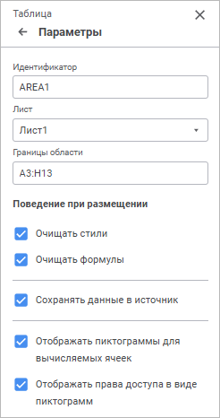

# Настройка параметров

Настройка параметров
-

# Настройка параметров

Для настройки общих параметров табличной области используйте группу
 параметров «Параметры» [панели
 параметров](../Starting/Starting.htm#elements):

[Для открытия
 группы параметров «Параметры»](javascript:TextPopup(this))

	Для открытия на панели параметров группы параметров «Параметры»:

		- Выделите ячейку или диапазон ячеек, принадлежащих табличной
		 области.

		- Нажмите кнопку  «Параметры» панели инструментов.

		- Выберите тип области «Таблица»
		 в раскрывающемся меню заголовка панели параметров.

Задайте параметры:

[Идентификатор](javascript:TextPopup(this))

	В поле указан идентификатор табличной области, как объекта на листе
	 формы ввода.

	Для изменения идентификатора табличной области введите в поле последовательность
	 букв латинского алфавита и цифр. Идентификатор должен быть уникальным
	 в пределах формы ввода.

[Лист](javascript:TextPopup(this))

	Для перемещения табличной области на другой лист формы ввода из
	 раскрывающегося списка «Лист»
	 выберите необходимый лист.

	Примечание.
	 При перемещении табличной области с листа на лист сохраняются форматирование
	 и все применённые к таблице настройки.

	По умолчанию отображается наименование листа, на котором расположена
	 табличная область.

[Границы области](javascript:TextPopup(this))

	Для перемещения табличной области по листу формы ввода измените
	 координату левого верхнего угла табличной области.

	Примечание.
	 Границы табличной области не могут быть установлены больше или меньше
	 их фактического размера.

	По умолчанию отображается фактический диапазон ячеек табличной области.

[Очищать
 стили](javascript:TextPopup(this))

	Для очистки оформления, применённого на листе, в таблице установите
	 флажок «Очищать стили». Очищение
	 оформления в таблице будет происходить только при [обновлении
	 формы](Refresh.htm).

	Для использования оформления, применённого на листе, к таблице снимите
	 флажок «Очищать стили».

	К оформлению листа относятся настройки [оформления](Format.htm),
	 [условного форматирования](Conditional_Formatting.htm),
	 [стиля таблицы и предопределённые
	 стили](../Work/Table_Styles.htm), заданные для типа области «Ячейка»
	 на [панели параметров](Design.htm#format) независимо от
	 принадлежности ячейки.

	Снимите флажок «Очищать стили»,
	 только если табличная область не будет динамически перестраиваться,
	 при этом меняя свой размер.

	По умолчанию флажок установлен.

[Очищать формулы](javascript:TextPopup(this))

	Для использования только вычисленного значения формулы в ячейке
	 табличной области установите флажок «Очищать
	 формулы».

	Для использования самой формулы в ячейке табличной области снимите
	 флажок «Очищать формулы».

	Изменение поведения будет применено при [обновлении](Refresh.htm)
	 или [сохранении](../Starting/ConstructForm.htm#save) формы
	 ввода.

	Если флажок при открытии формы ввода был снят, а в процессе работы
	 с формой ввода установлен, то уже введенные формулы в табличной области
	 будут рассчитаны, и расчётные значения будут подставлены в ячейки.

[Сохранять данные
 в источник](javascript:TextPopup(this))

	Установка флажка позволяет сохранять измененные данные табличной
	 области в источник данных. Если флажок снят, то сохранить измененные
	 данные в источник невозможно. По умолчанию флажок установлен.

[Отображать пиктограммы
 для вычисляемых ячеек](javascript:TextPopup(this))

	Установка флажка позволяет отображать пиктограммы  для ячеек вычисляемых элементов.
	 По умолчанию флажок установлен.

	Для получения подробной информации
	 обратитесь к статье «[Отображение
	 пиктограмм в ячейках](UiAnalyticalArea.chm::/TableView/Formatting/Cells_icons.htm)».

[Отображать
 права доступа в виде пиктограмм](javascript:TextPopup(this))

	Установка флажка позволяет отображать пиктограммы  для ячеек, на которые у
	 пользователя нет прав. По умолчанию флажок установлен.

	Для получения подробной информации
	 обратитесь к статье «[Отображение
	 пиктограмм в ячейках](UiAnalyticalArea.chm::/TableView/Formatting/Cells_icons.htm)».

См. также:

[Настройка оформления
 и вида отображения формы](Design.htm)

		Справочная
		 система на версию 10.9
		 от 18/08/2025,
		 © ООО «ФОРСАЙТ»,
