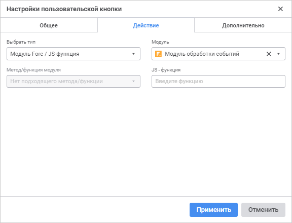
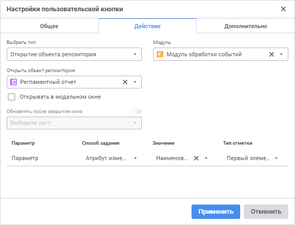
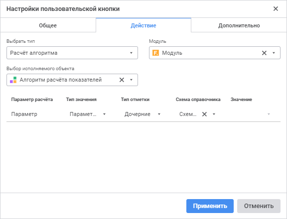
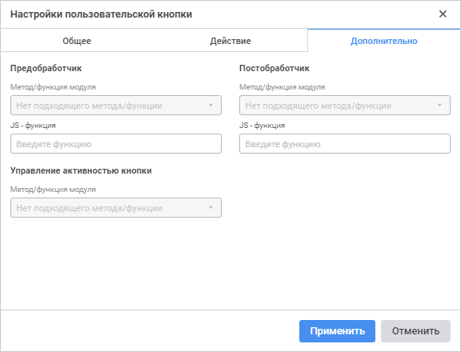

# Настройка пользовательских кнопок: Формы ввода

Настройка пользовательских кнопок: Формы ввода
-

# Настройка пользовательских кнопок

Пользовательские кнопки отображаются на [панели
 инструментов](../Starting/Starting.htm#elements) и предназначены для ручного выполнения Fore-модулей или
 JavaScript-функций, открытия объектов репозитория и запуска алгоритмов
 расчёта.

Доступные операции:

	- [добавление пользовательских
	 кнопок](Toolbar_settings.htm#button);

	- [редактирование пользовательских
	 кнопок](Toolbar_settings.htm#edit);

	- [удаление пользовательских
	 кнопок](Toolbar_settings.htm#delete).

## Задание настроек кнопки

Задание настроек пользовательских кнопок выполняется с помощью соответствующих
 вкладок окна «Настройки пользовательской
 кнопки».

[Для открытия окна](javascript:TextPopup(this))

		- Выполните команду 
		 «Настроить панель инструментов»
		 контекстного меню [панели
		 инструментов](../Starting/Starting.htm#elements).

		- Выберите пользовательскую вкладку панели инструментов из
		 списка.

		- Выберите кнопку после которой должна будет расположиться
		 новая кнопка. Если на вкладку добавляется первая кнопка пропустите
		 шаг.

		- Выполните команду из раскрывающегося списка кнопки «Добавить > Пользовательскую кнопку».

	 Общее Действие Дополнительно

		

		Задайте общие настройки кнопки:

			- Наименование кнопки.
			 Введите наименование пользовательской кнопки. По умолчанию:
			 «Пользовательская кнопка
			 N», где N -
			 номер кнопки.

		Наименование пользовательской кнопки
		 может быть сохранено на разных языках в зависимости от текущего
		 языка, выбранного в [окне регистрации](getstarted.chm::/GetStarted/Get_Started.htm),
		 или с помощью ресурса, входящего в [состав
		 объекта](UiNav.chm::/03_Objects/UiNav_Obj_BasicPropConsist.htm). Для получения подробной информации
		 обратитесь к разделу «[Настройка
		 мультиязычности](UiNav.chm::/Multilanguage/Multilanguage_setting.htm)»;

			- Изображение для кнопки.
			 Установите пиктограмму кнопки, которая будет отображаться
			 на [панели инструментов](../Starting/Starting.htm#elements).
			 Для этого нажмите кнопку «Загрузить
			 пиктограмму» и выберите изображение в открывшемся окне.
			 Для загрузки доступны изображения форматов SVG, PNG, JPG,
			 BMP и GIF. По умолчанию для кнопки установлена пиктограмма .

		Примечание.
		 В качестве пиктограммы кнопки рекомендуется использовать изображения
		 размером 16x16 пикселей. Если размер изображения больше 16x16
		 пикселей, то оно автоматически будет подогнано под рекомендуемый
		 размер.

		Для сброса заданного изображения
		 и установки пиктограммы по умолчанию нажмите кнопку  «Сбросить
		 пиктограмму».

		

		Выберите тип кнопки из раскрывающегося списка «Выбрать
		 тип».

		[Настройка
		 открытия объекта репозитория](javascript:TextPopup(this))

			При выборе типа «Открытие
			 объекта репозитория» задайте дополнительные настройки:

				- Открыть объект
				 репозитория. Выберите
				 в раскрывающемся списке объект репозитория, который будет
				 открываться по нажатию кнопки:

			

			В качестве объекта репозитория
			 можно выбрать форму ввода, [регламентный отчёт](uireport.chm::/UiReport_purpose.htm), [веб-форму](uidevenv.chm::/01_Development_Environment/02_Work_in_Development_Environment/DevEnv_Object/Web_Form.htm)
			 или [справочник
			 НСИ](uinavobj.chm::/reference_book/Master_RDS_reference_book/Master_RDS.htm).

Для быстрого выбора объекта в поле для поиска введите его название/идентификатор/ключ
 в зависимости от настроек отображения. Поиск будет выполняться автоматически
 по мере ввода текста. Список будет содержать объекты, наименования/идентификаторы/ключи
 которых содержат вводимый текст.

Для настройки отображения объектов репозитория в списке нажмите кнопку
 «Отображение объекта» и выберите
 в раскрывающемся меню вариант отображения:

		- Наименование. Объекты
		 отображаются под своими наименованиями. Вариант по умолчанию;

		- Идентификатор. Объекты
		 отображаются под своими идентификаторами;

		- Ключ. Объекты отображаются
		 под своими ключами.

Выбрать можно несколько вариантов. Идентификатор
 и ключ будут указаны в скобках;

			Примечание.
			 Объект, используемый в пользовательской кнопке, включается
			 в иерархию объектов, из которых состоит форма ввода. Для просмотра
			 иерархии объектов форма ввода используйте вкладку «[Состоит
			 из](uinav.chm::/03_objects/uinav_obj_basicprop.htm)» окна «Свойства
			 объекта» в навигаторе объектов.

				- Модуль.
				 При необходимости выберите из раскрывающегося списка модуль,
				 написанный на языке Fore. Модуль может быть использован
				 для предобработчика, постобработчика, управления активностью
				 кнопки, настройка которых выполняется на вкладке «Дополнительно». Для
				 кнопки можно задать только один модуль;

				- Установите флажок при необходимости:

					- Открывать в
					 модальном окне. По умолчанию флажок снят. При
					 установке флажка блокируется работа с родительской
					 формой ввода во время открытия объекта;

					- Обновлять после
					 закрытия окна. Переключатель становится доступным
					 после установки флажка «Открывать
					 в модальном окне». В раскрывающемся списке
					 выберите листы, которые необходимо обновить после
					 закрытия объекта.

			Примечание.
			 Сохранение данных в открытом модальном окне является обязательным
			 условием для обновления листов после закрытия объекта.

				- Задайте параметры для
				 объектов, у которых есть параметры:

					- Способ задания.
					 В раскрывающемся списке выберите:

						- Не передавать.
						 Значение по умолчанию. При открытии объекта в
						 параметр ничего не будет передаваться;

						- Параметр
						 объекта. При открытии объекта в параметр
						 передается значение параметра формы ввода или
						 отчёта;

						- Атрибут
						 измерения. При открытии объекта в параметр
						 передается значение атрибута первого элемента
						 или всех элементов выбранного измерения из выделенной
						 в таблице области;

						- Вручную.
						 При открытии объекта в параметр передается указанное
						 значение;

				- Значение.
				 Наполнение поля зависит от выбранного способа передачи
				 значения:

					- если был выбран способ передачи значения «Не передавать»,
					 то поле недоступно;

					- если был выбран способ передачи значения «Параметр объекта»,
					 то в раскрывающемся списке выберите параметр. В списке
					 отображаются доступные параметры форм ввода. Список
					 параметров формы ввода отфильтрован по типу параметра
					 объекта. Выбрать можно только один параметр;

					- если был выбран способ передачи значения «Атрибут измерения»,
					 то в раскрывающемся списке выберите атрибут. В списке
					 отображаются все доступные атрибуты всех измерений
					 всех табличных областей в форме ввода. Выбрать можно
					 только один атрибут;

					- если был выбран способ передачи значения «Вручную», то в поле
					 «Значение»
					 отображается редактор, соответствующий типу параметра.
					 Выбрать можно только один элемент;

				- Тип
				 отметки. Раскрывающийся список доступен если был
				 выбран способ передачи значения «Атрибут
				 измерения». В раскрывающемся списке выберите:

					- Первый элемент.
					 В параметр передается выбранный атрибут первого элемента
					 измерения из выделения;

					- Все элементы.
					 В параметр передаются значения выбранного атрибута
					 всех элементов измерения из выделения.

### Особенности работы с веб-формами

			Если по пользовательской кнопке открывается веб-форма, то
			 в системе в рамках пользовательской сессии фиксируется активный
			 регламентный отчёт, с которым связана форма ввода. Активный
			 отчёт возвращает статическое свойство [PrxReport.ActiveReport](KeReport.chm::/Interface/IPrxReportClass/IPrxReportClass.ActiveReport.htm),
			 доступное в языке Fore. При использовании нескольких веб-форм,
			 вызванных из разных отчётов, в рамках одной сессии активным
			 отчётом будет установлен тот, из которого произошёл последний
			 вызов веб-формы вплоть до её закрытия.

			При наличии нескольких одновременно открытых регламентных
			 отчётов и веб-форм свойство [PrxReport.ActiveReport](KeReport.chm::/Interface/IPrxReportClass/IPrxReportClass.ActiveReport.htm)
			 может отработать некорректно, так как вернёт последний отчёт,
			 из которого открывалась веб-форма. Изменить активный отчёт
			 можно с помощью операции [SetActiveReport](PPSOMService.chm::/Operations/RegularReport/SetActiveReport.htm).

			Для работы с отчётом из веб-формы рекомендуется сохранять
			 активный отчёт в глобальную переменную, объявленную на уровне
			 класса веб-формы. Запись активного отчёта в переменную осуществлять
			 в событии onShow:

				Class TESTWebForm: WebForm

				    activeRep: IPrxReport;

				    activeSheet: IPrxSheet;

				    Sub TESTWebFormOnShow;

				    Begin

				        activeRep := PrxReport.ActiveReport;

				        activeSheet := activeRep.ActiveSheet;

				        // Дальнейшая работа с отчётом

				    End Sub TESTWebFormOnShow;

				End Class TESTWebForm;

		[Настройка
		 алгоритма расчёта](javascript:TextPopup(this))

			При выборе типа «Расчёт
			 алгоритма» задайте дополнительные настройки:

				- Выбор исполняемого
				 объекта. Выберите в раскрывающемся списке алгоритм
				 расчёта, который будет выполняться по нажатию кнопки:

			

Для быстрого выбора объекта в поле для поиска введите его название/идентификатор/ключ
 в зависимости от настроек отображения. Поиск будет выполняться автоматически
 по мере ввода текста. Список будет содержать объекты, наименования/идентификаторы/ключи
 которых содержат вводимый текст.

Для настройки отображения объектов репозитория в списке нажмите кнопку
 «Отображение объекта» и выберите
 в раскрывающемся меню вариант отображения:

		- Наименование. Объекты
		 отображаются под своими наименованиями. Вариант по умолчанию;

		- Идентификатор. Объекты
		 отображаются под своими идентификаторами;

		- Ключ. Объекты отображаются
		 под своими ключами.

Выбрать можно несколько вариантов. Идентификатор
 и ключ будут указаны в скобках;

			Примечание.
			 Алгоритм расчёта, используемый в пользовательской кнопке,
			 включается в иерархию объектов, из которых состоит форма ввода.
			 Для просмотра иерархии объектов форма ввода используйте вкладку
			 «[Состоит
			 из](uinav.chm::/03_objects/uinav_obj_basicprop.htm)» окна «Свойства
			 объекта» в навигаторе объектов.

				- Модуль.
				 При необходимости выберите из раскрывающегося списка модуль,
				 написанный на языке Fore. Модуль может быть использован
				 для предобработчика, постобработчика, управления активностью
				 кнопки, настройка которых выполняется на вкладке «Дополнительно». Для
				 кнопки можно задать только один модуль;

				- Задайте параметры для
				 алгоритмов расчёта, у которых есть параметры:

					- Тип
					 значения. Укажите значения, которые используются
					 при расчёте алгоритма:

						- Параметр
						 объекта. В расчёте используется значение
						 параметра объекта;

						- Константное
						 значение. В расчёте используется постоянное
						 значение;

					- Тип отметки.
					 В зависимости от выбранного типа значения:

						- если установлен тип «Параметр
						 объекта», укажите тип отметки, выбрав его
						 из раскрывающегося списка. Допустимые значения:
						 исходная, первый элемент, последний элемент, исходная+дочерние,
						 исходная+дочерние (рекурсивно), дочерние, дочерние
						 (рекурсивно);

						- если установлен тип «Константное
						 значение», тип отметки недоступен;

					- Схема справочника.
					 Выберите из раскрывающегося списка [схему
					 отметки](UiNavObj.chm::/reference_book/look-and-feel_Reference_book/UiMd_reference_book_look-and-feel_Scheme.htm) справочника, используемого
					 в качестве параметра алгоритма. Если у справочника
					 не настроена схема отметки, то список будет пустой;

			Примечание.
			 Схема отметки справочника имеет больший приоритет, чем тип
			 отметки.

					- Значение.
					 В зависимости от выбранного типа значения:

						- если установлен
						 тип «Параметр
						 объекта», укажите параметр или атрибут
						 параметра отчёта, выбрав его из раскрывающегося
						 списка;

						- если установлен
						 тип «Константное
						 значение», задайте значение константы.

		[Настройка
		 модуля Fore/JS-функции](javascript:TextPopup(this))

			При выборе типа «Модуль
			 Fore/JS-функция» задайте дополнительные настройки:

				- Модуль.
				 Выберите из раскрывающегося списка модуль, написанный
				 на языке Fore. Для кнопки можно задать только один модуль.

Для быстрого выбора объекта в поле для поиска введите его название/идентификатор/ключ
 в зависимости от настроек отображения. Поиск будет выполняться автоматически
 по мере ввода текста. Список будет содержать объекты, наименования/идентификаторы/ключи
 которых содержат вводимый текст.

Для настройки отображения объектов репозитория в списке нажмите кнопку
 «Отображение объекта» и выберите
 в раскрывающемся меню вариант отображения:

		- Наименование. Объекты
		 отображаются под своими наименованиями. Вариант по умолчанию;

		- Идентификатор. Объекты
		 отображаются под своими идентификаторами;

		- Ключ. Объекты отображаются
		 под своими ключами.

Выбрать можно несколько вариантов. Идентификатор
 и ключ будут указаны в скобках;

				- Метод/функция модуля.
				 Выберите из раскрывающегося списка метод или функцию модуля.
				 Функция должна иметь требуемую сигнатуру:

			Public Sub <Наименование функции>(<Report>: IPrxReport);

			Begin

			…

			End Sub <Наименование функции>;

			Параметр:

					- Report.
					 В параметр передаётся регламентный отчёт в формате
					 IPrxReport.
					 При работе с этим объектом будут доступны все свойства
					 и методы интерфейса [IPrxReport](KeReport.chm::/Interface/IPrxReport/IPrxReport.htm).

			Примечание.
			 Если в модуле нет методов и функций, удовлетворяющих требуемой
			 сигнатуре, то список «Метод/функция
			 модуля» недоступен.

			Пример функции:

				Sub SubButtons(Report: IPrxReport);

				Var

				    TSheet: ITabSheet;

				Begin

				    TSheet := (Report.ActiveSheet As IPrxTable).TabSheet;

				    TSheet.Cell(0, 0).Value := DateTime.Now.ToString;

				    TSheet.Recalc;

				End Sub SubButtons;

	- JS-функция. Укажите
	 наименование функции на языке JavaScript, которую необходимо запустить
	 при выполнении действия кнопки. Сигнатура для ввода наименования функции:

javascript:<Наименование
 функции(пользовательские параметры, callback, args)>

Примечание.
 Наличие угловых скобок при указании наименования функции с параметрами
 обязательно.

Параметры:

		- пользовательские параметры.
		 Значения пользовательских параметров в соответствии с сигнатурой
		 вызываемой функции. Необязательный параметр;

		- callback. Функция
		 обратного вызова. Обязательный параметр;

		- args. Аргументы
		 функции, генерируемые платформой. Необязательный параметр, позволяет
		 получить доступ к объекту, из которого была выполнена js-функция.

Примеры указания наименования функции:

javascript:<Test(callback)>
 - вызов простой js-функции без передачи каких-либо параметров в неё.

javascript:<CalculateAB(100,
 "200", callback)> - вызов js-функции с передачей двух значений
 различных типов.

javascript:<Check(callback,
 args)> - вызов js-функции с возможностью доступа к объекту, из которого
 она вызвана.

Если указаны js-функция и Fore-функция, то
 сначала выполняется Fore-функция, затем js-функция.

Для получения подробной информации о сигнатуре
 и подключении js-функции к форме ввода обратитесь к разделу «[Подключение пользовательской
 js-функции](dhtmlFAQ.chm::/FAQ/js_to_link.htm)».

Веб-приложение предоставляет реализацию различных
 ресурсов, которые могут использоваться внутри кода JS-функции.

Параметр args
 имеет поле moduleId, которое возвращает
 уникальный идентификатор открытого экземпляра объекта, из которого вызывается
 js-функция. Данный идентификатор используется с методами объекта Platform.Managers, описание которого
 представлено ниже.

		- Platform.Bi - объект,
		 содержащий методы для взаимодействия с BI-сервером посредством
		 Json-запросов. Список методов и их сигнатура:

			- execMethod('ID
			 репозитория', 'ID сборки', 'Метод', ['Параметр 1','Параметр
			 2',…]) - для выполнения запросов с помощью операции [ForeExec](PPSOMService.chm::/Operations/Repository/ForeExec.htm).

			- sendRequest({параметры},
			 Json-запрос 1, Json-запрос 2,…) - для выполнения пакета Json-запросов.
			 Каждый отдельный запрос осуществляет выполнение одной из доступных
			 [операций](PPSOMService.chm::/Operations/BaseService.htm)
			 BI-сервера. В качестве параметров в текущей реализации может
			 быть указан параметр batched:
			 boolean, указывающий необходимость выполнения указанных
			 запросов в виде одного пакета.

			- putBin('моникёр', FormData) - для загрузки
			 изображения в документ с помощью операции [PutBin](PPSOMService.chm::/Additional/PutBin.htm).

			- getBin('моникёр',
			 признак загрузки, 'имя файла') - для получения изображения
			 из документа с помощью операции [GetBin](PPSOMService.chm::/Additional/GetBin.htm).

		- Platform.Notification
		 - объект, содержащий методы для вывода уведомлений, стилизованных
		 под оформление платформы. Список методов и их сигнатура:

			- error('Заголовок',
			 'Текст'). Вывод сообщения об ошибке.

			- warning('Заголовок',
			 'Текст'). Вывод предупреждающего сообщения.

			- success('Заголовок',
			 'Текст'). Вывод сообщения об успешном событии.

			- info('Заголовок',
			 'Текст'). Вывод информационного сообщения.

		- Platform.Managers
		 - объект, предоставляющий доступ к открытым объектам репозитория,
		 из которых вызываются js-функции. В текущей реализации у данного
		 объекта реализованы объекты Prx и DataEntryForm, предоставляющие
		 доступ к регламентному отчёту и форме ввода соответственно. Для
		 получения доступа к экземпляру объекта, из которого вызывается
		 js-функция, передайте в конструктор указанных объектов уникальный
		 идентификатор moduleId.
		 Каждый объект имеет два поля:

			- selectors.
			 Содержит селекторы для получения информации об открытом объекте:

				- name() -
				 имя объекта;

				- key() -
				 ключ объекта;

				- id() - идентификатор
				 объекта;

				- openId():
				 - моникёр открытого экземпляра объекта.

			- actions. Содержит
			 метод refresh() для обновления открытого объекта.

Примеры функций:

// Вывод различных уведомлений
async function showNotifications(callback) {
  Platform.Notification.error('Ошибка', 'Ошибка сохранения данных. Неверный тип значения.');
  Platform.Notification.warning('Предупреждение', 'Выполнение расчёта может занять длительное время.');
  Platform.Notification.success('Успешно', 'Расчёт завершён.');
  Platform.Notification.info('Информация', 'Появилась новая версия отчёта.');
  callback();
}
// Обновление регламентного отчёта
async function refreshPrx(callback, args) {
  const { moduleId } = args;
  const refresh = Platform.Managers.Prx(moduleId).actions.refresh();
  callback();
}
// Отправка JSON-запроса
async function closeControlPanel(callback, args) {
  const { moduleId } = args;
  const openId = Platform.Managers.Prx(moduleId).selectors.openId();
  const closeControlPanel = {
    request: {
      SetPrxMeta: {
        mon: openId,
        tArg: {
          meta: {
            options: {
              controlPanelVisible: false,
            },
          },
        },
      },
    },
    handleResult: (response) => response?.SetPrxMetaResult,
  };
  const response = await Platform.Bi.sendRequest({}, closeControlPanel);
  callback();
}
// Пакетное выполнение запросов
async function batchRequests(callback, args) {
  // Запросы
  const request1 = {
    request: {
      // Первый запрос
    },
  };
  const request2 = {
    request: {
      // Второй запрос
      },
    },
  };
  const response = await Platform.Bi.sendRequest({batched: true}, request1, request2);
  callback();
}
// Получение имени формы ввода
async function getName(callback, args) {
  const { moduleId } = args;
  const openId = Platform.Managers.Prx(moduleId).selectors.openId();
  const metadata = await Platform.Bi.execMethod('ASM_WEB_METHODS', 'GetMetadata', [openId]);
  callback(metadata.Name);
}

		

		После задания Fore-модуля настройте предобработчик, постобработчик
		 и управление активностью кнопки.

		[Настройка
		 предобработчика](javascript:TextPopup(this))

			Предобработчик используется для вывода текстового сообщения
			 с произвольным текстом при нажатии на пользовательскую кнопку.
			 Например, для кнопки, вызывающей выполнение расчёта, может
			 быть настроен предобработчик с сообщением о начале выполнения
			 расчёта, которое может занять длительное время. В этом случае
			 при нажатии кнопки перед выполнением расчёта будет выведено
			 настроенное сообщение.

			Для настройки предобработчика задайте параметры:

				- Метод/функция модуля.
				 Выберите из раскрывающегося списка метод или функцию модуля.
				 Поле доступно только после выбора модуля.

			Список содержит все методы и
			 функции выбранного модуля, соответствующие сигнатуре:

			Function <Наименование функции>(<Report>: IPrxReport; [Var messageType: Integer]): String;

			Примечание.
			 Если в модуле нет методов и функций, удовлетворяющих требуемой
			 сигнатуре, то список «Метод/функция
			 модуля» недоступен.

			Параметры:

					- Report.
					 В параметр передаётся регламентный отчёт в
					 формате IPrxReport.
					 При работе с этим объектом будут доступны все свойства
					 и методы интерфейса [IPrxReport](KeReport.chm::/Interface/IPrxReport/IPrxReport.htm).

					- messageType.
					 Необязательный параметр. Предназначен для определения
					 формата выводимого сообщения. Если параметр не задан,
					 то будет применяться диалог подтверждения. Для скрытия
					 выводимого сообщения уберите возвращаемое значение
					 в Return. Допустимые значения:

						- 0.
						 Диалог подтверждения. При нажатии кнопки «Да» диалога
						 выполняется заданное для кнопки действие. При
						 нажатии кнопки «Нет»
						 диалога заданное для кнопки действие выполняться
						 не будет;

						- 1.
						 Ошибка. При нажатии кнопки «ОК»
						 диалога заданное для кнопки действие не выполняется;

						- 2.
						 Предупреждение. При нажатии кнопки «ОК»
						 диалога заданное для кнопки действие не выполняется;

						- 3.
						 Информационное сообщение. При нажатии кнопки «ОК» диалога
						 заданное для кнопки действие не выполняется.

			Пример функции:

				Function MessageInformationBox(Report: IPrxReport; Var messageType: integer): String;

				    Begin

				        messageType := 3;

				    Return "Операция будет доступна, когда будут введены все данные";

				End Function MessageInformationBox;

	- JS-функция. Укажите
	 наименование функции на языке JavaScript, которую необходимо запустить
	 при выполнении действия кнопки. Сигнатура для ввода наименования функции:

javascript:<Наименование
 функции(пользовательские параметры, callback, args)>

Примечание.
 Наличие угловых скобок при указании наименования функции с параметрами
 обязательно.

Параметры:

		- пользовательские параметры.
		 Значения пользовательских параметров в соответствии с сигнатурой
		 вызываемой функции. Необязательный параметр;

		- callback. Функция
		 обратного вызова. Обязательный параметр;

		- args. Аргументы
		 функции, генерируемые платформой. Необязательный параметр, позволяет
		 получить доступ к объекту, из которого была выполнена js-функция.

Примеры указания наименования функции:

javascript:<Test(callback)>
 - вызов простой js-функции без передачи каких-либо параметров в неё.

javascript:<CalculateAB(100,
 "200", callback)> - вызов js-функции с передачей двух значений
 различных типов.

javascript:<Check(callback,
 args)> - вызов js-функции с возможностью доступа к объекту, из которого
 она вызвана.

Если указаны js-функция и Fore-функция, то
 сначала выполняется Fore-функция, затем js-функция.

Для получения подробной информации о сигнатуре
 и подключении js-функции к форме ввода обратитесь к разделу «[Подключение пользовательской
 js-функции](dhtmlFAQ.chm::/FAQ/js_to_link.htm)».

Веб-приложение предоставляет реализацию различных
 ресурсов, которые могут использоваться внутри кода JS-функции.

Параметр args
 имеет поле moduleId, которое возвращает
 уникальный идентификатор открытого экземпляра объекта, из которого вызывается
 js-функция. Данный идентификатор используется с методами объекта Platform.Managers, описание которого
 представлено ниже.

		- Platform.Bi - объект,
		 содержащий методы для взаимодействия с BI-сервером посредством
		 Json-запросов. Список методов и их сигнатура:

			- execMethod('ID
			 репозитория', 'ID сборки', 'Метод', ['Параметр 1','Параметр
			 2',…]) - для выполнения запросов с помощью операции [ForeExec](PPSOMService.chm::/Operations/Repository/ForeExec.htm).

			- sendRequest({параметры},
			 Json-запрос 1, Json-запрос 2,…) - для выполнения пакета Json-запросов.
			 Каждый отдельный запрос осуществляет выполнение одной из доступных
			 [операций](PPSOMService.chm::/Operations/BaseService.htm)
			 BI-сервера. В качестве параметров в текущей реализации может
			 быть указан параметр batched:
			 boolean, указывающий необходимость выполнения указанных
			 запросов в виде одного пакета.

			- putBin('моникёр', FormData) - для загрузки
			 изображения в документ с помощью операции [PutBin](PPSOMService.chm::/Additional/PutBin.htm).

			- getBin('моникёр',
			 признак загрузки, 'имя файла') - для получения изображения
			 из документа с помощью операции [GetBin](PPSOMService.chm::/Additional/GetBin.htm).

		- Platform.Notification
		 - объект, содержащий методы для вывода уведомлений, стилизованных
		 под оформление платформы. Список методов и их сигнатура:

			- error('Заголовок',
			 'Текст'). Вывод сообщения об ошибке.

			- warning('Заголовок',
			 'Текст'). Вывод предупреждающего сообщения.

			- success('Заголовок',
			 'Текст'). Вывод сообщения об успешном событии.

			- info('Заголовок',
			 'Текст'). Вывод информационного сообщения.

		- Platform.Managers
		 - объект, предоставляющий доступ к открытым объектам репозитория,
		 из которых вызываются js-функции. В текущей реализации у данного
		 объекта реализованы объекты Prx и DataEntryForm, предоставляющие
		 доступ к регламентному отчёту и форме ввода соответственно. Для
		 получения доступа к экземпляру объекта, из которого вызывается
		 js-функция, передайте в конструктор указанных объектов уникальный
		 идентификатор moduleId.
		 Каждый объект имеет два поля:

			- selectors.
			 Содержит селекторы для получения информации об открытом объекте:

				- name() -
				 имя объекта;

				- key() -
				 ключ объекта;

				- id() - идентификатор
				 объекта;

				- openId():
				 - моникёр открытого экземпляра объекта.

			- actions. Содержит
			 метод refresh() для обновления открытого объекта.

Примеры функций:

// Вывод различных уведомлений
async function showNotifications(callback) {
  Platform.Notification.error('Ошибка', 'Ошибка сохранения данных. Неверный тип значения.');
  Platform.Notification.warning('Предупреждение', 'Выполнение расчёта может занять длительное время.');
  Platform.Notification.success('Успешно', 'Расчёт завершён.');
  Platform.Notification.info('Информация', 'Появилась новая версия отчёта.');
  callback();
}
// Обновление регламентного отчёта
async function refreshPrx(callback, args) {
  const { moduleId } = args;
  const refresh = Platform.Managers.Prx(moduleId).actions.refresh();
  callback();
}
// Отправка JSON-запроса
async function closeControlPanel(callback, args) {
  const { moduleId } = args;
  const openId = Platform.Managers.Prx(moduleId).selectors.openId();
  const closeControlPanel = {
    request: {
      SetPrxMeta: {
        mon: openId,
        tArg: {
          meta: {
            options: {
              controlPanelVisible: false,
            },
          },
        },
      },
    },
    handleResult: (response) => response?.SetPrxMetaResult,
  };
  const response = await Platform.Bi.sendRequest({}, closeControlPanel);
  callback();
}
// Пакетное выполнение запросов
async function batchRequests(callback, args) {
  // Запросы
  const request1 = {
    request: {
      // Первый запрос
    },
  };
  const request2 = {
    request: {
      // Второй запрос
      },
    },
  };
  const response = await Platform.Bi.sendRequest({batched: true}, request1, request2);
  callback();
}
// Получение имени формы ввода
async function getName(callback, args) {
  const { moduleId } = args;
  const openId = Platform.Managers.Prx(moduleId).selectors.openId();
  const metadata = await Platform.Bi.execMethod('ASM_WEB_METHODS', 'GetMetadata', [openId]);
  callback(metadata.Name);
}

		[Настройка
		 постобработчика](javascript:TextPopup(this))

			Постобработчик используется для выполнения требуемых действий
			 после завершения работы метода Доступно задание только одного постобработчика.

			Для настройки постобработчика задайте параметры:

				- Метод/функция модуля.
				 Выберите из раскрывающегося списка метод или функцию модуля.
				 Поле доступно только после выбора модуля.

			Список содержит все методы и
			 функции выбранного модуля, соответствующие сигнатуре:

			Sub <Наименование метода>(<Report>: IPrxReport);

			Примечание.
			 Если в модуле нет методов и функций, удовлетворяющих требуемой
			 сигнатуре, то список «Метод/функция
			 модуля» недоступен.

			Параметр:

					- Report.
					 В параметр передаётся регламентный отчёт в формате
					 IPrxReport.
					 При работе с этим объектом будут доступны все свойства
					 и методы интерфейса [IPrxReport](KeReport.chm::/Interface/IPrxReport/IPrxReport.htm).

			Пример функции:

				Sub UpdateData(Report: IPrxReport);

				Var

				    SheetT: IPrxTable;

				    ItemIndex: Integer;

				Begin

				    ItemIndex := Report.ActiveSheet.Index;

				    SheetT := Report.Sheets.Item(ItemIndex) As IPrxTable;

				    SheetT.TabSheet.CellValue(10,10) := 1000000;

				End Sub UpdateData;

	- JS-функция. Укажите
	 наименование функции на языке JavaScript, которую необходимо запустить
	 при выполнении действия кнопки. Сигнатура для ввода наименования функции:

javascript:<Наименование
 функции(пользовательские параметры, callback, args)>

Примечание.
 Наличие угловых скобок при указании наименования функции с параметрами
 обязательно.

Параметры:

		- пользовательские параметры.
		 Значения пользовательских параметров в соответствии с сигнатурой
		 вызываемой функции. Необязательный параметр;

		- callback. Функция
		 обратного вызова. Обязательный параметр;

		- args. Аргументы
		 функции, генерируемые платформой. Необязательный параметр, позволяет
		 получить доступ к объекту, из которого была выполнена js-функция.

Примеры указания наименования функции:

javascript:<Test(callback)>
 - вызов простой js-функции без передачи каких-либо параметров в неё.

javascript:<CalculateAB(100,
 "200", callback)> - вызов js-функции с передачей двух значений
 различных типов.

javascript:<Check(callback,
 args)> - вызов js-функции с возможностью доступа к объекту, из которого
 она вызвана.

Если указаны js-функция и Fore-функция, то
 сначала выполняется Fore-функция, затем js-функция.

Для получения подробной информации о сигнатуре
 и подключении js-функции к форме ввода обратитесь к разделу «[Подключение пользовательской
 js-функции](dhtmlFAQ.chm::/FAQ/js_to_link.htm)».

Веб-приложение предоставляет реализацию различных
 ресурсов, которые могут использоваться внутри кода JS-функции.

Параметр args
 имеет поле moduleId, которое возвращает
 уникальный идентификатор открытого экземпляра объекта, из которого вызывается
 js-функция. Данный идентификатор используется с методами объекта Platform.Managers, описание которого
 представлено ниже.

		- Platform.Bi - объект,
		 содержащий методы для взаимодействия с BI-сервером посредством
		 Json-запросов. Список методов и их сигнатура:

			- execMethod('ID
			 репозитория', 'ID сборки', 'Метод', ['Параметр 1','Параметр
			 2',…]) - для выполнения запросов с помощью операции [ForeExec](PPSOMService.chm::/Operations/Repository/ForeExec.htm).

			- sendRequest({параметры},
			 Json-запрос 1, Json-запрос 2,…) - для выполнения пакета Json-запросов.
			 Каждый отдельный запрос осуществляет выполнение одной из доступных
			 [операций](PPSOMService.chm::/Operations/BaseService.htm)
			 BI-сервера. В качестве параметров в текущей реализации может
			 быть указан параметр batched:
			 boolean, указывающий необходимость выполнения указанных
			 запросов в виде одного пакета.

			- putBin('моникёр', FormData) - для загрузки
			 изображения в документ с помощью операции [PutBin](PPSOMService.chm::/Additional/PutBin.htm).

			- getBin('моникёр',
			 признак загрузки, 'имя файла') - для получения изображения
			 из документа с помощью операции [GetBin](PPSOMService.chm::/Additional/GetBin.htm).

		- Platform.Notification
		 - объект, содержащий методы для вывода уведомлений, стилизованных
		 под оформление платформы. Список методов и их сигнатура:

			- error('Заголовок',
			 'Текст'). Вывод сообщения об ошибке.

			- warning('Заголовок',
			 'Текст'). Вывод предупреждающего сообщения.

			- success('Заголовок',
			 'Текст'). Вывод сообщения об успешном событии.

			- info('Заголовок',
			 'Текст'). Вывод информационного сообщения.

		- Platform.Managers
		 - объект, предоставляющий доступ к открытым объектам репозитория,
		 из которых вызываются js-функции. В текущей реализации у данного
		 объекта реализованы объекты Prx и DataEntryForm, предоставляющие
		 доступ к регламентному отчёту и форме ввода соответственно. Для
		 получения доступа к экземпляру объекта, из которого вызывается
		 js-функция, передайте в конструктор указанных объектов уникальный
		 идентификатор moduleId.
		 Каждый объект имеет два поля:

			- selectors.
			 Содержит селекторы для получения информации об открытом объекте:

				- name() -
				 имя объекта;

				- key() -
				 ключ объекта;

				- id() - идентификатор
				 объекта;

				- openId():
				 - моникёр открытого экземпляра объекта.

			- actions. Содержит
			 метод refresh() для обновления открытого объекта.

Примеры функций:

// Вывод различных уведомлений
async function showNotifications(callback) {
  Platform.Notification.error('Ошибка', 'Ошибка сохранения данных. Неверный тип значения.');
  Platform.Notification.warning('Предупреждение', 'Выполнение расчёта может занять длительное время.');
  Platform.Notification.success('Успешно', 'Расчёт завершён.');
  Platform.Notification.info('Информация', 'Появилась новая версия отчёта.');
  callback();
}
// Обновление регламентного отчёта
async function refreshPrx(callback, args) {
  const { moduleId } = args;
  const refresh = Platform.Managers.Prx(moduleId).actions.refresh();
  callback();
}
// Отправка JSON-запроса
async function closeControlPanel(callback, args) {
  const { moduleId } = args;
  const openId = Platform.Managers.Prx(moduleId).selectors.openId();
  const closeControlPanel = {
    request: {
      SetPrxMeta: {
        mon: openId,
        tArg: {
          meta: {
            options: {
              controlPanelVisible: false,
            },
          },
        },
      },
    },
    handleResult: (response) => response?.SetPrxMetaResult,
  };
  const response = await Platform.Bi.sendRequest({}, closeControlPanel);
  callback();
}
// Пакетное выполнение запросов
async function batchRequests(callback, args) {
  // Запросы
  const request1 = {
    request: {
      // Первый запрос
    },
  };
  const request2 = {
    request: {
      // Второй запрос
      },
    },
  };
  const response = await Platform.Bi.sendRequest({batched: true}, request1, request2);
  callback();
}
// Получение имени формы ввода
async function getName(callback, args) {
  const { moduleId } = args;
  const openId = Platform.Managers.Prx(moduleId).selectors.openId();
  const metadata = await Platform.Bi.execMethod('ASM_WEB_METHODS', 'GetMetadata', [openId]);
  callback(metadata.Name);
}

		[Настройка
		 управления активностью кнопки](javascript:TextPopup(this))

			Для настройки управления активностью кнопки задайте параметр
			 «Метод/функция модуля»»,
			 в котором выберите из раскрывающегося списка метод или функцию
			 модуля. Поле доступно только после выбора модуля.

			Список содержит все методы и функции выбранного модуля,
			 соответствующие сигнатуре:

			Function <Название функции>(<Report>: IPrxReport): Boolean;

			Примечание.
			 Если в модуле нет методов и функций, удовлетворяющих требуемой
			 сигнатуре, то список «Метод/функция
			 модуля» недоступен.

			Параметр:

				- Report.
				 В параметр передаётся регламентный отчёт в формате [IPrxReport](KeReport.chm::/Interface/IPrxReport/IPrxReport.htm).
				 При работе с этим объектом будут доступны все свойства
				 и методы интерфейса [IPrxReport](KeReport.chm::/Interface/IPrxReport/IPrxReport.htm).
				 Допустимые значения:

					- True.
					 Кнопка активна;

					- False.
					 Кнопка неактивна.

			Примечание.
			 Проверка выполнения условия проходит постоянно, поэтому Fore-функция
			 должна быстро выполняться, иначе форма ввода будет неработоспособной.

См. также:

[Настройки
 панели инструментов](Toolbar_settings.htm)

		Справочная
		 система на версию 10.9
		 от 18/08/2025,
		 © ООО «ФОРСАЙТ»,
